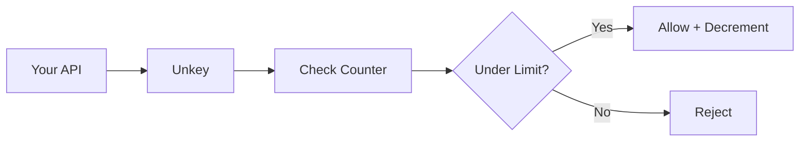

Unkey's rate limiting is designed for global, low-latency enforcement across distributed systems.

## Architecture

When you call `limiter.limit(identifier)`:

1. Request hits the nearest Unkey location
2. Counter is checked and updated
3. Decision returned in ~30ms globally

See real-time performance metrics at [ratelimit.unkey.com](https://ratelimit.unkey.com).



## Sliding window algorithm

Unkey uses a sliding window algorithm that provides smooth rate limiting without the "burst at window start" problem of fixed windows.

**Fixed window problem:**

- Limit: 100/minute
- User sends 100 requests at 0:59
- Window resets at 1:00
- User sends 100 more at 1:01
- Result: 200 requests in 2 seconds ❌

**Sliding window solution:**

- Limit: 100/minute
- Considers requests from the past 60 seconds at any point
- No burst exploitation possible

## Global consistency

Rate limits are enforced consistently across all regions. A user can't bypass limits by hitting different geographic endpoints.

### Cross-region denial propagation

When an identifier crosses its limit in any region, every other region picks up the denial within a few seconds and starts rejecting the same identifier locally — even before that region sees any of the abusive traffic firsthand. The window is honored end to end: as the offending window decays, every region releases the identifier at the same time.

This means a single attacker hitting your API from multiple geographies can't multiply their effective limit by the number of regions they hit. Once any region denies them, every region denies them.

You don't have to enable or configure anything — propagation runs automatically for every namespace.

<Note>
  Cross-region enforcement applies to limits with a window of at least 1 minute.
  Shorter windows (for example, per-second burst limits) are enforced per region
  only, because the propagation roundtrip takes longer than the window itself.
</Note>

## Response fields

Every rate limit check returns:

| Field       | Type      | Description                            |
| ----------- | --------- | -------------------------------------- |
| `success`   | `boolean` | `true` if request is allowed           |
| `limit`     | `number`  | The configured limit                   |
| `remaining` | `number`  | Requests left in current window        |
| `reset`     | `number`  | Unix timestamp (ms) when window resets |

## Handling the response

```typescript
const { success, remaining, reset } = await limiter.limit(identifier);

if (!success) {
  // Calculate retry time
  const retryAfter = Math.ceil((reset - Date.now()) / 1000);

  return new Response("Rate limit exceeded", {
    status: 429,
    headers: {
      "Retry-After": retryAfter.toString(),
      "X-RateLimit-Remaining": "0",
      "X-RateLimit-Reset": reset.toString(),
    },
  });
}

// Request allowed
```

## Cost-based limiting

Not all requests are equal. Use `cost` to deduct more from the limit for expensive operations:

```typescript
// Normal request: costs 1
await limiter.limit(userId);

// Expensive operation: costs 5
await limiter.limit(userId, { cost: 5 });
```

With a limit of 100/minute:

- 100 normal requests, OR
- 20 expensive requests, OR
- Mix of both

### Track token consumption in the dashboard

When you use cost-based limiting, the rate limit overview in your Unkey dashboard surfaces token usage per identifier alongside request counts. Each row in the namespace logs table includes:

| Column            | What it shows                                                                |
| ----------------- | ---------------------------------------------------------------------------- |
| `Passed Requests` | Number of requests that were allowed in the selected window                  |
| `Blocked Requests`| Number of requests that were denied in the selected window                  |
| `Passed Tokens`   | Sum of `cost` deducted from the limit by allowed requests                    |
| `Blocked Tokens`  | Sum of `cost` that would have been required by denied requests              |

This is useful when different operations have different costs — for example, when an LLM endpoint deducts tokens proportional to prompt size. Inspect the **Passed Tokens** and **Blocked Tokens** columns to see which identifiers are actually consuming the most capacity, not just making the most requests.

If you don't pass a `cost` value, every request counts as `1` token, so the token columns mirror the request columns.

#### Requests vs. Tokens charts

The namespace overview displays two bar charts side by side, both bucketed by the same time granularity and filterable with the same controls:

| Chart      | What each bar represents                                                                                       |
| ---------- | -------------------------------------------------------------------------------------------------------------- |
| `REQUESTS` | Count of rate limit checks in the bucket, split into **PASSED** (allowed) and **BLOCKED** (denied)             |
| `TOKENS`   | Sum of `cost` across rate limit checks in the bucket, split into **PASSED** (deducted) and **BLOCKED** (would have been deducted) |

The two charts diverge whenever requests carry a non-default `cost`. For example, a window with 100 requests where most carry `cost: 5` produces a short bar on the requests chart but a tall bar on the tokens chart — a quick visual signal that a few expensive calls are dominating capacity. When every request uses the default `cost` of `1`, the two charts are identical.

Drag-selecting a range on either chart applies the same time window filter to the logs table below, so you can jump from a token spike straight to the identifiers that caused it.

## Timeout and fallback

Configure behavior when Unkey is unreachable:

```typescript
const limiter = new Ratelimit({
  rootKey: process.env.UNKEY_ROOT_KEY,
  namespace: "api",
  limit: 100,
  duration: "60s",
  timeout: {
    ms: 3000, // Wait max 3 seconds
    fallback: (identifier) => ({
      success: true, // Allow on timeout (or false to deny)
      limit: 0,
      remaining: 0,
      reset: Date.now(),
    }),
  },
  onError: (err, identifier) => {
    console.error(`Rate limit error for ${identifier}:`, err);
    return { success: true, limit: 0, remaining: 0, reset: Date.now() };
  },
});
```

## Next steps

<CardGroup cols={2}>
  <Card
    title="Custom overrides"
    icon="sliders"
    href="/platform/ratelimiting/overrides"
  >
    Give specific users different limits
  </Card>
  <Card
    title="SDK reference"
    icon="book"
    href="/libraries/ts/ratelimit/ratelimit"
  >
    Full SDK documentation
  </Card>
</CardGroup>
