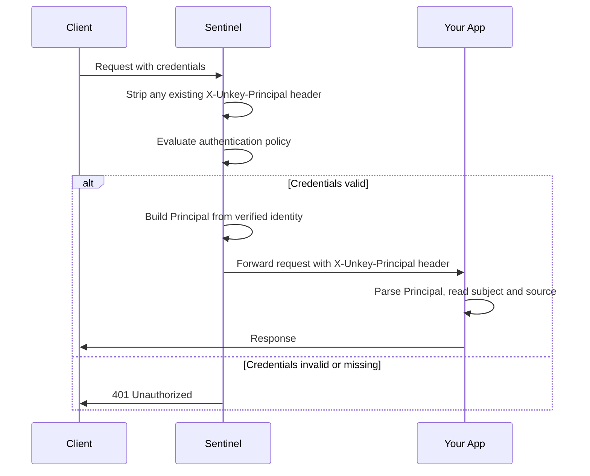

import DeployBeta from "/snippets/deploy-beta.mdx";

<DeployBeta />

Authentication policies verify credentials before requests reach your app. On success, the Sentinel produces a [Principal](/platform/sentinel/principal/overview), a verified identity object, and forwards it to your app via the `X-Unkey-Principal` request header. Your app receives the authenticated identity without performing its own credential checks.

The Sentinel supports [API key authentication](/platform/sentinel/policies/api-key) today, with [JWT](/platform/sentinel/policies/jwt) coming soon. All authentication methods produce the same [Principal structure](/platform/sentinel/principal/overview), so your app handles identity the same way regardless of how the request was authenticated.

## How it works



After all policies pass, the Sentinel serializes the Principal as JSON and sets the `X-Unkey-Principal` header on the proxied request. The Sentinel always strips any client-supplied `X-Unkey-Principal` header before policy evaluation, so clients can't forge identity information. Since all traffic to your deployment routes through the Sentinel, you can trust the header unconditionally.

Only one Principal exists per request. If multiple authentication policies match, the first successful one sets the Principal and subsequent authentication policies are skipped.

## The Principal

Your app reads the authenticated identity from the `X-Unkey-Principal` request header. If the header is absent, the request is anonymous. Here's an example for an API key linked to an identity:

```json
{
  "version": 1,
  "subject": "user_42",
  "type": "key",
  "identity": {
    "externalId": "user_42",
    "meta": { "plan": "pro" }
  },
  "source": {
    "key": {
      "keyId": "key_3xMpL9kF2nR",
      "keySpaceId": "ks_abc123",
      "meta": {},
      "roles": ["admin"],
      "permissions": ["api.read", "api.write"]
    }
  }
}
```

See the [Principal reference](/platform/sentinel/principal/overview) for the full field definitions, source pages for [API key](/platform/sentinel/principal/sources/api-key) and [JWT](/platform/sentinel/principal/sources/jwt) details, and [framework examples](/platform/sentinel/principal/examples) for integration patterns.

## Downstream policies

Other policies can use the Principal for their own decisions without knowing which authentication method produced it. For example, a [rate limit policy](/platform/sentinel/policies/rate-limiting) can throttle requests per `subject`, and an API key policy can enforce [permissions](/platform/apis/features/authorization/introduction) before requests reach your app. This decoupling means you can swap authentication methods without reconfiguring downstream policies.
