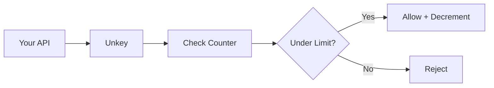

Unkey's rate limiting is designed for global, low-latency enforcement across distributed systems.

## Architecture

When you call `limiter.limit(identifier)`:

1. Request hits the nearest Unkey location
2. Counter is checked and updated
3. Decision returned in ~30ms globally

See real-time performance metrics at [ratelimit.unkey.com](https://ratelimit.unkey.com).



## Sliding window algorithm

Unkey uses a sliding window algorithm that provides smooth rate limiting without the "burst at window start" problem of fixed windows.

**Fixed window problem:**
- Limit: 100/minute
- User sends 100 requests at 0:59
- Window resets at 1:00
- User sends 100 more at 1:01
- Result: 200 requests in 2 seconds ❌

**Sliding window solution:**
- Limit: 100/minute
- Considers requests from the past 60 seconds at any point
- No burst exploitation possible

## Global consistency

Rate limits are enforced consistently across all regions. A user can't bypass limits by hitting different geographic endpoints.

## Response fields

Every rate limit check returns:

| Field | Type | Description |
|-------|------|-------------|
| `success` | `boolean` | `true` if request is allowed |
| `limit` | `number` | The configured limit |
| `remaining` | `number` | Requests left in current window |
| `reset` | `number` | Unix timestamp (ms) when window resets |

## Handling the response

```typescript
const { success, remaining, reset } = await limiter.limit(identifier);

if (!success) {
  // Calculate retry time
  const retryAfter = Math.ceil((reset - Date.now()) / 1000);
  
  return new Response("Rate limit exceeded", {
    status: 429,
    headers: {
      "Retry-After": retryAfter.toString(),
      "X-RateLimit-Remaining": "0",
      "X-RateLimit-Reset": reset.toString(),
    },
  });
}

// Request allowed
```

## Cost-based limiting

Not all requests are equal. Use `cost` to deduct more from the limit for expensive operations:

```typescript
// Normal request: costs 1
await limiter.limit(userId);

// Expensive operation: costs 5
await limiter.limit(userId, { cost: 5 });
```

With a limit of 100/minute:
- 100 normal requests, OR
- 20 expensive requests, OR
- Mix of both

## Timeout and fallback

Configure behavior when Unkey is unreachable:

```typescript
const limiter = new Ratelimit({
  rootKey: process.env.UNKEY_ROOT_KEY,
  namespace: "api",
  limit: 100,
  duration: "60s",
  timeout: {
    ms: 3000,  // Wait max 3 seconds
    fallback: (identifier) => ({
      success: true,  // Allow on timeout (or false to deny)
      limit: 0,
      remaining: 0,
      reset: Date.now(),
    }),
  },
  onError: (err, identifier) => {
    console.error(`Rate limit error for ${identifier}:`, err);
    return { success: true, limit: 0, remaining: 0, reset: Date.now() };
  },
});
```

## Next steps

<CardGroup cols={2}>
  <Card title="Custom overrides" icon="sliders" href="/ratelimiting/overrides">
    Give specific users different limits
  </Card>
  <Card title="SDK reference" icon="book" href="/libraries/ts/ratelimit/ratelimit">
    Full SDK documentation
  </Card>
</CardGroup>
