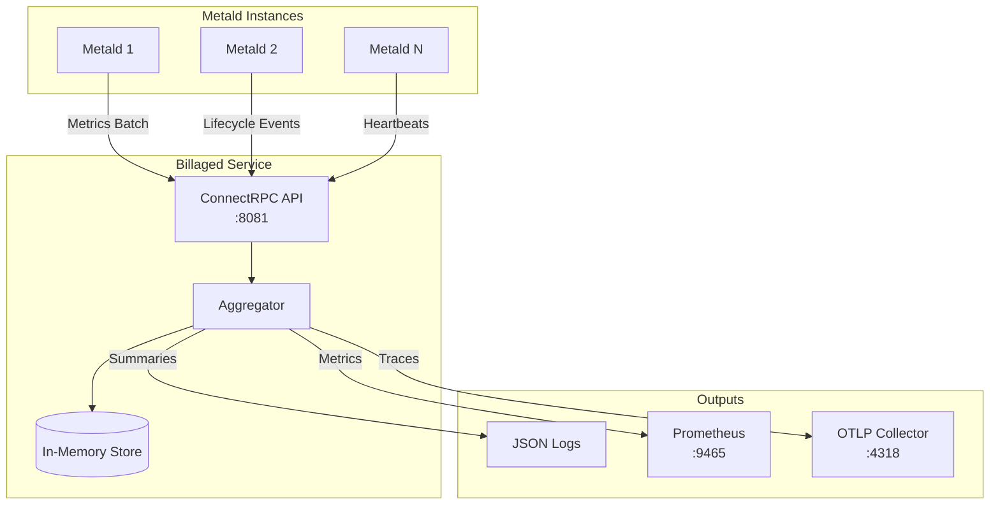

# Billaged - VM Usage Billing Aggregation Service

Billaged is a lightweight, stateless service that collects and aggregates virtual machine usage metrics from [metald](../metald/docs/README.md) instances for billing purposes in the Unkey Deploy platform.

## Quick Links

- [API Documentation](./docs/api/README.md) - Complete API reference with examples
- [Architecture & Dependencies](./docs/architecture/README.md) - Service interactions and data flow
- [Operations Guide](./docs/operations/README.md) - Production deployment and monitoring
- [Development Setup](./docs/development/README.md) - Build and test instructions

## Service Overview

**Purpose**: Real-time aggregation of VM resource usage metrics for billing calculations.

### Key Features

- **High-frequency Ingestion**: Processes metrics batches from multiple metald instances
- **In-memory Aggregation**: Configurable aggregation intervals (default: 60s)
- **Composite Billing Score**: Weighted resource usage calculation
- **Stateless Design**: No database dependencies, all data in-memory
- **Gap Detection**: Handles metric collection interruptions gracefully
- **Observable**: OpenTelemetry tracing, Prometheus metrics, structured logging
- **Secure Communication**: SPIFFE/mTLS support for service authentication

### Dependencies

- [metald](../metald/docs/README.md) - Sends VM usage metrics and lifecycle events

## Quick Start

### Installation

```bash
# Build from source
cd billaged
make build

# Install with systemd
sudo make install
```

### Basic Configuration

```bash
# Minimal configuration for development
export UNKEY_BILLAGED_PORT=8081
export UNKEY_BILLAGED_ADDRESS=0.0.0.0
export UNKEY_BILLAGED_AGGREGATION_INTERVAL=60s
export UNKEY_BILLAGED_TLS_MODE=disabled

./billaged
```

### Testing the Service

```bash
# Check health
curl http://localhost:8081/health

# View aggregation stats
curl http://localhost:8081/stats

# Send test metrics (see API docs for full examples)
curl -X POST http://localhost:8081/billing.v1.BillingService/SendMetricsBatch \
  -H "Content-Type: application/json" \
  -d '{
    "vm_id": "test-vm-123",
    "customer_id": "customer-456",
    "metrics": [{
      "timestamp": "2024-01-01T12:00:00Z",
      "cpu_time_nanos": 1000000000,
      "memory_usage_bytes": 1073741824
    }]
  }'
```

## Architecture Overview



## Billing Score Calculation

The service calculates a composite billing score based on weighted resource usage:

```go
resourceScore = (cpuSeconds * 1.0) + (memoryGB * 0.5) + (diskMB * 0.3)
```

[View implementation](internal/aggregator/aggregator.go:282-326)

## API Highlights

The service exposes a ConnectRPC API with five main operations:

- `SendMetricsBatch` - Ingest VM usage metrics from metald
- `SendHeartbeat` - Receive active VM lists from metald instances
- `NotifyVmStarted` - Handle VM lifecycle start events
- `NotifyVmStopped` - Handle VM lifecycle stop events
- `NotifyPossibleGap` - Handle data gap notifications

See [API Documentation](./docs/api/README.md) for complete reference.

## Production Deployment

### System Requirements

- **OS**: Linux (any distribution)
- **CPU**: 2+ cores recommended
- **Memory**: 2GB+ for typical workloads
- **Network**: Low latency connection to metald instances

### Configuration

Key environment variables:

- `UNKEY_BILLAGED_PORT` - Service port (default: 8081)
- `UNKEY_BILLAGED_AGGREGATION_INTERVAL` - Summary interval (default: 60s)
- `UNKEY_BILLAGED_TLS_MODE` - TLS mode: disabled/file/spiffe (default: spiffe)
- `UNKEY_BILLAGED_ENABLE_OTEL` - Enable OpenTelemetry (default: false)

See [Operations Guide](./docs/operations/README.md) for complete configuration.

## Monitoring

Key metrics to monitor:

- `billaged_usage_records_processed_total` - Usage records processed
- `billaged_aggregation_duration_seconds` - Aggregation latency
- `billaged_active_vms` - Currently tracked VMs
- `billaged_billing_errors_total` - Processing errors

## Development

### Building from Source

```bash
git clone https://github.com/unkeyed/unkey
cd go/billaged
make test
make build
```

### Running Tests

```bash
# Unit tests
make test

# Lint checks
make lint

# All checks
make ci
```

See [Development Setup](./docs/development/README.md) for detailed instructions.

## Support

- **Issues**: [GitHub Issues](https://github.com/unkeyed/unkey/issues)
- **Documentation**: [Full Documentation](./docs/README.md)
- **Version**: v0.1.0
