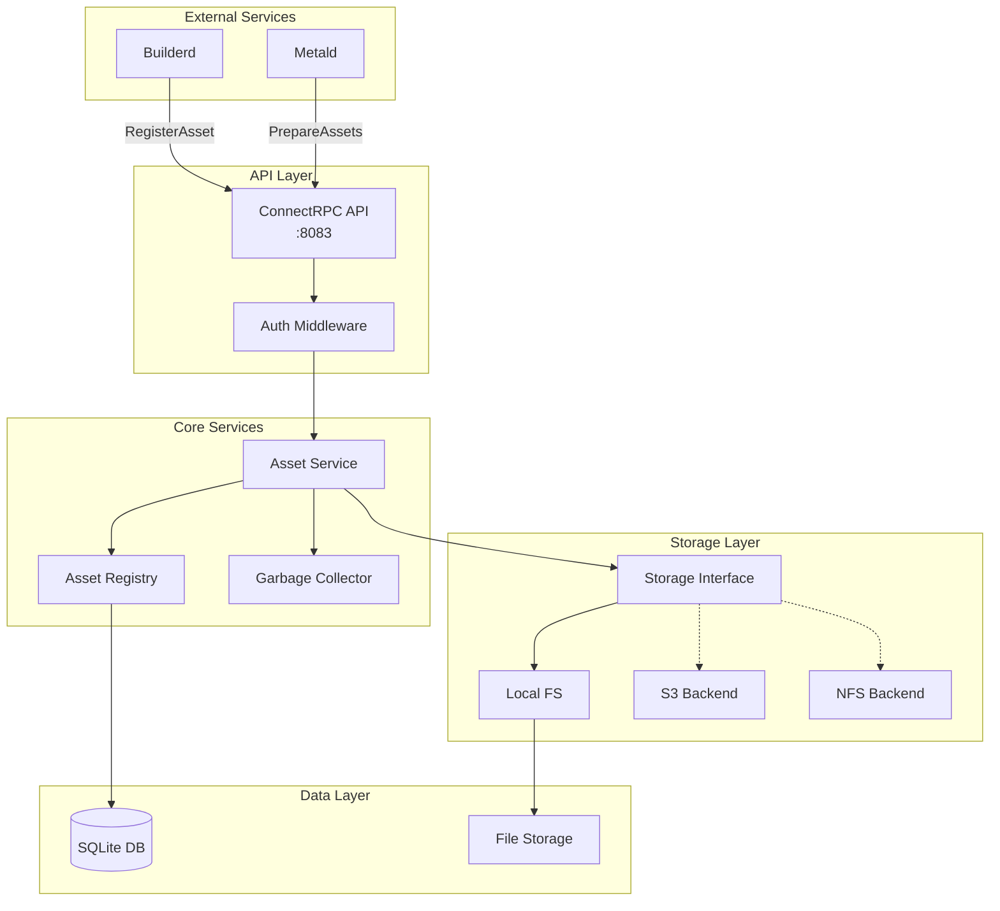

# AssetManagerd - Centralized VM Asset Management Service

AssetManagerd is a centralized asset repository and lifecycle management service for virtual machine resources in the Unkey Deploy platform. It provides efficient storage, versioning, and distribution of VM assets like kernels, rootfs images, initrd, and disk images.

## Quick Links

- [API Documentation](./docs/api/README.md) - Complete API reference with examples
- [Architecture & Dependencies](./docs/architecture/README.md) - Service design and integrations
- [Operations Guide](./docs/operations/README.md) - Production deployment and monitoring
- [Development Setup](./docs/development/README.md) - Build, test, and local development

## Service Overview

**Purpose**: Centralized management and distribution of VM assets with reference counting, lease management, and garbage collection.

### Key Features

- **Asset Registry**: Centralized metadata store for all VM assets with SQLite backend
- **Pluggable Storage**: Support for local filesystem, S3, NFS, and HTTP backends
- **Reference Counting**: Track asset usage with lease management for safe lifecycle control
- **Garbage Collection**: Automatic cleanup of expired leases and unreferenced assets
- **Asset Preparation**: Efficient asset deployment to VM jailer paths via hard links or copies
- **Label-based Discovery**: Flexible asset filtering using key-value labels
- **Checksum Verification**: SHA256 integrity verification for all assets
- **High Observability**: OpenTelemetry tracing, Prometheus metrics, structured logging

### Dependencies

- [builderd](../builderd/docs/README.md) - Registers built VM images as assets
- [metald](../metald/docs/README.md) - Consumes assets for VM provisioning

## Quick Start

### Installation

```bash
# Build from source
cd assetmanagerd
make build

# Install with systemd
sudo make install
```

### Basic Configuration

```bash
# Minimal configuration for development
export UNKEY_ASSETMANAGERD_PORT=8083
export UNKEY_ASSETMANAGERD_STORAGE_TYPE=local
export UNKEY_ASSETMANAGERD_LOCAL_PATH=/opt/vm-assets
export UNKEY_ASSETMANAGERD_DATABASE_PATH=/opt/assetmanagerd/assets.db
export UNKEY_ASSETMANAGERD_TLS_MODE=spiffe

./assetmanagerd
```

### Register Your First Asset

```bash
# Register a kernel asset
curl -X POST http://localhost:8083/asset.v1.AssetManagerService/RegisterAsset \
  -H "Content-Type: application/json" \
  -d '{
    "name": "vmlinux",
    "type": "ASSET_TYPE_KERNEL",
    "backend": "STORAGE_BACKEND_LOCAL",
    "location": "ab/abcd1234...",
    "size_bytes": 10485760,
    "checksum": "abcd1234...",
    "labels": {
      "arch": "x86_64",
      "version": "5.10",
      "default": "true"
    },
    "created_by": "manual"
  }'
```

## Architecture Overview



## Asset Types

AssetManagerd supports the following asset types:

- **KERNEL**: Linux kernel images for VM boot
- **ROOTFS**: Root filesystem images (ext4, squashfs)
- **INITRD**: Initial ramdisk images
- **DISK_IMAGE**: Additional disk images for data volumes

## Production Deployment

### System Requirements

- **OS**: Linux (any modern distribution)
- **CPU**: 2+ cores recommended
- **Memory**: 4GB+ for metadata and caching
- **Storage**: Depends on asset volume (100GB+ recommended)
- **Network**: Low latency to metald instances

### Security Considerations

1. **TLS/mTLS**: Enable SPIFFE for service-to-service authentication
2. **Storage Permissions**: Secure asset storage directories
3. **Database Security**: Protect SQLite database file
4. **Access Control**: Implement proper authorization for asset operations

### High Availability

- **Metadata**: Regular SQLite backups
- **Storage**: Use distributed storage backends (S3, NFS)
- **Service**: Multiple instances with shared storage
- **Caching**: Local cache for frequently accessed assets

## API Highlights

The service exposes a ConnectRPC API with the following main operations:

- `RegisterAsset` - Register new asset metadata
- `GetAsset` - Retrieve asset information
- `ListAssets` - List assets with filtering and pagination
- `AcquireAsset` - Acquire lease on an asset
- `ReleaseAsset` - Release asset lease
- `PrepareAssets` - Prepare assets for VM deployment
- `DeleteAsset` - Mark asset for deletion
- `GarbageCollect` - Manually trigger garbage collection
- `QueryAssets` - Enhanced asset query with automatic build triggering

See [API Documentation](./docs/api/README.md) for complete reference.

## Monitoring

Key metrics to monitor in production:

- `assetmanager_assets_total` - Total assets by type and status
- `assetmanager_leases_active` - Active leases per asset
- `assetmanager_storage_bytes_used` - Storage usage by type
- `assetmanager_gc_duration_seconds` - Garbage collection performance
- `assetmanager_prepare_duration_seconds` - Asset preparation latency

See [Operations Guide](./docs/operations/README.md) for complete monitoring setup.

## Development

### Building from Source

```bash
git clone https://github.com/unkeyed/unkey
cd go/deploy/assetmanagerd
make test
make build
```

### Running Tests

```bash
# Unit tests
make test

# Integration tests
make test-integration

# Benchmark tests
make bench
```

See [Development Setup](./docs/development/README.md) for detailed instructions.

## Support

- **Issues**: [GitHub Issues](https://github.com/unkeyed/unkey/issues)
- **Documentation**: [Full Documentation](./docs/README.md)
- **Version**: v0.3.0

## Automatic Asset Building

AssetManagerd integrates with builderd to automatically create missing assets. When QueryAssets is called with:
- `enable_auto_build: true`
- A docker_image label in the query
- No matching assets found

The service will automatically trigger builderd to create the rootfs and register it upon completion.

```bash
# Query with auto-build enabled
curl -X POST http://localhost:8083/asset.v1.AssetManagerService/QueryAssets \
  -H "Content-Type: application/json" \
  -d '{
    "type": "ASSET_TYPE_ROOTFS",
    "label_selector": {
      "docker_image": "nginx:latest"
    },
    "build_options": {
      "enable_auto_build": true,
      "wait_for_completion": true,
      "build_timeout_seconds": 1800
    }
  }'
```