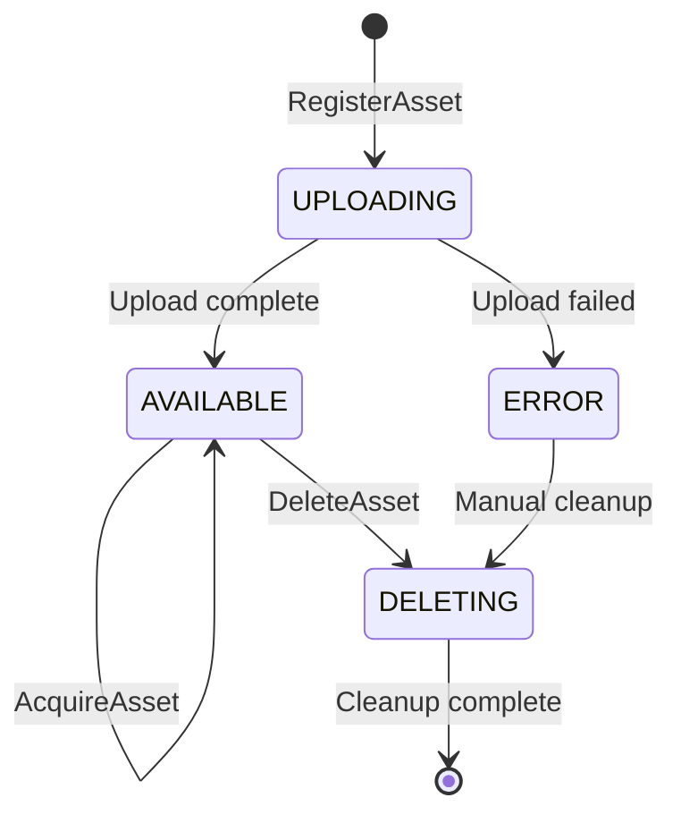
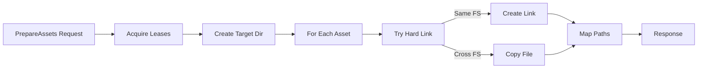

# AssetManagerd Architecture & Dependencies

This document describes the internal architecture of assetmanagerd and its interactions with external services.

## Table of Contents

- [System Architecture](#system-architecture)
- [Component Overview](#component-overview)
- [Service Dependencies](#service-dependencies)
- [Data Flow](#data-flow)
- [Storage Architecture](#storage-architecture)
- [Database Schema](#database-schema)
- [Garbage Collection](#garbage-collection)
- [Security Architecture](#security-architecture)

## System Architecture

```mermaid
graph TB
    subgraph "External Services"
        BUILD[Builderd]
        METAL[Metald]
        SPIFFE[SPIFFE/SPIRE]
    end
    
    subgraph "API Layer"
        API[ConnectRPC Server<br/>:8083]
        AUTH[Auth Interceptor]
        METRICS_EP[Prometheus Metrics<br/>:9467]
        HEALTH[Health Check<br/>/health]
    end
    
    subgraph "Service Layer"
        SVC[Asset Service]
        REG[Asset Registry]
        LEASE[Lease Manager]
        GC[Garbage Collector]
    end
    
    subgraph "Storage Layer"
        STORE[Storage Interface]
        LOCAL[Local FS Backend]
        S3[S3 Backend<br/>(planned)]
        NFS[NFS Backend<br/>(planned)]
    end
    
    subgraph "Data Layer"
        DB[(SQLite Database)]
        CACHE[Local Cache<br/>/opt/assetmanagerd/cache]
        FS[Asset Storage<br/>/opt/vm-assets]
    end
    
    BUILD -->|RegisterAsset| API
    METAL -->|PrepareAssets| API
    METAL -->|AcquireAsset| API
    SPIFFE --> API
    
    API --> AUTH
    AUTH --> SVC
    SVC --> REG
    SVC --> LEASE
    SVC --> GC
    
    REG --> DB
    LEASE --> DB
    GC --> DB
    
    SVC --> STORE
    STORE --> LOCAL
    STORE -.-> S3
    STORE -.-> NFS
    
    LOCAL --> FS
    LOCAL --> CACHE
    
    API --> METRICS_EP
    API --> HEALTH
```

## Component Overview

### API Layer

#### ConnectRPC Server

**Location**: [`cmd/assetmanagerd/main.go:267-298`](../../cmd/assetmanagerd/main.go:267-298)

The server component handles:
- HTTP/2 server with optional TLS/mTLS support
- Request/response compression
- OpenTelemetry instrumentation
- Health check endpoints

Configuration:
```go
mux := http.NewServeMux()
mux.Handle(assetv1connect.NewAssetManagerServiceHandler(service, interceptors...))
mux.Handle("/health", healthHandler)
```

#### Authentication Interceptor

**Location**: [`internal/observability/interceptor.go`](../../internal/observability/interceptor.go)

Handles:
- SPIFFE/SPIRE mTLS verification
- Request logging
- Error handling and recovery

### Service Layer

#### Asset Service

**Location**: [`internal/service/service.go:39-58`](../../internal/service/service.go:39-58)

```go
type Service struct {
    registry *registry.Registry
    storage  storage.Storage
    logger   *slog.Logger
    config   *config.Config
}
```

Core responsibilities:
- Implements all RPC methods
- Coordinates between registry and storage
- Manages asset lifecycle
- Handles concurrent requests

#### Asset Registry

**Location**: [`internal/registry/registry.go:32-49`](../../internal/registry/registry.go:32-49)

```go
type Registry struct {
    db       *sql.DB
    mu       sync.RWMutex
    logger   *slog.Logger
    config   *config.Config
    gcTicker *time.Ticker
}
```

Features:
- SQLite-based metadata storage
- Thread-safe operations with RWMutex
- Automatic garbage collection
- Label-based filtering

#### Lease Manager

**Location**: [`internal/registry/registry.go:CreateLease`](../../internal/registry/registry.go)

Handles:
- Lease creation with TTL
- Reference counting
- Expiration tracking
- Atomic operations

### Storage Layer

#### Storage Interface

**Location**: [`internal/storage/storage.go:10`](../../internal/storage/storage.go:10)

```go
type Storage interface {
    Get(ctx context.Context, key string) (io.ReadCloser, error)
    Put(ctx context.Context, key string, reader io.Reader) error
    Delete(ctx context.Context, key string) error
    Exists(ctx context.Context, key string) (bool, error)
    Copy(ctx context.Context, srcKey, dstPath string) error
}
```

#### Local Storage Backend

**Location**: [`internal/storage/local.go:24-37`](../../internal/storage/local.go:24-37)

```go
type LocalStorage struct {
    basePath  string
    cachePath string
    logger    *slog.Logger
}
```

Features:
- Sharded directory structure for performance
- Hard link optimization for same filesystem
- Atomic file operations
- Cache directory management

## Service Dependencies

### Primary Dependencies

#### Builderd Integration

[Builderd](../builderd/docs/README.md) is the primary producer of assets:

1. **Asset Upload Flow**:
   ```mermaid
   sequenceDiagram
       Builderd->>Storage: Upload rootfs to /opt/vm-assets
       Builderd->>AssetManagerd: RegisterAsset(metadata)
       AssetManagerd->>SQLite: Store asset record
       AssetManagerd-->>Builderd: Asset registered
   ```

2. **Integration Details**:
   - Builderd uploads assets directly to storage
   - Calls `RegisterAsset` with metadata
   - Provides `build_id` and `source_image` references
   - Assets are immutable once registered

#### Metald Integration

[Metald](../metald/docs/README.md) is the primary consumer of assets:

1. **Asset Preparation Flow**:
   ```mermaid
   sequenceDiagram
       Metald->>AssetManagerd: PrepareAssets([kernel, rootfs])
       AssetManagerd->>AssetManagerd: AcquireAsset (internal)
       AssetManagerd->>Storage: Link/Copy to target
       AssetManagerd->>SQLite: Create leases
       AssetManagerd-->>Metald: Prepared paths + lease IDs
   ```

2. **Lifecycle Management**:
   - Acquires leases when creating VMs
   - Releases leases when VMs are destroyed
   - Uses `PrepareAssets` for jailer chroot setup

### Infrastructure Dependencies

#### SQLite Database

**Location**: [`internal/registry/registry.go:InitDB`](../../internal/registry/registry.go)

Configuration:
- Path: `/opt/assetmanagerd/assets.db`
- WAL mode for better concurrency
- Connection pool: 10 max open, 5 idle
- Automatic schema migration

#### SPIFFE/SPIRE

**Location**: Uses [`pkg/tls`](../../pkg/tls) and [`pkg/spiffe`](../../pkg/spiffe)

Features:
- Workload identity verification
- Automatic certificate rotation
- mTLS for all service communication

Configuration:
```go
TLS: tls.Config{
    Mode:         getEnvOrDefault("UNKEY_ASSETMANAGERD_TLS_MODE", "spiffe"),
    SpiffeSocket: getEnvOrDefault("SPIFFE_ENDPOINT_SOCKET", "unix:///tmp/spire-agent/public/api.sock"),
}
```

## Data Flow

### Asset Registration Flow


### Asset Lifecycle



### Asset Preparation Flow



## Storage Architecture

### Storage Backends

#### Local Storage (Implemented)

**Sharded Directory Structure** to prevent filesystem performance degradation:

```
/opt/vm-assets/
├── {first-2-chars}/
│   └── {asset-id}
```

**Implementation**: [`internal/storage/local.go:43`](../../internal/storage/local.go:43)
```go
func (l *LocalStorage) keyToPath(key string) string {
    if len(key) >= 2 {
        return filepath.Join(l.basePath, key[:2], key)
    }
    return filepath.Join(l.basePath, key)
}
```

**Cache Structure**:
```
/opt/assetmanagerd/cache/
└── downloads/
    └── {asset-id}
```

#### Hard Link Optimization

PrepareAssets uses hard links when source and destination are on the same filesystem:

```go
// From service.go:361
srcPath := filepath.Join(l.storagePath, asset.Location)
if sameFilesystem(srcPath, ref.TargetPath) {
    return os.Link(srcPath, ref.TargetPath)
}
return copyFile(srcPath, ref.TargetPath)
```

Benefits:
- Near-instant "copy" operations
- No additional disk space used
- Atomic operation

#### S3 Storage (Planned)

Configuration:
```go
type S3Config struct {
    Bucket       string
    Region       string
    Endpoint     string
    AccessKey    string
    SecretKey    string
    UsePathStyle bool
}
```

#### NFS Storage (Planned)

Configuration:
```go
type NFSConfig struct {
    Server     string
    ExportPath string
    MountOpts  string
}
```

## Database Schema

### Assets Table

```sql
CREATE TABLE assets (
    id TEXT PRIMARY KEY,              -- ULID
    name TEXT NOT NULL,               -- Human name
    type INTEGER NOT NULL,            -- AssetType enum
    status INTEGER NOT NULL,          -- AssetStatus enum
    backend INTEGER NOT NULL,         -- StorageBackend enum
    location TEXT NOT NULL,           -- Backend-specific path
    size_bytes INTEGER NOT NULL,      
    checksum TEXT NOT NULL,           -- SHA256
    created_by TEXT NOT NULL,         -- SPIFFE ID
    created_at INTEGER NOT NULL,      -- Unix timestamp
    last_accessed_at INTEGER NOT NULL,
    reference_count INTEGER NOT NULL DEFAULT 0,
    build_id TEXT,                    -- Optional builderd reference
    source_image TEXT                 -- Optional source image
);
```

### Asset Labels Table

```sql
CREATE TABLE asset_labels (
    asset_id TEXT NOT NULL,
    key TEXT NOT NULL,
    value TEXT NOT NULL,
    PRIMARY KEY (asset_id, key),
    FOREIGN KEY (asset_id) REFERENCES assets(id) ON DELETE CASCADE
);
```

### Asset Leases Table

```sql
CREATE TABLE asset_leases (
    id TEXT PRIMARY KEY,              -- Lease ULID
    asset_id TEXT NOT NULL,
    acquired_by TEXT NOT NULL,        -- Service/VM ID
    acquired_at INTEGER NOT NULL,     -- Unix timestamp
    expires_at INTEGER,               -- Optional TTL
    released_at INTEGER,              -- When released
    FOREIGN KEY (asset_id) REFERENCES assets(id) ON DELETE CASCADE
);
```

### Indexes

```sql
CREATE INDEX idx_assets_type_status ON assets(type, status);
CREATE INDEX idx_assets_checksum ON assets(checksum);
CREATE INDEX idx_asset_labels_key_value ON asset_labels(key, value);
CREATE INDEX idx_leases_expires_at ON asset_leases(expires_at);
CREATE INDEX idx_leases_asset_id ON asset_leases(asset_id);
```

## Garbage Collection

### Algorithm

**Location**: [`internal/registry/registry.go:RunGarbageCollection`](../../internal/registry/registry.go)

1. **Lease Cleanup**:
   ```sql
   DELETE FROM asset_leases WHERE expires_at < ? AND released_at IS NULL
   ```

2. **Reference Count Update**:
   ```sql
   UPDATE assets SET reference_count = (
       SELECT COUNT(*) FROM asset_leases 
       WHERE asset_id = assets.id AND released_at IS NULL
   )
   ```

3. **Asset Removal Criteria**:
   - Status = DELETED
   - Reference count = 0
   - Last accessed > max_age

4. **Storage Cleanup**:
   - Remove files from storage backend
   - Clean cache entries

### Configuration

```go
type GCConfig struct {
    Enabled      bool          // Enable automatic GC
    Interval     time.Duration // How often to run (default: 1h)
    MaxAssetAge  time.Duration // Max age for unreferenced assets (default: 168h)
}
```

## Security Architecture

### Authentication

1. **SPIFFE/mTLS** (Production):
   - Workload identity verification
   - Certificate rotation
   - Trust domain validation

2. **File-based TLS** (Testing):
   - Manual certificate management
   - Static trust anchors

3. **Disabled** (Development only):
   - No authentication
   - Local testing only

### Authorization

Currently no fine-grained authorization. All authenticated services have full access.

Future considerations:
- Service-specific permissions
- Read-only vs read-write roles
- Asset ownership tracking

### Data Security

1. **Checksum Verification**:
   - SHA256 for all assets
   - Verified on registration
   - Verified on preparation

2. **Immutable Assets**:
   - No modification after registration
   - Version new assets instead

3. **Secure Deletion**:
   - Overwrite before deletion (optional)
   - Verify no active leases

## Concurrency and Consistency

### Transaction Boundaries

All registry operations use SQLite transactions for consistency:

```go
// Example from registry.go:CreateAsset
tx, err := r.db.BeginTx(ctx, nil)
defer tx.Rollback()
// ... operations ...
return tx.Commit()
```

### Reference Count Safety

Atomic increment/decrement operations prevent race conditions:

```sql
-- Acquire increments atomically
UPDATE assets SET reference_count = reference_count + 1 WHERE id = ?

-- Release decrements with check
UPDATE assets SET reference_count = reference_count - 1 
WHERE id = ? AND reference_count > 0
```

## Performance Considerations

### Optimizations

1. **Sharded Storage**: Prevents directory listing bottlenecks
2. **Hard Links**: Zero-copy asset preparation
3. **Connection Pooling**: SQLite connection reuse
4. **Batch Operations**: PrepareAssets handles multiple assets
5. **Checksum Deduplication**: Reduces storage usage

### Caching Strategy

1. **Local storage acts as cache** for remote backends
2. **LRU eviction** planned for cache management
3. **Per-node caching**: Each instance maintains local cache

### Scalability

1. **Horizontal Scaling**:
   - Multiple instances with shared storage
   - Load balancer distribution
   - Shared SQLite limitations

2. **Storage Scaling**:
   - Pluggable backends
   - Distributed storage support
   - CDN integration (future)

## Failure Handling

### Service Resilience

- **SQLite durability**: WAL mode for crash recovery
- **Atomic operations**: All-or-nothing asset operations
- **Graceful shutdown**: Completes in-flight requests

### Storage Failures

- **Retry logic**: Exponential backoff for transient failures
- **Fallback paths**: Multiple storage backends (future)
- **Consistency checks**: Periodic verification (planned)

## Future Enhancements

1. **Storage Backends**:
   - S3/Object storage implementation
   - NFS support for shared storage
   - HTTP proxy backend for CDN
   - P2P distribution for edge

2. **Advanced Features**:
   - Asset compression
   - Content-addressable storage
   - Incremental updates
   - Multi-region replication

3. **Operations**:
   - Distributed registry (replace SQLite)
   - Smart caching with pre-warming
   - Asset usage analytics
   - Cost tracking