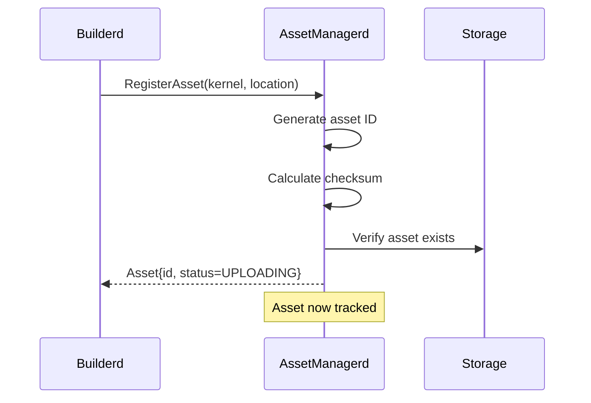
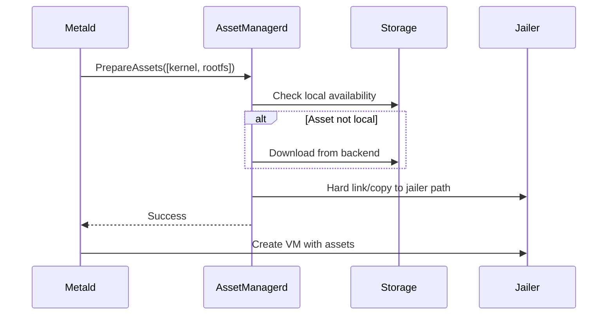
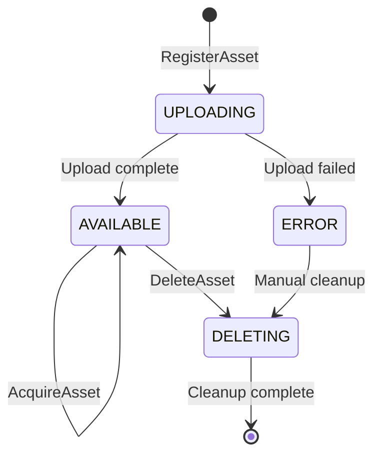

# AssetManagerd Architecture

This document describes the internal architecture of AssetManagerd and its interactions with other Unkey Deploy services.

## System Architecture

AssetManagerd follows a layered architecture with clear separation of concerns:

```
┌─────────────────────────────────────────────────────────┐
│                   ConnectRPC API Layer                   │
│              (gRPC with Connect protocol)                │
└─────────────────────────────────────────────────────────┘
                            │
┌─────────────────────────────────────────────────────────┐
│                    Service Layer                         │
│         (Business logic and orchestration)               │
└─────────────────────────────────────────────────────────┘
                            │
┌─────────────────┴────────────────────────┴──────────────┐
│      Registry Layer                Storage Layer         │
│   (SQLite metadata DB)          (Pluggable backends)    │
└─────────────────────────────────────────────────────────┘
```

**Key Components**:
- **API Layer**: [internal/service/service.go](../../internal/service/service.go) - ConnectRPC service implementation
- **Registry**: [internal/registry/registry.go](../../internal/registry/registry.go) - SQLite-based metadata storage
- **Storage**: [internal/storage/storage.go](../../internal/storage/storage.go) - Pluggable storage interface
- **Config**: [internal/config/config.go](../../internal/config/config.go) - Configuration management
- **Observability**: [internal/observability/](../../internal/observability/) - Metrics and tracing

## Service Interactions

### Inbound Dependencies

#### 1. Builderd → AssetManagerd
[Builderd](../../../docs/PILLAR_SERVICES.md) registers newly built VM images:



**Integration Pattern**:
- Builderd creates VM images in a staging area
- Registers assets with AssetManagerd upon successful build
- AssetManagerd takes ownership of lifecycle management

// AIDEV: builderd documentation needed for complete interaction description

#### 2. Metald → AssetManagerd  
[Metald](../../../docs/metald/) prepares assets for VM creation:



**Integration Pattern**:
- Metald calls PrepareAssets before VM creation
- AssetManagerd stages assets in jailer chroot
- Optimizes with hard links when possible
- Falls back to copying for cross-filesystem

### Outbound Dependencies

#### 1. AssetManagerd → SPIFFE/SPIRE
Service authentication via mTLS:

```go
// Configuration in internal/config/config.go:39
TLS: tls.Config{
    Mode:         getEnvOrDefault("UNKEY_ASSETMANAGERD_TLS_MODE", "spiffe"),
    SpiffeSocket: getEnvOrDefault("SPIFFE_ENDPOINT_SOCKET", "unix:///tmp/spire-agent/public/api.sock"),
}
```

#### 2. AssetManagerd → Storage Backends
Pluggable storage interface ([internal/storage/storage.go:10](../../internal/storage/storage.go:10)):

```go
type Storage interface {
    Get(ctx context.Context, key string) (io.ReadCloser, error)
    Put(ctx context.Context, key string, reader io.Reader) error
    Delete(ctx context.Context, key string) error
    Exists(ctx context.Context, key string) (bool, error)
    Copy(ctx context.Context, srcKey, dstPath string) error
}
```

Current implementation: **Local filesystem** ([internal/storage/local.go](../../internal/storage/local.go))  
Future backends: S3, HTTP, NFS

## Data Flow

### Asset Registration Flow

1. **External Request**: Builderd or manual registration
2. **Validation**: Type, size, checksum verification
3. **Deduplication**: Check for existing assets by checksum
4. **Storage**: Create registry entry with metadata
5. **Response**: Return asset ID for reference

### Asset Lifecycle



### Reference Counting

Assets use reference counting to prevent premature deletion:

```sql
-- From registry.go asset table schema
reference_count INTEGER NOT NULL DEFAULT 0
```

**Lifecycle**:
1. `AcquireAsset` → Increment reference count
2. `ReleaseAsset` → Decrement reference count  
3. `DeleteAsset` → Only allowed when count = 0 (unless forced)
4. `GarbageCollect` → Removes assets with count = 0 and age > threshold

## Storage Design

### Sharded Directory Structure

To prevent filesystem performance degradation with thousands of files:

```
/opt/vm-assets/
├── {first-2-chars}/
│   └── {asset-id}
```

**Implementation**: [internal/storage/local.go:43](../../internal/storage/local.go:43)
```go
func (l *LocalStorage) keyToPath(key string) string {
    if len(key) >= 2 {
        return filepath.Join(l.basePath, key[:2], key)
    }
    return filepath.Join(l.basePath, key)
}
```

### Optimization: Hard Links

PrepareAssets uses hard links when source and destination are on the same filesystem:

```go
// From service.go:361
srcPath := filepath.Join(l.storagePath, asset.Location)
if sameFilesystem(srcPath, ref.TargetPath) {
    return os.Link(srcPath, ref.TargetPath)
}
return copyFile(srcPath, ref.TargetPath)
```

Benefits:
- Near-instant "copy" operations
- No additional disk space used
- Atomic operation

## Database Schema

AssetManagerd uses SQLite for metadata storage with three main tables:

### Assets Table
```sql
CREATE TABLE assets (
    id TEXT PRIMARY KEY,              -- UUID
    name TEXT NOT NULL,               -- Human name
    type INTEGER NOT NULL,            -- AssetType enum
    status INTEGER NOT NULL,          -- AssetStatus enum
    backend INTEGER NOT NULL,         -- StorageBackend enum
    location TEXT NOT NULL,           -- Backend-specific path
    size_bytes INTEGER NOT NULL,      
    checksum TEXT NOT NULL,           -- SHA256
    created_by TEXT NOT NULL,         -- SPIFFE ID
    created_at INTEGER NOT NULL,      -- Unix timestamp
    last_accessed_at INTEGER NOT NULL,
    reference_count INTEGER NOT NULL DEFAULT 0,
    build_id TEXT,                    -- Optional builderd reference
    source_image TEXT                 -- Optional source image
);
```

### Asset Labels Table
```sql
CREATE TABLE asset_labels (
    asset_id TEXT NOT NULL,
    key TEXT NOT NULL,
    value TEXT NOT NULL,
    PRIMARY KEY (asset_id, key),
    FOREIGN KEY (asset_id) REFERENCES assets(id) ON DELETE CASCADE
);
```

### Asset Leases Table  
```sql
CREATE TABLE asset_leases (
    id TEXT PRIMARY KEY,              -- Lease UUID
    asset_id TEXT NOT NULL,
    acquired_by TEXT NOT NULL,        -- Service/VM ID
    acquired_at INTEGER NOT NULL,     -- Unix timestamp
    expires_at INTEGER,               -- Optional TTL
    released_at INTEGER,              -- When released
    FOREIGN KEY (asset_id) REFERENCES assets(id) ON DELETE CASCADE
);
```

## Concurrency and Consistency

### Transaction Boundaries

All registry operations use SQLite transactions for consistency:

```go
// Example from registry.go:CreateAsset
tx, err := r.db.BeginTx(ctx, nil)
defer tx.Rollback()
// ... operations ...
return tx.Commit()
```

### Reference Count Safety

Atomic increment/decrement operations prevent race conditions:

```go
// Acquire increments atomically
UPDATE assets SET reference_count = reference_count + 1 WHERE id = ?

// Release decrements with check
UPDATE assets SET reference_count = reference_count - 1 
WHERE id = ? AND reference_count > 0
```

## Security Model

### Authentication
- **mTLS via SPIFFE**: All service-to-service communication
- **No plaintext fallback**: TLS required, no insecure mode
- **Identity**: SPIFFE IDs identify calling services

### Authorization
- **Service-level**: Currently trusts authenticated services
- **Future**: Per-operation authorization rules

### Asset Isolation
- **Labels**: Enable multi-tenant filtering
- **No cross-tenant access**: Filtered at query level
- **Checksum validation**: Ensures content integrity

## Performance Considerations

### Caching Strategy
1. **Local storage acts as cache** for remote backends
2. **LRU eviction** planned for cache management
3. **Checksum-based deduplication** reduces storage

### Optimization Points
- **Sharded storage**: Prevents directory listing bottlenecks
- **Hard linking**: Zero-copy asset preparation
- **Batch operations**: PrepareAssets handles multiple assets
- **Connection pooling**: Reuses gRPC connections

### Scaling Considerations
- **Horizontal scaling**: Multiple instances with shared storage
- **Per-node caching**: Each node maintains local cache
- **Registry federation**: Future multi-region support

## Failure Handling

### Service Resilience
- **SQLite durability**: WAL mode for crash recovery
- **Atomic operations**: All-or-nothing asset operations
- **Graceful shutdown**: Completes in-flight requests

### Storage Failures
- **Retry logic**: Exponential backoff for transient failures
- **Fallback paths**: Multiple storage backends (future)
- **Consistency checks**: Periodic verification (planned)

## Monitoring Integration

AssetManagerd exports comprehensive metrics:

- **RPC metrics**: Latency, errors, throughput
- **Storage metrics**: Operations, failures, latency
- **Registry metrics**: Asset counts, lease statistics
- **GC metrics**: Cleanup operations, reclaimed space

See [Operations Guide](../operations/) for details.

## Future Architecture Enhancements

### Planned Improvements
1. **Distributed Registry**: Replace SQLite with distributed store
2. **Multi-region Replication**: Cross-region asset distribution
3. **Smart Caching**: Predictive asset pre-warming
4. **Compression**: On-the-fly asset compression
5. **Deduplication**: Content-addressable storage

### Storage Backend Roadmap
- **S3 Backend**: For cloud deployments
- **HTTP Backend**: For CDN integration  
- **NFS Backend**: For shared storage clusters
- **P2P Distribution**: For edge deployments