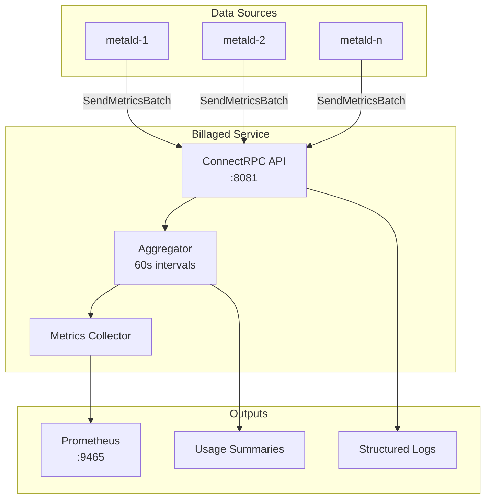

# Billaged - VM Usage Billing Aggregation Service

Billaged is a high-performance usage metrics aggregation service for the Unkey Deploy platform. It collects VM resource usage data from metald instances and aggregates it for billing purposes.

## Quick Links

- [API Documentation](./docs/api/README.md) - Complete API reference with examples
- [Architecture & Dependencies](./docs/architecture/README.md) - Service interactions and system design
- [Operations Guide](./docs/operations/README.md) - Metrics, monitoring, and production deployment
- [Development Setup](./docs/development/README.md) - Build, test, and local development

## Service Overview

**Purpose**: Real-time VM usage metrics aggregation for accurate resource-based billing.

### Key Features

- **Real-time Aggregation**: Processes usage metrics in configurable intervals (default 60s)
- **Resource Tracking**: CPU time, memory usage, disk I/O, and network I/O monitoring
- **Billing Score Calculation**: Weighted resource usage scoring for billing
- **High-Performance**: Batch processing with concurrent metric handling
- **Gap Detection**: Handles data gaps and VM lifecycle events
- **Production Ready**: OpenTelemetry tracing, Prometheus metrics, structured logging
- **Security**: SPIFFE/mTLS support for secure service communication

### Dependencies

- [metald](../metald/docs/README.md) - Primary data source for VM usage metrics
- [pkg/tls](../pkg/tls) - Shared TLS/SPIFFE provider
- [pkg/health](../pkg/health) - Health check utilities

## Quick Start

### Installation

```bash
# Build from source
cd billaged
make build

# Install with systemd
sudo make install
```

### Basic Configuration

```bash
# Minimal configuration for development
export UNKEY_BILLAGED_PORT=8081
export UNKEY_BILLAGED_AGGREGATION_INTERVAL=60s
export UNKEY_BILLAGED_TLS_MODE=disabled

./build/billaged
```

### Production Configuration

```bash
# Production configuration with observability
export UNKEY_BILLAGED_PORT=8081
export UNKEY_BILLAGED_ADDRESS=0.0.0.0
export UNKEY_BILLAGED_AGGREGATION_INTERVAL=60s
export UNKEY_BILLAGED_OTEL_ENABLED=true
export UNKEY_BILLAGED_OTEL_ENDPOINT=otel-collector:4318
export UNKEY_BILLAGED_TLS_MODE=spiffe
export UNKEY_BILLAGED_SPIFFE_SOCKET=/run/spire/sockets/agent.sock

./build/billaged
```

## Architecture Overview



## Resource Score Calculation

Billaged calculates a composite billing score based on weighted resource usage:

```
resourceScore = (cpuSeconds * 1.0) + (memoryGB * 0.5) + (diskMB * 0.3)
```

- **CPU Weight (1.0)**: Highest weight as CPU time directly correlates with compute costs
- **Memory Weight (0.5)**: Medium weight for allocated memory resources
- **I/O Weight (0.3)**: Lower weight for disk I/O operations

See [Architecture Documentation](./docs/architecture/README.md) for detailed calculation logic.

## API Highlights

The service exposes a ConnectRPC API with the following operations:

- `SendMetricsBatch` - Receive VM usage metrics from metald
- `SendHeartbeat` - Process heartbeats with active VM lists
- `NotifyVmStarted` - Handle VM lifecycle start events
- `NotifyVmStopped` - Handle VM lifecycle stop events
- `NotifyPossibleGap` - Handle data gap notifications

Additional HTTP endpoints:
- `/stats` - Current aggregation statistics
- `/metrics` - Prometheus metrics (when enabled)
- `/health` - Health check endpoint

See [API Documentation](./docs/api/README.md) for complete reference.

## Monitoring

Key metrics to monitor in production:

- `billaged_usage_records_processed_total` - Usage record processing rate
- `billaged_aggregation_duration_seconds` - Aggregation performance
- `billaged_active_vms` - Number of VMs being tracked
- `billaged_billing_errors_total` - Processing error rate

See [Operations Guide](./docs/operations/README.md) for complete monitoring setup.

## Development

### Building from Source

```bash
git clone https://github.com/unkeyed/unkey
cd go/deploy/billaged
make test
make build
```

### Running Tests

```bash
# Unit tests
make test

# Integration tests
make test-integration

# Benchmark tests
make bench
```

See [Development Setup](./docs/development/README.md) for detailed instructions.

## Support

- **Issues**: [GitHub Issues](https://github.com/unkeyed/unkey/issues)
- **Documentation**: [Full Documentation](./docs/README.md)
- **Version**: v0.1.0