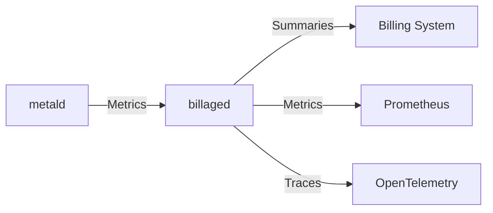

# Billaged Documentation

Welcome to the comprehensive documentation for Billaged, the VM usage billing aggregation service.

## Documentation Structure

### [API Reference](./api/README.md)
Complete API documentation including:
- ConnectRPC service definitions
- Request/response schemas
- Example usage for each RPC method
- HTTP endpoints (/stats, /metrics, /health)
- Error handling patterns

### [Architecture & Dependencies](./architecture/README.md)
Detailed architectural documentation covering:
- Component architecture and design
- Service dependencies (metald, pkg/tls, pkg/health)
- Data flow and processing pipeline
- Concurrency model and performance
- Security considerations

### [Operations Guide](./operations/README.md)
Production operations documentation including:
- Configuration reference
- Metrics and monitoring setup
- Logging and debugging
- Health checks and probes
- Performance tuning
- Troubleshooting playbook

### [Development Setup](./development/README.md)
Developer documentation with:
- Build instructions and setup
- Testing strategies and examples
- Local development environment
- Code organization and style
- Contributing guidelines

## Quick Navigation

- **Getting Started**: See the [main README](../README.md)
- **API Endpoints**: [API Documentation](./api/README.md)
- **Configuration**: [Operations Guide - Configuration](./operations/README.md#configuration)
- **Metrics**: [Operations Guide - Metrics](./operations/README.md#metrics)
- **Troubleshooting**: [Operations Guide - Troubleshooting](./operations/README.md#troubleshooting-playbook)

## Service Overview

Billaged is a critical component in the Unkey Deploy platform that:

1. **Collects** VM usage metrics from multiple metald instances
2. **Aggregates** resource usage data in configurable intervals
3. **Calculates** billing scores based on weighted resource consumption
4. **Provides** usage summaries for billing systems

## Key Features

- Real-time metric processing with batch support
- Configurable aggregation intervals
- Resource-based billing score calculation
- High-cardinality metric support (optional)
- SPIFFE/mTLS security
- OpenTelemetry observability
- Prometheus metrics export
- Structured JSON logging

## Integration Points

## Version History

- **v0.1.0** - Initial release with core aggregation functionality
- **v0.2.0** - Added SPIFFE/mTLS support (planned)
- **v0.3.0** - Enhanced observability features (planned)

## Support

For issues, questions, or contributions:
- [GitHub Issues](https://github.com/unkeyed/unkey/issues)
- [Contributing Guide](./development/README.md#contributing)
- Service Owner: Platform Team