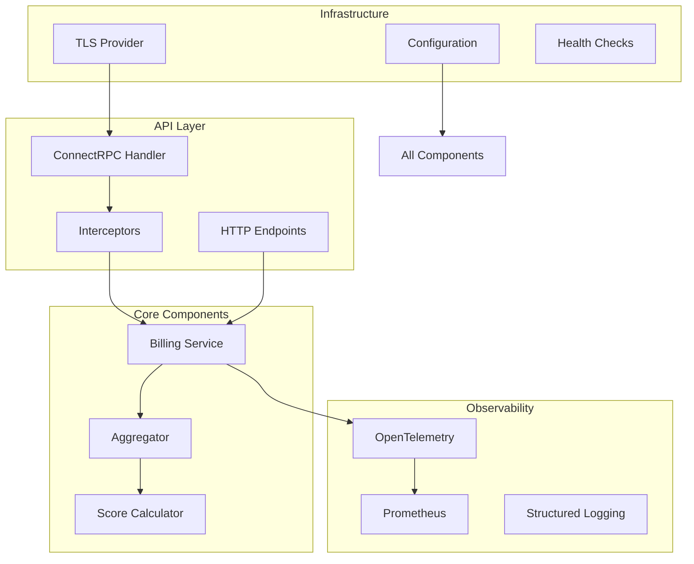
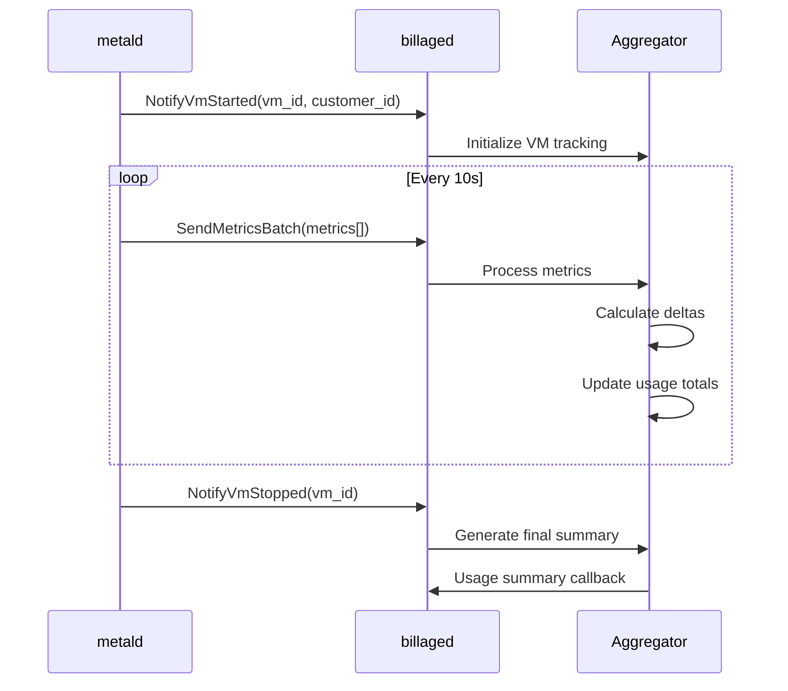
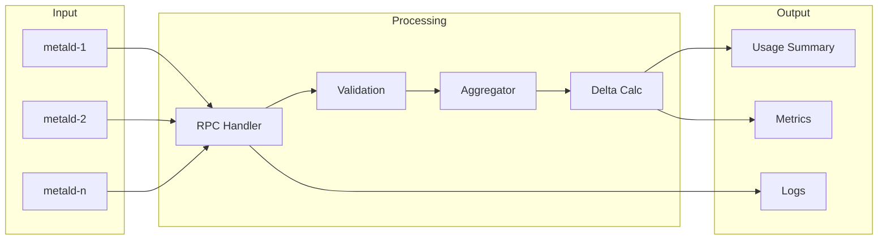

# Billaged Architecture & Dependencies

## Service Architecture

Billaged follows a modular architecture designed for high-performance metric processing and reliable billing data aggregation.

### Component Overview



### Core Components

#### 1. Billing Service
**Location**: [`internal/service/billing.go`](../../internal/service/billing.go:17-180)

The main service implementation that:
- Implements the ConnectRPC BillingService interface
- Routes incoming metrics to the aggregator
- Handles VM lifecycle events
- Integrates with observability metrics

#### 2. Aggregator
**Location**: [`internal/aggregator/aggregator.go`](../../internal/aggregator/aggregator.go:68-366)

The heart of the billing system that:
- Maintains in-memory VM usage state
- Calculates usage deltas from cumulative metrics
- Generates periodic usage summaries
- Handles VM lifecycle tracking

Key data structures:
```go
type VMUsageData struct {
    VMID                string
    CustomerID          string
    StartTime           time.Time
    LastUpdate          time.Time
    TotalCPUNanos       int64
    TotalMemoryBytes    int64
    TotalDiskReadBytes  int64
    TotalDiskWriteBytes int64
    TotalNetworkRxBytes int64
    TotalNetworkTxBytes int64
    SampleCount         int64
}
```

#### 3. Resource Score Calculator
**Location**: [`internal/aggregator/aggregator.go:282-305`](../../internal/aggregator/aggregator.go:282-305)

Implements the billing score formula:

```go
// AIDEV-BUSINESS_RULE: Resource Score Calculation
resourceScore = (cpuSeconds * 1.0) + (memoryGB * 0.5) + (diskMB * 0.3)
```

Weights reflect relative infrastructure costs:
- **CPU (1.0)**: Direct compute cost correlation
- **Memory (0.5)**: Moderate cost impact
- **I/O (0.3)**: Lower direct cost impact

## Service Dependencies

### Internal Dependencies

#### 1. metald
**Documentation**: [metald README](../../../metald/docs/README.md)
**Integration Points**:
- Primary data source for VM usage metrics
- Sends metrics via `SendMetricsBatch` RPC
- Provides VM lifecycle notifications
- Sends periodic heartbeats with active VM lists

**Data Flow**:


#### 2. pkg/tls
**Location**: [`../pkg/tls`](../../cmd/billaged/main.go:24)
**Purpose**: Shared TLS/SPIFFE provider for secure communication

Features:
- SPIFFE workload identity support
- File-based TLS certificates
- Automatic certificate rotation
- mTLS for service-to-service auth

#### 3. pkg/health
**Location**: [`../pkg/health`](../../cmd/billaged/main.go:23)
**Purpose**: Standardized health check implementation

Provides:
- Service name and version
- Uptime tracking
- Readiness/liveness probes

### External Dependencies

#### 1. OpenTelemetry
**Configuration**: [`internal/observability/otel.go`](../../internal/observability/otel.go)

Components:
- **Tracing**: Distributed request tracing
- **Metrics**: Custom billing metrics
- **Exporters**: OTLP HTTP exporters

#### 2. Prometheus
**Metrics**: [`internal/observability/metrics.go`](../../internal/observability/metrics.go:14-119)

Key metrics:
- `billaged_usage_records_processed_total`
- `billaged_aggregation_duration_seconds`
- `billaged_active_vms`
- `billaged_billing_errors_total`

## Data Flow

### Metric Processing Pipeline



### Aggregation Process

1. **Metric Reception**: [`internal/service/billing.go:33-84`](../../internal/service/billing.go:33-84)
   - Validates incoming batch
   - Records processing metrics
   - Forwards to aggregator

2. **Delta Calculation**: [`internal/aggregator/aggregator.go:136-173`](../../internal/aggregator/aggregator.go:136-173)
   - Computes incremental usage from cumulative values
   - Handles counter resets gracefully
   - Updates running totals

3. **Periodic Aggregation**: [`internal/aggregator/aggregator.go:250-276`](../../internal/aggregator/aggregator.go:250-276)
   - Runs every configurable interval (default 60s)
   - Generates usage summaries for active VMs
   - Triggers callback functions

4. **Summary Generation**: [`internal/aggregator/aggregator.go:279-326`](../../internal/aggregator/aggregator.go:279-326)
   - Calculates resource scores
   - Prepares billing-ready data
   - Includes all resource metrics

## Concurrency Model

The service uses Go's concurrency primitives for safe multi-threaded operation:

### Mutex Protection
```go
type Aggregator struct {
    mu        sync.RWMutex
    vmData    map[string]*VMUsageData
    customers map[string][]string
}
```

- Read locks for queries (stats, summaries)
- Write locks for updates (metrics, lifecycle)
- Fine-grained locking for performance

### Goroutine Management
1. **Main Server**: HTTP/gRPC server goroutine
2. **Prometheus Server**: Separate metrics endpoint
3. **Aggregation Timer**: Periodic summary generation
4. **Graceful Shutdown**: Coordinated via context

## Error Handling

### Error Categories

1. **Configuration Errors**: Fatal, exit on startup
2. **Processing Errors**: Logged, metrics updated, continue
3. **Network Errors**: Handled by ConnectRPC framework
4. **Panic Recovery**: Interceptor-level recovery

### Error Propagation

```go
// Logging interceptor with panic recovery
defer func() {
    if r := recover(); r != nil {
        logger.Error("panic in interceptor",
            slog.String("procedure", req.Spec().Procedure),
            slog.Any("panic", r),
        )
        err = connect.NewError(connect.CodeInternal, 
            fmt.Errorf("internal server error: %v", r))
    }
}()
```

## Performance Considerations

### Memory Usage
- In-memory VM tracking: O(n) where n = active VMs
- Bounded by VM lifecycle (cleared on stop)
- No persistent storage requirements

### CPU Usage
- Delta calculations: O(m) where m = metrics per batch
- Aggregation: O(n) every interval
- Minimal computational overhead

### Network
- Batch processing reduces RPC overhead
- ConnectRPC compression support
- HTTP/2 multiplexing

## Security Model

### Authentication
- SPIFFE/mTLS for service identity
- No user authentication (service-to-service only)
- Customer isolation at data level

### Authorization
- No fine-grained permissions
- Relies on network segmentation
- Service mesh policies recommended

### Data Privacy
- No PII storage
- VM IDs and customer IDs only
- Metrics data retention in memory only

## Deployment Considerations

### High Availability
- Stateless design (no persistent state)
- Multiple instances behind load balancer
- Metric aggregation per instance

### Scaling
- Horizontal scaling supported
- Partition by customer or VM range
- Aggregation coordination required

### Monitoring
- Prometheus metrics for observability
- Structured logging for debugging
- OpenTelemetry for distributed tracing