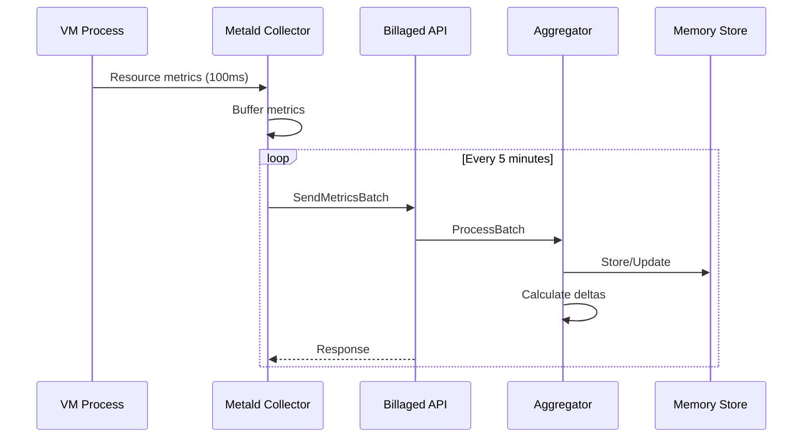
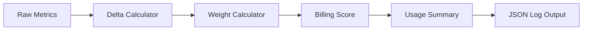

# Billaged Architecture & Dependencies

This document describes the architecture, design decisions, and service interactions of the billaged service.

## Table of Contents

- [System Architecture](#system-architecture)
- [Component Overview](#component-overview)
- [Service Dependencies](#service-dependencies)
- [Data Flow](#data-flow)
- [Aggregation Design](#aggregation-design)
- [Security Architecture](#security-architecture)
- [Performance Considerations](#performance-considerations)

## System Architecture

```mermaid
graph TB
    subgraph "Metald Fleet"
        M1[Metald Instance 1]
        M2[Metald Instance 2]
        MN[Metald Instance N]
    end
    
    subgraph "Billaged Service"
        API[ConnectRPC Server<br/>:8081]
        SVC[Billing Service]
        AGG[Aggregator Engine]
        MEM[(In-Memory Store)]
        INT[Interceptor]
    end
    
    subgraph "Observability"
        PROM[Prometheus<br/>:9465]
        OTLP[OTLP Collector<br/>:4318]
        LOGS[Structured Logs<br/>(stdout)]
    end
    
    M1 -->|mTLS| API
    M2 -->|mTLS| API
    MN -->|mTLS| API
    
    API --> INT
    INT --> SVC
    SVC --> AGG
    AGG --> MEM
    
    AGG -->|Metrics| PROM
    AGG -->|Traces| OTLP
    AGG -->|Summaries| LOGS
```

## Component Overview

### ConnectRPC Server

**Location**: [`cmd/billaged/main.go:267-298`](../../cmd/billaged/main.go:267-298)

The server component handles:
- HTTP/2 with h2c support for cleartext connections
- TLS/mTLS configuration via SPIFFE
- Request compression and decompression
- Protocol transcoding (gRPC ↔ HTTP/JSON)

### Billing Service

**Location**: [`internal/service/billing.go:18-31`](../../internal/service/billing.go:18-31)

```go
type BillingServiceServer struct {
    aggregator *aggregator.Aggregator
    logger     *slog.Logger
    metrics    *observability.BillingMetrics
}
```

Responsibilities:
- Request validation
- Metric batching
- Lifecycle event handling
- Error response generation

### Aggregator Engine

**Location**: [`internal/aggregator/aggregator.go:26-42`](../../internal/aggregator/aggregator.go:26-42)

The aggregator is the core processing engine:

```go
type Aggregator struct {
    interval          time.Duration
    vmUsageData       map[string]*VMUsageData
    mu                sync.RWMutex
    logger            *slog.Logger
    onSummaryCallback func(summary UsageSummary)
}
```

Key features:
- Thread-safe in-memory storage
- Configurable aggregation intervals
- Delta calculation for cumulative metrics
- Automatic counter reset detection

### Observability Layer

**Interceptor**: [`internal/observability/interceptor.go:15-58`](../../internal/observability/interceptor.go:15-58)

Provides:
- Request/response logging
- Latency tracking
- Error rate monitoring
- OpenTelemetry trace injection

## Service Dependencies

### Primary Dependency: Metald

Billaged has a single service dependency on [metald](../../../metald/docs/README.md) for VM metrics:

**Integration Points**:

1. **Metrics Collection** ([`metald/internal/billing/collector.go:65-100`](../../../metald/internal/billing/collector.go:65-100))
   - Metald collects metrics every 5 minutes
   - Sends batches via `SendMetricsBatch` RPC
   - Includes CPU, memory, disk, and network metrics

2. **Lifecycle Events** ([`metald/internal/billing/collector.go:92-100`](../../../metald/internal/billing/collector.go:92-100))
   - VM start notifications with customer ID
   - VM stop notifications with final metrics
   - Gap detection for billing accuracy

3. **Heartbeats**
   - Periodic active VM list updates
   - Instance health monitoring

### No External Dependencies

Billaged is designed to be lightweight with no dependencies on:
- ❌ Databases (PostgreSQL, MySQL, Redis)
- ❌ Message queues (Kafka, RabbitMQ)
- ❌ Object storage (S3, MinIO)
- ❌ External APIs or services

This design choice ensures:
- Simple deployment and operations
- No persistent state management
- Fast startup and shutdown
- Minimal resource requirements

## Data Flow

### Metric Ingestion Flow



### Aggregation Flow



## Aggregation Design

### Metric Processing

**Delta Calculation**: [`internal/aggregator/aggregator.go:110-133`](../../internal/aggregator/aggregator.go:110-133)

```go
// Calculate deltas for cumulative metrics
cpuDelta := metric.CpuTimeNanos - usage.LastCpuTimeNanos
if cpuDelta < 0 {
    // Handle counter reset
    cpuDelta = metric.CpuTimeNanos
}
```

### Billing Score Formula

**Implementation**: [`internal/aggregator/aggregator.go:198-207`](../../internal/aggregator/aggregator.go:198-207)

```go
resourceScore := (cpuSeconds * cpuWeight) + 
                 (memoryGB * memoryWeight) + 
                 (diskMB * diskWeight)
```

Default weights:
- CPU: 1.0 (highest priority)
- Memory: 0.5 (medium priority)
- Disk I/O: 0.3 (lower priority)

### Summary Generation

**Triggered by**:
1. Timer expiration (default: 60s)
2. VM stop events
3. Manual flush requests

**Output Format**:
```json
{
  "vm_id": "vm-123",
  "customer_id": "customer-456",
  "period_start": "2024-01-01T12:00:00Z",
  "period_end": "2024-01-01T12:01:00Z",
  "cpu_seconds_used": 45.2,
  "memory_gb_seconds": 30.5,
  "disk_mb_transferred": 150.8,
  "network_mb_transferred": 25.3,
  "resource_score": 78.5
}
```

## Security Architecture

### Service Authentication

**TLS Configuration**: [`internal/config/config.go:61-73`](../../internal/config/config.go:61-73)

Supports three modes:
1. **SPIFFE** (default): Automatic mTLS via SPIRE agent
2. **File**: Manual certificate management
3. **Disabled**: Development only

### SPIFFE Integration

**Implementation**: [`pkg/spiffe`](../../pkg/spiffe) and [`pkg/tls`](../../pkg/tls)

```go
// Default SPIFFE socket path
socketPath := "/var/lib/spire/agent/agent.sock"

// Automatic certificate rotation
// Trust domain validation
// Service identity verification
```

### Data Privacy

- No persistent storage of sensitive data
- Metrics aggregated and anonymized
- Customer isolation at aggregation level
- No PII in logs or metrics

## Performance Considerations

### Memory Management

**VM Tracking**: [`internal/aggregator/aggregator.go:44-57`](../../internal/aggregator/aggregator.go:44-57)

```go
type VMUsageData struct {
    VMID              string
    CustomerID        string
    StartTime         time.Time
    LastMetricTime    time.Time
    // Cumulative counters
    LastCpuTimeNanos  int64
    LastDiskReadBytes int64
    // ... more fields
}
```

Memory usage scales with:
- Number of active VMs (O(n))
- Metric retention window
- Aggregation interval

Typical memory footprint:
- 1,000 VMs: ~10MB
- 10,000 VMs: ~100MB
- 100,000 VMs: ~1GB

### Concurrency Design

1. **Read-Write Mutex**: Protects shared VM data
2. **Goroutine per Summary**: Parallel summary generation
3. **Non-blocking Callbacks**: Async log writing
4. **Buffered Channels**: Smooth metric flow

### Optimization Strategies

1. **Batch Processing**: Reduces lock contention
2. **Pre-allocated Buffers**: Minimizes allocations
3. **Counter Reset Detection**: Handles VM restarts
4. **Lazy Initialization**: On-demand VM tracking

## Failure Handling

### Metric Loss Scenarios

1. **Billaged Restart**:
   - In-memory data lost
   - Metald retries with buffered metrics
   - Gap detection ensures accuracy

2. **Network Partition**:
   - Metald buffers locally
   - Exponential backoff retry
   - Gap notification on recovery

3. **Overload Protection**:
   - Request timeout enforcement
   - Metric drop with error logging
   - Prometheus alerts on drops

### Monitoring Integration

Key metrics for operations:
- `billaged_aggregation_lag_seconds`: Processing delay
- `billaged_memory_usage_bytes`: Memory consumption
- `billaged_active_vms`: Capacity planning
- `billaged_rpc_duration_seconds`: API latency

## Future Considerations

### Scalability Options

1. **Horizontal Sharding**: Partition VMs by ID
2. **Write-Through Cache**: Redis for persistence
3. **Streaming Aggregation**: Apache Flink integration
4. **Multi-Region**: Geographic distribution

### Feature Roadmap

- [ ] Configurable metric weights
- [ ] Custom aggregation windows
- [ ] Real-time alerting
- [ ] Historical data export
- [ ] Cost prediction models