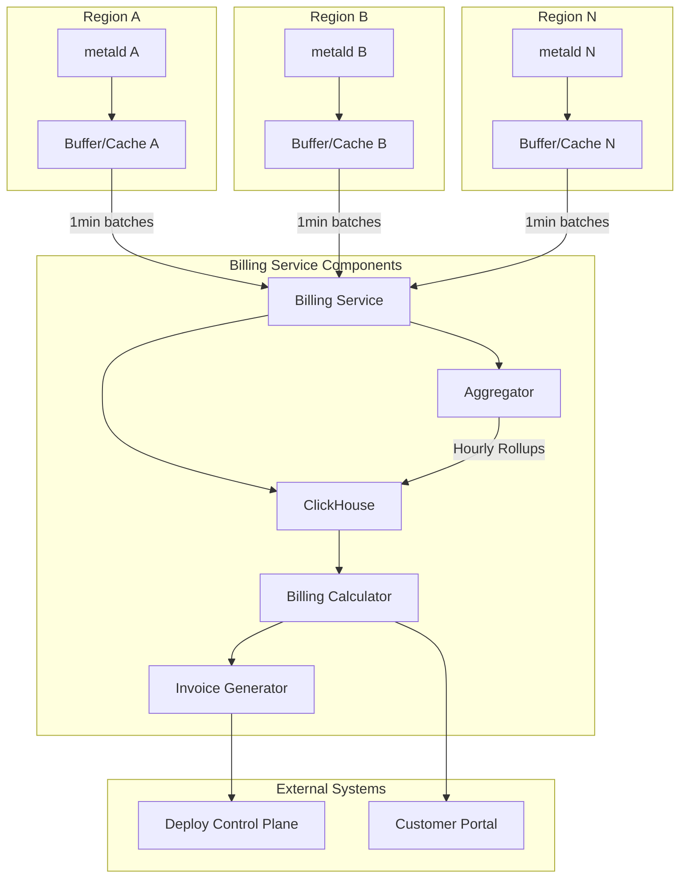
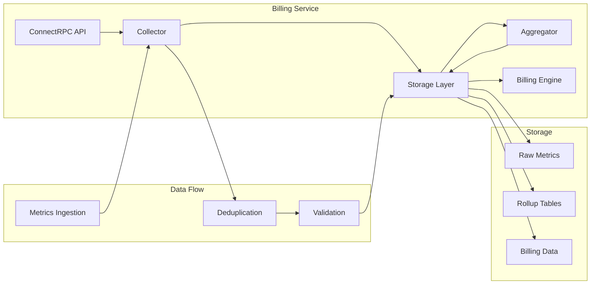
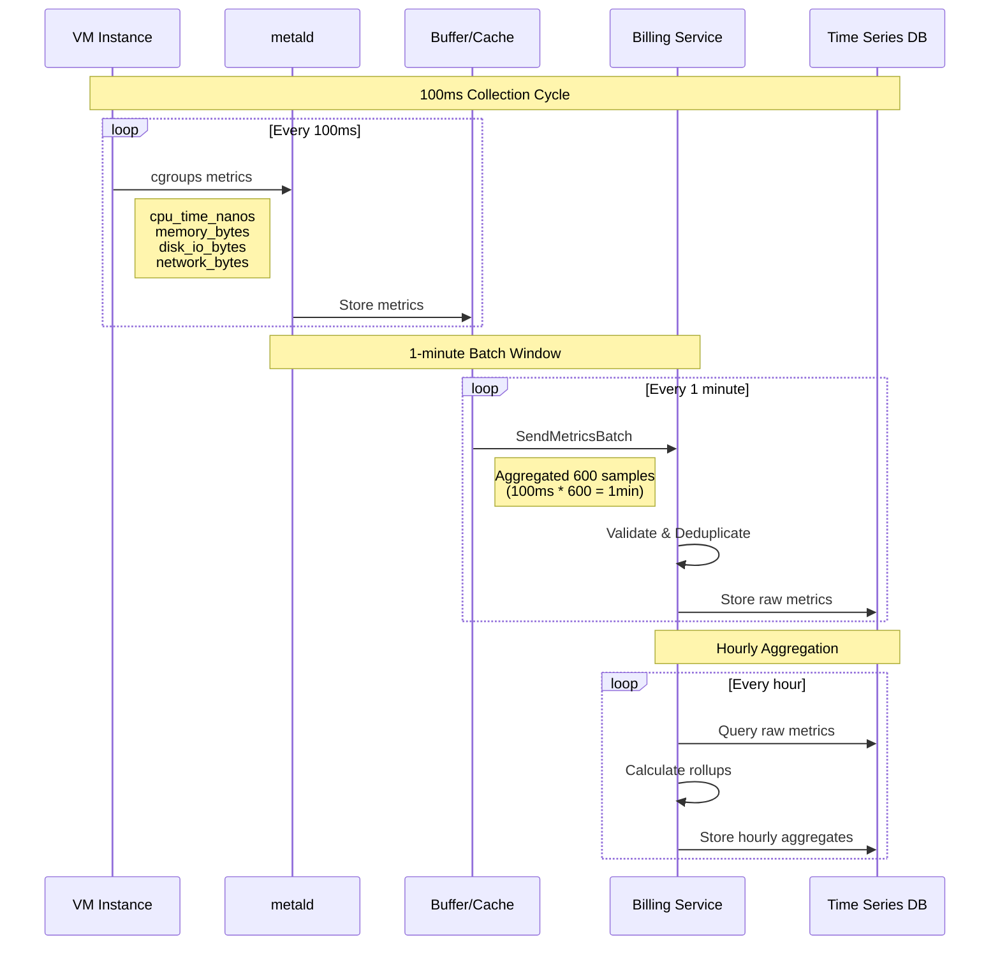
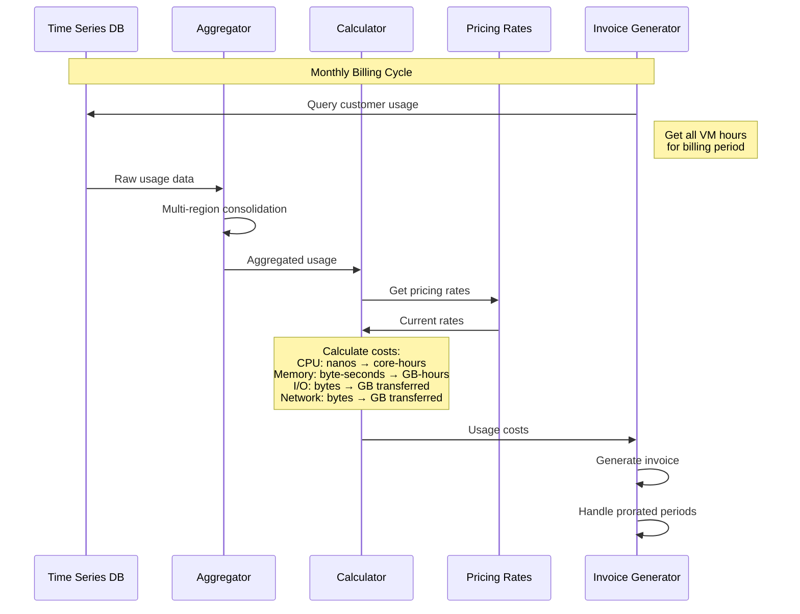
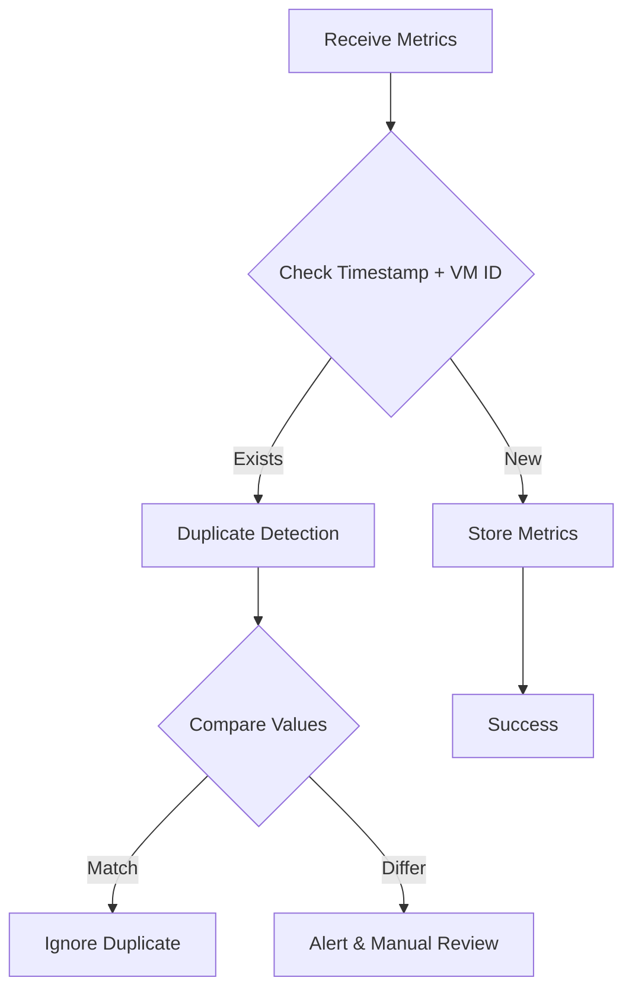
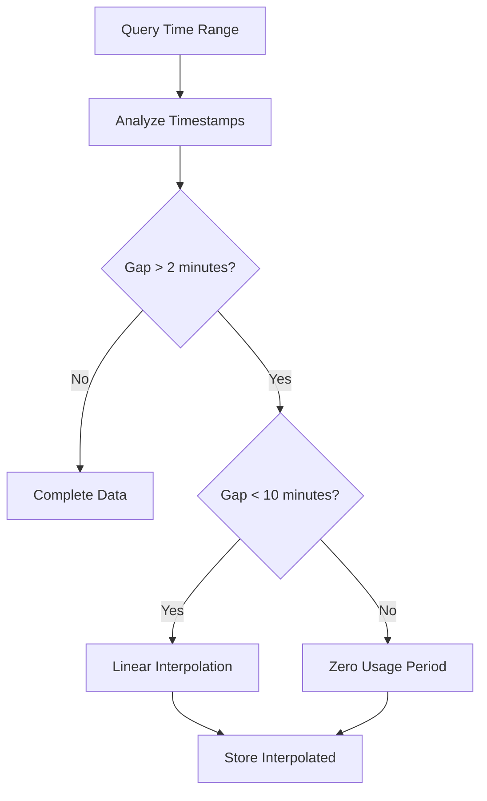
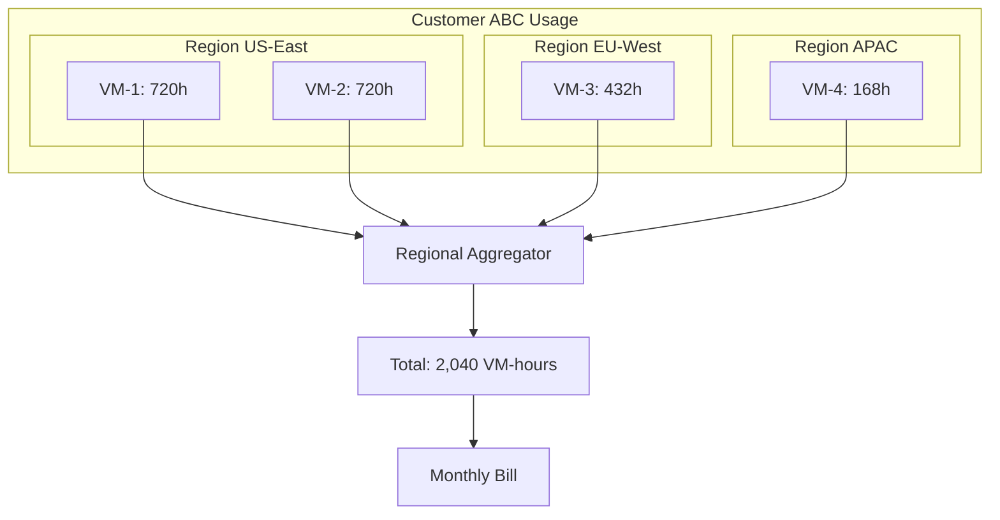
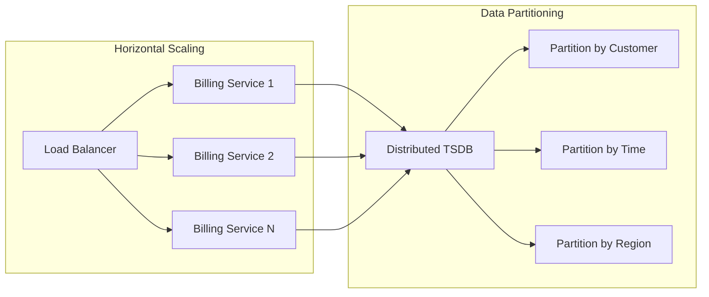

# Billing Service Architecture

## Overview

The billing service provides high-precision usage accounting for VM resources across multiple regions. It collects metrics from metald instances and aggregates them for accurate customer billing with nanosecond CPU precision and byte-level I/O tracking.

## Architecture Diagram



## Component Architecture



## Data Flow Architecture

### Metrics Collection Flow



### Billing Calculation Flow



## Precision Requirements

### Resource Tracking Precision

| Resource | Collection Precision | Storage Precision | Billing Precision |
|----------|---------------------|-------------------|------------------|
| CPU Time | nanoseconds | nanoseconds | milliseconds |
| Memory | bytes | bytes | KB (rounded up) |
| Disk I/O | bytes | bytes | KB (rounded up) |
| Network | bytes | bytes | KB (rounded up) |

### Time Windows

```mermaid
gantt
    title Billing Time Windows
    dateFormat X
    axisFormat %s
    
    section Collection
    metald samples     :0, 100
    Buffer window      :0, 60000
    
    section Aggregation  
    Batch to billing   :60000, 120000
    Hourly rollup      :3600000, 7200000
    
    section Billing
    Monthly cycle      :2592000000, 5184000000
```



## Error Handling & Reliability

### Duplicate Handling



### Gap Detection



## Multi-Region Consolidation

### Customer Usage Aggregation



## Storage Schema

### Time Series Tables

```sql
-- Raw metrics table (high frequency)
CREATE TABLE metrics_raw (
    timestamp TIMESTAMPTZ NOT NULL,
    vm_id VARCHAR(64) NOT NULL,
    customer_id VARCHAR(64) NOT NULL,
    region VARCHAR(32) NOT NULL,
    
    -- CPU metrics (nanosecond precision)
    cpu_time_nanos BIGINT NOT NULL,
    cpu_utilization_pct DOUBLE PRECISION,
    cpu_cores_used DOUBLE PRECISION,
    
    -- Memory metrics (byte precision)
    memory_bytes_used BIGINT NOT NULL,
    memory_bytes_peak BIGINT NOT NULL,
    
    -- I/O metrics
    disk_read_bytes BIGINT NOT NULL,
    disk_write_bytes BIGINT NOT NULL,
    network_rx_bytes BIGINT NOT NULL,
    network_tx_bytes BIGINT NOT NULL,
    
    PRIMARY KEY (timestamp, vm_id)
);

-- Hourly rollups (for billing)
CREATE TABLE metrics_hourly (
    hour_start TIMESTAMPTZ NOT NULL,
    vm_id VARCHAR(64) NOT NULL,
    customer_id VARCHAR(64) NOT NULL,
    region VARCHAR(32) NOT NULL,
    
    -- Aggregated values
    cpu_core_hours DOUBLE PRECISION NOT NULL,
    memory_gb_hours DOUBLE PRECISION NOT NULL,
    disk_gb_transferred DOUBLE PRECISION NOT NULL,
    network_gb_transferred DOUBLE PRECISION NOT NULL,
    
    PRIMARY KEY (hour_start, vm_id)
);
```

## Performance Requirements

### Throughput Targets

| Metric | Target | Peak Capacity |
|--------|--------|---------------|
| Metrics Ingestion | 10K/second | 50K/second |
| Query Response | <100ms p95 | <500ms p99 |
| Billing Calculation | <5 seconds | Monthly invoice |
| Data Retention | 13 months | For compliance |

### Scaling Considerations

