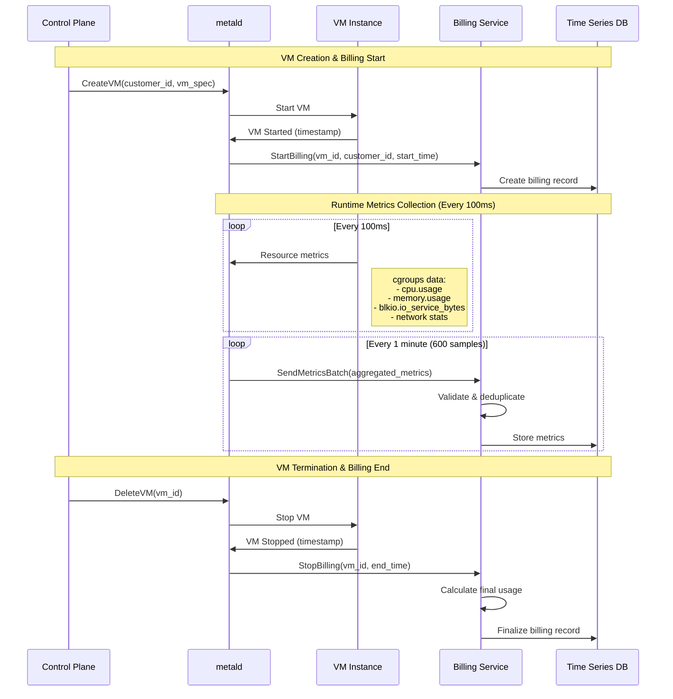
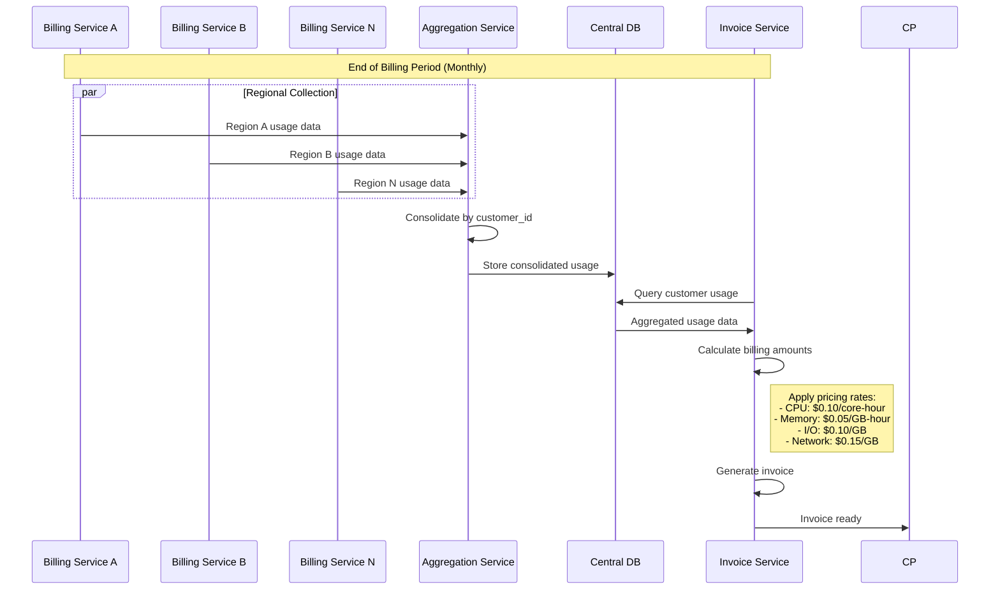
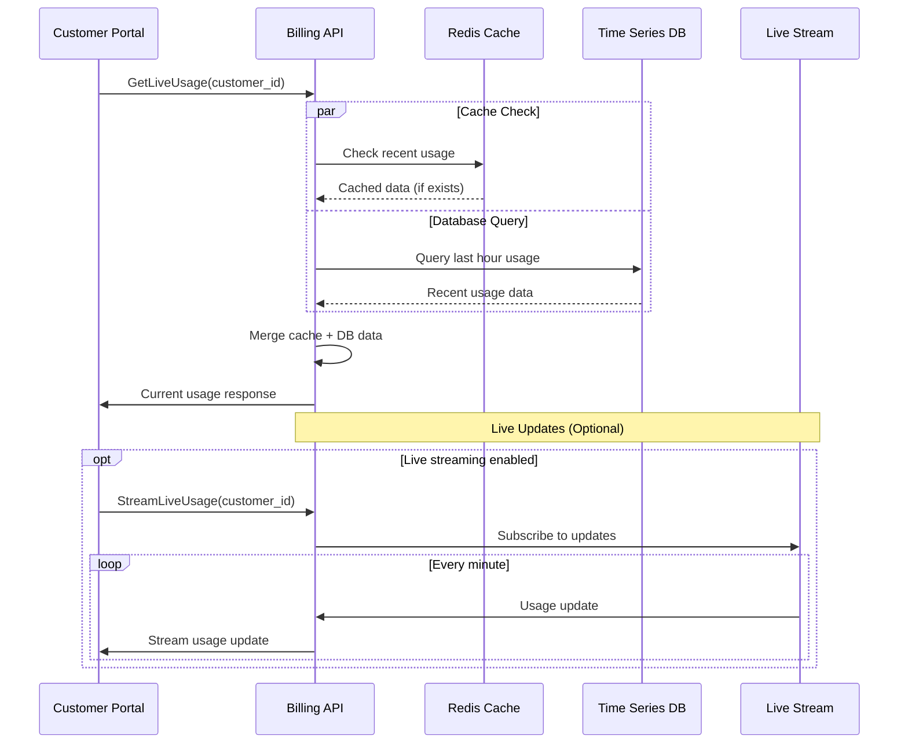
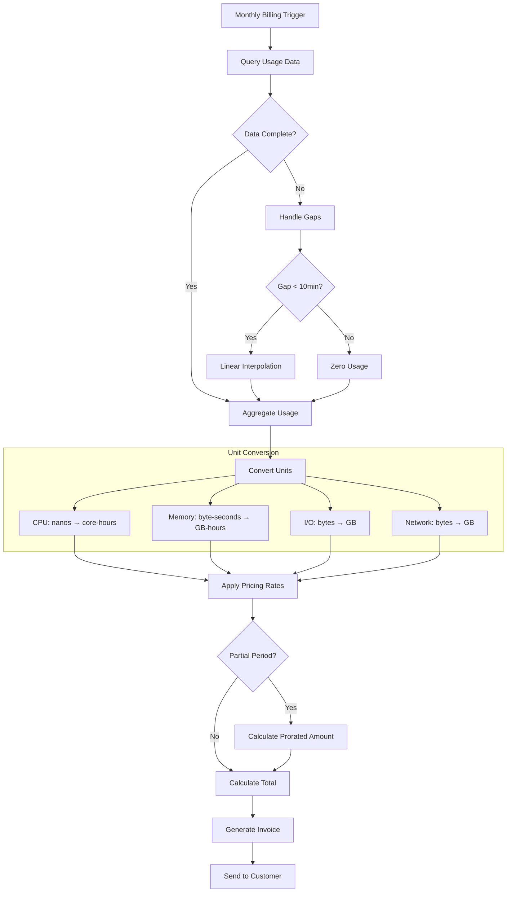
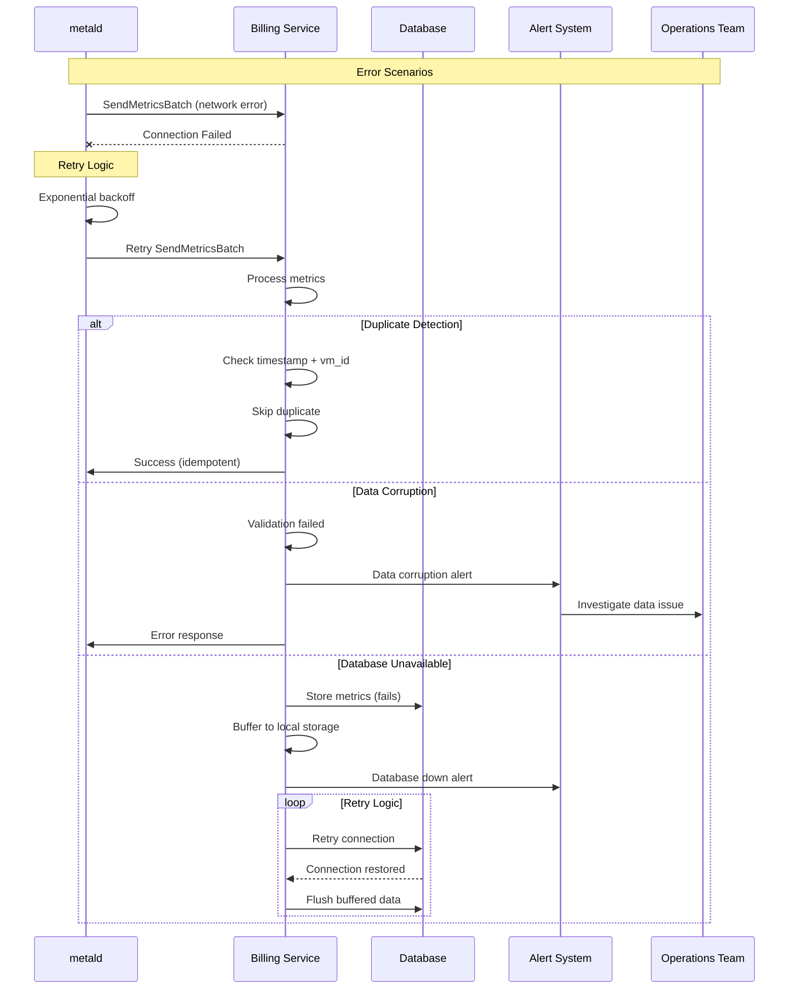
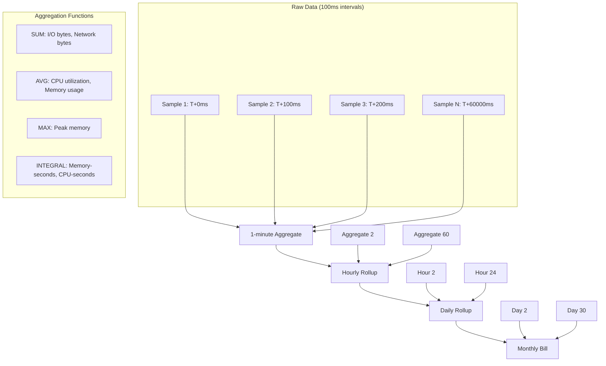
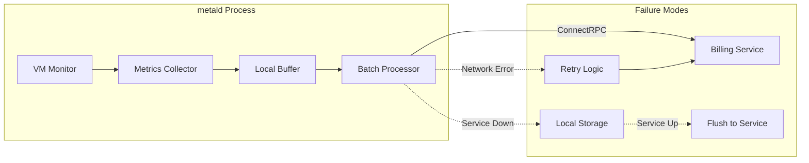
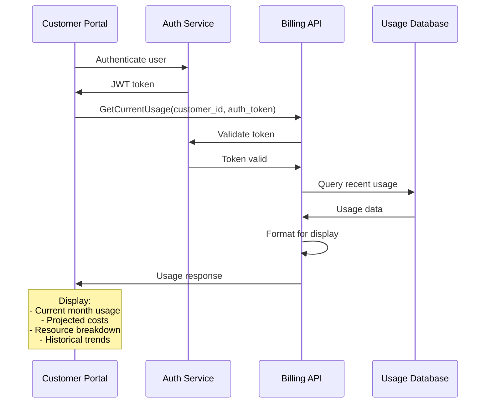

# Billing Service Flow Documentation

## Core Billing Flows

### 1. VM Lifecycle Billing Flow



### 2. Multi-Region Usage Aggregation



### 3. Real-time Usage Tracking



### 4. Billing Calculation Flow



### 5. Error Handling & Recovery Flow



### 6. Data Aggregation Patterns



### 7. Precision Handling Flow

```mermaid
flowchart LR
    subgraph "Collection Precision"
        CPU_NS[CPU: nanoseconds]
        MEM_B[Memory: bytes]
        IO_B[I/O: bytes]
        NET_B[Network: bytes]
    end
    
    subgraph "Storage Precision"
        CPU_NS --> CPU_NS_STORE[Store: int64 nanoseconds]
        MEM_B --> MEM_B_STORE[Store: int64 bytes]
        IO_B --> IO_B_STORE[Store: int64 bytes]
        NET_B --> NET_B_STORE[Store: int64 bytes]
    end
    
    subgraph "Billing Precision"
        CPU_NS_STORE --> CPU_MS[Bill: millisecond precision]
        MEM_B_STORE --> MEM_KB[Bill: KB precision (rounded up)]
        IO_B_STORE --> IO_KB[Bill: KB precision (rounded up)]
        NET_B_STORE --> NET_KB[Bill: KB precision (rounded up)]
    end
    
    subgraph "Rate Calculation"
        CPU_MS --> CPU_RATE[Rate: per core-hour]
        MEM_KB --> MEM_RATE[Rate: per GB-hour]
        IO_KB --> IO_RATE[Rate: per GB transferred]
        NET_KB --> NET_RATE[Rate: per GB transferred]
    end
```

## Integration Points

### metald Integration



### Customer Portal Integration



## Validation Points

### Data Integrity Checks

1. **Temporal Consistency**: Ensure timestamps are monotonically increasing
2. **Resource Bounds**: Validate metrics are within reasonable limits
3. **Completeness**: Check for missing data gaps
4. **Duplicate Prevention**: Ensure idempotent processing
5. **Cross-validation**: Compare aggregated values with raw data samples

This documentation provides a comprehensive view of how the billing service operates, handles edge cases, and integrates with other system components for accurate usage accounting.