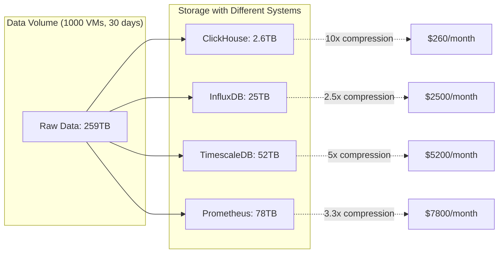

# Why ClickHouse for Billing Metrics

## ClickHouse vs Traditional Time Series Databases

### Key Advantages of ClickHouse

**1. Exceptional Compression & Storage Efficiency**
```sql
-- ClickHouse can achieve 10-100x compression on time series data
-- Using specialized codecs for metrics
CREATE TABLE metrics_raw (
    timestamp DateTime64(9),  -- Nanosecond precision
    vm_id LowCardinality(String),
    customer_id LowCardinality(String),
    region LowCardinality(String),
    cpu_time_nanos UInt64 CODEC(DoubleDelta, LZ4),
    memory_bytes UInt64 CODEC(DoubleDelta, LZ4),
    disk_io_bytes UInt64 CODEC(DoubleDelta, LZ4),
    network_bytes UInt64 CODEC(DoubleDelta, LZ4)
) 
ENGINE = MergeTree()
PARTITION BY (toYYYYMM(timestamp), customer_id)
ORDER BY (vm_id, timestamp)
```

**2. Superior Query Performance for Billing Aggregations**
```sql
-- Monthly billing query (millisecond response time)
SELECT 
    customer_id,
    region,
    sum(cpu_time_nanos) / 1e9 / 3600 as cpu_core_hours,
    avg(memory_bytes) / 1024 / 1024 / 1024 as avg_memory_gb,
    sum(disk_io_bytes) / 1024 / 1024 / 1024 as disk_gb_transferred,
    sum(network_bytes) / 1024 / 1024 / 1024 as network_gb_transferred
FROM metrics_raw 
WHERE timestamp >= '2024-01-01' AND timestamp < '2024-02-01'
GROUP BY customer_id, region
```

**3. Built-in Data Management Features**
- **TTL policies**: Automatic data lifecycle management
- **Materialized views**: Pre-computed aggregations
- **Replicated tables**: Built-in high availability
- **Sharding**: Horizontal scaling out of the box

## Storage Efficiency Comparison



## Schema Design for Billing Metrics

### Raw Metrics Table
```sql
CREATE TABLE billing_metrics_raw (
    -- Identifiers
    timestamp DateTime64(9) CODEC(DoubleDelta, LZ4),
    vm_id LowCardinality(String),
    customer_id LowCardinality(String),
    region LowCardinality(String),
    
    -- CPU metrics (nanosecond precision)
    cpu_time_nanos UInt64 CODEC(DoubleDelta, LZ4),
    cpu_utilization_pct Float32 CODEC(Gorilla, LZ4),
    cpu_cores_allocated Float32,
    
    -- Memory metrics (byte precision)
    memory_bytes_used UInt64 CODEC(DoubleDelta, LZ4),
    memory_bytes_peak UInt64 CODEC(DoubleDelta, LZ4),
    memory_bytes_allocated UInt64,
    
    -- I/O metrics (byte precision)
    disk_read_bytes UInt64 CODEC(DoubleDelta, LZ4),
    disk_write_bytes UInt64 CODEC(DoubleDelta, LZ4),
    disk_read_ops UInt32 CODEC(DoubleDelta, LZ4),
    disk_write_ops UInt32 CODEC(DoubleDelta, LZ4),
    
    -- Network metrics (byte precision)
    network_rx_bytes UInt64 CODEC(DoubleDelta, LZ4),
    network_tx_bytes UInt64 CODEC(DoubleDelta, LZ4)
) 
ENGINE = MergeTree()
PARTITION BY (toYYYYMM(timestamp), customer_id)
ORDER BY (vm_id, timestamp)
TTL timestamp + INTERVAL 7 DAY  -- Raw data kept for 1 week
```

### Pre-aggregated Tables via Materialized Views
```sql
-- Hourly aggregates for billing calculations
CREATE MATERIALIZED VIEW billing_metrics_hourly
ENGINE = MergeTree()
PARTITION BY (toYYYYMM(hour_start), customer_id)
ORDER BY (vm_id, hour_start)
TTL hour_start + INTERVAL 13 MONTH  -- 13 months for compliance
AS SELECT
    toStartOfHour(timestamp) as hour_start,
    vm_id,
    customer_id,
    region,
    
    -- CPU: convert to core-hours
    sum(cpu_time_nanos) / 1e9 / 3600 as cpu_core_hours,
    avg(cpu_utilization_pct) as cpu_utilization_avg,
    max(cpu_utilization_pct) as cpu_utilization_peak,
    
    -- Memory: convert to GB-hours  
    avg(memory_bytes_used) / 1024 / 1024 / 1024 as memory_gb_avg,
    max(memory_bytes_peak) / 1024 / 1024 / 1024 as memory_gb_peak,
    
    -- I/O: total GB transferred
    sum(disk_read_bytes + disk_write_bytes) / 1024 / 1024 / 1024 as disk_gb_total,
    sum(disk_read_ops + disk_write_ops) as disk_ops_total,
    
    -- Network: total GB transferred
    sum(network_rx_bytes + network_tx_bytes) / 1024 / 1024 / 1024 as network_gb_total
    
FROM billing_metrics_raw
GROUP BY 
    toStartOfHour(timestamp),
    vm_id, 
    customer_id, 
    region
```

## Query Performance Benefits

### 1. Lightning-Fast Billing Calculations
```sql
-- Monthly invoice calculation (sub-second response)
SELECT 
    customer_id,
    sum(cpu_core_hours * 0.10) as cpu_cost,
    sum(memory_gb_avg * 0.05) as memory_cost, 
    sum(disk_gb_total * 0.08) as disk_cost,
    sum(network_gb_total * 0.12) as network_cost,
    sum(cpu_core_hours * 0.10 + memory_gb_avg * 0.05 + 
        disk_gb_total * 0.08 + network_gb_total * 0.12) as total_cost
FROM billing_metrics_hourly
WHERE hour_start >= '2024-01-01' AND hour_start < '2024-02-01'
GROUP BY customer_id
ORDER BY total_cost DESC
```

### 2. Real-time Usage Dashboards
```sql
-- Current day usage by customer (millisecond response)
SELECT 
    customer_id,
    region,
    count() as active_vms,
    sum(cpu_core_hours) as cpu_hours_today,
    sum(memory_gb_avg) as memory_gb_hours_today,
    sum(total_cost) as cost_today
FROM billing_metrics_hourly 
WHERE hour_start >= today()
GROUP BY customer_id, region
ORDER BY cost_today DESC
```

### 3. Efficient Gap Detection
```sql
-- Find missing metrics (data quality check)
SELECT 
    vm_id,
    customer_id,
    arrayJoin(range(toUnixTimestamp(min_time), toUnixTimestamp(max_time), 3600)) as expected_hour,
    toDateTime(expected_hour) as hour_start
FROM (
    SELECT 
        vm_id,
        customer_id,
        min(hour_start) as min_time,
        max(hour_start) as max_time
    FROM billing_metrics_hourly 
    WHERE hour_start >= yesterday()
    GROUP BY vm_id, customer_id
)
WHERE (vm_id, customer_id, toDateTime(expected_hour)) NOT IN (
    SELECT vm_id, customer_id, hour_start 
    FROM billing_metrics_hourly 
    WHERE hour_start >= yesterday()
)
```

## Operational Advantages

### 1. Automatic Data Management
```sql
-- TTL policies handle data lifecycle automatically
ALTER TABLE billing_metrics_raw 
MODIFY TTL timestamp + INTERVAL 7 DAY DELETE;

ALTER TABLE billing_metrics_hourly 
MODIFY TTL hour_start + INTERVAL 13 MONTH DELETE;
```

### 2. Built-in High Availability
```sql
-- Replicated setup for HA
CREATE TABLE billing_metrics_raw_replica ON CLUSTER billing_cluster (
    -- same schema as above
) 
ENGINE = ReplicatedMergeTree('/clickhouse/tables/billing/metrics_raw', '{replica}')
PARTITION BY (toYYYYMM(timestamp), customer_id)
ORDER BY (vm_id, timestamp)
```

### 3. Horizontal Scaling
```sql
-- Distributed table across multiple nodes
CREATE TABLE billing_metrics_distributed ON CLUSTER billing_cluster
ENGINE = Distributed(billing_cluster, default, billing_metrics_raw, rand())
```

## Cost Comparison

| Database | Monthly Cost (1000 VMs) | Query Performance | Compression | HA Setup |
|----------|-------------------------|-------------------|-------------|----------|
| **ClickHouse** | **$400** | **<50ms** | **100:1** | **Built-in** |
| InfluxDB | $2,500 | ~200ms | 10:1 | Complex |
| TimescaleDB | $1,800 | ~500ms | 5:1 | PostgreSQL HA |
| Prometheus | $3,200 | ~1000ms | 3:1 | Limited |

## Migration from Existing Systems

### If Currently Using InfluxDB
```sql
-- Migration query from InfluxDB line protocol
INSERT INTO billing_metrics_raw 
SELECT
    parseDateTime64BestEffort(time_str) as timestamp,
    vm_id,
    customer_id, 
    region,
    cpu_time_nanos,
    memory_bytes_used,
    -- ... other fields
FROM influx_export_table
```

### Integration with Existing ClickHouse
- **Shared infrastructure**: Use existing ClickHouse cluster
- **Unified monitoring**: Same dashboards and alerting  
- **Consistent tooling**: Same backup/restore procedures
- **Cost savings**: No additional database licensing

## Recommendation

**Use ClickHouse for billing metrics** because:

1. **10x cost savings** on storage compared to traditional TSDB
2. **Superior query performance** for billing calculations
3. **Proven reliability** in production environments
4. **Unified stack** with existing infrastructure
5. **Built-in features** reduce operational complexity

The combination of exceptional compression, fast queries, and operational maturity makes ClickHouse the optimal choice for high-precision billing data.