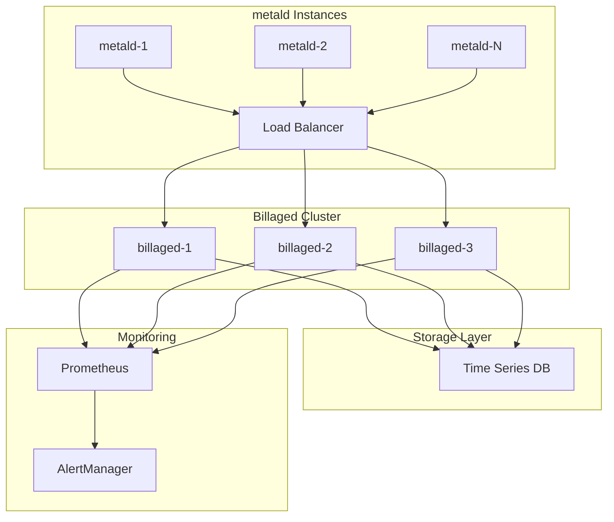

# Billaged Deployment & Operations Guide

Comprehensive guide for deploying and operating billaged in production environments.

## Table of Contents

1. [Deployment Overview](#deployment-overview)
2. [System Requirements](#system-requirements)
3. [Deployment Methods](#deployment-methods)
4. [Production Checklist](#production-checklist)
5. [Operations](#operations)
6. [Backup & Recovery](#backup--recovery)
7. [Scaling](#scaling)
8. [Security](#security)

## Deployment Overview

Billaged is designed for high-availability deployments with horizontal scaling capabilities. It integrates with time-series databases for metrics storage and provides real-time billing data aggregation.

### Architecture Components



## System Requirements

### Hardware Requirements

| Component | Minimum | Recommended | Notes |
|-----------|---------|-------------|-------|
| CPU | 2 cores | 4-8 cores | CPU bound during aggregation |
| Memory | 1 GB | 4-8 GB | Depends on active VMs |
| Storage | 10 GB | 50 GB | For local buffering |
| Network | 1 Gbps | 10 Gbps | High throughput required |

### Software Requirements

- Go 1.21+ (for building)
- Linux kernel 4.9+ (production)
- systemd 230+ (for service management)
- Time synchronization (NTP/chrony)

## Deployment Methods

### 1. Systemd Service

```bash
# 1. Build billaged
go build -o /usr/local/bin/billaged ./cmd/billaged

# 2. Create service user
useradd -r -s /bin/false billaged

# 3. Create directories
mkdir -p /var/lib/billaged /var/log/billaged
chown billaged:billaged /var/lib/billaged /var/log/billaged

# 4. Install service file
cp contrib/systemd/billaged.service /etc/systemd/system/
cp contrib/systemd/billaged.env.example /etc/billaged.env

# 5. Configure environment
vim /etc/billaged.env

# 6. Enable and start
systemctl daemon-reload
systemctl enable billaged
systemctl start billaged
```

**Service file** (`/etc/systemd/system/billaged.service`):
```ini
[Unit]
Description=Billaged - VM Usage Billing Service
Documentation=https://github.com/unkeyed/unkey
After=network-online.target
Wants=network-online.target

[Service]
Type=notify
User=billaged
Group=billaged
EnvironmentFile=/etc/billaged.env
ExecStart=/usr/local/bin/billaged
Restart=always
RestartSec=5
LimitNOFILE=65535
StandardOutput=journal
StandardError=journal
SyslogIdentifier=billaged

# Security hardening
NoNewPrivileges=true
PrivateTmp=true
ProtectSystem=strict
ProtectHome=true
ReadWritePaths=/var/lib/billaged /var/log/billaged

[Install]
WantedBy=multi-user.target
```

### 2. Docker Deployment

```dockerfile
# Dockerfile
FROM golang:1.21-alpine AS builder
WORKDIR /build
COPY . .
RUN go mod download
RUN CGO_ENABLED=0 go build -o billaged ./cmd/billaged

FROM alpine:3.19
RUN apk add --no-cache ca-certificates tzdata
COPY --from=builder /build/billaged /usr/local/bin/
USER nobody
EXPOSE 8081 9465
ENTRYPOINT ["billaged"]
```

```bash
# Build and run
docker build -t billaged:latest .
docker run -d \
  --name billaged \
  -p 8081:8081 \
  -p 9465:9465 \
  -e BILLAGED_OTEL_ENABLED=true \
  -e BILLAGED_OTEL_ENDPOINT=otel-collector:4318 \
  --restart unless-stopped \
  billaged:latest
```

### 3. Kubernetes Deployment

```yaml
apiVersion: v1
kind: Service
metadata:
  name: billaged
  labels:
    app: billaged
spec:
  selector:
    app: billaged
  ports:
  - name: grpc
    port: 8081
    targetPort: 8081
  - name: metrics
    port: 9465
    targetPort: 9465
  type: ClusterIP
---
apiVersion: apps/v1
kind: Deployment
metadata:
  name: billaged
  labels:
    app: billaged
spec:
  replicas: 3
  selector:
    matchLabels:
      app: billaged
  template:
    metadata:
      labels:
        app: billaged
      annotations:
        prometheus.io/scrape: "true"
        prometheus.io/port: "9465"
        prometheus.io/path: "/metrics"
    spec:
      affinity:
        podAntiAffinity:
          preferredDuringSchedulingIgnoredDuringExecution:
          - weight: 100
            podAffinityTerm:
              labelSelector:
                matchExpressions:
                - key: app
                  operator: In
                  values:
                  - billaged
              topologyKey: kubernetes.io/hostname
      containers:
      - name: billaged
        image: unkeyed/billaged:v1.0.0
        ports:
        - containerPort: 8081
          name: grpc
        - containerPort: 9465
          name: metrics
        env:
        - name: BILLAGED_OTEL_ENABLED
          value: "true"
        - name: BILLAGED_OTEL_ENDPOINT
          value: "otel-collector.monitoring.svc.cluster.local:4318"
        - name: BILLAGED_OTEL_HIGH_CARDINALITY_ENABLED
          value: "false"
        livenessProbe:
          httpGet:
            path: /health
            port: 8081
          initialDelaySeconds: 10
          periodSeconds: 10
        readinessProbe:
          httpGet:
            path: /health
            port: 8081
          initialDelaySeconds: 5
          periodSeconds: 5
        resources:
          requests:
            memory: "512Mi"
            cpu: "500m"
          limits:
            memory: "2Gi"
            cpu: "2000m"
```

## Production Checklist

### Pre-deployment

- [ ] Time synchronization configured (NTP/chrony)
- [ ] Firewall rules configured
- [ ] TLS certificates provisioned (if applicable)
- [ ] Load balancer configured
- [ ] Monitoring endpoints accessible
- [ ] Log aggregation configured
- [ ] Backup strategy defined

### Configuration

- [ ] Production environment variables set
- [ ] OpenTelemetry endpoint configured
- [ ] High cardinality labels disabled
- [ ] Appropriate sampling rate set
- [ ] Resource limits configured

### Post-deployment

- [ ] Health checks passing
- [ ] Metrics being collected
- [ ] Test metrics batch processed
- [ ] Alerts configured
- [ ] Documentation updated

## Operations

### Health Monitoring

```bash
# Check service health
curl -f http://billaged:8081/health

# Check systemd status
systemctl status billaged

# Check recent logs
journalctl -u billaged -n 100 -f

# Verify metrics
curl -s http://billaged:9465/metrics | grep billaged_
```

### Log Management

Configure structured logging output:

```bash
# Journal logs (systemd)
journalctl -u billaged --since "1 hour ago" -o json

# Docker logs
docker logs billaged --since 1h

# Kubernetes logs
kubectl logs -l app=billaged --tail=100 -f
```

### Performance Monitoring

Key metrics to track:

```promql
# Request rate
rate(billaged_metrics_processed_total[5m])

# Processing latency
histogram_quantile(0.95, billaged_processing_duration_seconds)

# Active VMs
billaged_active_vms

# Memory usage
process_resident_memory_bytes{job="billaged"}

# CPU usage
rate(process_cpu_seconds_total{job="billaged"}[5m])
```

### Capacity Planning

Monitor these indicators for scaling decisions:

| Metric | Warning Threshold | Critical Threshold | Action |
|--------|------------------|-------------------|---------|
| CPU Usage | > 70% | > 85% | Add replicas |
| Memory Usage | > 80% | > 90% | Increase memory |
| Processing Latency p95 | > 50ms | > 100ms | Add replicas |
| Queue Depth | > 1000 | > 5000 | Add replicas |

## Backup & Recovery

### Data Backup

Billaged is stateless and forwards data to persistent storage:

1. **No local state**: All data is sent to time-series database
2. **Configuration backup**: Store environment configuration
3. **Deployment artifacts**: Version control all deployment files

### Disaster Recovery

```bash
# 1. Deploy new instance
kubectl apply -f billaged-deployment.yaml

# 2. Verify configuration
kubectl get configmap billaged-config -o yaml

# 3. Check connectivity
kubectl exec -it billaged-0 -- wget -qO- http://localhost:8081/health

# 4. Verify metrics flow
kubectl logs -l app=billaged | grep "metrics batch"
```

## Scaling

### Horizontal Scaling

```bash
# Kubernetes
kubectl scale deployment billaged --replicas=5

# Docker Swarm
docker service scale billaged=5

# Manual scaling
# Deploy additional instances behind load balancer
```

### Vertical Scaling

Update resource allocations:

```yaml
resources:
  requests:
    memory: "2Gi"
    cpu: "2000m"
  limits:
    memory: "4Gi"
    cpu: "4000m"
```

### Auto-scaling

```yaml
apiVersion: autoscaling/v2
kind: HorizontalPodAutoscaler
metadata:
  name: billaged-hpa
spec:
  scaleTargetRef:
    apiVersion: apps/v1
    kind: Deployment
    name: billaged
  minReplicas: 3
  maxReplicas: 10
  metrics:
  - type: Resource
    resource:
      name: cpu
      target:
        type: Utilization
        averageUtilization: 70
  - type: Resource
    resource:
      name: memory
      target:
        type: Utilization
        averageUtilization: 80
```

## Security

### Network Security

1. **Ingress Rules**:
   - Port 8081: Only from metald instances
   - Port 9465: Only from monitoring systems

2. **Egress Rules**:
   - Time-series database ports
   - OpenTelemetry collector (4318)

### Service Hardening

```bash
# 1. Run as non-root user
useradd -r -s /bin/false billaged

# 2. Set file permissions
chmod 755 /usr/local/bin/billaged
chown root:root /usr/local/bin/billaged

# 3. Restrict configuration access
chmod 600 /etc/billaged.env
chown billaged:billaged /etc/billaged.env

# 4. Enable security features
# In systemd service:
ProtectSystem=strict
NoNewPrivileges=true
PrivateTmp=true
```

### Secrets Management

```yaml
# Kubernetes secrets
apiVersion: v1
kind: Secret
metadata:
  name: billaged-secrets
type: Opaque
data:
  database-url: <base64-encoded>
  api-key: <base64-encoded>
```

## Operational Procedures

### Rolling Updates

```bash
# 1. Update image
kubectl set image deployment/billaged billaged=unkeyed/billaged:v1.1.0

# 2. Monitor rollout
kubectl rollout status deployment/billaged

# 3. Verify health
kubectl get pods -l app=billaged
```

### Emergency Procedures

1. **Service Degradation**:
   ```bash
   # Increase resources
   kubectl patch deployment billaged -p '{"spec":{"replicas":5}}'
   
   # Check for errors
   kubectl logs -l app=billaged --tail=1000 | grep ERROR
   ```

2. **Complete Outage**:
   ```bash
   # Quick restart
   kubectl rollout restart deployment/billaged
   
   # Force recreation
   kubectl delete pods -l app=billaged
   ```

3. **Data Recovery**:
   - Billaged is stateless
   - Check time-series database for data integrity
   - metald will retry failed batches

### Maintenance Windows

```bash
# 1. Notify stakeholders
# 2. Scale down gradually
kubectl scale deployment billaged --replicas=1

# 3. Perform maintenance
# 4. Scale back up
kubectl scale deployment billaged --replicas=3

# 5. Verify operations
curl -f http://billaged:8081/health
```

This guide provides comprehensive operational procedures for maintaining billaged in production environments.