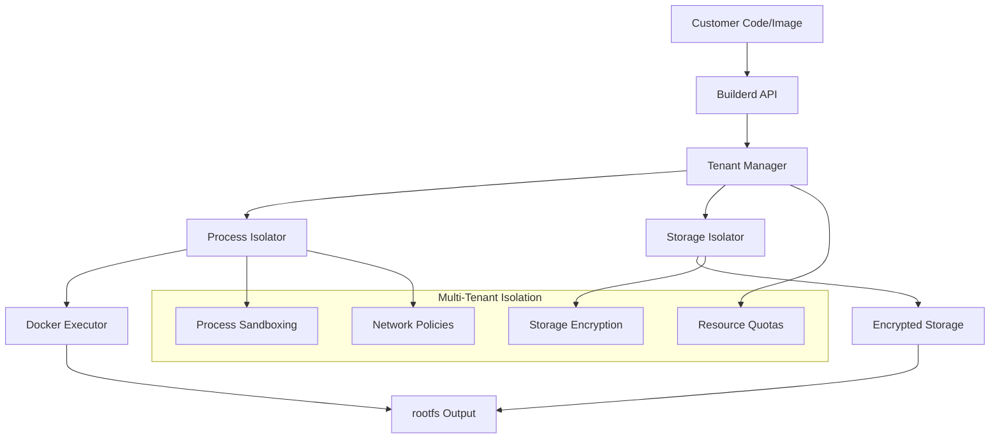

# Builderd

**Multi-tenant build execution sandbox for converting customer images and code into rootfs for microVM deployment**

## Table of Contents

🏗️ **Architecture**
- [Architecture Overview](architecture-overview.md) - System design and component interaction
- [Build Workflows](build-workflows.md) - Supported build types and execution flows
- [Storage Backends](storage-backends.md) - Tenant isolation and data management

📚 **API Reference**
- [API Reference](api-reference.md) - Complete ConnectRPC API documentation
- [Build Configuration](configuration-guide.md) - Environment variables and settings

🚀 **Deployment**
- [Deployment & Operations Guide](deployment-operations-guide.md) - Production deployment and operations
- [Systemd Integration](../contrib/systemd/README.md) - Service management and installation

🔧 **Development**
- [Testing Guide](../test-docker-build.sh) - Local testing and validation
- [Grafana Dashboards](../grafana-dashboards/README.md) - Monitoring and observability

## Overview



## Key Features

🔒 **Multi-Tenant Isolation**
- Process sandboxing with Linux namespaces and cgroups
- Encrypted tenant-specific storage directories
- Resource quotas and tier-based limits
- Network access controls and registry allowlists

🏗️ **Extensible Build Types**
- Docker image extraction (implemented)
- Git repository builds (planned)
- Archive-based builds (planned)
- Custom build strategies

📊 **Production Ready**
- OpenTelemetry observability (metrics, tracing, logging)
- Prometheus metrics exposition
- Comprehensive audit logging
- Health checks and monitoring endpoints

🚀 **Scalable Architecture**
- ConnectRPC API with HTTP/2 support
- Executor registry pattern for build type extensibility
- Configurable resource limits per tenant tier
- Horizontal scaling support

## Getting Started

### Quick Start

```bash
# Build builderd
make build

# Start service (development)
./build/builderd

# Test with sample build
./test-docker-build.sh
```

### Production Deployment

```bash
# Install systemd service
sudo cp contrib/systemd/builderd.service /etc/systemd/system/
sudo cp contrib/systemd/builderd.env.example /etc/builderd/builderd.env

# Configure and start
sudo systemctl daemon-reload
sudo systemctl enable builderd
sudo systemctl start builderd
```

### API Usage

```bash
# Create a build
curl -X POST http://localhost:8082/builder.v1.BuilderService/CreateBuild \
  -H "Content-Type: application/json" \
  -H "X-Tenant-ID: your-tenant" \
  -d '{"config": {"source": {"docker_image": {"image_uri": "alpine:latest"}}}}'

# Monitor build progress
curl http://localhost:8082/builder.v1.BuilderService/GetBuildStatus/BUILD_ID

# Download rootfs
curl http://localhost:8082/builder.v1.BuilderService/GetBuildArtifact/BUILD_ID
```

## Tenant Tiers

| Tier | Concurrent Builds | Daily Builds | Memory | CPU | Disk | Network |
|------|-------------------|--------------|--------|-----|------|---------|
| Free | 1 | 5 | 512MB | 1 core | 1GB | Limited |
| Pro | 3 | 100 | 2GB | 2 cores | 10GB | Full |
| Enterprise | 10 | 1000 | 8GB | 4 cores | 100GB | Full |
| Dedicated | 50 | 10000 | 32GB | 16 cores | 1TB | Full |

## Support

- **Issues**: Report bugs and feature requests
- **Documentation**: Complete guides and API reference
- **Monitoring**: Grafana dashboards and alerts
- **Operations**: Runbooks and troubleshooting guides

## Integration

Builderd works alongside:
- **metald**: microVM lifecycle management and networking
- **billaged**: Usage tracking and billing integration
- **Customer APIs**: Build triggers and status notifications