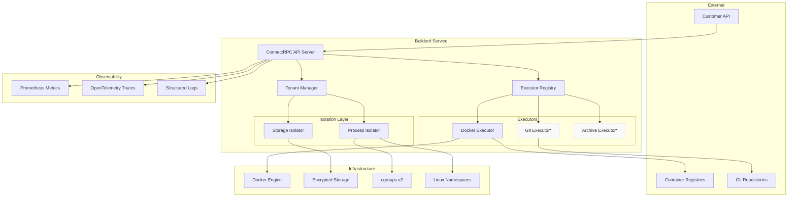
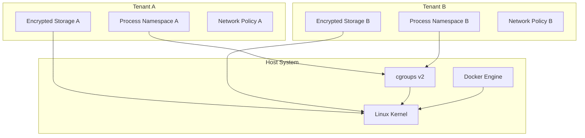
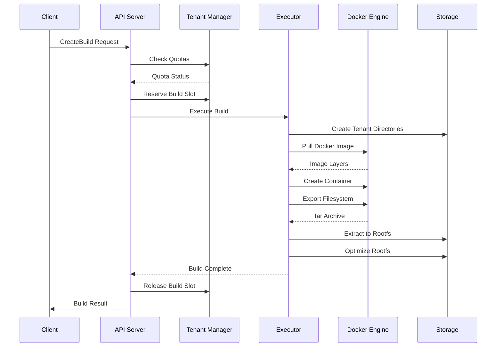
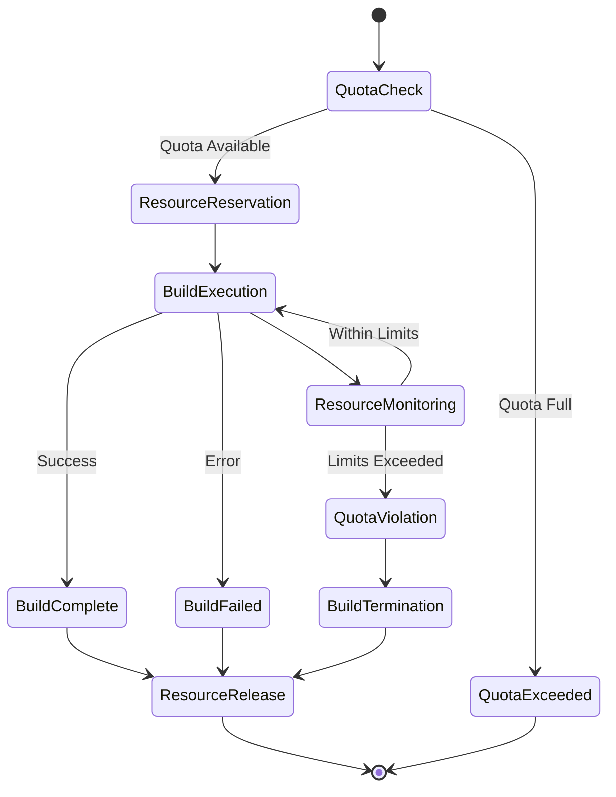
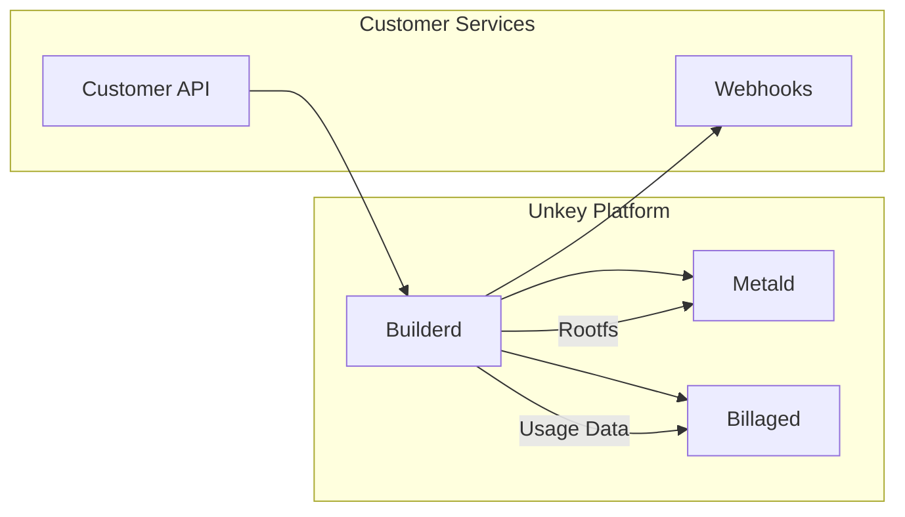

# Builderd Architecture Overview

## System Architecture

Builderd is a multi-tenant build execution sandbox designed to convert customer code and container images into rootfs filesystems for microVM deployment. The architecture emphasizes security, isolation, and scalability.



## Core Components

### 1. ConnectRPC API Server

**Location**: `internal/server/`

The API server provides the primary interface for build requests using ConnectRPC over HTTP/2.

**Responsibilities**:
- Request validation and authentication
- Tenant context extraction and validation
- Build lifecycle management
- Response formatting and error handling
- Rate limiting and quota enforcement

**Key Features**:
- HTTP/2 streaming for real-time build updates
- Tenant-scoped request isolation
- Comprehensive input validation
- Graceful error handling and recovery

### 2. Tenant Manager

**Location**: `internal/tenant/manager.go`

Central component for multi-tenant isolation and resource management.

**Responsibilities**:
- Tenant configuration management
- Resource quota tracking and enforcement
- Usage statistics and billing data
- Tenant tier management (Free, Pro, Enterprise, Dedicated)

**Resource Management**:
```go
type TenantLimits struct {
    MaxConcurrentBuilds int32
    MaxDailyBuilds      int32
    MaxMemoryBytes      int64
    MaxCPUCores         int32
    MaxDiskBytes        int64
    MaxStorageBytes     int64
    TimeoutSeconds      int32
}
```

### 3. Process Isolator

**Location**: `internal/tenant/isolation.go`

Handles process-level isolation and security constraints for build execution.

**Security Features**:
- Linux namespaces (PID, Network, Mount, User)
- cgroups v2 resource limits
- Capability dropping and seccomp profiles
- Docker command generation with security flags
- Process monitoring and violation detection

**Isolation Mechanisms**:
```bash
# Example Docker isolation flags
docker run --rm \
  --memory=2g --cpus=2 \
  --user=1000:1000 \
  --read-only \
  --security-opt=no-new-privileges:true \
  --cap-drop=ALL \
  --network=none \
  --tmpfs=/tmp:size=100m
```

### 4. Storage Isolator

**Location**: `internal/tenant/storage.go`

Manages tenant-specific storage with encryption and access controls.

**Storage Structure**:
```
/var/lib/builderd/tenants/
├── tenant-123/
│   ├── builds/
│   │   ├── build-456/
│   │   │   ├── workspace/     # Build working directory
│   │   │   ├── rootfs/        # Output rootfs
│   │   │   ├── temp/          # Temporary files
│   │   │   ├── logs/          # Build logs
│   │   │   └── metadata/      # Build metadata
│   │   └── build-789/
│   └── cache/                 # Shared tenant cache
└── tenant-456/
```

**Security Features**:
- AES-GCM encryption for sensitive data
- Path traversal protection
- Directory quotas and usage tracking
- Secure file permissions (750/640)
- Audit logging for all access

### 5. Executor Registry

**Location**: `internal/executor/registry.go`

Pluggable architecture for different build source types.

**Current Executors**:
- **Docker Executor**: Container image extraction
- **Git Executor**: Repository-based builds (planned)
- **Archive Executor**: Tarball/ZIP builds (planned)

**Executor Interface**:
```go
type Executor interface {
    Execute(ctx context.Context, request *BuildRequest) (*BuildResult, error)
    Validate(ctx context.Context, source *BuildSource) error
    GetCapabilities() ExecutorCapabilities
}
```

## Security Architecture

### Multi-Tenant Isolation



### Security Layers

1. **Network Isolation**
   - Tenant-specific network policies
   - Registry and git host allowlists
   - No network access for Free tier
   - Isolated Docker networks per tenant

2. **Process Isolation**
   - Linux namespaces (PID, NET, MNT, USER)
   - Dropped capabilities (SYS_ADMIN, MKNOD, etc.)
   - Read-only root filesystem
   - Non-privileged execution (uid/gid 1000)

3. **Storage Isolation**
   - Tenant-specific directory trees
   - AES-GCM encryption for Enterprise+ tiers
   - Path traversal protection
   - Quota enforcement and monitoring

4. **Resource Isolation**
   - cgroups v2 memory limits
   - CPU usage controls
   - Disk I/O throttling
   - Build timeout enforcement

## Data Flow

### Build Execution Flow



### Resource Management Flow



## Scalability Considerations

### Horizontal Scaling

- **Stateless Design**: No persistent state in builderd processes
- **Database Integration**: SQLite for development, PostgreSQL for production
- **Load Balancing**: Multiple builderd instances behind load balancer
- **Shared Storage**: NFS or distributed filesystem for artifact storage

### Performance Optimization

- **Docker Layer Caching**: Per-tenant layer cache for faster builds
- **Parallel Execution**: Multiple builds per tenant (within quota)
- **Resource Pooling**: Shared Docker daemon with isolation
- **Cleanup Automation**: Background cleanup of old builds and cache

### Monitoring and Observability

- **Metrics**: Build duration, success rates, resource usage
- **Tracing**: End-to-end request tracing with OpenTelemetry
- **Logging**: Structured logs with tenant context
- **Alerting**: Quota violations, build failures, resource exhaustion

## Integration Points

### Service Integration



**Integration Points**:
- **metald**: Receives rootfs artifacts for microVM deployment
- **billaged**: Receives build usage data for billing
- **Customer APIs**: Webhook notifications for build completion
- **External Registries**: Docker Hub, GitHub Container Registry, private registries

### Configuration Integration

- **Environment Variables**: `UNKEY_BUILDERD_*` prefix for all configuration
- **Secret Management**: Integration with Kubernetes secrets or HashiCorp Vault
- **Service Discovery**: Consul or Kubernetes service discovery for dependent services

## Future Architecture Enhancements

### Planned Features

1. **Git Repository Builds**
   - Direct repository cloning and building
   - Dockerfile detection and execution
   - Branch and tag support

2. **Build Caching**
   - Distributed build cache
   - Layer-level caching across tenants
   - Cache invalidation strategies

3. **Advanced Scheduling**
   - Priority-based build queuing
   - Resource-aware scheduling
   - Multi-region deployment

4. **Security Enhancements**
   - SELinux/AppArmor integration
   - Hardware security module (HSM) support
   - Enhanced audit logging

### Architecture Evolution

- **Microservices Decomposition**: Split into multiple focused services
- **Event-Driven Architecture**: Asynchronous build processing with message queues
- **Kubernetes Native**: Custom Resource Definitions (CRDs) for build management
- **Multi-Cloud Support**: Cross-cloud artifact storage and execution

This architecture provides a solid foundation for secure, scalable, multi-tenant build execution while maintaining simplicity and operational excellence.