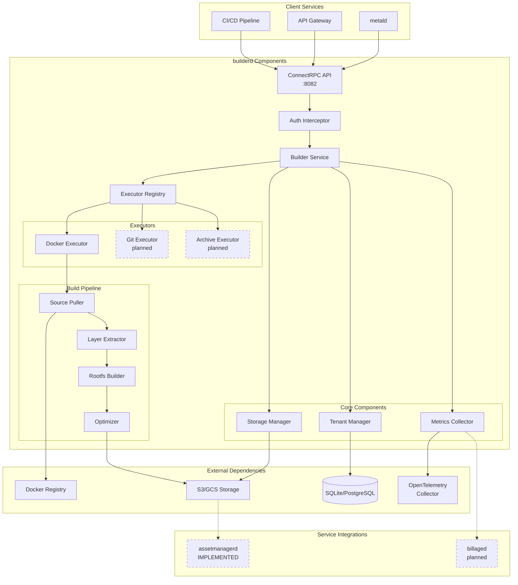
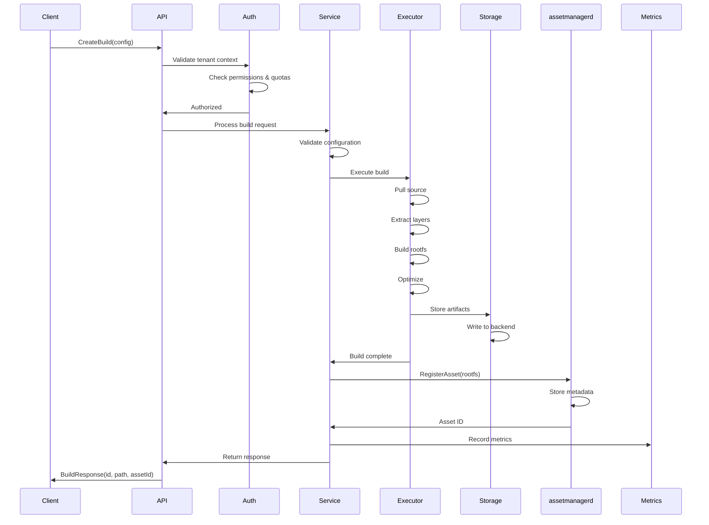
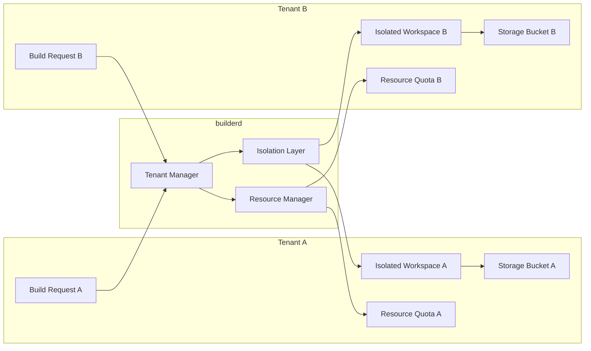

# builderd Architecture

This document describes the architecture and design of the builderd service.

## System Architecture

## Component Architecture

### API Layer

**ConnectRPC Service** ([`internal/service/builder.go`](../../internal/service/builder.go))
- Implements the BuilderService RPC interface
- Handles request validation and response formatting
- Manages build job lifecycle
- Coordinates with executors and storage

**Interceptors** ([`internal/observability/interceptor.go`](../../internal/observability/interceptor.go))
- `TenantAuthInterceptor`: Validates tenant context and permissions
- `LoggingInterceptor`: Structured logging for all requests
- `OTELInterceptor`: OpenTelemetry tracing integration

### Executor System

**Executor Registry** ([`internal/executor/registry.go`](../../internal/executor/registry.go))
- Manages available build executors
- Routes builds to appropriate executor based on source type
- Handles executor lifecycle and configuration

**Docker Executor** ([`internal/executor/docker.go`](../../internal/executor/docker.go))
- Pulls images from Docker registries
- Extracts and processes image layers
- Builds optimized rootfs for microVMs
- Handles registry authentication

### Tenant Management

**Tenant Manager** ([`internal/tenant/manager.go`](../../internal/tenant/manager.go))
- Enforces resource quotas per tenant tier
- Tracks usage and billing metrics
- Manages tenant isolation boundaries
- Validates permissions for operations

**Isolation** ([`internal/tenant/isolation.go`](../../internal/tenant/isolation.go))
- Creates isolated build environments
- Manages namespaces and cgroups
- Enforces security contexts
- Prevents cross-tenant access

### Storage System

**Storage Manager** ([`internal/tenant/storage.go`](../../internal/tenant/storage.go))
- Abstracts storage backend (local, S3, GCS)
- Manages artifact lifecycle and retention
- Implements caching for performance
- Handles multi-tenant data isolation

### Observability

**Metrics** ([`internal/observability/metrics.go`](../../internal/observability/metrics.go))
- Prometheus metrics for builds, resources, and quotas
- High-cardinality labels for detailed analysis
- Custom histogram buckets for latency tracking

**OpenTelemetry** ([`internal/observability/otel.go`](../../internal/observability/otel.go))
- Distributed tracing across service boundaries
- Context propagation for request correlation
- Span attributes for debugging

## Service Interactions

### Inbound Calls

builderd receives requests from:

1. **metald** (future integration)
   - Requests rootfs builds for new VM deployments
   - Provides VM specifications for optimization
   - Tracks build status for provisioning workflow

2. **API Gateway/CLI**
   - Direct build requests from users
   - Management operations (list, cancel, delete)
   - Quota and usage queries

3. **CI/CD Systems**
   - Automated builds on code commits
   - Integration with deployment pipelines
   - Batch build operations

### Outbound Calls

builderd makes requests to:

1. **Docker Registries**
   - Image pulls with authentication
   - Layer downloads and verification
   - Manifest inspection

2. **Storage Backends**
   - Artifact upload and retrieval
   - Temporary file management
   - Cache operations

3. **Database** (planned)
   - Build job persistence
   - Tenant configuration
   - Usage tracking

4. **assetmanagerd** (IMPLEMENTED)
   - Registers successful builds as VM assets
   - Provides centralized artifact management
   - Enables cross-service asset sharing
   - Tracks build metadata for asset lifecycle

5. **billaged** (future integration)
   - Resource usage reporting
   - Cost calculation inputs
   - Quota enforcement feedback

## Data Flow

### Build Creation Flow

### Multi-Tenant Isolation Flow

## Design Decisions

### 1. Synchronous Build Execution (Current)

**Decision**: Execute builds synchronously in the request handler
**Rationale**: Simplifies initial implementation and debugging
**Trade-offs**: 
- ✅ Simple error handling
- ✅ Direct feedback to clients
- ❌ Blocks during long builds
- ❌ Limited scalability

**Future**: Implement async queue-based execution

### 2. Tenant Isolation Strategy

**Decision**: Use Linux namespaces and cgroups for isolation
**Rationale**: Provides strong security boundaries without VM overhead
**Implementation**:
- PID namespace: Process isolation
- Network namespace: Network isolation
- Mount namespace: Filesystem isolation
- Cgroups: Resource limits

### 3. Storage Architecture

**Decision**: Abstract storage behind interface with multiple backends
**Rationale**: Flexibility for different deployment scenarios
**Supported Backends**:
- Local filesystem (development)
- S3/S3-compatible (production)
- Google Cloud Storage (enterprise)

### 4. Build Caching

**Decision**: Implement layer-based caching for Docker builds
**Rationale**: Significant performance improvement for repeated builds
**Cache Key**: `{tenant_id}/{image_digest}/{layer_digest}`
**Eviction**: LRU with configurable size limits

### 5. Metrics and Observability

**Decision**: OpenTelemetry-first with Prometheus compatibility
**Rationale**: Industry standard with broad ecosystem support
**Implementation**:
- Traces: Full request lifecycle
- Metrics: Resource usage and performance
- Logs: Structured with correlation IDs

## Security Architecture

### Authentication and Authorization

1. **Service-to-Service**: SPIFFE/mTLS
   - Automatic certificate rotation
   - Strong identity verification
   - Zero-trust networking

2. **Tenant Isolation**:
   - Mandatory tenant context validation
   - Resource access scoped to tenant
   - Audit logging for all operations

### Build Security

1. **Source Validation**:
   - Registry allowlists
   - Image signature verification (planned)
   - Vulnerability scanning (planned)

2. **Runtime Isolation**:
   - Unprivileged build processes
   - Read-only root filesystem
   - No network access during builds

3. **Resource Limits**:
   - CPU and memory cgroups
   - Disk quota enforcement
   - Time-based termination

## Performance Considerations

### Optimization Strategies

1. **Parallel Processing**:
   - Concurrent layer downloads
   - Parallel optimization steps
   - Async artifact uploads

2. **Caching**:
   - Docker layer cache
   - Build artifact cache
   - Registry mirror support

3. **Resource Pooling**:
   - Connection pooling for registries
   - Reusable build workspaces
   - Executor process pooling

### Scalability

1. **Horizontal Scaling**:
   - Stateless service design
   - External state in database/storage
   - Load balancer compatible

2. **Resource Management**:
   - Configurable concurrent build limits
   - Queue-based scheduling (planned)
   - Auto-scaling support (planned)

## Future Enhancements

### Planned Features

1. **Additional Source Types**:
   - Git repository builds
   - Archive extraction (tar, zip)
   - Nix flake support

2. **Advanced Optimization**:
   - Binary stripping and compression
   - Dependency deduplication
   - Custom optimization plugins

3. **Enhanced Security**:
   - Image vulnerability scanning
   - SBOM generation
   - Policy-based validation

4. **Service Integrations**:
   - assetmanagerd for artifact management
   - billaged for usage billing
   - metald for direct VM provisioning

### Architecture Evolution

1. **Queue-Based Execution**:
   - Decouple API from execution
   - Support for priority queues
   - Better resource utilization

2. **Distributed Builds**:
   - Multi-node build clusters
   - Geographic distribution
   - Edge caching

3. **Plugin System**:
   - Custom build strategies
   - External optimization tools
   - Third-party integrations

AIDEV-NOTE: The architecture is designed for extensibility and future service integration while maintaining strong isolation and security boundaries.