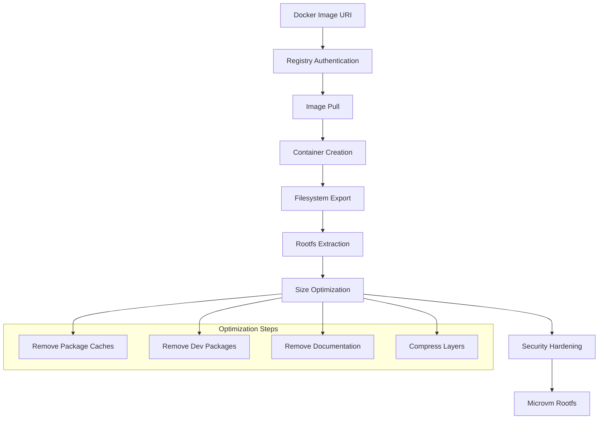
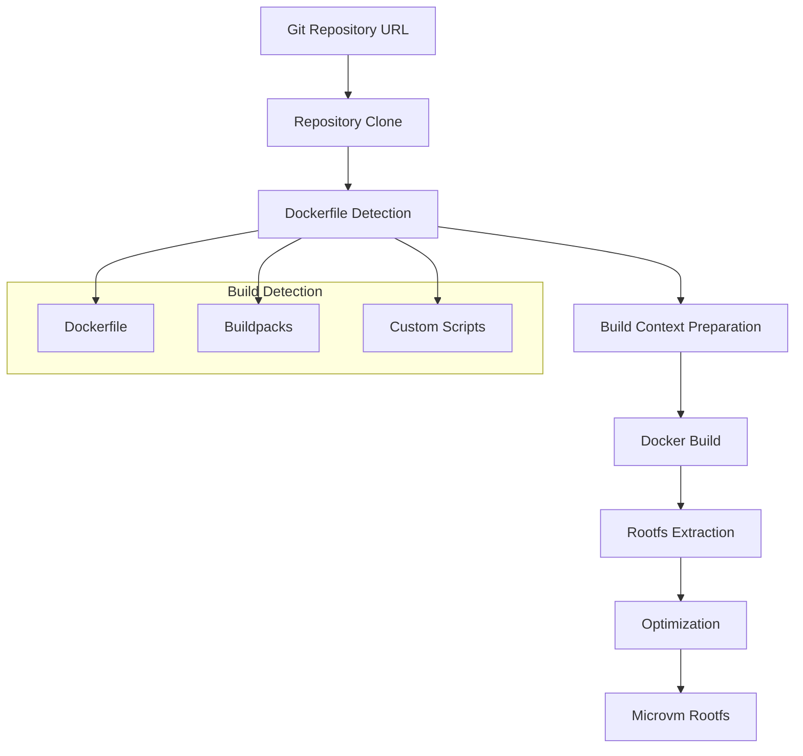
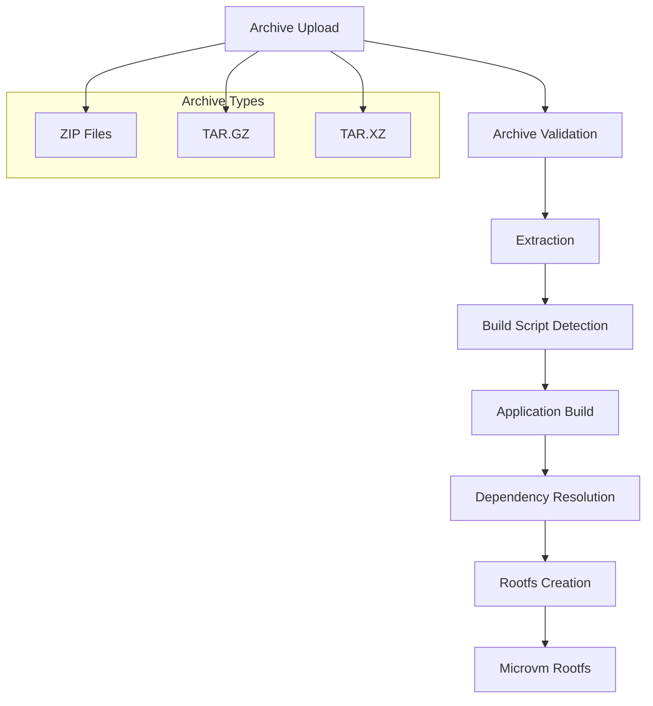
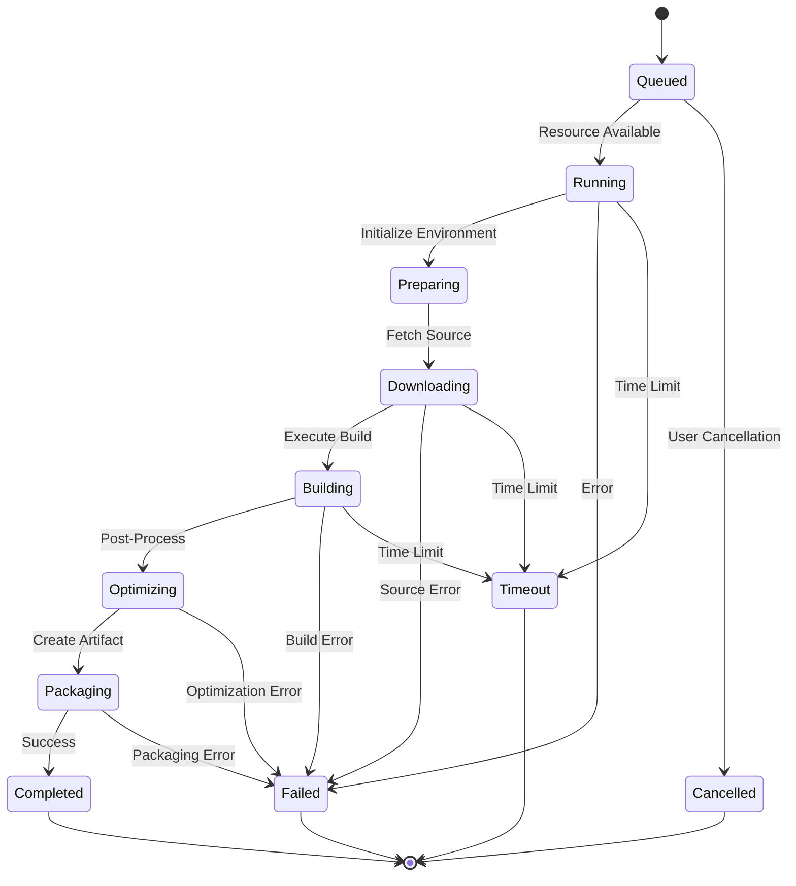
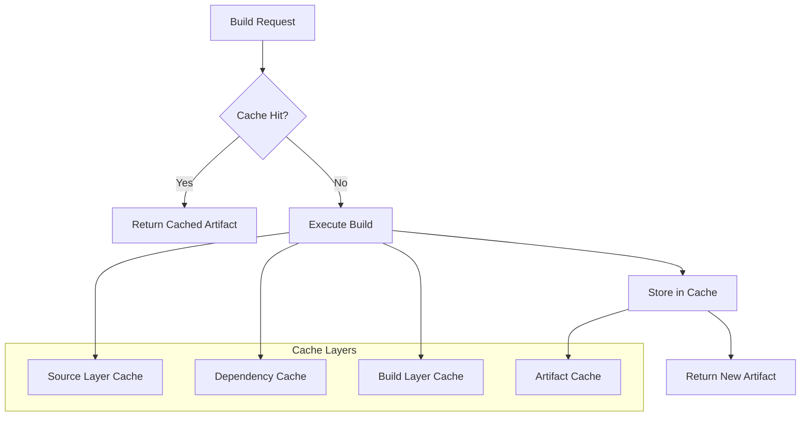
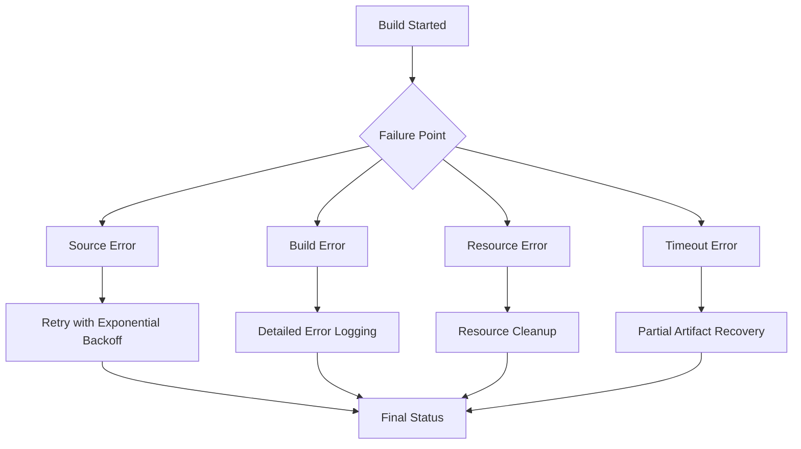

# Builderd Build Workflows

## Overview

Builderd supports multiple build workflows to convert various source formats into microVM-ready rootfs filesystems. Each workflow is designed for specific use cases while maintaining consistent security, isolation, and observability.

## Supported Build Types

### 1. Docker Image Extraction (Implemented)

Extracts and optimizes container images for microVM deployment.



**Use Cases**:
- Converting existing container applications
- Deploying pre-built images to microVMs
- Fast deployment of standardized applications

**Input**: Container image URI (e.g., `ghcr.io/unkeyed/unkey:f4cfee5`)
**Output**: Optimized ext4 rootfs filesystem

### 2. Git Repository Builds (Planned)

Clones repositories and builds applications from source code.



**Use Cases**:
- Building from source control
- Continuous deployment workflows
- Custom application builds

**Input**: Git repository URL with optional Dockerfile
**Output**: Built and optimized rootfs filesystem

### 3. Archive-Based Builds (Planned)

Processes uploaded archives (ZIP, tar.gz) for microVM deployment.



**Use Cases**:
- Legacy application deployment
- Custom build environments
- Offline application packages

**Input**: Compressed archive with application code
**Output**: Built rootfs filesystem

## Build Strategies

### Docker Strategy

Optimizes Docker images for microVM deployment with configurable optimization levels.

```json
{
  "docker_strategy": {
    "optimize_for_size": true,
    "remove_dev_packages": true,
    "preserve_layers": false,
    "custom_commands": [
      "apt-get clean",
      "rm -rf /var/lib/apt/lists/*",
      "rm -rf /tmp/*"
    ]
  }
}
```

**Optimization Options**:
- **Size Optimization**: Removes unnecessary files and compresses layers
- **Dev Package Removal**: Strips development tools and headers
- **Layer Preservation**: Option to maintain Docker layer structure
- **Custom Commands**: Execute arbitrary cleanup commands

### Git Strategy (Planned)

Builds applications from source with multiple build system support.

```json
{
  "git_strategy": {
    "build_system": "docker",
    "dockerfile_path": "Dockerfile",
    "build_args": {
      "ENV": "production",
      "VERSION": "1.0.0"
    },
    "cache_dependencies": true
  }
}
```

### Archive Strategy (Planned)

Processes uploaded archives with flexible build configurations.

```json
{
  "archive_strategy": {
    "build_script": "build.sh",
    "runtime": "node",
    "version": "18",
    "dependencies": ["package.json"],
    "output_path": "/app"
  }
}
```

## Build Targets

### MicroVM Rootfs Target

Creates optimized rootfs filesystems for microVM deployment.

```json
{
  "microvm_rootfs": {
    "format": "ext4",
    "init_strategy": "INIT_STRATEGY_DIRECT_EXEC",
    "compression": "gzip",
    "size_limit_bytes": 1073741824
  }
}
```

**Init Strategies**:

#### INIT_STRATEGY_DIRECT_EXEC
Executes the application directly without an init system.
```bash
# Example: Node.js application
CMD ["node", "/app/server.js"]
```

#### INIT_STRATEGY_SYSTEMD
Uses systemd as the init system for complex applications.
```bash
# Systemd service management
systemctl enable app.service
systemctl start app.service
```

#### INIT_STRATEGY_CUSTOM
Uses a custom init script for specialized startup sequences.
```bash
#!/bin/bash
# Custom initialization
setup_environment()
start_application()
```

## Workflow Execution

### Build Lifecycle



### Detailed Build Steps

#### 1. Pre-Build Phase
```bash
# Quota validation
check_tenant_quotas(tenant_id, tier)

# Resource allocation
allocate_build_slot(tenant_id)
create_isolated_environment(build_id)

# Storage preparation
create_tenant_directories(tenant_id, build_id)
setup_encryption(tenant_tier)
```

#### 2. Source Acquisition
```bash
# Docker image source
docker_pull(image_uri, registry_auth)
create_container(image_name)

# Git repository source (planned)
git_clone(repository_url, ref)
detect_build_system(repository_path)

# Archive source (planned)
download_archive(archive_url)
extract_archive(archive_path)
```

#### 3. Build Execution
```bash
# Environment isolation
setup_process_isolation(tenant_limits)
setup_network_isolation(tenant_policies)
setup_storage_isolation(tenant_directories)

# Build execution
execute_build_strategy(source, strategy)
monitor_resource_usage(build_id)
enforce_timeout_limits(tenant_tier)
```

#### 4. Optimization Phase
```bash
# Rootfs optimization
remove_package_caches()
remove_dev_packages()
remove_documentation()
compress_filesystem()

# Security hardening
remove_sensitive_files()
set_secure_permissions()
apply_security_policies()
```

#### 5. Artifact Creation
```bash
# Packaging
create_rootfs_image(format, compression)
generate_metadata(build_info)
calculate_checksums(artifact)

# Storage
store_artifact(tenant_storage)
update_build_status(completed)
cleanup_temporary_files()
```

## Build Configuration Examples

### Simple Node.js Application

```json
{
  "config": {
    "source": {
      "docker_image": {
        "image_uri": "node:18-alpine"
      }
    },
    "target": {
      "microvm_rootfs": {
        "format": "ext4",
        "init_strategy": "INIT_STRATEGY_DIRECT_EXEC"
      }
    },
    "strategy": {
      "docker_strategy": {
        "optimize_for_size": true,
        "remove_dev_packages": false,
        "custom_commands": [
          "npm ci --only=production",
          "npm cache clean --force"
        ]
      }
    }
  }
}
```

### Production Web Application

```json
{
  "config": {
    "source": {
      "docker_image": {
        "image_uri": "ghcr.io/company/webapp:v1.2.3",
        "registry_auth": {
          "username": "github_user",
          "password": "ghp_token"
        }
      }
    },
    "target": {
      "microvm_rootfs": {
        "format": "ext4",
        "init_strategy": "INIT_STRATEGY_SYSTEMD",
        "compression": "gzip",
        "size_limit_bytes": 2147483648
      }
    },
    "strategy": {
      "docker_strategy": {
        "optimize_for_size": true,
        "remove_dev_packages": true,
        "preserve_layers": false,
        "custom_commands": [
          "apt-get autoremove -y",
          "apt-get clean",
          "rm -rf /var/lib/apt/lists/*",
          "rm -rf /tmp/*",
          "rm -rf /var/tmp/*"
        ]
      }
    }
  }
}
```

### Git Repository Build (Planned)

```json
{
  "config": {
    "source": {
      "git_repository": {
        "clone_url": "https://github.com/company/application.git",
        "ref": "main",
        "auth": {
          "token": "github_token"
        },
        "dockerfile_path": "Dockerfile.production"
      }
    },
    "target": {
      "microvm_rootfs": {
        "format": "ext4",
        "init_strategy": "INIT_STRATEGY_CUSTOM"
      }
    },
    "strategy": {
      "git_strategy": {
        "build_system": "docker",
        "build_args": {
          "ENV": "production",
          "BUILD_VERSION": "{{.GitCommit}}"
        },
        "cache_dependencies": true
      }
    }
  }
}
```

## Performance Optimization

### Build Caching



**Cache Strategies**:
- **Source Caching**: Docker layers, Git references
- **Dependency Caching**: npm, pip, maven artifacts
- **Build Caching**: Intermediate build outputs
- **Artifact Caching**: Complete rootfs images

### Parallel Execution

```bash
# Concurrent builds per tenant (tier-based)
Free Tier: 1 concurrent build
Pro Tier: 3 concurrent builds
Enterprise Tier: 10 concurrent builds
Dedicated Tier: 50 concurrent builds

# Resource allocation
memory_per_build = tenant_limit / concurrent_builds
cpu_per_build = tenant_limit / concurrent_builds
```

### Resource Optimization

```bash
# Build resource monitoring
memory_usage = monitor_process_memory(build_pid)
cpu_usage = monitor_process_cpu(build_pid)
disk_io = monitor_disk_operations(build_path)

# Dynamic resource adjustment
if memory_usage > threshold:
    apply_memory_pressure_relief()
if cpu_usage > threshold:
    apply_cpu_throttling()
```

## Error Handling & Recovery

### Build Failure Types



**Error Categories**:
- **Source Errors**: Network issues, authentication failures
- **Build Errors**: Compilation failures, dependency issues
- **Resource Errors**: Out of memory, disk space
- **Timeout Errors**: Build time limit exceeded

### Retry Policies

```json
{
  "retry_policy": {
    "max_retries": 3,
    "backoff_strategy": "exponential",
    "base_delay": "30s",
    "max_delay": "300s",
    "retry_on": [
      "NETWORK_ERROR",
      "TEMPORARY_RESOURCE_ERROR",
      "REGISTRY_RATE_LIMIT"
    ]
  }
}
```

### Recovery Mechanisms

```bash
# Automatic cleanup on failure
cleanup_build_environment(build_id)
release_allocated_resources(tenant_id)
preserve_logs_for_debugging(build_id)

# Partial artifact recovery
if build_stage >= "optimization":
    save_intermediate_artifact()
    mark_as_recoverable()
```

## Integration Patterns

### Webhook Notifications

```json
{
  "webhook": {
    "url": "https://api.customer.com/webhooks/build-complete",
    "events": ["build.completed", "build.failed"],
    "headers": {
      "Authorization": "Bearer customer_token"
    }
  }
}
```

### API Integration

```bash
# Start build
curl -X POST /builder.v1.BuilderService/CreateBuild \
  -H "X-Tenant-ID: tenant-123" \
  -d '{"config": {...}}'

# Monitor progress
curl /builder.v1.BuilderService/GetBuildStatus/BUILD_ID

# Download artifact
curl /builder.v1.BuilderService/GetBuildArtifact/BUILD_ID \
  -o rootfs.ext4
```

### CI/CD Integration

```yaml
# GitHub Actions example
- name: Build MicroVM Rootfs
  uses: unkeyed/builderd-action@v1
  with:
    image: ghcr.io/company/app:${{ github.sha }}
    tenant-id: ${{ secrets.UNKEY_TENANT_ID }}
    api-endpoint: https://builderd.unkey.dev
    wait-for-completion: true
    
- name: Deploy to Production
  uses: unkeyed/metald-deploy@v1
  with:
    rootfs: ${{ steps.build.outputs.artifact-url }}
```

This comprehensive workflow system provides flexibility for various application deployment scenarios while maintaining security, performance, and operational excellence.