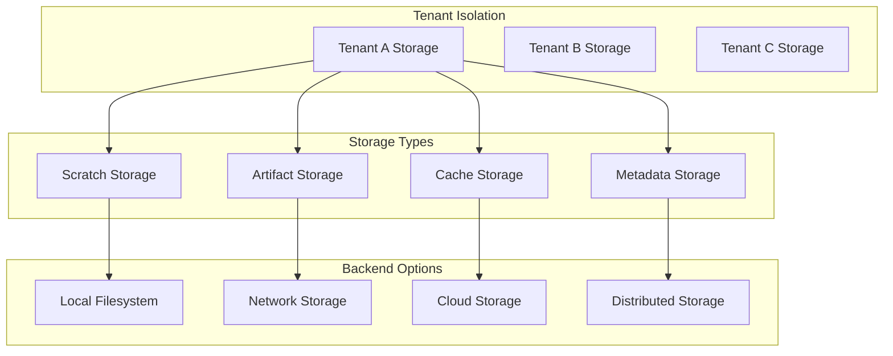
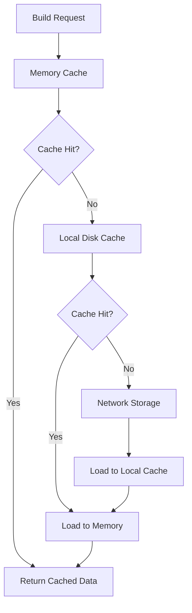

# Builderd Storage Backends

## Overview

Builderd's storage architecture is designed for multi-tenant isolation, security, and scalability. The system manages build artifacts, temporary files, caches, and metadata across different storage backends while maintaining strict tenant boundaries.

## Storage Architecture



## Directory Structure

### Tenant-Isolated Layout

```
/var/lib/builderd/
├── tenants/
│   ├── tenant-123/
│   │   ├── builds/
│   │   │   ├── build-456/
│   │   │   │   ├── workspace/     # Build working directory
│   │   │   │   ├── rootfs/        # Generated rootfs artifacts
│   │   │   │   ├── temp/          # Temporary build files
│   │   │   │   ├── logs/          # Build execution logs
│   │   │   │   └── metadata/      # Build metadata and checksums
│   │   │   └── build-789/
│   │   └── cache/                 # Tenant-specific build cache
│   │       ├── docker-layers/     # Docker layer cache
│   │       ├── dependencies/      # Dependency cache (npm, pip, etc.)
│   │       └── git-repos/         # Git repository cache
│   └── tenant-456/
├── global/
│   ├── registry-cache/           # Shared registry layer cache
│   ├── system-temp/              # System temporary files
│   └── metrics/                  # Storage usage metrics
└── config/
    ├── encryption-keys/          # Per-tenant encryption keys
    └── retention-policies/       # Storage retention configurations
```

### Storage Categories

#### 1. Scratch Storage (Ephemeral)
**Path**: `/var/lib/builderd/tenants/{tenant-id}/builds/{build-id}/temp/`
**Purpose**: Temporary files during build execution
**Lifecycle**: Deleted after build completion
**Encryption**: Optional (tier-dependent)

```bash
# Example contents
temp/
├── docker-export.tar      # Docker container export
├── extracted-layers/      # Unpacked Docker layers
├── build-context/         # Git clone or archive extraction
└── intermediate/          # Build intermediate files
```

#### 2. Workspace Storage (Build Context)
**Path**: `/var/lib/builderd/tenants/{tenant-id}/builds/{build-id}/workspace/`
**Purpose**: Active build workspace and source code
**Lifecycle**: Preserved during build, cleaned up after
**Encryption**: Yes (Enterprise+ tiers)

```bash
# Example contents
workspace/
├── source/               # Application source code
├── dependencies/         # Downloaded dependencies
├── build-output/         # Compiled artifacts
└── configuration/        # Build configuration files
```

#### 3. Artifact Storage (Persistent)
**Path**: `/var/lib/builderd/tenants/{tenant-id}/builds/{build-id}/rootfs/`
**Purpose**: Final build artifacts and rootfs images
**Lifecycle**: Retained per tenant retention policy
**Encryption**: Yes (Enterprise+ tiers)

```bash
# Example contents
rootfs/
├── filesystem.ext4       # Final rootfs image
├── filesystem.ext4.gz    # Compressed variant
├── manifest.json         # Artifact metadata
└── checksums.sha256      # Integrity verification
```

#### 4. Cache Storage (Persistent)
**Path**: `/var/lib/builderd/tenants/{tenant-id}/cache/`
**Purpose**: Build acceleration and dependency caching
**Lifecycle**: LRU eviction with configurable retention
**Encryption**: Optional (tier-dependent)

```bash
# Example contents
cache/
├── docker-layers/
│   ├── sha256:abc123.../    # Docker layer by digest
│   └── sha256:def456.../
├── dependencies/
│   ├── npm/                 # Node.js package cache
│   ├── pip/                 # Python package cache
│   └── maven/               # Java dependency cache
└── git-repos/
    ├── github.com-user-repo.git/  # Git repository cache
    └── gitlab.com-org-project.git/
```

## Storage Backends

### Local Filesystem Backend (Default)

**Configuration**:
```bash
UNKEY_BUILDERD_STORAGE_BACKEND=filesystem
UNKEY_BUILDERD_SCRATCH_DIR=/var/lib/builderd/scratch
UNKEY_BUILDERD_ROOTFS_OUTPUT_DIR=/var/lib/builderd/rootfs
UNKEY_BUILDERD_WORKSPACE_DIR=/var/lib/builderd/workspace
UNKEY_BUILDERD_CACHE_DIR=/var/lib/builderd/cache
```

**Characteristics**:
- High performance for single-node deployments
- Direct filesystem access
- POSIX ACLs for permission management
- Local disk quotas support

**Pros**:
- Fast I/O operations
- Simple configuration
- No network dependencies
- Direct filesystem features

**Cons**:
- Limited to single node
- No built-in replication
- Backup complexity
- Scale limitations

### Network Storage Backend

#### NFS Configuration

```bash
UNKEY_BUILDERD_STORAGE_BACKEND=nfs
UNKEY_BUILDERD_NFS_SERVER=storage.example.com
UNKEY_BUILDERD_NFS_PATH=/exports/builderd
UNKEY_BUILDERD_NFS_OPTIONS=vers=4.1,rsize=1048576,wsize=1048576,hard,intr
```

**Mount Example**:
```bash
# /etc/fstab entry
storage.example.com:/exports/builderd /var/lib/builderd nfs4 rw,hard,intr,rsize=1048576,wsize=1048576 0 0

# Mount manually
sudo mount -t nfs4 -o rw,hard,intr,rsize=1048576,wsize=1048576 \
    storage.example.com:/exports/builderd /var/lib/builderd
```

#### iSCSI Configuration

```bash
UNKEY_BUILDERD_STORAGE_BACKEND=iscsi
UNKEY_BUILDERD_ISCSI_TARGET=iqn.2024-01.com.example:builderd
UNKEY_BUILDERD_ISCSI_PORTAL=storage.example.com:3260
UNKEY_BUILDERD_ISCSI_FILESYSTEM=ext4
```

### Cloud Storage Backend (Planned)

#### AWS S3 Configuration

```bash
UNKEY_BUILDERD_STORAGE_BACKEND=s3
UNKEY_BUILDERD_S3_BUCKET=builderd-artifacts
UNKEY_BUILDERD_S3_REGION=us-east-1
UNKEY_BUILDERD_S3_ACCESS_KEY_ID=AKIA...
UNKEY_BUILDERD_S3_SECRET_ACCESS_KEY=...
UNKEY_BUILDERD_S3_ENCRYPTION=AES256
```

**Use Cases**:
- Multi-region artifact distribution
- Infinite storage scalability
- Built-in encryption and versioning
- Cost-effective long-term storage

#### Google Cloud Storage Configuration

```bash
UNKEY_BUILDERD_STORAGE_BACKEND=gcs
UNKEY_BUILDERD_GCS_BUCKET=builderd-artifacts
UNKEY_BUILDERD_GCS_PROJECT=my-project
UNKEY_BUILDERD_GCS_CREDENTIALS_FILE=/etc/builderd/gcs-key.json
```

#### Azure Blob Storage Configuration

```bash
UNKEY_BUILDERD_STORAGE_BACKEND=azure
UNKEY_BUILDERD_AZURE_ACCOUNT=builderdstorage
UNKEY_BUILDERD_AZURE_CONTAINER=artifacts
UNKEY_BUILDERD_AZURE_ACCESS_KEY=...
```

### Distributed Storage Backend (Planned)

#### Ceph Configuration

```bash
UNKEY_BUILDERD_STORAGE_BACKEND=ceph
UNKEY_BUILDERD_CEPH_MONITORS=mon1.example.com:6789,mon2.example.com:6789
UNKEY_BUILDERD_CEPH_POOL=builderd
UNKEY_BUILDERD_CEPH_USER=builderd
UNKEY_BUILDERD_CEPH_KEYRING=/etc/ceph/ceph.client.builderd.keyring
```

#### MinIO Configuration

```bash
UNKEY_BUILDERD_STORAGE_BACKEND=minio
UNKEY_BUILDERD_MINIO_ENDPOINT=https://minio.example.com:9000
UNKEY_BUILDERD_MINIO_ACCESS_KEY=builderd
UNKEY_BUILDERD_MINIO_SECRET_KEY=...
UNKEY_BUILDERD_MINIO_BUCKET=builderd-artifacts
```

## Encryption & Security

### Tenant Data Encryption

#### AES-GCM Encryption (Enterprise+ Tiers)

```go
type StorageEncryption struct {
    Algorithm     string // "aes-gcm"
    KeySize       int    // 256 bits
    KeyRotation   bool   // Automatic key rotation
    PerTenant     bool   // Separate keys per tenant
}
```

**Implementation**:
```bash
# Per-tenant encryption keys
/var/lib/builderd/config/encryption-keys/
├── tenant-123.key        # AES-256 key for tenant-123
├── tenant-456.key        # AES-256 key for tenant-456
└── master.key            # Master key for key encryption
```

#### Encryption at Rest

```bash
# File-level encryption for sensitive data
encrypt_file() {
    local input_file="$1"
    local output_file="$2"
    local tenant_id="$3"
    
    # Encrypt using tenant-specific key
    openssl enc -aes-256-gcm -in "$input_file" -out "$output_file" \
        -kfile "/var/lib/builderd/config/encryption-keys/$tenant_id.key"
}
```

#### Encryption in Transit

```bash
# TLS configuration for storage backends
UNKEY_BUILDERD_STORAGE_TLS_ENABLED=true
UNKEY_BUILDERD_STORAGE_TLS_CERT_FILE=/etc/builderd/tls/storage.crt
UNKEY_BUILDERD_STORAGE_TLS_KEY_FILE=/etc/builderd/tls/storage.key
UNKEY_BUILDERD_STORAGE_TLS_CA_FILE=/etc/builderd/tls/ca.crt
```

### Access Control

#### POSIX ACLs (Filesystem Backend)

```bash
# Set tenant-specific permissions
setfacl -R -m u:builderd:rwx /var/lib/builderd/tenants/tenant-123/
setfacl -R -m g:tenant-123:rwx /var/lib/builderd/tenants/tenant-123/
setfacl -R -m o::--- /var/lib/builderd/tenants/tenant-123/

# Default ACLs for new files
setfacl -R -d -m u:builderd:rwx /var/lib/builderd/tenants/tenant-123/
setfacl -R -d -m g:tenant-123:rwx /var/lib/builderd/tenants/tenant-123/
setfacl -R -d -m o::--- /var/lib/builderd/tenants/tenant-123/
```

#### SELinux Contexts

```bash
# Define SELinux contexts for tenant isolation
semanage fcontext -a -t builderd_tenant_t \
    "/var/lib/builderd/tenants/tenant-123(/.*)?"

# Apply contexts
restorecon -R /var/lib/builderd/tenants/tenant-123/
```

## Storage Quotas & Limits

### Tier-Based Storage Limits

| Tier | Total Storage | Build Artifacts | Cache Size | Concurrent Builds |
|------|---------------|-----------------|------------|-------------------|
| Free | 1 GB | 500 MB | 500 MB | 1 |
| Pro | 10 GB | 5 GB | 5 GB | 3 |
| Enterprise | 100 GB | 50 GB | 50 GB | 10 |
| Dedicated | 1 TB | 500 GB | 500 GB | 50 |

### Quota Enforcement

#### Filesystem Quotas (XFS/ext4)

```bash
# Enable project quotas on XFS
mount -o prjquota /dev/sdb1 /var/lib/builderd

# Set quota for tenant
xfs_quota -x -c "project -s tenant-123" /var/lib/builderd
xfs_quota -x -c "limit -p bhard=10g tenant-123" /var/lib/builderd
```

#### Application-Level Quotas

```go
type QuotaEnforcement struct {
    CheckInterval    time.Duration // Check every 30 seconds
    SoftLimitPercent int          // Warn at 80%
    HardLimitAction  string       // "reject" or "throttle"
    CleanupPolicy    string       // "lru" or "fifo"
}
```

**Implementation**:
```bash
# Monitor and enforce quotas
monitor_tenant_storage() {
    local tenant_id="$1"
    local limit_bytes="$2"
    
    current_usage=$(du -sb "/var/lib/builderd/tenants/$tenant_id" | cut -f1)
    
    if [ "$current_usage" -gt "$limit_bytes" ]; then
        trigger_quota_violation "$tenant_id" "$current_usage" "$limit_bytes"
    fi
}
```

### Cache Management

#### LRU Cache Eviction

```go
type CacheManager struct {
    MaxSize        int64         // Maximum cache size in bytes
    EvictionPolicy string        // "lru", "fifo", "random"
    MinRetention   time.Duration // Minimum retention period
    MaxRetention   time.Duration // Maximum retention period
}
```

**Cache Cleanup**:
```bash
# LRU-based cache cleanup
cleanup_cache() {
    local tenant_id="$1"
    local cache_limit="$2"
    
    # Find oldest cache entries
    find "/var/lib/builderd/tenants/$tenant_id/cache" \
        -type f -printf '%T@ %p\n' | \
        sort -n | \
        while read timestamp file; do
            current_size=$(du -sb "$cache_dir" | cut -f1)
            if [ "$current_size" -gt "$cache_limit" ]; then
                rm -f "$file"
            else
                break
            fi
        done
}
```

## Performance Optimization

### Storage Performance Tuning

#### Filesystem Optimization

```bash
# XFS mount options for performance
mount -o noatime,largeio,inode64,swalloc /dev/sdb1 /var/lib/builderd

# ext4 mount options for performance
mount -o noatime,data=writeback,barrier=0,nobh /dev/sdb1 /var/lib/builderd
```

#### I/O Scheduling

```bash
# Set appropriate I/O scheduler
echo mq-deadline > /sys/block/sdb/queue/scheduler

# Tune readahead for large sequential reads
echo 4096 > /sys/block/sdb/queue/read_ahead_kb
```

### Caching Strategies

#### Multi-Level Caching



#### Cache Warming

```bash
# Pre-populate cache with common dependencies
warm_cache() {
    local tenant_id="$1"
    
    # Popular Docker base images
    docker pull alpine:latest
    docker pull node:18-alpine
    docker pull python:3.11-slim
    
    # Common dependencies
    npm cache add popular-packages.txt
    pip cache dir # Warm Python package cache
}
```

### Parallel I/O Operations

```go
type ParallelIO struct {
    WorkerCount    int           // Number of parallel workers
    BatchSize      int           // Files per batch
    BufferSize     int           // I/O buffer size
    UseDirectIO    bool          // Bypass OS cache
}
```

## Backup & Recovery

### Backup Strategies

#### Incremental Backups

```bash
#!/bin/bash
# Incremental backup using rsync
backup_tenant_storage() {
    local tenant_id="$1"
    local backup_dest="$2"
    local date=$(date +%Y%m%d)
    
    # Create incremental backup
    rsync -av --link-dest="../previous" \
        "/var/lib/builderd/tenants/$tenant_id/" \
        "$backup_dest/$tenant_id/$date/"
    
    # Update symlink to latest
    ln -sfn "$date" "$backup_dest/$tenant_id/latest"
}
```

#### Snapshot-Based Backups

```bash
# ZFS snapshots
zfs snapshot storage/builderd@$(date +%Y%m%d_%H%M%S)

# LVM snapshots
lvcreate -L10G -s -n builderd_snap /dev/vg0/builderd
```

### Disaster Recovery

#### Point-in-Time Recovery

```bash
# Restore from specific backup
restore_tenant_storage() {
    local tenant_id="$1"
    local backup_date="$2"
    local backup_source="$3"
    
    # Stop builderd service
    systemctl stop builderd
    
    # Restore data
    rsync -av "$backup_source/$tenant_id/$backup_date/" \
        "/var/lib/builderd/tenants/$tenant_id/"
    
    # Restart service
    systemctl start builderd
}
```

#### Cross-Region Replication

```bash
# Replicate to secondary region
replicate_storage() {
    local source_region="us-east-1"
    local dest_region="us-west-2"
    
    aws s3 sync s3://builderd-$source_region/ s3://builderd-$dest_region/ \
        --delete --storage-class STANDARD_IA
}
```

## Monitoring & Observability

### Storage Metrics

```bash
# Prometheus metrics for storage
builderd_storage_usage_bytes{tenant_id,storage_type}
builderd_storage_operations_total{tenant_id,operation,backend}
builderd_storage_operation_duration_seconds{tenant_id,operation}
builderd_storage_quota_usage_ratio{tenant_id}
builderd_cache_hit_ratio{tenant_id,cache_type}
```

### Health Checks

```bash
# Storage health check endpoint
curl http://localhost:8082/health/storage

# Example response
{
  "status": "healthy",
  "backends": {
    "filesystem": {
      "status": "healthy",
      "free_space_bytes": 107374182400,
      "total_space_bytes": 536870912000,
      "usage_percent": 80.0
    }
  },
  "tenants": {
    "tenant-123": {
      "usage_bytes": 1073741824,
      "quota_bytes": 10737418240,
      "usage_percent": 10.0
    }
  }
}
```

### Storage Alerts

```yaml
# Prometheus alert rules
groups:
- name: builderd_storage
  rules:
  - alert: StorageSpaceLow
    expr: builderd_storage_free_bytes / builderd_storage_total_bytes < 0.1
    for: 5m
    labels:
      severity: warning
    annotations:
      summary: "Storage space low: {{ $value }}% remaining"
      
  - alert: TenantQuotaExceeded
    expr: builderd_storage_quota_usage_ratio > 0.95
    for: 1m
    labels:
      severity: critical
    annotations:
      summary: "Tenant {{ $labels.tenant_id }} quota exceeded"
```

This comprehensive storage backend system provides the foundation for secure, scalable, and high-performance build artifact management in a multi-tenant environment.