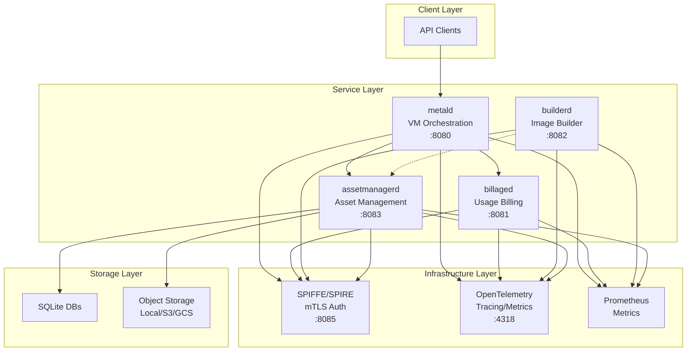

# Unkey Deploy System Documentation

## System Overview

Unkey Deploy is a microservices-based system for managing and orchestrating micro-VMs (via Firecracker) with integrated billing, asset management, and build capabilities. The system provides a complete platform for deploying and managing lightweight virtualized workloads with automatic resource tracking and billing.

### Architecture



### Service Inventory

| Service | Port | Role | Documentation |
|---------|------|------|---------------|
| [metald](../metald/) | 8080 | VM lifecycle orchestration, Firecracker management | [✓ Docs](../metald/docs/) |
| [billaged](../billaged/) | 8081 | Usage tracking, billing aggregation, metering | [✓ Docs](../billaged/docs/) |
| [builderd](../builderd/) | 8082 | VM image building, asset creation | [✓ Docs](../builderd/docs/) |
| [assetmanagerd](../assetmanagerd/) | 8083 | VM asset storage, distribution, lifecycle | [✓ Docs](../assetmanagerd/docs/) |

### Technology Stack

- **Language**: Go 1.23+
- **RPC Framework**: ConnectRPC (HTTP/2)
- **Virtualization**: Firecracker microVMs
- **Authentication**: SPIFFE/SPIRE for mTLS
- **Observability**: OpenTelemetry, Prometheus metrics
- **Storage**: SQLite (metadata), pluggable object storage
- **Development**: Make-based builds, systemd deployment

## Quick Navigation

- [Architecture](./architecture/) - System design, service interactions, data flows
- [Operations](./operations/) - Deployment, monitoring, incident response
- [Development](./development/) - Guidelines, testing, contributing
- [Service Matrix](./services/) - Detailed service interactions and dependencies

## Getting Started

### Prerequisites

- Go 1.23 or later
- systemd-based Linux distribution
- Firecracker binary (for metald)
- SPIFFE/SPIRE (optional, for production mTLS)

### Quick Start

1. **Build all services**:
   ```bash
   make build
   ```

2. **Install services with systemd**:
   ```bash
   make install
   ```

3. **Start core services**:
   ```bash
   sudo systemctl start assetmanagerd billaged metald
   ```

4. **Verify health**:
   ```bash
   curl http://localhost:9464/health  # metald
   curl http://localhost:9465/health  # billaged
   curl http://localhost:9467/health  # assetmanagerd
   ```

### Environment Configuration

All services follow a consistent environment variable pattern:
```bash
UNKEY_<SERVICE>_<VARIABLE>
```

Common configuration:
```bash
# API Ports
UNKEY_METALD_API_PORT=8080
UNKEY_BILLAGED_API_PORT=8081
UNKEY_BUILDERD_API_PORT=8082
UNKEY_ASSETMANAGERD_API_PORT=8083

# Metrics Ports
UNKEY_METALD_METRICS_PORT=9464
UNKEY_BILLAGED_METRICS_PORT=9465
UNKEY_BUILDERD_METRICS_PORT=9466
UNKEY_ASSETMANAGERD_METRICS_PORT=9467

# TLS Configuration
UNKEY_*_TLS_MODE=spiffe
UNKEY_*_SPIFFE_SOCKET_PATH=/run/spire/sockets/agent.sock

# Observability
UNKEY_*_OTEL_ENABLED=true
UNKEY_*_OTEL_ENDPOINT=http://localhost:4318
```

## System Capabilities

### VM Management (metald)
- Create, start, stop, and destroy Firecracker microVMs
- Automatic resource allocation and network configuration
- Real-time usage tracking and lifecycle management
- Integrated jailer for security isolation

### Billing & Metering (billaged)
- Real-time resource usage collection
- Automatic billing event generation
- Usage aggregation and reporting
- Gap detection and recovery mechanisms

### Asset Management (assetmanagerd)
- VM image storage and distribution
- Multi-backend support (local, S3, GCS)
- Asset lifecycle tracking
- Efficient caching and staging

### Image Building (builderd)
- Custom VM image creation
- Multi-architecture support
- Automated build pipelines
- Asset registration integration (planned)

## Documentation Standards

This documentation follows these principles:
- **Validation-First**: All claims are verified against source code
- **Operational Focus**: Emphasis on real-world deployment and debugging
- **Cross-Reference**: Service interactions are documented bidirectionally
- **Completeness**: Coverage metrics and AIDEV markers track gaps

---

For detailed information, explore the subdirectories:
- [Architecture Documentation](./architecture/)
- [Operations Guide](./operations/)
- [Development Guide](./development/)
- [Service Interaction Matrix](./services/)