# Unkey Deploy Service Architecture Overview

## Table of Contents
1. [System Overview](#system-overview)
2. [Service Components](#service-components)
3. [Infrastructure Architecture](#infrastructure-architecture)
4. [Application Flow](#application-flow)
5. [Sequence Diagrams](#sequence-diagrams)
6. [Data Flow](#data-flow)
7. [Service Communication](#service-communication)

## System Overview

The Unkey Deploy service is a comprehensive VM management platform that handles the entire lifecycle of microVMs from build to billing. The system is designed with microservices architecture for scalability, security, and maintainability.

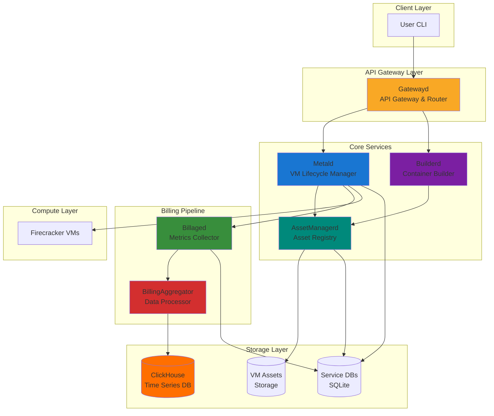

## Service Components

### 1. **Gatewayd** (To Be Developed)
- **Purpose**: API Gateway and request router
- **Responsibilities**:
  - Authentication and authorization
  - Request routing to appropriate services
  - Rate limiting and quota management
  - API versioning
  - Request/response transformation
  - Circuit breaking and retries

### 2. **Metald** (VM Lifecycle Manager)
- **Purpose**: Core VM management service
- **Port**: 8080
- **Responsibilities**:
  - VM lifecycle management (create, boot, pause, resume, shutdown, delete)
  - Resource allocation and scheduling
  - Integration with Firecracker/Cloud Hypervisor
  - Metrics collection (100ms intervals)
  - Multi-tenant isolation
  - Jailer integration for security

### 3. **Builderd** (Container Builder)
- **Purpose**: Multi-tenant build service
- **Port**: 8082
- **Responsibilities**:
  - Container image to rootfs conversion
  - Build isolation and security
  - Build caching and optimization
  - Asset registration with AssetManagerd
  - Build provenance tracking

### 4. **AssetManagerd** (Asset Registry)
- **Purpose**: Centralized VM asset management
- **Port**: 8083
- **Responsibilities**:
  - Asset registration and metadata management
  - Reference counting for garbage collection
  - Asset distribution to jailer chroots
  - Storage backend abstraction (local, S3, etc.)
  - Asset versioning and deduplication

### 5. **Billaged** (Metrics Collector)
- **Purpose**: High-frequency metrics collection
- **Port**: 8081
- **Responsibilities**:
  - 100ms metrics collection from VMs
  - Data buffering and batching
  - Reliability and gap detection
  - Initial aggregation
  - Forwarding to BillingAggregator

### 6. **BillingAggregator** (To Be Developed)
- **Purpose**: Billing data processing pipeline
- **Responsibilities**:
  - Advanced aggregation and rollups
  - Data validation and enrichment
  - Multi-dimensional analysis
  - ClickHouse schema management
  - Cost calculation rules engine

## Infrastructure Architecture

```mermaid
graph TB
    subgraph "Network Zones"
        subgraph "DMZ"
            LB[Load Balancer]
            WAF[WAF/DDoS Protection]
        end
        
        subgraph "Application Zone"
            GATEWAY_CLUSTER[Gatewayd Cluster<br/>3+ instances]
            
            subgraph "Service Mesh"
                METALD_CLUSTER[Metald Cluster]
                BUILDERD_CLUSTER[Builderd Cluster]
                ASSETMGR_CLUSTER[AssetManagerd Cluster]
                BILLAGED_CLUSTER[Billaged Cluster]
            end
        end
        
        subgraph "Data Zone"
            BILLAGG_CLUSTER[BillingAggregator<br/>Stream Processing]
            CH_CLUSTER[ClickHouse Cluster<br/>Sharded + Replicated]
            S3[S3-Compatible<br/>Object Storage]
        end
        
        subgraph "Compute Zone"
            subgraph "Host 1"
                FC1[Firecracker VMs]
                JAILER1[Jailer Isolation]
            end
            subgraph "Host N"
                FCN[Firecracker VMs]
                JAILERN[Jailer Isolation]
            end
        end
    end
    
    LB --> WAF
    WAF --> GATEWAY_CLUSTER
    GATEWAY_CLUSTER --> Service Mesh
    
    METALD_CLUSTER --> BILLAGED_CLUSTER
    BILLAGED_CLUSTER --> BILLAGG_CLUSTER
    BILLAGG_CLUSTER --> CH_CLUSTER
    
    ASSETMGR_CLUSTER --> S3
    METALD_CLUSTER --> Compute Zone
```

## Application Flow

### 1. VM Deployment Flow

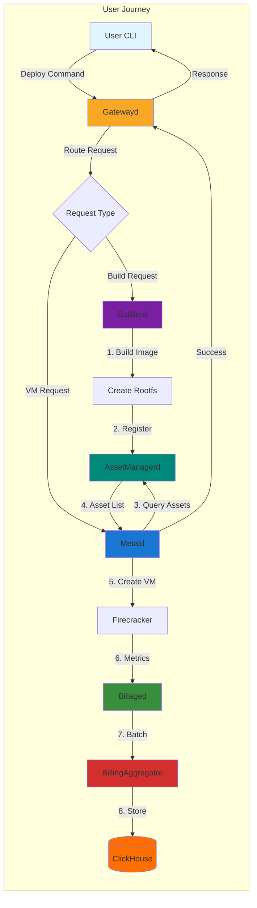

### 2. Billing Pipeline Flow

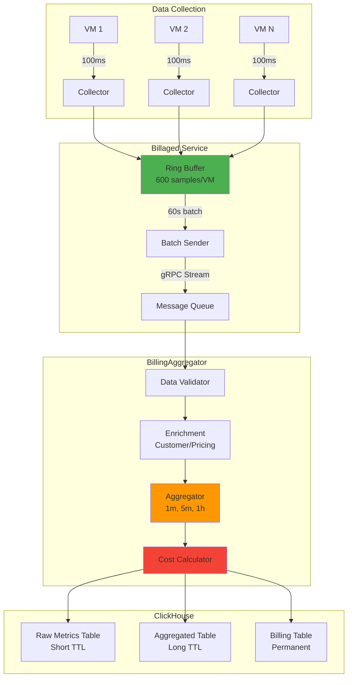

## Sequence Diagrams

### 1. Complete VM Deployment Sequence

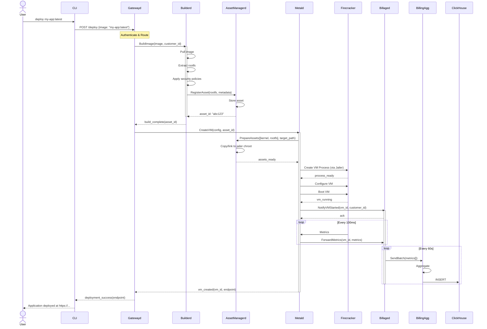

### 2. Asset Management Sequence

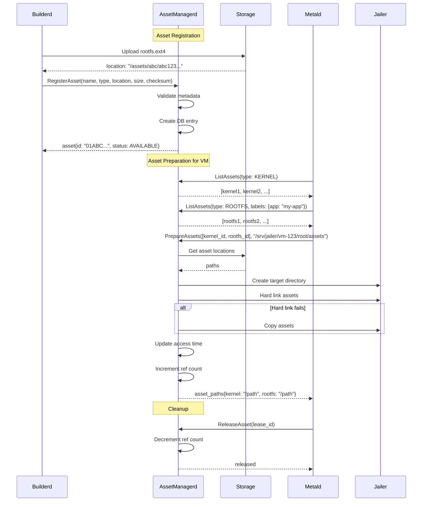

### 3. Billing Data Flow Sequence

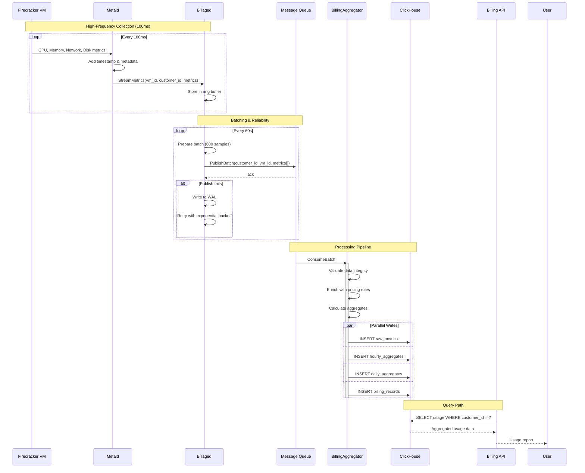

## Data Flow

### 1. Metrics Pipeline

```mermaid
graph LR
    subgraph "Collection"
        VM[VM Metrics] -->|100ms| FIFO[FIFO/Files]
        FIFO --> Metald
    end
    
    subgraph "Buffering"
        Metald -->|Stream| Billaged
        Billaged --> RingBuf[Ring Buffer<br/>10min retention]
    end
    
    subgraph "Transport"
        RingBuf -->|60s batch| Proto[Protobuf]
        Proto --> Compress[Zstd Compression]
        Compress --> Queue[Kafka/NATS]
    end
    
    subgraph "Processing"
        Queue --> BillingAgg
        BillingAgg --> Validate[Validation]
        Validate --> Enrich[Enrichment]
        Enrich --> Aggregate[Aggregation]
    end
    
    subgraph "Storage"
        Aggregate --> CH[(ClickHouse)]
        CH --> Partition[Date Partitions]
        Partition --> TTL[TTL Policies]
    end
    
    style VM fill:#2196f3
    style RingBuf fill:#4caf50
    style Queue fill:#ff9800
    style CH fill:#ff6f00
```

### 2. Request Flow

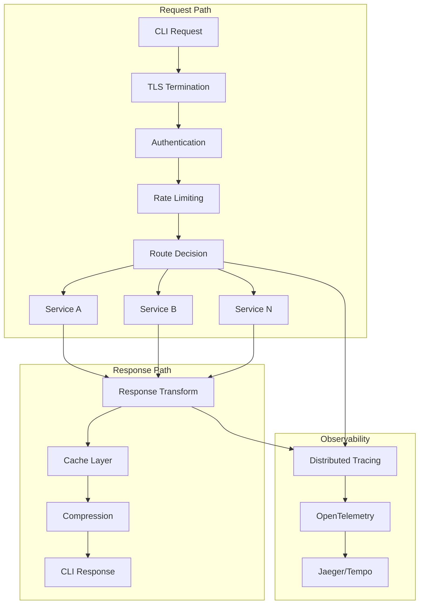

## Service Communication

### 1. Protocol Stack

```yaml
External Communication:
  CLI -> Gatewayd: HTTPS/REST or gRPC-Web
  
Internal Communication:
  Gatewayd -> Services: ConnectRPC (gRPC + HTTP semantics)
  Service -> Service: ConnectRPC
  Billaged -> BillingAgg: gRPC streaming
  BillingAgg -> ClickHouse: Native TCP protocol

Message Formats:
  API: JSON or Protobuf
  Internal: Protobuf exclusively
  Metrics: Protobuf with compression
  
Security:
  External: TLS 1.3, mTLS optional
  Internal: mTLS required
  Service Mesh: Istio/Linkerd for zero-trust
```

### 2. Service Discovery

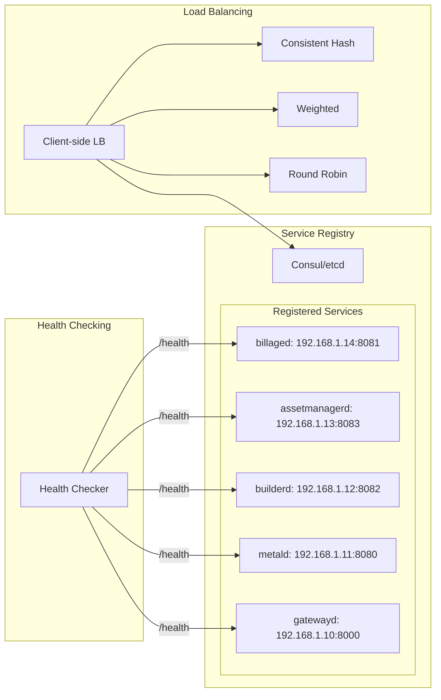

### 3. Failure Handling

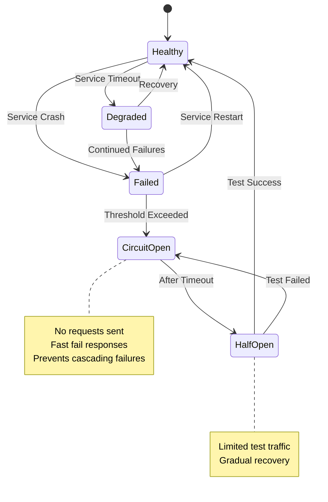

## Deployment Architecture

### 1. Container Organization

```yaml
services:
  gatewayd:
    image: unkey/gatewayd:latest
    replicas: 3
    resources:
      cpu: 2
      memory: 4Gi
    
  metald:
    image: unkey/metald:latest
    replicas: 3
    resources:
      cpu: 4
      memory: 8Gi
    capabilities:
      - CAP_SYS_ADMIN  # For jailer
      - CAP_NET_ADMIN  # For network namespaces
    volumes:
      - /srv/jailer:/srv/jailer
      - /opt/vm-assets:/opt/vm-assets:ro
    
  builderd:
    image: unkey/builderd:latest
    replicas: 2
    resources:
      cpu: 8
      memory: 16Gi
    volumes:
      - /var/run/docker.sock:/var/run/docker.sock
    
  assetmanagerd:
    image: unkey/assetmanagerd:latest
    replicas: 2
    resources:
      cpu: 2
      memory: 4Gi
    volumes:
      - /opt/vm-assets:/opt/vm-assets
    
  billaged:
    image: unkey/billaged:latest
    replicas: 3
    resources:
      cpu: 2
      memory: 8Gi  # High memory for buffering
```

### 2. Network Architecture

```mermaid
graph TB
    subgraph "Internet"
        Users[Users]
    end
    
    subgraph "Edge"
        CDN[CDN/WAF]
        LB[Load Balancers]
    end
    
    subgraph "DMZ"
        GW[Gatewayd Cluster]
    end
    
    subgraph "App Network"
        subgraph "Control Plane"
            METALD[Metald]
            BUILDERD[Builderd]
            ASSETMGR[AssetManagerd]
        end
        
        subgraph "Data Plane"
            BILLAGED[Billaged]
            BILLAGG[BillingAggregator]
        end
    end
    
    subgraph "Data Network"
        CLICKHOUSE[(ClickHouse)]
        S3[(Object Storage)]
    end
    
    subgraph "Compute Network"
        FC[Firecracker Hosts]
    end
    
    Users --> CDN
    CDN --> LB
    LB --> GW
    
    GW -.->|Control| Control Plane
    Control Plane -.->|Metrics| Data Plane
    Data Plane -.->|Store| Data Network
    METALD -.->|Manage| FC
    
    style GW fill:#f9a825
    style METALD fill:#1976d2
    style BILLAGED fill:#388e3c
    style CLICKHOUSE fill:#ff6f00
```

## Security Architecture

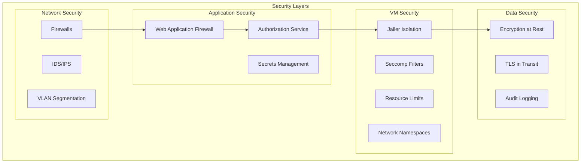

This architecture provides:
- **Scalability**: Horizontal scaling of all components
- **Security**: Multiple isolation layers and zero-trust networking
- **Reliability**: Redundancy and failure handling at every level
- **Observability**: Comprehensive metrics, logs, and traces
- **Flexibility**: Pluggable components and storage backends