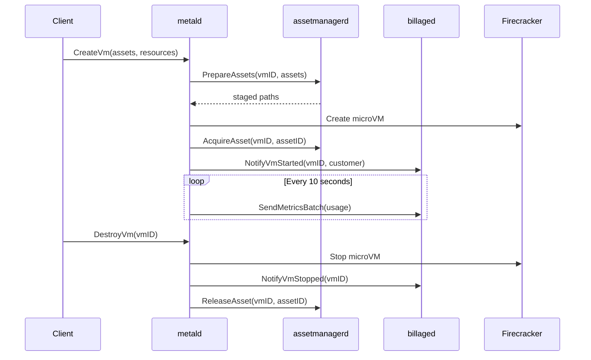
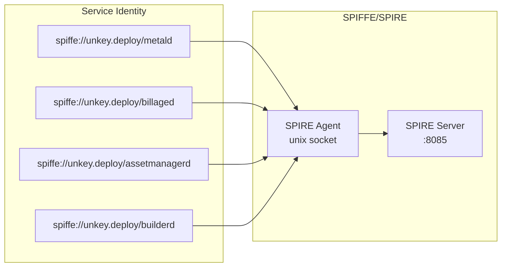

# Unkey Deploy Architecture

## System Architecture Overview

Unkey Deploy implements a microservices architecture for managing Firecracker microVMs with integrated billing, asset management, and build capabilities. The system is designed for high reliability, observability, and operational simplicity.

### Design Principles

1. **Service Isolation**: Each service owns its data and operates independently
2. **Synchronous Communication**: Direct RPC calls for predictable behavior
3. **Observability First**: Comprehensive metrics, tracing, and structured logging
4. **Pluggable Backends**: Abstract storage and hypervisor implementations
5. **Fail-Safe Defaults**: Services degrade gracefully when dependencies fail

## Service Interaction Map

### Primary Data Flows



### Service Dependencies

| Service | Depends On | Purpose | Status |
|---------|------------|---------|---------|
| metald | assetmanagerd | VM asset staging and lifecycle | ✓ Verified |
| metald | billaged | Usage tracking and billing | ✓ Verified |
| builderd | assetmanagerd | Register built images | ⚠ Planned |
| billaged | - | None (receives data) | ✓ Verified |
| assetmanagerd | - | None (independent) | ✓ Verified |

## API Contracts

### metald → assetmanagerd

**PrepareAssets** - Stage assets in jailer directory
```protobuf
message PrepareAssetsRequest {
  string vm_id = 1;
  repeated string asset_ids = 2;
  string jailer_path = 3;
}
```
[✓ Verified: metald/internal/assetmanager/client.go:45]

**AcquireAsset** - Mark asset as in-use
```protobuf
message AcquireAssetRequest {
  string vm_id = 1;
  string asset_id = 2;
}
```
[✓ Verified: metald/internal/assetmanager/client.go:89]

### metald → billaged

**SendMetricsBatch** - Periodic usage metrics
```protobuf
message SendMetricsBatchRequest {
  repeated VmMetrics metrics = 1;
  message VmMetrics {
    string vm_id = 1;
    string customer_id = 2;
    ResourceUsage usage = 3;
  }
}
```
[✓ Verified: metald/internal/billing/client.go:78]

**NotifyVmStarted/Stopped** - Lifecycle events
```protobuf
message NotifyVmStartedRequest {
  string vm_id = 1;
  string customer_id = 2;
  google.protobuf.Timestamp started_at = 3;
}
```
[✓ Verified: metald/internal/billing/client.go:120]

## Authentication Architecture

### Service-to-Service mTLS

All inter-service communication uses SPIFFE/SPIRE for mutual TLS:



Configuration:
```bash
UNKEY_*_TLS_MODE=spiffe
UNKEY_*_SPIFFE_SOCKET_PATH=/run/spire/sockets/agent.sock
UNKEY_*_SPIFFE_TRUST_DOMAIN=unkey.deploy
```

### Client Authentication

metald supports bearer token authentication:
- Format: `Bearer dev_customer_{customer_id}`
- Extracts customer ID for billing association
- No authentication on other services (internal only)

## Data Consistency Patterns

### Eventually Consistent Billing

billaged implements eventual consistency for usage tracking:

1. **Gap Detection**: Monitors for missing metric intervals
2. **Recovery**: Requests historical data when gaps detected
3. **Deduplication**: Prevents double-billing on retries
4. **Heartbeats**: Detects service health and data freshness

### Asset Lifecycle Management

assetmanagerd ensures consistency through:

1. **Reference Counting**: Tracks VMs using each asset
2. **Atomic Operations**: Acquire/release in single transactions
3. **Staging Isolation**: Separate staged copies per VM
4. **Cleanup**: Automatic removal of orphaned staged assets

## Storage Architecture

### Service Storage Patterns

| Service | Storage | Purpose | Implementation |
|---------|---------|---------|----------------|
| assetmanagerd | SQLite + Object Store | Metadata + asset blobs | ✓ Implemented |
| metald | In-memory (SQLite planned) | VM state tracking | ⚠ In-memory only |
| billaged | In-memory | Active metrics buffer | ✓ Implemented |
| builderd | SQLite planned | Build history, tenant data | ⚠ Not implemented |

### Object Storage Backends

assetmanagerd supports pluggable storage:
- **Local**: Filesystem-based for development
- **S3**: AWS S3 or compatible (MinIO)
- **GCS**: Google Cloud Storage
- **Memory**: Testing only

## Network Architecture

### Service Ports

| Service | API Port | Metrics Port | Protocol |
|---------|----------|--------------|----------|
| metald | 8080 | 9464 | HTTP/2 + TLS |
| billaged | 8081 | 9465 | HTTP/2 + TLS |
| builderd | 8082 | 9466 | HTTP/2 + TLS |
| assetmanagerd | 8083 | 9467 | HTTP/2 + TLS |
| SPIRE Server | 8085 | - | gRPC + TLS |

### VM Network Architecture

metald implements VM networking through:
- Bridge-based networking with isolated bridges per VM
- IPv4 and IPv6 support
- Automatic IP allocation from configured pools
- iptables/nftables rules for NAT and isolation

## Observability Architecture

### Distributed Tracing

OpenTelemetry integration across all services:
```
Client Request
  └─ metald.CreateVm
      ├─ assetmanagerd.PrepareAssets
      ├─ firecracker.CreateVM
      ├─ assetmanagerd.AcquireAsset
      └─ billaged.NotifyVmStarted
```

### Metrics Collection

Prometheus metrics exposed by all services:
- Request rates, latencies, errors
- Business metrics (active VMs, usage, assets)
- System metrics (CPU, memory, disk)

### Structured Logging

Consistent JSON logging with:
- Request IDs for correlation
- Service and method tags
- Error categorization
- Performance measurements

## Failure Modes and Recovery

### Service Failure Handling

**metald fails**:
- Running VMs continue operating
- No new VMs can be created
- Billing data may have gaps (recovered later)

**billaged fails**:
- metald continues buffering metrics
- Automatic recovery when billaged returns
- Gap detection ensures no data loss

**assetmanagerd fails**:
- Existing VMs unaffected
- New VM creation blocked
- Staged assets cleaned up on restart

### Network Partition Handling

- Services use exponential backoff with jitter
- Circuit breakers prevent cascade failures
- Health checks detect unavailable services
- Graceful degradation for non-critical paths

## Security Architecture

### Defense in Depth

1. **Network Isolation**: Services on private network
2. **mTLS**: All service communication encrypted
3. **Jailer**: VMs run in isolated environments
4. **Least Privilege**: Services run as non-root
5. **Input Validation**: Strict API contract enforcement

### Secrets Management

- TLS certificates from SPIFFE/SPIRE
- No hardcoded secrets in code
- Environment-based configuration
- Automatic certificate rotation

---

For implementation details, see:
- [Service Documentation](../services/)
- [Operations Guide](../operations/)
- [Development Guide](../development/)