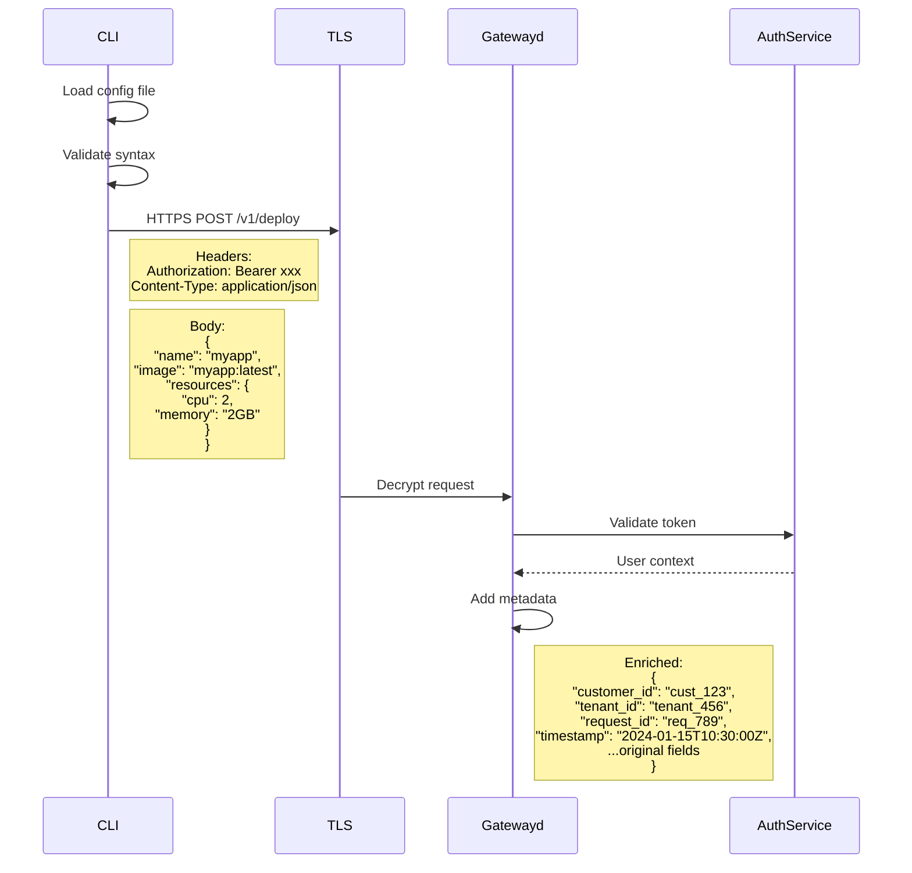
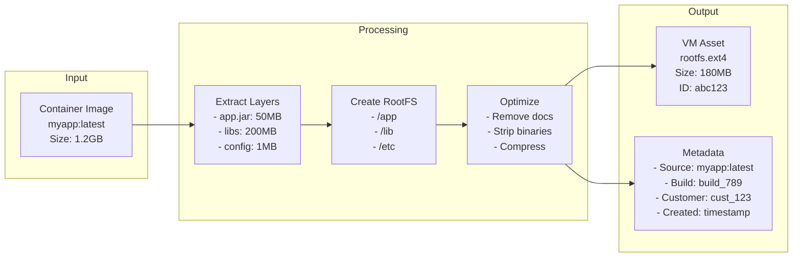
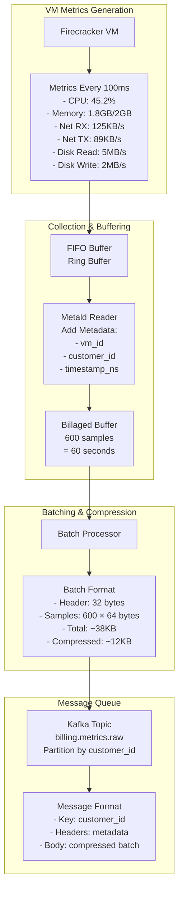
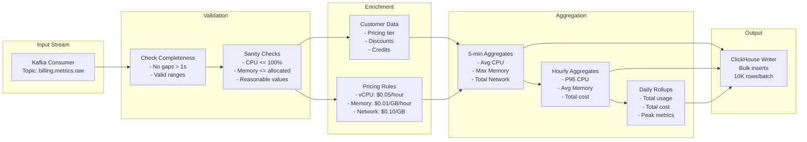

# End-to-End Data Flow: CLI to ClickHouse

## Complete Data Journey

```mermaid
graph TB
    subgraph "1. User Interaction"
        CLI[User CLI<br/>unkey deploy app.yaml]
        CONFIG[Config File<br/>CPU: 2<br/>Memory: 2GB<br/>Image: myapp:latest]
    end

    subgraph "2. API Gateway Gatewayd"
        REQ_RECV[Request Received<br/>POST /v1/deploy]
        AUTH[Authentication<br/>API Key/JWT]
        VALIDATE[Validation<br/>Schema Check]
        ENRICH[Enrichment<br/>Add Metadata]
        ROUTE[Route Decision<br/>Build + Deploy]
    end

    subgraph "3. Build Phase Builderd"
        BUILD_QUEUE[Build Queue<br/>Priority: Normal]
        PULL_IMAGE[Pull Image<br/>From Registry]
        EXTRACT[Extract RootFS<br/>From Container]
        SECURITY[Apply Security<br/>- Remove shells<br/>- Set permissions]
        COMPRESS[Compress<br/>RootFS Image]
        REGISTER[Register Asset<br/>With AssetManagerd]
    end

    subgraph "4. Asset Management"
        ASSET_META[Asset Metadata<br/>ID: abc123<br/>Size: 512MB<br/>Type: rootfs]
        ASSET_STORE[Store Asset<br/>S3/Local FS]
        ASSET_INDEX[Index Asset<br/>SQLite DB]
    end

    subgraph "5. VM Creation Metald"
        SCHEDULE[Schedule VM<br/>Select Host]
        PREPARE[Prepare Jailer<br/>Chroot Environment]
        COPY_ASSETS[Copy Assets<br/>Kernel + RootFS]
        CREATE_VM[Create VM<br/>Firecracker Process]
        CONFIGURE[Configure VM<br/>Network, Storage]
        BOOT[Boot VM<br/>Start Guest OS]
    end

    subgraph "6. Metrics Collection"
        METRICS_FIFO[Metrics FIFO<br/>100ms samples]
        METALD_COLLECT[Metald Collector<br/>Read + Timestamp]
        BILLAGED_STREAM[Billaged Stream<br/>Buffer 600 samples]
        BATCH[Batch Processor<br/>60s window]
    end

    subgraph "7. Billing Pipeline"
        MSG_QUEUE[Message Queue<br/>Kafka/NATS]
        BILLING_AGG[BillingAggregator<br/>Stream Processor]
        VALIDATE_DATA[Validate<br/>Completeness]
        ENRICH_DATA[Enrich<br/>Customer Info]
        CALCULATE[Calculate<br/>Usage Cost]
    end

    subgraph "8. ClickHouse Storage"
        CH_BUFFER[Buffer Table<br/>In-Memory]
        CH_RAW[Raw Metrics<br/>MergeTree]
        CH_AGG_5M[5min Aggregates<br/>AggregatingMergeTree]
        CH_AGG_1H[Hourly Aggregates<br/>SummingMergeTree]
        CH_BILLING[Billing Records<br/>ReplacingMergeTree]
    end

    CLI --> CONFIG
    CONFIG --> REQ_RECV

    REQ_RECV --> AUTH
    AUTH --> VALIDATE
    VALIDATE --> ENRICH
    ENRICH --> ROUTE

    ROUTE --> BUILD_QUEUE
    BUILD_QUEUE --> PULL_IMAGE
    PULL_IMAGE --> EXTRACT
    EXTRACT --> SECURITY
    SECURITY --> COMPRESS
    COMPRESS --> REGISTER

    REGISTER --> ASSET_META
    ASSET_META --> ASSET_STORE
    ASSET_META --> ASSET_INDEX

    ROUTE --> SCHEDULE
    SCHEDULE --> PREPARE
    PREPARE --> COPY_ASSETS
    COPY_ASSETS --> CREATE_VM
    CREATE_VM --> CONFIGURE
    CONFIGURE --> BOOT

    BOOT --> METRICS_FIFO
    METRICS_FIFO --> METALD_COLLECT
    METALD_COLLECT --> BILLAGED_STREAM
    BILLAGED_STREAM --> BATCH

    BATCH --> MSG_QUEUE
    MSG_QUEUE --> BILLING_AGG
    BILLING_AGG --> VALIDATE_DATA
    VALIDATE_DATA --> ENRICH_DATA
    ENRICH_DATA --> CALCULATE

    CALCULATE --> CH_BUFFER
    CH_BUFFER --> CH_RAW
    CH_RAW --> CH_AGG_5M
    CH_AGG_5M --> CH_AGG_1H
    CALCULATE --> CH_BILLING

    style CLI fill:#e3f2fd
    style REQ_RECV fill:#f9a825
    style BUILD_QUEUE fill:#7b1fa2
    style ASSET_META fill:#00897b
    style SCHEDULE fill:#1976d2
    style METRICS_FIFO fill:#2e7d32
    style MSG_QUEUE fill:#d32f2f
    style CH_BUFFER fill:#ff6f00
```



## Detailed Data Transformations

### 1. CLI Request to API Gateway



### 2. Build Process Data Flow



### 3. VM Metrics Data Pipeline



### 4. BillingAggregator Processing



### 5. ClickHouse Data Organization

```sql
-- Raw metrics table (7 day retention)
CREATE TABLE metrics_raw (
    customer_id String,
    vm_id String,
    timestamp DateTime64(3),
    cpu_usage_percent Float32,
    memory_used_bytes UInt64,
    memory_total_bytes UInt64,
    network_rx_bytes UInt64,
    network_tx_bytes UInt64,
    disk_read_bytes UInt64,
    disk_write_bytes UInt64
) ENGINE = MergeTree()
PARTITION BY toYYYYMMDD(timestamp)
ORDER BY (customer_id, vm_id, timestamp)
TTL timestamp + INTERVAL 7 DAY;

-- 5-minute aggregates (30 day retention)
CREATE TABLE metrics_5min (
    customer_id String,
    vm_id String,
    timestamp DateTime,
    cpu_avg Float32,
    cpu_max Float32,
    memory_avg_bytes UInt64,
    memory_max_bytes UInt64,
    network_total_bytes UInt64,
    disk_total_bytes UInt64,
    sample_count UInt32
) ENGINE = AggregatingMergeTree()
PARTITION BY toYYYYMM(timestamp)
ORDER BY (customer_id, timestamp, vm_id)
TTL timestamp + INTERVAL 30 DAY;

-- Hourly billing records (permanent)
CREATE TABLE billing_hourly (
    customer_id String,
    vm_id String,
    hour DateTime,
    vcpu_hours Float64,
    memory_gb_hours Float64,
    network_gb Float64,
    storage_gb Float64,
    total_cost Decimal(10, 4),
    pricing_version String,
    created_at DateTime DEFAULT now()
) ENGINE = ReplacingMergeTree(created_at)
PARTITION BY toYYYYMM(hour)
ORDER BY (customer_id, hour, vm_id);
```

## Data Volume Calculations

### Per VM Metrics
```yaml
Sample Rate: 100ms (10 samples/second)
Sample Size: 64 bytes
Per VM per hour: 10 × 3600 × 64 = 2.3 MB
Per VM per day: 2.3 × 24 = 55.2 MB
Per VM per month: 55.2 × 30 = 1.66 GB

With compression (3:1): ~550 MB/month/VM
```

### At Scale (10,000 VMs)
```yaml
Raw Data:
  Per hour: 23 GB
  Per day: 552 GB
  Per month: 16.6 TB

After Aggregation:
  5-min aggregates: 1/30 of raw = 550 GB/month
  Hourly aggregates: 1/360 of raw = 46 GB/month
  Daily aggregates: 1/8640 of raw = 1.9 GB/month

Total Storage (with replication):
  Raw (7 days): 3.9 TB × 2 = 7.8 TB
  Aggregates: 598 GB × 2 = 1.2 TB
  Total: ~9 TB active storage
```

## Query Patterns

### 1. Real-time Dashboard
```sql
-- Current VM status (last 5 minutes)
SELECT
    vm_id,
    avg(cpu_usage_percent) as avg_cpu,
    max(memory_used_bytes) / 1073741824 as max_memory_gb,
    sum(network_rx_bytes + network_tx_bytes) / 1048576 as total_network_mb
FROM metrics_raw
WHERE customer_id = 'cust_123'
  AND timestamp > now() - INTERVAL 5 MINUTE
GROUP BY vm_id
ORDER BY avg_cpu DESC;
```

### 2. Billing Query
```sql
-- Monthly bill for customer
SELECT
    sum(vcpu_hours) as total_vcpu_hours,
    sum(memory_gb_hours) as total_memory_gb_hours,
    sum(network_gb) as total_network_gb,
    sum(total_cost) as total_cost
FROM billing_hourly
WHERE customer_id = 'cust_123'
  AND hour >= toStartOfMonth(now())
  AND hour < toStartOfMonth(now()) + INTERVAL 1 MONTH;
```

### 3. Capacity Planning
```sql
-- Peak usage by hour for capacity planning
SELECT
    toStartOfHour(timestamp) as hour,
    quantile(0.95)(cpu_usage_percent) as p95_cpu,
    max(memory_used_bytes) / 1073741824 as peak_memory_gb,
    count(DISTINCT vm_id) as active_vms
FROM metrics_raw
WHERE timestamp > now() - INTERVAL 7 DAY
GROUP BY hour
ORDER BY hour DESC;
```

## Performance Optimizations

### 1. Write Optimization
- Batch inserts of 10,000+ rows
- Async inserts with buffer tables
- Partition by day for raw metrics
- Use appropriate codecs (DoubleDelta for timestamps)

### 2. Read Optimization
- Materialized views for common aggregations
- Projection for customer-specific queries
- Distributed tables for multi-node queries
- Query result caching

### 3. Storage Optimization
- Aggressive TTLs on raw data
- Column-specific compression (ZSTD)
- Cold storage tiering for old aggregates
- Automatic partition dropping

This completes the end-to-end data flow documentation, showing how data moves from the user's CLI command through the entire system to final storage in ClickHouse, including all transformations, calculations, and optimizations along the way.
