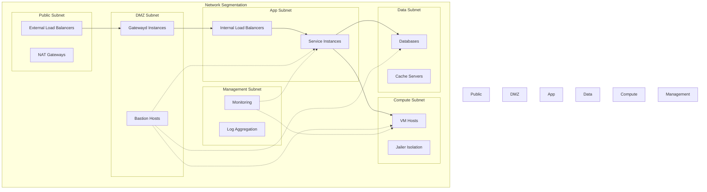
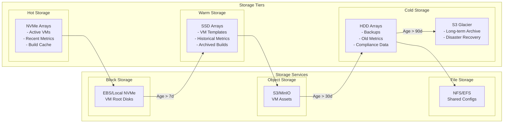
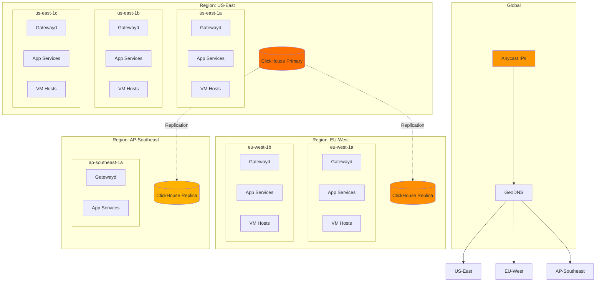
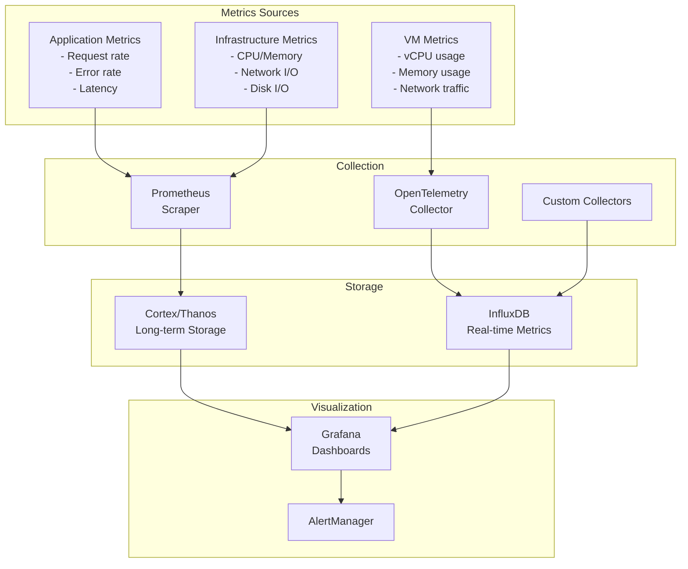
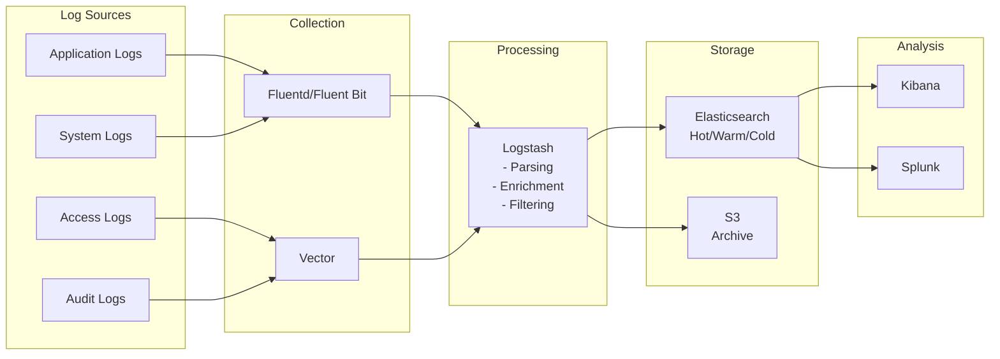

# Infrastructure Components and Organization

## Component Overview

```mermaid
graph TB
    subgraph "External Layer"
        INTERNET[Internet]
        CDN[CDN<br/>CloudFlare/Fastly]
        DNS[DNS<br/>Route53/CloudFlare]
    end
    
    subgraph "Edge Layer"
        GLB[Global Load Balancer<br/>- GeoDNS<br/>- Health Checks<br/>- Failover]
        WAF[Web Application Firewall<br/>- DDoS Protection<br/>- Rate Limiting<br/>- Geo Blocking]
    end
    
    subgraph "Gateway Layer"
        subgraph "Gatewayd Cluster"
            GW1[Gatewayd-1<br/>Leader]
            GW2[Gatewayd-2<br/>Follower]
            GW3[Gatewayd-3<br/>Follower]
        end
        
        CONSUL[Consul/etcd<br/>Service Discovery]
    end
    
    subgraph "Application Layer"
        subgraph "Control Plane Services"
            METALD_LB[Metald LB]
            METALD1[Metald-1]
            METALD2[Metald-2]
            METALD3[Metald-3]
            
            BUILDERD_LB[Builderd LB]
            BUILDERD1[Builderd-1]
            BUILDERD2[Builderd-2]
            
            ASSET_LB[AssetMgr LB]
            ASSET1[AssetManagerd-1]
            ASSET2[AssetManagerd-2]
        end
        
        subgraph "Data Plane Services"
            BILLAGED_LB[Billaged LB]
            BILLAGED1[Billaged-1]
            BILLAGED2[Billaged-2]
            BILLAGED3[Billaged-3]
            
            BILLAGG[BillingAggregator<br/>Stream Processor]
        end
    end
    
    subgraph "Message Layer"
        KAFKA[Kafka/NATS<br/>Message Broker]
        SCHEMA[Schema Registry]
    end
    
    subgraph "Data Layer"
        subgraph "ClickHouse Cluster"
            CH_LB[ClickHouse LB]
            CH1[CH Shard 1<br/>Replica 1]
            CH2[CH Shard 1<br/>Replica 2]
            CH3[CH Shard 2<br/>Replica 1]
            CH4[CH Shard 2<br/>Replica 2]
            ZK[ZooKeeper<br/>Cluster]
        end
        
        subgraph "Object Storage"
            S3[S3/MinIO<br/>VM Assets]
            BACKUP[Backup Storage]
        end
        
        subgraph "Cache Layer"
            REDIS1[Redis Master]
            REDIS2[Redis Replica]
        end
    end
    
    subgraph "Compute Layer"
        subgraph "VM Host Pool"
            HOST1[Compute Host 1<br/>- 96 vCPU<br/>- 384GB RAM<br/>- NVMe Storage]
            HOST2[Compute Host 2]
            HOSTN[Compute Host N]
        end
    end
    
    INTERNET --> CDN
    CDN --> GLB
    GLB --> WAF
    WAF --> Gatewayd Cluster
    
    GW1 --> CONSUL
    GW2 --> CONSUL
    GW3 --> CONSUL
    
    Gatewayd Cluster --> METALD_LB
    Gatewayd Cluster --> BUILDERD_LB
    Gatewayd Cluster --> ASSET_LB
    
    METALD_LB --> METALD1
    METALD_LB --> METALD2
    METALD_LB --> METALD3
    
    BILLAGED_LB --> BILLAGED1
    BILLAGED_LB --> BILLAGED2
    BILLAGED_LB --> BILLAGED3
    
    BILLAGED1 --> KAFKA
    BILLAGED2 --> KAFKA
    BILLAGED3 --> KAFKA
    
    KAFKA --> BILLAGG
    BILLAGG --> CH_LB
    
    CH_LB --> CH1
    CH_LB --> CH2
    CH_LB --> CH3
    CH_LB --> CH4
    
    CH1 -.-> ZK
    CH2 -.-> ZK
    CH3 -.-> ZK
    CH4 -.-> ZK
    
    METALD1 --> HOST1
    METALD2 --> HOST2
    METALD3 --> HOSTN
    
    style GLB fill:#ff9800
    style KAFKA fill:#424242
    style CH_LB fill:#ff6f00
    style S3 fill:#569A31
```

## Infrastructure Specifications

### 1. Hardware Requirements

#### Gatewayd Nodes
```yaml
Purpose: API Gateway and routing
Count: 3 minimum (multi-AZ)
Specifications:
  CPU: 8 vCPU
  Memory: 16 GB
  Storage: 100 GB SSD (logs)
  Network: 10 Gbps
  
Scaling:
  Horizontal: Auto-scale based on request rate
  Vertical: Up to 32 vCPU for high traffic
```

#### Metald Nodes
```yaml
Purpose: VM lifecycle management
Count: 3 minimum (active-active)
Specifications:
  CPU: 16 vCPU
  Memory: 32 GB
  Storage: 500 GB NVMe (VM metadata)
  Network: 10 Gbps
  
Special Requirements:
  - CAP_SYS_ADMIN capability
  - Access to /srv/jailer
  - Direct access to compute hosts
```

#### Builderd Nodes
```yaml
Purpose: Container to rootfs conversion
Count: 2 minimum
Specifications:
  CPU: 32 vCPU
  Memory: 64 GB
  Storage: 1 TB NVMe (build cache)
  Network: 10 Gbps
  
Special Requirements:
  - Docker socket access
  - High IOPS for image operations
```

#### VM Compute Hosts
```yaml
Purpose: Running Firecracker VMs
Count: Variable based on load
Specifications:
  CPU: 96-128 vCPU (AMD EPYC/Intel Xeon)
  Memory: 384-512 GB ECC RAM
  Storage: 
    - 2x 1TB NVMe (OS/Jailer)
    - 4x 4TB NVMe (VM storage)
  Network: 
    - 2x 25 Gbps (bonded)
    - SR-IOV support
    
VM Density:
  - Small VMs (1 vCPU, 512MB): 150-180 per host
  - Medium VMs (2 vCPU, 2GB): 40-50 per host
  - Large VMs (4 vCPU, 8GB): 10-12 per host
```

#### ClickHouse Cluster
```yaml
Purpose: Time series metrics storage
Topology: 2 shards x 2 replicas
Specifications per node:
  CPU: 32 vCPU
  Memory: 128 GB
  Storage: 
    - 500 GB NVMe (hot data)
    - 10 TB SSD (warm data)
    - 50 TB HDD (cold data)
  Network: 10 Gbps
  
Data Retention:
  - Raw metrics: 7 days (NVMe)
  - 5-min aggregates: 30 days (SSD)
  - Hourly aggregates: 1 year (SSD)
  - Daily aggregates: 3 years (HDD)
```

### 2. Network Architecture



### 3. Storage Architecture



## Deployment Topology

### 1. Multi-Region Architecture



### 2. Kubernetes Deployment

```yaml
apiVersion: v1
kind: Namespace
metadata:
  name: unkey-deploy
---
apiVersion: apps/v1
kind: Deployment
metadata:
  name: gatewayd
  namespace: unkey-deploy
spec:
  replicas: 3
  selector:
    matchLabels:
      app: gatewayd
  template:
    metadata:
      labels:
        app: gatewayd
    spec:
      affinity:
        podAntiAffinity:
          requiredDuringSchedulingIgnoredDuringExecution:
          - labelSelector:
              matchExpressions:
              - key: app
                operator: In
                values:
                - gatewayd
            topologyKey: kubernetes.io/hostname
      containers:
      - name: gatewayd
        image: unkey/gatewayd:latest
        ports:
        - containerPort: 8000
        resources:
          requests:
            memory: "8Gi"
            cpu: "4"
          limits:
            memory: "16Gi"
            cpu: "8"
        env:
        - name: UNKEY_GATEWAYD_PORT
          value: "8000"
        - name: UNKEY_GATEWAYD_LOG_LEVEL
          value: "info"
        livenessProbe:
          httpGet:
            path: /health
            port: 8000
          initialDelaySeconds: 30
          periodSeconds: 10
        readinessProbe:
          httpGet:
            path: /ready
            port: 8000
          initialDelaySeconds: 5
          periodSeconds: 5
---
apiVersion: apps/v1
kind: StatefulSet
metadata:
  name: metald
  namespace: unkey-deploy
spec:
  serviceName: metald
  replicas: 3
  selector:
    matchLabels:
      app: metald
  template:
    metadata:
      labels:
        app: metald
    spec:
      securityContext:
        fsGroup: 1000
      containers:
      - name: metald
        image: unkey/metald:latest
        ports:
        - containerPort: 8080
        securityContext:
          capabilities:
            add:
            - CAP_SYS_ADMIN
            - CAP_NET_ADMIN
            - CAP_DAC_OVERRIDE
        volumeMounts:
        - name: jailer-storage
          mountPath: /srv/jailer
        - name: vm-assets
          mountPath: /opt/vm-assets
        resources:
          requests:
            memory: "16Gi"
            cpu: "8"
          limits:
            memory: "32Gi"
            cpu: "16"
  volumeClaimTemplates:
  - metadata:
      name: jailer-storage
    spec:
      accessModes: [ "ReadWriteOnce" ]
      storageClassName: fast-ssd
      resources:
        requests:
          storage: 500Gi
```

### 3. Service Mesh Configuration

```yaml
apiVersion: networking.istio.io/v1beta1
kind: VirtualService
metadata:
  name: gatewayd-routing
  namespace: unkey-deploy
spec:
  hosts:
  - gatewayd
  http:
  - match:
    - uri:
        prefix: "/v1/vms"
    route:
    - destination:
        host: metald
        port:
          number: 8080
      weight: 100
    timeout: 30s
    retries:
      attempts: 3
      perTryTimeout: 10s
  - match:
    - uri:
        prefix: "/v1/builds"
    route:
    - destination:
        host: builderd
        port:
          number: 8082
      weight: 100
    timeout: 300s
---
apiVersion: networking.istio.io/v1beta1
kind: DestinationRule
metadata:
  name: circuit-breaker
  namespace: unkey-deploy
spec:
  host: metald
  trafficPolicy:
    connectionPool:
      tcp:
        maxConnections: 100
      http:
        http1MaxPendingRequests: 100
        http2MaxRequests: 100
        maxRequestsPerConnection: 2
    outlierDetection:
      consecutiveErrors: 5
      interval: 30s
      baseEjectionTime: 30s
      maxEjectionPercent: 50
      minHealthPercent: 30
```

## Monitoring and Observability

### 1. Metrics Architecture



### 2. Logging Architecture



This infrastructure documentation provides:
- Detailed component specifications
- Network segmentation and security
- Multi-region deployment strategies
- Kubernetes and service mesh configurations
- Comprehensive monitoring and logging architectures
- Scalability considerations for each component