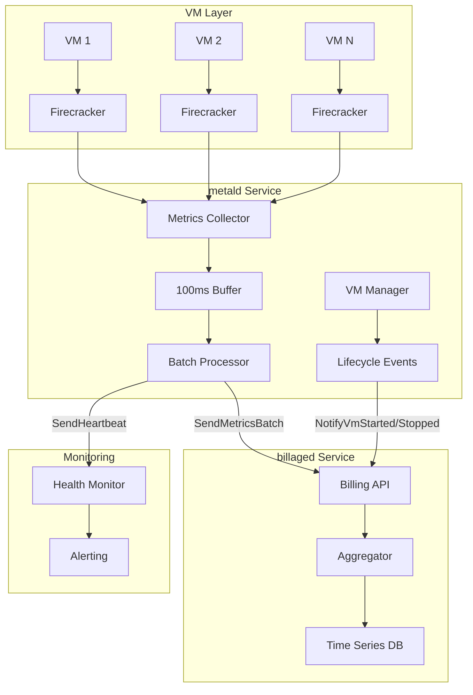
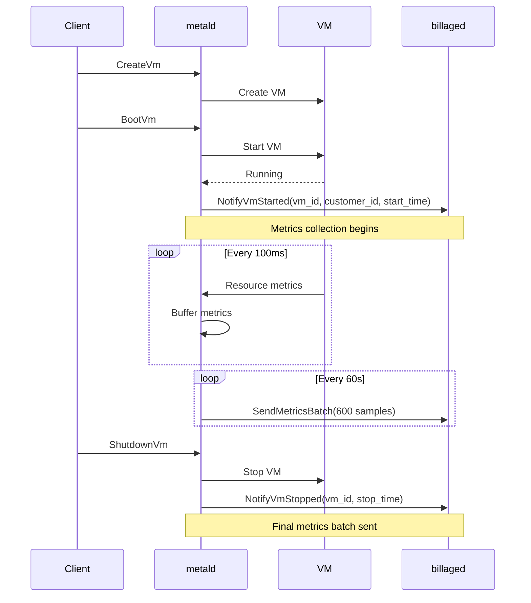

# Metald-Billaged Integration Guide

Complete guide for integrating metald VM management with billaged billing service for accurate usage tracking and billing.

## Integration Overview

The metald-billaged integration provides real-time VM resource usage tracking with 100ms precision for accurate customer billing. This document covers the complete integration flow, configuration, and operational procedures.

## Architecture



## Integration Components

### 1. Metrics Collection Pipeline

**metald** collects metrics from Firecracker VMs every 100ms:
- CPU time (nanosecond precision)
- Memory usage (byte precision)
- Disk I/O (bytes read/written)
- Network I/O (bytes received/transmitted)

**billaged** receives and aggregates these metrics:
- Accepts batches of 600 samples (1 minute)
- Validates data integrity
- Stores in time-series database

### 2. VM Lifecycle Integration



## Configuration

### metald Configuration

```go
// internal/billing/client.go
type BillingClient struct {
    endpoint string
    client   billingv1connect.BillingServiceClient
}

func NewBillingClient(endpoint string) *BillingClient {
    httpClient := &http.Client{
        Transport: &http2.Transport{
            AllowHTTP: true,
            DialTLS: func(network, addr string, cfg *tls.Config) (net.Conn, error) {
                return net.Dial(network, addr)
            },
        },
    }
    
    client := billingv1connect.NewBillingServiceClient(
        httpClient,
        endpoint,
    )
    
    return &BillingClient{
        endpoint: endpoint,
        client:   client,
    }
}
```

### Environment Variables

**metald**:
```bash
# Billing service configuration
export UNKEY_METALD_BILLING_ENABLED=true
export UNKEY_METALD_BILLING_ENDPOINT=http://billaged:8081
export UNKEY_METALD_BILLING_BATCH_SIZE=600
export UNKEY_METALD_BILLING_INTERVAL=100ms
```

**billaged**:
```bash
# API configuration
export BILLAGED_PORT=8081
export BILLAGED_ADDRESS=0.0.0.0
export BILLAGED_AGGREGATION_INTERVAL=60s
```

## Implementation Details

### Metrics Collection in metald

```go
// internal/billing/collector.go
func (mc *MetricsCollector) collectMetrics(vmID string) error {
    // Read from Firecracker metrics file
    metricsPath := fmt.Sprintf("/var/lib/firecracker/%s/metrics.json", vmID)
    data, err := os.ReadFile(metricsPath)
    if err != nil {
        return fmt.Errorf("failed to read metrics: %w", err)
    }
    
    // Parse Firecracker metrics
    var fcMetrics FirecrackerMetrics
    if err := json.Unmarshal(data, &fcMetrics); err != nil {
        return fmt.Errorf("failed to parse metrics: %w", err)
    }
    
    // Convert to billaged format
    metric := &billingv1.VMMetrics{
        Timestamp:        timestamppb.Now(),
        CpuTimeNanos:     fcMetrics.CpuStats.CpuTimeNanos,
        MemoryUsageBytes: fcMetrics.MemoryStats.UsageBytes,
        DiskReadBytes:    fcMetrics.BlockStats.ReadBytes,
        DiskWriteBytes:   fcMetrics.BlockStats.WriteBytes,
        NetworkRxBytes:   fcMetrics.NetStats.RxBytes,
        NetworkTxBytes:   fcMetrics.NetStats.TxBytes,
    }
    
    // Add to buffer
    mc.buffer.Add(vmID, metric)
    
    return nil
}
```

### Batch Sending Logic

```go
// internal/billing/sender.go
func (bs *BatchSender) sendBatch(vmID, customerID string, metrics []*billingv1.VMMetrics) error {
    ctx, cancel := context.WithTimeout(context.Background(), 10*time.Second)
    defer cancel()
    
    req := connect.NewRequest(&billingv1.SendMetricsBatchRequest{
        VmId:       vmID,
        CustomerId: customerID,
        Metrics:    metrics,
    })
    
    resp, err := bs.client.SendMetricsBatch(ctx, req)
    if err != nil {
        // Implement retry logic
        return bs.retryWithBackoff(vmID, customerID, metrics)
    }
    
    if !resp.Msg.Success {
        return fmt.Errorf("batch rejected: %s", resp.Msg.Message)
    }
    
    return nil
}
```

### VM Lifecycle Notifications

```go
// internal/service/vm.go
func (s *VMService) BootVm(ctx context.Context, req *connect.Request[metaldv1.BootVmRequest]) (*connect.Response[metaldv1.BootVmResponse], error) {
    vmID := req.Msg.GetVmId()
    
    // Boot the VM
    if err := s.backend.BootVM(ctx, vmID); err != nil {
        return nil, err
    }
    
    // Notify billing service
    if s.billingClient != nil {
        customerID := s.getCustomerID(vmID) // Extract from metadata
        startTime := time.Now().UnixNano()
        
        notifyReq := connect.NewRequest(&billingv1.NotifyVmStartedRequest{
            VmId:       vmID,
            CustomerId: customerID,
            StartTime:  startTime,
        })
        
        if _, err := s.billingClient.NotifyVmStarted(ctx, notifyReq); err != nil {
            s.logger.Error("failed to notify billing of VM start", 
                "vm_id", vmID, 
                "error", err)
            // Don't fail VM boot on billing notification failure
        }
        
        // Start metrics collection
        s.metricsCollector.StartCollection(vmID, customerID)
    }
    
    return connect.NewResponse(&metaldv1.BootVmResponse{
        Success: true,
        State:   metaldv1.VmState_VM_STATE_RUNNING,
    }), nil
}
```

## Error Handling

### Network Failures

```go
// Exponential backoff retry
func (bs *BatchSender) retryWithBackoff(vmID, customerID string, metrics []*billingv1.VMMetrics) error {
    backoff := 100 * time.Millisecond
    maxBackoff := 30 * time.Second
    maxRetries := 5
    
    for i := 0; i < maxRetries; i++ {
        time.Sleep(backoff)
        
        if err := bs.sendBatch(vmID, customerID, metrics); err == nil {
            return nil
        }
        
        // Exponential backoff with jitter
        backoff = time.Duration(float64(backoff) * (1.5 + rand.Float64()*0.5))
        if backoff > maxBackoff {
            backoff = maxBackoff
        }
    }
    
    // Write to WAL for recovery
    return bs.wal.WriteFailedBatch(vmID, customerID, metrics)
}
```

### Gap Detection

```go
// Monitor for data gaps
func (mc *MetricsCollector) detectGaps() {
    ticker := time.NewTicker(30 * time.Second)
    defer ticker.Stop()
    
    for range ticker.C {
        now := time.Now()
        mc.mu.RLock()
        
        for vmID, tracker := range mc.activeVMs {
            lastSent := tracker.lastBatchTime
            if now.Sub(lastSent) > 2*time.Minute {
                // Potential gap detected
                mc.notifyGap(vmID, lastSent, now)
            }
        }
        
        mc.mu.RUnlock()
    }
}

func (mc *MetricsCollector) notifyGap(vmID string, lastSent, resumeTime time.Time) {
    req := connect.NewRequest(&billingv1.NotifyPossibleGapRequest{
        VmId:       vmID,
        LastSent:   lastSent.UnixNano(),
        ResumeTime: resumeTime.UnixNano(),
    })
    
    ctx, cancel := context.WithTimeout(context.Background(), 5*time.Second)
    defer cancel()
    
    if _, err := mc.billingClient.NotifyPossibleGap(ctx, req); err != nil {
        mc.logger.Error("failed to notify gap", 
            "vm_id", vmID,
            "gap_duration", resumeTime.Sub(lastSent),
            "error", err)
    }
}
```

## Testing Integration

### Integration Test Setup

```go
func TestMetaldBillagedIntegration(t *testing.T) {
    // Start mock billaged
    mockBillaged := startMockBillaged(t)
    defer mockBillaged.Stop()
    
    // Configure metald with mock endpoint
    config := &Config{
        Billing: BillingConfig{
            Enabled:  true,
            Endpoint: mockBillaged.URL,
        },
    }
    
    // Create VM and verify billing notifications
    vmService := NewVMService(config)
    
    // Create and boot VM
    createResp, err := vmService.CreateVm(ctx, &CreateVmRequest{...})
    require.NoError(t, err)
    
    bootResp, err := vmService.BootVm(ctx, &BootVmRequest{
        VmId: createResp.VmId,
    })
    require.NoError(t, err)
    
    // Wait for metrics batch
    time.Sleep(65 * time.Second)
    
    // Verify billing received data
    assert.True(t, mockBillaged.ReceivedVmStart(createResp.VmId))
    assert.Greater(t, mockBillaged.MetricsBatchCount(createResp.VmId), 0)
}
```

### End-to-End Verification

```bash
# 1. Start billaged
BILLAGED_PORT=8081 ./billaged &

# 2. Start metald with billing enabled
UNKEY_METALD_BILLING_ENABLED=true \
UNKEY_METALD_BILLING_ENDPOINT=http://localhost:8081 \
./metald &

# 3. Create a test VM
VM_ID=$(curl -X POST http://localhost:8080/vmprovisioner.v1.VmService/CreateVm \
  -H "Content-Type: application/json" \
  -d '{"config":{...}}' | jq -r .vmId)

# 4. Boot the VM
curl -X POST http://localhost:8080/vmprovisioner.v1.VmService/BootVm \
  -H "Content-Type: application/json" \
  -d "{\"vm_id\":\"$VM_ID\"}"

# 5. Verify billing notifications
curl -s http://localhost:9465/metrics | grep billaged_metrics_processed_total

# 6. Check for metrics batches (wait 60s)
sleep 65
curl -s http://localhost:9465/metrics | grep billaged_batch_size_histogram
```

## Monitoring Integration Health

### Key Metrics

```promql
# Metrics collection rate
rate(metald_billing_metrics_collected_total[5m])

# Batch send success rate
rate(metald_billing_batches_sent_total[5m])

# Failed batches
rate(metald_billing_batch_failures_total[5m])

# Gap notifications
rate(billaged_gap_notifications_total[5m])

# End-to-end latency
histogram_quantile(0.95, 
  metald_billing_batch_latency_seconds_bucket
)
```

### Alerts

```yaml
groups:
- name: metald-billaged-integration
  rules:
  - alert: BillingIntegrationDown
    expr: up{job="billaged"} == 0
    for: 5m
    annotations:
      summary: "Billaged service is down"
      
  - alert: MetricsBatchFailureRate
    expr: rate(metald_billing_batch_failures_total[5m]) > 0.1
    for: 10m
    annotations:
      summary: "High billing batch failure rate"
      
  - alert: BillingDataGap
    expr: rate(billaged_gap_notifications_total[5m]) > 0
    for: 5m
    annotations:
      summary: "Billing data gaps detected"
```

## Troubleshooting

### Common Issues

1. **Connection Refused**
   ```
   Error: failed to send metrics batch: connection refused
   Solution: Verify billaged is running and accessible
   ```

2. **Batch Rejection**
   ```
   Error: batch rejected: no metrics provided
   Solution: Check metrics collection is working
   ```

3. **High Memory Usage**
   ```
   Symptom: metald memory growing continuously
   Solution: Check if billaged is accepting batches
   ```

### Debug Commands

```bash
# Check connectivity
curl -f http://billaged:8081/health

# Verify metrics flow
tail -f /var/log/metald.log | grep billing

# Check batch sizes
curl -s http://localhost:9464/metrics | grep metald_billing_batch_size

# Verify lifecycle events
journalctl -u metald | grep -E "(NotifyVmStarted|NotifyVmStopped)"
```

## Best Practices

1. **High Availability**
   - Deploy multiple billaged instances
   - Use load balancer for distribution
   - Implement circuit breaker pattern

2. **Data Integrity**
   - Enable WAL in metald for failed batches
   - Monitor gap notifications
   - Implement reconciliation procedures

3. **Performance**
   - Keep batch size at 600 samples
   - Use connection pooling
   - Monitor network latency

4. **Security**
   - Use TLS for production
   - Implement authentication
   - Restrict network access

This integration guide ensures reliable, accurate billing data collection across the metald-billaged system.