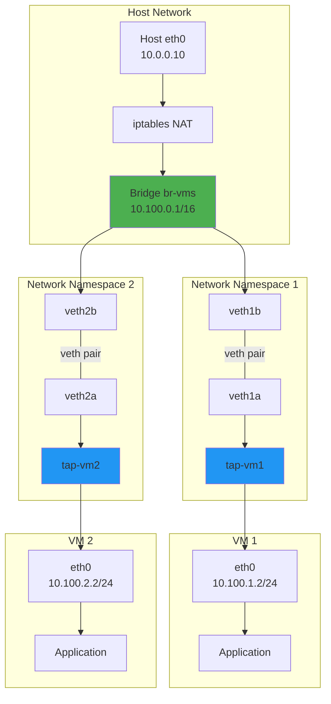
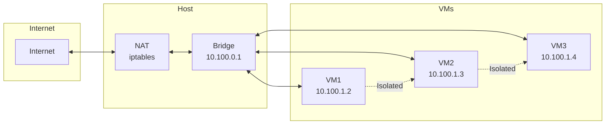

# MicroVM Networking Implementation Guide

## Overview

This guide details how to enable networking for Firecracker microVMs in the Unkey deploy infrastructure, including TAP device creation, network namespaces, IP management, and routing.

## Network Architecture



## Implementation Steps

### 1. Host Network Setup

First, we need to prepare the host system for VM networking:

```bash
#!/bin/bash
# setup-host-networking.sh

# Enable IP forwarding
echo 1 > /proc/sys/net/ipv4/ip_forward
echo "net.ipv4.ip_forward = 1" >> /etc/sysctl.conf

# Create bridge for VMs
ip link add name br-vms type bridge
ip addr add 10.100.0.1/16 dev br-vms
ip link set br-vms up

# Setup NAT for VM traffic
iptables -t nat -A POSTROUTING -s 10.100.0.0/16 -o eth0 -j MASQUERADE
iptables -A FORWARD -i br-vms -o eth0 -j ACCEPT
iptables -A FORWARD -i eth0 -o br-vms -m state --state RELATED,ESTABLISHED -j ACCEPT

# Save iptables rules
iptables-save > /etc/iptables/rules.v4
```

### 2. Network Manager Service

Create a network manager component in metald:

```go
// internal/network/manager.go
package network

import (
    "context"
    "fmt"
    "log/slog"
    "net"
    "sync"
    
    "github.com/vishvananda/netlink"
    "github.com/vishvananda/netns"
)

type NetworkManager struct {
    logger      *slog.Logger
    bridgeName  string
    subnet      *net.IPNet
    allocator   *IPAllocator
    mu          sync.Mutex
    vmNetworks  map[string]*VMNetwork
}

type VMNetwork struct {
    VMID       string
    Namespace  string
    TapDevice  string
    VethHost   string
    VethVM     string
    IPAddress  net.IP
    Gateway    net.IP
    MacAddress string
}

func NewNetworkManager(logger *slog.Logger, bridgeName string, subnet string) (*NetworkManager, error) {
    _, ipnet, err := net.ParseCIDR(subnet)
    if err != nil {
        return nil, fmt.Errorf("invalid subnet: %w", err)
    }
    
    allocator := NewIPAllocator(ipnet)
    
    return &NetworkManager{
        logger:     logger,
        bridgeName: bridgeName,
        subnet:     ipnet,
        allocator:  allocator,
        vmNetworks: make(map[string]*VMNetwork),
    }, nil
}

// CreateVMNetwork sets up networking for a VM
func (nm *NetworkManager) CreateVMNetwork(ctx context.Context, vmID string) (*VMNetwork, error) {
    nm.mu.Lock()
    defer nm.mu.Unlock()
    
    // Allocate IP address
    ip, err := nm.allocator.AllocateIP()
    if err != nil {
        return nil, fmt.Errorf("failed to allocate IP: %w", err)
    }
    
    // Generate MAC address
    mac := generateMAC(vmID)
    
    // Create network namespace
    nsName := fmt.Sprintf("vm-%s", vmID)
    ns, err := netns.NewNamed(nsName)
    if err != nil {
        nm.allocator.ReleaseIP(ip)
        return nil, fmt.Errorf("failed to create netns: %w", err)
    }
    defer ns.Close()
    
    // Create veth pair
    vethHost := fmt.Sprintf("veth-%s-h", vmID[:8])
    vethVM := fmt.Sprintf("veth-%s-v", vmID[:8])
    
    veth := &netlink.Veth{
        LinkAttrs: netlink.LinkAttrs{Name: vethHost},
        PeerName:  vethVM,
    }
    
    if err := netlink.LinkAdd(veth); err != nil {
        nm.allocator.ReleaseIP(ip)
        netns.DeleteNamed(nsName)
        return nil, fmt.Errorf("failed to create veth pair: %w", err)
    }
    
    // Move VM end to namespace
    vethVMLink, err := netlink.LinkByName(vethVM)
    if err != nil {
        nm.cleanup(vmID, ip, nsName, vethHost)
        return nil, fmt.Errorf("failed to get veth link: %w", err)
    }
    
    if err := netlink.LinkSetNsFd(vethVMLink, int(ns)); err != nil {
        nm.cleanup(vmID, ip, nsName, vethHost)
        return nil, fmt.Errorf("failed to move veth to netns: %w", err)
    }
    
    // Attach host end to bridge
    bridge, err := netlink.LinkByName(nm.bridgeName)
    if err != nil {
        nm.cleanup(vmID, ip, nsName, vethHost)
        return nil, fmt.Errorf("failed to get bridge: %w", err)
    }
    
    vethHostLink, err := netlink.LinkByName(vethHost)
    if err != nil {
        nm.cleanup(vmID, ip, nsName, vethHost)
        return nil, fmt.Errorf("failed to get veth host link: %w", err)
    }
    
    if err := netlink.LinkSetMaster(vethHostLink, bridge); err != nil {
        nm.cleanup(vmID, ip, nsName, vethHost)
        return nil, fmt.Errorf("failed to attach veth to bridge: %w", err)
    }
    
    if err := netlink.LinkSetUp(vethHostLink); err != nil {
        nm.cleanup(vmID, ip, nsName, vethHost)
        return nil, fmt.Errorf("failed to bring up veth host: %w", err)
    }
    
    // Configure networking inside namespace
    tapName := fmt.Sprintf("tap-%s", vmID[:8])
    if err := nm.configureNamespace(nsName, vethVM, tapName, ip, mac); err != nil {
        nm.cleanup(vmID, ip, nsName, vethHost)
        return nil, fmt.Errorf("failed to configure namespace: %w", err)
    }
    
    vmNet := &VMNetwork{
        VMID:       vmID,
        Namespace:  nsName,
        TapDevice:  tapName,
        VethHost:   vethHost,
        VethVM:     vethVM,
        IPAddress:  ip,
        Gateway:    nm.getGateway(),
        MacAddress: mac,
    }
    
    nm.vmNetworks[vmID] = vmNet
    
    nm.logger.LogAttrs(ctx, slog.LevelInfo, "created VM network",
        slog.String("vm_id", vmID),
        slog.String("ip", ip.String()),
        slog.String("mac", mac),
        slog.String("namespace", nsName),
    )
    
    return vmNet, nil
}

// configureNamespace sets up networking inside the network namespace
func (nm *NetworkManager) configureNamespace(nsName, vethName, tapName string, ip net.IP, mac string) error {
    // Get namespace handle
    ns, err := netns.GetFromName(nsName)
    if err != nil {
        return fmt.Errorf("failed to get namespace: %w", err)
    }
    defer ns.Close()
    
    // Save current namespace
    origns, err := netns.Get()
    if err != nil {
        return fmt.Errorf("failed to get current namespace: %w", err)
    }
    defer origns.Close()
    
    // Switch to VM namespace
    if err := netns.Set(ns); err != nil {
        return fmt.Errorf("failed to set namespace: %w", err)
    }
    defer netns.Set(origns)
    
    // Create TAP device
    tap := &netlink.Tuntap{
        LinkAttrs: netlink.LinkAttrs{
            Name: tapName,
        },
        Mode: netlink.TUNTAP_MODE_TAP,
    }
    
    if err := netlink.LinkAdd(tap); err != nil {
        return fmt.Errorf("failed to create tap device: %w", err)
    }
    
    // Set MAC address on TAP
    tapLink, err := netlink.LinkByName(tapName)
    if err != nil {
        return fmt.Errorf("failed to get tap link: %w", err)
    }
    
    hwAddr, _ := net.ParseMAC(mac)
    if err := netlink.LinkSetHardwareAddr(tapLink, hwAddr); err != nil {
        return fmt.Errorf("failed to set tap MAC: %w", err)
    }
    
    // Bridge veth and tap inside namespace
    br := &netlink.Bridge{
        LinkAttrs: netlink.LinkAttrs{
            Name: "br0",
        },
    }
    
    if err := netlink.LinkAdd(br); err != nil {
        return fmt.Errorf("failed to create bridge: %w", err)
    }
    
    // Get all links
    brLink, _ := netlink.LinkByName("br0")
    vethLink, _ := netlink.LinkByName(vethName)
    
    // Add veth and tap to bridge
    netlink.LinkSetMaster(vethLink, brLink)
    netlink.LinkSetMaster(tapLink, brLink)
    
    // Bring everything up
    netlink.LinkSetUp(vethLink)
    netlink.LinkSetUp(tapLink)
    netlink.LinkSetUp(brLink)
    
    // Add IP to bridge
    addr := &netlink.Addr{
        IPNet: &net.IPNet{
            IP:   ip,
            Mask: net.CIDRMask(24, 32),
        },
    }
    netlink.AddrAdd(brLink, addr)
    
    // Add default route
    route := &netlink.Route{
        Dst: nil, // default route
        Gw:  nm.getGateway(),
    }
    netlink.RouteAdd(route)
    
    return nil
}

// DeleteVMNetwork removes networking for a VM
func (nm *NetworkManager) DeleteVMNetwork(ctx context.Context, vmID string) error {
    nm.mu.Lock()
    defer nm.mu.Unlock()
    
    vmNet, exists := nm.vmNetworks[vmID]
    if !exists {
        return nil // Already deleted
    }
    
    // Release IP
    nm.allocator.ReleaseIP(vmNet.IPAddress)
    
    // Delete veth pair (this also removes it from bridge)
    if link, err := netlink.LinkByName(vmNet.VethHost); err == nil {
        netlink.LinkDel(link)
    }
    
    // Delete network namespace (this cleans up everything inside)
    netns.DeleteNamed(vmNet.Namespace)
    
    delete(nm.vmNetworks, vmID)
    
    nm.logger.LogAttrs(ctx, slog.LevelInfo, "deleted VM network",
        slog.String("vm_id", vmID),
        slog.String("ip", vmNet.IPAddress.String()),
    )
    
    return nil
}

func (nm *NetworkManager) getGateway() net.IP {
    // Use .1 address of the subnet as gateway
    gw := make(net.IP, len(nm.subnet.IP))
    copy(gw, nm.subnet.IP)
    gw[len(gw)-1] = 1
    return gw
}

func generateMAC(vmID string) string {
    // Generate deterministic MAC from VM ID
    h := fnv.New32a()
    h.Write([]byte(vmID))
    hash := h.Sum32()
    
    // Use locally administered MAC prefix
    return fmt.Sprintf("02:00:%02x:%02x:%02x:%02x",
        (hash>>24)&0xff,
        (hash>>16)&0xff,
        (hash>>8)&0xff,
        hash&0xff,
    )
}
```

### 3. IP Address Allocator

```go
// internal/network/allocator.go
package network

import (
    "fmt"
    "net"
    "sync"
)

type IPAllocator struct {
    subnet    *net.IPNet
    allocated map[string]bool
    mu        sync.Mutex
}

func NewIPAllocator(subnet *net.IPNet) *IPAllocator {
    return &IPAllocator{
        subnet:    subnet,
        allocated: make(map[string]bool),
    }
}

func (a *IPAllocator) AllocateIP() (net.IP, error) {
    a.mu.Lock()
    defer a.mu.Unlock()
    
    // Start from .2 (reserve .1 for gateway)
    ip := make(net.IP, len(a.subnet.IP))
    copy(ip, a.subnet.IP)
    
    for i := 2; i < 255; i++ {
        ip[len(ip)-1] = byte(i)
        
        if !a.allocated[ip.String()] {
            a.allocated[ip.String()] = true
            return ip, nil
        }
    }
    
    return nil, fmt.Errorf("no available IPs in subnet")
}

func (a *IPAllocator) ReleaseIP(ip net.IP) {
    a.mu.Lock()
    defer a.mu.Unlock()
    
    delete(a.allocated, ip.String())
}
```

### 4. Integration with Firecracker

Update the Firecracker VM configuration to include network interfaces:

```go
// internal/backend/firecracker/types.go

// Add to firecrackerNetworkInterface struct
type firecrackerNetworkInterface struct {
    IfaceID      string `json:"iface_id"`
    HostDevName  string `json:"host_dev_name"`
    GuestMAC     string `json:"guest_mac,omitempty"`
    RxRateLimiter *rateLimiter `json:"rx_rate_limiter,omitempty"`
    TxRateLimiter *rateLimiter `json:"tx_rate_limiter,omitempty"`
}

type rateLimiter struct {
    Bandwidth *tokenBucket `json:"bandwidth,omitempty"`
    Ops       *tokenBucket `json:"ops,omitempty"`
}

type tokenBucket struct {
    Size       int64 `json:"size"`
    RefillTime int64 `json:"refill_time"`
}
```

### 5. Update Process Manager

Modify the process manager to set up networking when creating VMs:

```go
// internal/process/manager.go

// Add network manager field
type ProcessManager struct {
    // ... existing fields ...
    networkMgr *network.NetworkManager
}

// Update createDedicatedProcess to setup networking
func (m *ProcessManager) createDedicatedProcess(ctx context.Context, vmID string) (*FirecrackerProcess, error) {
    // ... existing code ...
    
    // Setup networking before starting jailer
    vmNet, err := m.networkMgr.CreateVMNetwork(ctx, vmID)
    if err != nil {
        return nil, fmt.Errorf("failed to create VM network: %w", err)
    }
    
    // Update jailer command to use the network namespace
    cmd.Args = append(cmd.Args, "--netns", vmNet.Namespace)
    
    // ... rest of existing code ...
    
    process.NetworkInfo = vmNet
    
    return process, nil
}
```

### 6. VM Configuration with Networking

Update the VM creation to include network configuration:

```go
// internal/backend/firecracker/client.go

func (c *Client) CreateVMWithID(ctx context.Context, config *vmprovisionerv1.VmConfig, vmID string) (string, error) {
    // ... existing code ...
    
    // Add network configuration if process has network info
    if c.process != nil && c.process.NetworkInfo != nil {
        netConfig := firecrackerNetworkInterface{
            IfaceID:     "eth0",
            HostDevName: c.process.NetworkInfo.TapDevice,
            GuestMAC:    c.process.NetworkInfo.MacAddress,
        }
        
        // Configure rate limiting if specified
        if config.Network != nil && config.Network[0].RxRateLimit != nil {
            netConfig.RxRateLimiter = &rateLimiter{
                Bandwidth: &tokenBucket{
                    Size:       config.Network[0].RxRateLimit.Bandwidth,
                    RefillTime: config.Network[0].RxRateLimit.RefillTime,
                },
            }
        }
        
        if err := c.configureNetworkInterface(ctx, netConfig); err != nil {
            return "", fmt.Errorf("failed to configure network: %w", err)
        }
    }
    
    // ... rest of existing code ...
}

func (c *Client) configureNetworkInterface(ctx context.Context, config firecrackerNetworkInterface) error {
    data, err := json.Marshal(config)
    if err != nil {
        return err
    }
    
    resp, err := c.doRequest(ctx, "PUT", fmt.Sprintf("/network-interfaces/%s", config.IfaceID), data)
    if err != nil {
        return err
    }
    defer resp.Body.Close()
    
    if resp.StatusCode != http.StatusNoContent {
        respBody, _ := io.ReadAll(resp.Body)
        return fmt.Errorf("network config failed with status %d: %s", resp.StatusCode, string(respBody))
    }
    
    return nil
}
```

### 7. Guest OS Configuration

The guest OS needs to be configured to use DHCP or static IP. For static configuration, create a custom init script:

```bash
#!/bin/bash
# /etc/init.d/network-setup

# Read network config from kernel cmdline or metadata service
IP=$(cat /proc/cmdline | grep -o 'ip=[^ ]*' | cut -d= -f2)
GW=$(cat /proc/cmdline | grep -o 'gw=[^ ]*' | cut -d= -f2)
DNS=$(cat /proc/cmdline | grep -o 'dns=[^ ]*' | cut -d= -f2)

if [ -n "$IP" ]; then
    ip addr add $IP/24 dev eth0
    ip link set eth0 up
    ip route add default via $GW
    echo "nameserver $DNS" > /etc/resolv.conf
else
    # Fallback to DHCP
    dhclient eth0
fi
```

### 8. Network Policies and Security

Implement network policies for multi-tenant isolation:

```go
// internal/network/policy.go
package network

import (
    "fmt"
    "os/exec"
)

type NetworkPolicy struct {
    customerID string
    vmID       string
    rules      []FirewallRule
}

type FirewallRule struct {
    Direction string // ingress/egress
    Protocol  string // tcp/udp/icmp
    Port      int
    Source    string // CIDR or "any"
    Action    string // allow/deny
}

func (nm *NetworkManager) ApplyNetworkPolicy(vmNet *VMNetwork, policy *NetworkPolicy) error {
    // Create customer-specific chain
    chainName := fmt.Sprintf("VM_%s", vmNet.VMID[:8])
    
    // Create the chain
    exec.Command("iptables", "-t", "filter", "-N", chainName).Run()
    
    // Add rules to the chain
    for _, rule := range policy.rules {
        args := []string{"-t", "filter", "-A", chainName}
        
        if rule.Direction == "ingress" {
            args = append(args, "-d", vmNet.IPAddress.String())
        } else {
            args = append(args, "-s", vmNet.IPAddress.String())
        }
        
        if rule.Protocol != "" {
            args = append(args, "-p", rule.Protocol)
        }
        
        if rule.Port > 0 {
            args = append(args, "--dport", fmt.Sprintf("%d", rule.Port))
        }
        
        if rule.Source != "any" {
            args = append(args, "-s", rule.Source)
        }
        
        args = append(args, "-j", rule.Action)
        
        if err := exec.Command("iptables", args...).Run(); err != nil {
            return fmt.Errorf("failed to add firewall rule: %w", err)
        }
    }
    
    // Link chain to FORWARD
    exec.Command("iptables", "-t", "filter", "-I", "FORWARD", 
        "-d", vmNet.IPAddress.String(), "-j", chainName).Run()
    exec.Command("iptables", "-t", "filter", "-I", "FORWARD", 
        "-s", vmNet.IPAddress.String(), "-j", chainName).Run()
    
    return nil
}
```

## Network Topology Examples

### 1. Basic NAT Configuration



### 2. Multi-Tenant Isolation

```mermaid
graph TB
    subgraph "Customer A VMs"
        A_BR[Bridge A<br/>10.101.0.1/16]
        A_VM1[VM A1<br/>10.101.1.2]
        A_VM2[VM A2<br/>10.101.1.3]
    end
    
    subgraph "Customer B VMs"
        B_BR[Bridge B<br/>10.102.0.1/16]
        B_VM1[VM B1<br/>10.102.1.2]
        B_VM2[VM B2<br/>10.102.1.3]
    end
    
    subgraph "Shared Services"
        ROUTER[Virtual Router]
        FW[Firewall]
        NAT[NAT Gateway]
    end
    
    A_BR --> A_VM1
    A_BR --> A_VM2
    B_BR --> B_VM1
    B_BR --> B_VM2
    
    A_BR --> ROUTER
    B_BR --> ROUTER
    ROUTER --> FW
    FW --> NAT
    
    A_VM1 -.X.->|Blocked| B_VM1
    A_VM2 -.X.->|Blocked| B_VM2
```

### 3. Advanced SDN Configuration

```yaml
# network-config.yaml
networks:
  - name: customer-a-prod
    subnet: 10.101.0.0/16
    vlan: 101
    policies:
      - name: allow-http
        direction: ingress
        protocol: tcp
        port: 80
        source: 0.0.0.0/0
        action: allow
      - name: allow-https
        direction: ingress
        protocol: tcp
        port: 443
        source: 0.0.0.0/0
        action: allow
      - name: deny-all-else
        direction: ingress
        source: 0.0.0.0/0
        action: deny
        
  - name: customer-b-dev
    subnet: 10.102.0.0/16
    vlan: 102
    policies:
      - name: allow-ssh-from-office
        direction: ingress
        protocol: tcp
        port: 22
        source: 203.0.113.0/24
        action: allow
```

## Performance Considerations

### 1. Network Performance Tuning

```bash
# Host kernel parameters for better network performance
cat >> /etc/sysctl.conf << EOF
# Increase network buffers
net.core.rmem_max = 134217728
net.core.wmem_max = 134217728
net.ipv4.tcp_rmem = 4096 87380 134217728
net.ipv4.tcp_wmem = 4096 65536 134217728

# Enable TCP fast open
net.ipv4.tcp_fastopen = 3

# Increase netdev budget
net.core.netdev_budget = 600
net.core.netdev_max_backlog = 5000

# Enable RPS (Receive Packet Steering)
net.core.rps_sock_flow_entries = 32768
EOF

sysctl -p
```

### 2. SR-IOV for High Performance

For high-performance networking, use SR-IOV:

```go
// internal/network/sriov.go
type SRIOVManager struct {
    devices map[string]*SRIOVDevice
}

type SRIOVDevice struct {
    PFName   string
    NumVFs   int
    FreeVFs  []int
    UsedVFs  map[int]string // VF index -> VM ID
}

func (s *SRIOVManager) AllocateVF(vmID string) (string, error) {
    // Find available VF
    for _, dev := range s.devices {
        if len(dev.FreeVFs) > 0 {
            vfIndex := dev.FreeVFs[0]
            dev.FreeVFs = dev.FreeVFs[1:]
            dev.UsedVFs[vfIndex] = vmID
            
            vfName := fmt.Sprintf("%svf%d", dev.PFName, vfIndex)
            return vfName, nil
        }
    }
    return "", fmt.Errorf("no available VFs")
}
```

## Monitoring and Troubleshooting

### 1. Network Metrics Collection

```go
// Extend the metrics collection to include network stats
type NetworkMetrics struct {
    RxBytes   uint64
    TxBytes   uint64
    RxPackets uint64
    TxPackets uint64
    RxDropped uint64
    TxDropped uint64
}

func collectNetworkMetrics(tapDevice string) (*NetworkMetrics, error) {
    // Read from /sys/class/net/{device}/statistics/
    // or use netlink library
}
```

### 2. Common Issues and Solutions

```bash
# Check VM connectivity
ip netns exec vm-${VM_ID} ping -c 3 10.100.0.1

# Check iptables rules
iptables -t nat -L POSTROUTING -n -v
iptables -L FORWARD -n -v

# Check bridge status
bridge link show
bridge fdb show

# Monitor traffic
tcpdump -i br-vms -n
tcpdump -i tap-${VM_ID} -n

# Check network namespace
ip netns list
ip netns exec vm-${VM_ID} ip addr
ip netns exec vm-${VM_ID} ip route
```

This networking implementation provides:
- TAP device creation and management
- Network namespace isolation
- IP address allocation
- Bridge networking
- NAT configuration
- Multi-tenant isolation
- Network policies
- Performance optimization options
- Monitoring and troubleshooting tools