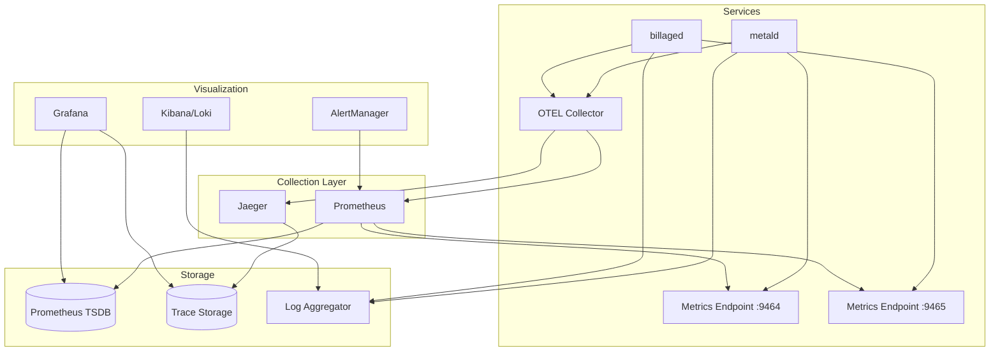

# Monitoring & Alerting Setup Guide

Complete guide for setting up comprehensive monitoring and alerting for metald and billaged services.

## Overview

This guide covers:
- Metrics collection with Prometheus
- Distributed tracing with OpenTelemetry
- Log aggregation strategies
- Alert configuration
- Dashboard setup with Grafana
- SLO/SLI definitions

## Architecture



## 1. Prometheus Setup

### Installation

```bash
# Download Prometheus
wget https://github.com/prometheus/prometheus/releases/download/v2.45.0/prometheus-2.45.0.linux-amd64.tar.gz
tar xvf prometheus-2.45.0.linux-amd64.tar.gz
cd prometheus-2.45.0.linux-amd64/

# Create configuration
cat > prometheus.yml << 'EOF'
global:
  scrape_interval: 15s
  evaluation_interval: 15s

alerting:
  alertmanagers:
    - static_configs:
        - targets:
          - localhost:9093

rule_files:
  - "alerts/*.yml"

scrape_configs:
  - job_name: 'metald'
    static_configs:
      - targets: ['localhost:9464']
    scrape_interval: 30s
    metrics_path: /metrics

  - job_name: 'billaged'
    static_configs:
      - targets: ['localhost:9465']
    scrape_interval: 30s
    metrics_path: /metrics

  - job_name: 'node'
    static_configs:
      - targets: ['localhost:9100']
EOF

# Start Prometheus
./prometheus --config.file=prometheus.yml
```

### Kubernetes Deployment

```yaml
apiVersion: v1
kind: ConfigMap
metadata:
  name: prometheus-config
data:
  prometheus.yml: |
    global:
      scrape_interval: 15s
    scrape_configs:
    - job_name: 'metald'
      kubernetes_sd_configs:
      - role: pod
      relabel_configs:
      - source_labels: [__meta_kubernetes_pod_label_app]
        action: keep
        regex: metald
      - source_labels: [__address__]
        action: replace
        regex: ([^:]+)(?::\d+)?
        replacement: $1:9464
        target_label: __address__
    - job_name: 'billaged'
      kubernetes_sd_configs:
      - role: pod
      relabel_configs:
      - source_labels: [__meta_kubernetes_pod_label_app]
        action: keep
        regex: billaged
      - source_labels: [__address__]
        action: replace
        regex: ([^:]+)(?::\d+)?
        replacement: $1:9465
        target_label: __address__
---
apiVersion: apps/v1
kind: Deployment
metadata:
  name: prometheus
spec:
  replicas: 1
  selector:
    matchLabels:
      app: prometheus
  template:
    metadata:
      labels:
        app: prometheus
    spec:
      containers:
      - name: prometheus
        image: prom/prometheus:v2.45.0
        args:
          - '--config.file=/etc/prometheus/prometheus.yml'
          - '--storage.tsdb.path=/prometheus/'
          - '--web.console.libraries=/etc/prometheus/console_libraries'
          - '--web.console.templates=/etc/prometheus/consoles'
        ports:
        - containerPort: 9090
        volumeMounts:
        - name: config
          mountPath: /etc/prometheus
        - name: storage
          mountPath: /prometheus
      volumes:
      - name: config
        configMap:
          name: prometheus-config
      - name: storage
        emptyDir: {}
```

## 2. Key Metrics

### metald Metrics

```yaml
# VM Lifecycle Metrics
metald_vms_total{state="running"}              # Currently running VMs
metald_vm_boot_duration_seconds                 # VM boot time histogram
metald_vm_operations_total{operation="create"}  # VM operation counters

# Resource Metrics
metald_cpu_usage_percent{vm_id="..."}          # Per-VM CPU usage
metald_memory_usage_bytes{vm_id="..."}         # Per-VM memory usage
metald_disk_io_bytes_total{vm_id="...",op="read"} # Disk I/O

# Billing Integration
metald_billing_metrics_collected_total          # Metrics collected
metald_billing_batches_sent_total               # Batches sent to billaged
metald_billing_batch_failures_total             # Failed batches
metald_billing_batch_size_histogram             # Batch size distribution

# System Health
metald_process_cpu_seconds_total                # metald CPU usage
metald_process_resident_memory_bytes            # metald memory usage
metald_go_goroutines                            # Active goroutines
```

### billaged Metrics

```yaml
# Billing Metrics
billaged_metrics_processed_total                # Total metrics processed
billaged_batch_size_histogram                   # Batch size distribution
billaged_processing_duration_seconds            # Processing latency
billaged_active_vms                             # Currently tracked VMs

# Aggregation Metrics
billaged_aggregation_duration_seconds           # Time to aggregate data
billaged_aggregation_errors_total               # Aggregation failures

# System Health
billaged_process_cpu_seconds_total              # billaged CPU usage
billaged_process_resident_memory_bytes          # billaged memory usage
```

## 3. OpenTelemetry Setup

### OTEL Collector Configuration

```yaml
# otel-collector-config.yaml
receivers:
  otlp:
    protocols:
      grpc:
        endpoint: 0.0.0.0:4317
      http:
        endpoint: 0.0.0.0:4318

processors:
  batch:
    timeout: 1s
    send_batch_size: 1024
  
  memory_limiter:
    check_interval: 1s
    limit_mib: 512
  
  attributes:
    actions:
      - key: environment
        value: production
        action: insert

exporters:
  prometheus:
    endpoint: "0.0.0.0:8889"
    namespace: otel
  
  jaeger:
    endpoint: jaeger-collector:14250
    tls:
      insecure: true
  
  logging:
    loglevel: info

service:
  pipelines:
    traces:
      receivers: [otlp]
      processors: [memory_limiter, batch]
      exporters: [jaeger, logging]
    
    metrics:
      receivers: [otlp]
      processors: [memory_limiter, batch, attributes]
      exporters: [prometheus, logging]
```

### Enable in Services

```bash
# metald
export UNKEY_METALD_OTEL_ENABLED=true
export UNKEY_METALD_OTEL_ENDPOINT=localhost:4318
export UNKEY_METALD_OTEL_SERVICE_NAME=metald-prod
export UNKEY_METALD_OTEL_SAMPLING_RATE=0.1

# billaged
export BILLAGED_OTEL_ENABLED=true
export BILLAGED_OTEL_ENDPOINT=localhost:4318
export BILLAGED_OTEL_SERVICE_NAME=billaged-prod
export BILLAGED_OTEL_SAMPLING_RATE=0.1
```

## 4. Alert Configuration

### Critical Alerts

```yaml
# alerts/critical.yml
groups:
- name: critical
  interval: 30s
  rules:
  
  # Service Down
  - alert: ServiceDown
    expr: up{job=~"metald|billaged"} == 0
    for: 2m
    labels:
      severity: critical
      team: platform
    annotations:
      summary: "{{ $labels.job }} is down"
      description: "{{ $labels.instance }} has been down for more than 2 minutes"
      runbook: "https://wiki.internal/runbooks/service-down"
  
  # High Error Rate
  - alert: HighErrorRate
    expr: |
      (
        rate(metald_errors_total[5m]) > 0.05
        or
        rate(billaged_errors_total[5m]) > 0.05
      )
    for: 5m
    labels:
      severity: critical
    annotations:
      summary: "High error rate detected"
      description: "Error rate is {{ $value | humanizePercentage }} for {{ $labels.job }}"
  
  # Billing Data Loss Risk
  - alert: BillingDataLossRisk
    expr: rate(metald_billing_batch_failures_total[5m]) > 0.1
    for: 5m
    labels:
      severity: critical
      team: billing
    annotations:
      summary: "High billing batch failure rate"
      description: "{{ $value | humanizePercentage }} of billing batches are failing"
```

### Warning Alerts

```yaml
# alerts/warnings.yml
groups:
- name: warnings
  interval: 1m
  rules:
  
  # High Memory Usage
  - alert: HighMemoryUsage
    expr: |
      (
        process_resident_memory_bytes{job="metald"} > 2e9
        or
        process_resident_memory_bytes{job="billaged"} > 1e9
      )
    for: 10m
    labels:
      severity: warning
    annotations:
      summary: "High memory usage in {{ $labels.job }}"
      description: "Memory usage is {{ $value | humanize1024 }} for {{ $labels.instance }}"
  
  # Slow Processing
  - alert: SlowBillingProcessing
    expr: |
      histogram_quantile(0.95, 
        rate(billaged_processing_duration_seconds_bucket[5m])
      ) > 0.1
    for: 10m
    labels:
      severity: warning
    annotations:
      summary: "Slow billing processing"
      description: "95th percentile processing time is {{ $value }}s"
  
  # VM Boot Failures
  - alert: VMBootFailures
    expr: |
      rate(metald_vm_operations_total{operation="boot",status="failed"}[5m]) > 0.01
    for: 10m
    labels:
      severity: warning
    annotations:
      summary: "Elevated VM boot failure rate"
      description: "{{ $value | humanizePercentage }} of VM boots are failing"
```

## 5. Grafana Dashboards

### metald Dashboard

```json
{
  "dashboard": {
    "title": "metald Operations",
    "panels": [
      {
        "title": "Running VMs",
        "targets": [{
          "expr": "metald_vms_total{state=\"running\"}"
        }]
      },
      {
        "title": "VM Operations Rate",
        "targets": [{
          "expr": "rate(metald_vm_operations_total[5m])",
          "legendFormat": "{{ operation }} - {{ status }}"
        }]
      },
      {
        "title": "Billing Metrics Collection",
        "targets": [{
          "expr": "rate(metald_billing_metrics_collected_total[5m])"
        }]
      },
      {
        "title": "API Latency",
        "targets": [{
          "expr": "histogram_quantile(0.95, rate(metald_api_duration_seconds_bucket[5m]))",
          "legendFormat": "p95"
        }]
      }
    ]
  }
}
```

### billaged Dashboard

```json
{
  "dashboard": {
    "title": "billaged Billing System",
    "panels": [
      {
        "title": "Metrics Processing Rate",
        "targets": [{
          "expr": "rate(billaged_metrics_processed_total[5m])"
        }]
      },
      {
        "title": "Batch Size Distribution",
        "targets": [{
          "expr": "histogram_quantile(0.5, rate(billaged_batch_size_histogram_bucket[5m]))",
          "legendFormat": "p50"
        }]
      },
      {
        "title": "Processing Latency",
        "targets": [{
          "expr": "histogram_quantile(0.95, rate(billaged_processing_duration_seconds_bucket[5m]))"
        }]
      },
      {
        "title": "Active VMs Tracked",
        "targets": [{
          "expr": "billaged_active_vms"
        }]
      }
    ]
  }
}
```

## 6. Log Aggregation

### Structured Logging Format

Configure services for structured JSON logging:

```bash
# metald
export LOG_FORMAT=json
export LOG_LEVEL=info

# billaged
export LOG_FORMAT=json
export LOG_LEVEL=info
```

### Fluentd Configuration

```yaml
# fluent.conf
<source>
  @type tail
  path /var/log/metald/*.log
  pos_file /var/log/td-agent/metald.pos
  tag metald
  <parse>
    @type json
    time_key timestamp
    time_format %Y-%m-%dT%H:%M:%S.%N%z
  </parse>
</source>

<source>
  @type tail
  path /var/log/billaged/*.log
  pos_file /var/log/td-agent/billaged.pos
  tag billaged
  <parse>
    @type json
    time_key timestamp
    time_format %Y-%m-%dT%H:%M:%S.%N%z
  </parse>
</source>

<match **>
  @type elasticsearch
  host elasticsearch.logging.svc.cluster.local
  port 9200
  logstash_format true
  logstash_prefix unkey
  include_tag_key true
  tag_key service
</match>
```

## 7. SLO/SLI Definitions

### Service Level Indicators (SLIs)

```yaml
# metald SLIs
- name: metald_availability
  expression: |
    sum(rate(metald_api_requests_total[5m])) 
    / 
    sum(rate(metald_api_requests_total[5m])) + sum(rate(metald_api_errors_total[5m]))

- name: metald_latency_p99
  expression: |
    histogram_quantile(0.99, 
      sum(rate(metald_api_duration_seconds_bucket[5m])) by (le)
    )

- name: billing_data_completeness
  expression: |
    1 - (
      sum(rate(metald_billing_batch_failures_total[5m]))
      /
      sum(rate(metald_billing_batches_sent_total[5m]))
    )

# billaged SLIs
- name: billaged_processing_success
  expression: |
    sum(rate(billaged_metrics_processed_total[5m]))
    /
    sum(rate(billaged_metrics_received_total[5m]))

- name: billaged_aggregation_latency
  expression: |
    histogram_quantile(0.95,
      sum(rate(billaged_aggregation_duration_seconds_bucket[5m])) by (le)
    )
```

### Service Level Objectives (SLOs)

```yaml
slos:
  - name: "metald API Availability"
    sli: metald_availability
    objective: 99.9
    window: 30d
    
  - name: "metald API Latency"
    sli: metald_latency_p99
    objective_threshold: 0.5  # 500ms
    window: 30d
    
  - name: "Billing Data Completeness"
    sli: billing_data_completeness
    objective: 99.99
    window: 30d
    
  - name: "billaged Processing Success"
    sli: billaged_processing_success
    objective: 99.95
    window: 30d
```

## 8. Alertmanager Configuration

```yaml
# alertmanager.yml
global:
  resolve_timeout: 5m
  slack_api_url: 'YOUR_SLACK_WEBHOOK_URL'

route:
  group_by: ['alertname', 'cluster', 'service']
  group_wait: 10s
  group_interval: 10s
  repeat_interval: 12h
  receiver: 'default'
  routes:
  - match:
      severity: critical
    receiver: pagerduty
    continue: true
  - match:
      severity: warning
    receiver: slack

receivers:
- name: 'default'
  slack_configs:
  - channel: '#alerts'
    title: 'Alert: {{ .GroupLabels.alertname }}'
    text: '{{ range .Alerts }}{{ .Annotations.description }}{{ end }}'

- name: 'pagerduty'
  pagerduty_configs:
  - service_key: 'YOUR_PAGERDUTY_KEY'
    description: '{{ .GroupLabels.alertname }}'

- name: 'slack'
  slack_configs:
  - channel: '#warnings'
    send_resolved: true
```

## 9. Monitoring Checklist

### Initial Setup
- [ ] Prometheus installed and scraping metrics
- [ ] Grafana connected to Prometheus
- [ ] OTEL Collector deployed
- [ ] Jaeger configured for traces
- [ ] Log aggregation pipeline working

### Dashboards
- [ ] metald operations dashboard
- [ ] billaged billing dashboard
- [ ] System resources dashboard
- [ ] Business metrics dashboard

### Alerts
- [ ] Critical alerts configured
- [ ] Warning alerts configured
- [ ] Alertmanager routing tested
- [ ] On-call rotation configured

### Validation
- [ ] Metrics flowing correctly
- [ ] Traces visible in Jaeger
- [ ] Logs searchable
- [ ] Alerts firing correctly
- [ ] SLOs tracking properly

## 10. Troubleshooting Monitoring

### No Metrics Appearing

```bash
# Check endpoints are accessible
curl -s http://localhost:9464/metrics | head -20
curl -s http://localhost:9465/metrics | head -20

# Verify Prometheus targets
curl -s http://localhost:9090/api/v1/targets | jq '.data.activeTargets'

# Check Prometheus logs
journalctl -u prometheus -n 100
```

### Missing Traces

```bash
# Verify OTEL is enabled
env | grep OTEL

# Check OTEL Collector
curl -s http://localhost:13133/metrics

# Test OTEL connectivity
curl -X POST http://localhost:4318/v1/traces \
  -H "Content-Type: application/json" \
  -d '{"resourceSpans":[]}'
```

### Alert Not Firing

```bash
# Check rule evaluation
curl -s http://localhost:9090/api/v1/rules | jq

# Test alert expression
curl -s http://localhost:9090/api/v1/query \
  -d 'query=up{job="metald"}==0' | jq

# Verify Alertmanager
curl -s http://localhost:9093/api/v1/alerts | jq
```

This comprehensive monitoring setup ensures full observability of your metald and billaged services in production.