# Detailed Service Interactions and Flow

## Complete System Flow with All Services

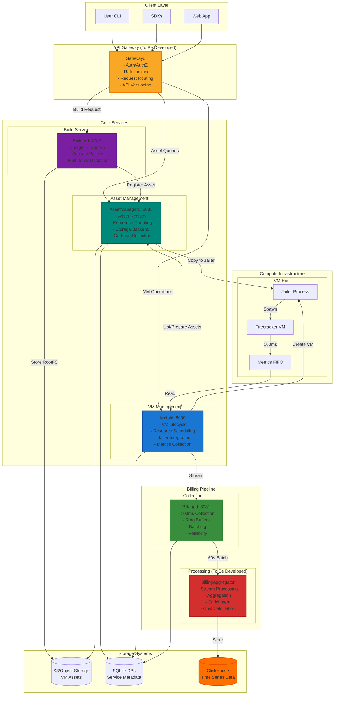

## Service Communication Patterns

### 1. Synchronous Request/Response

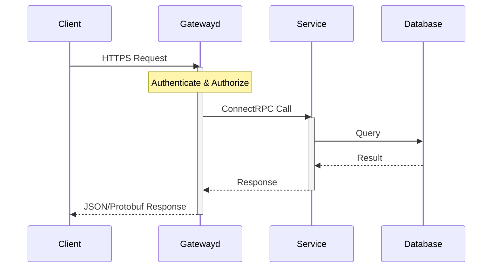

### 2. Asynchronous Processing

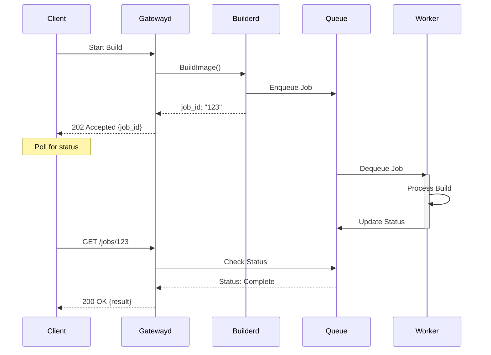

### 3. Streaming Communication

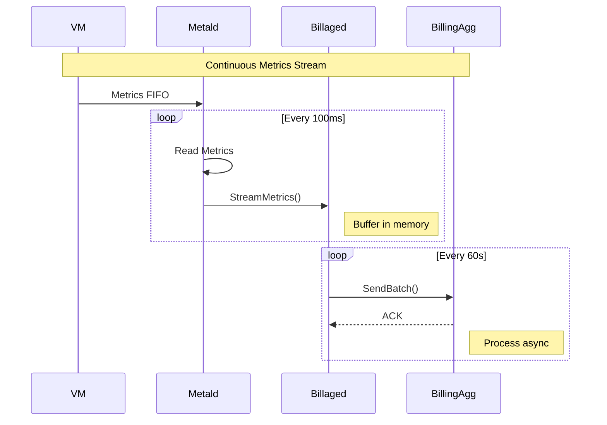

## Detailed Service Flows

### 1. Complete Application Deployment Flow

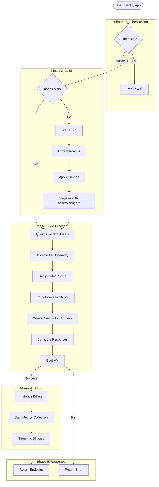

### 2. Asset Lifecycle Management

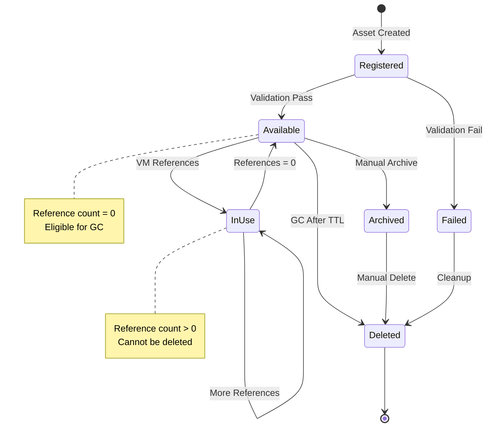

### 3. Billing Data Pipeline

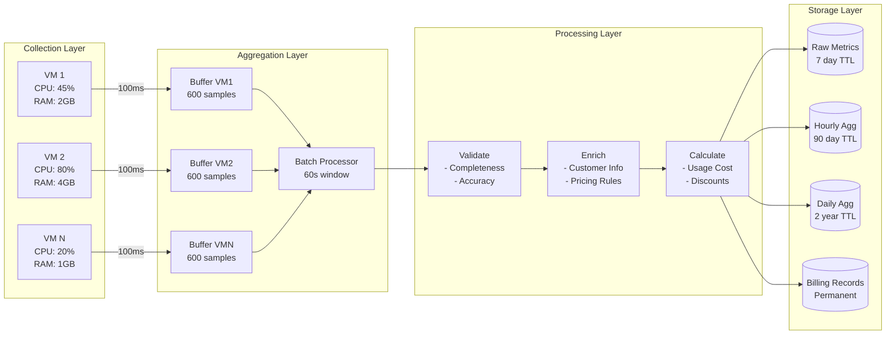

## Network Communication Details

### 1. Service Mesh Architecture

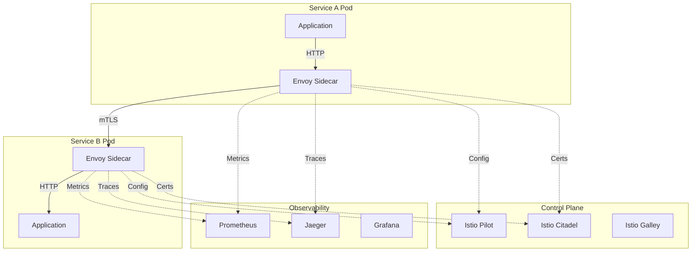

### 2. API Gateway Request Flow

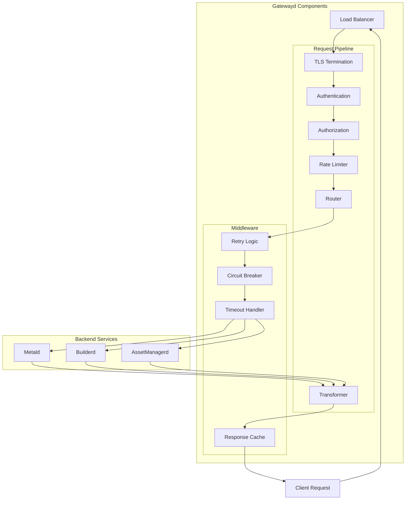

### 3. High Availability Architecture

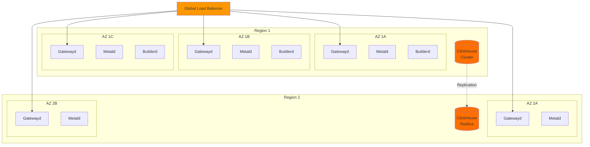

## Error Handling and Recovery

### 1. Circuit Breaker Pattern

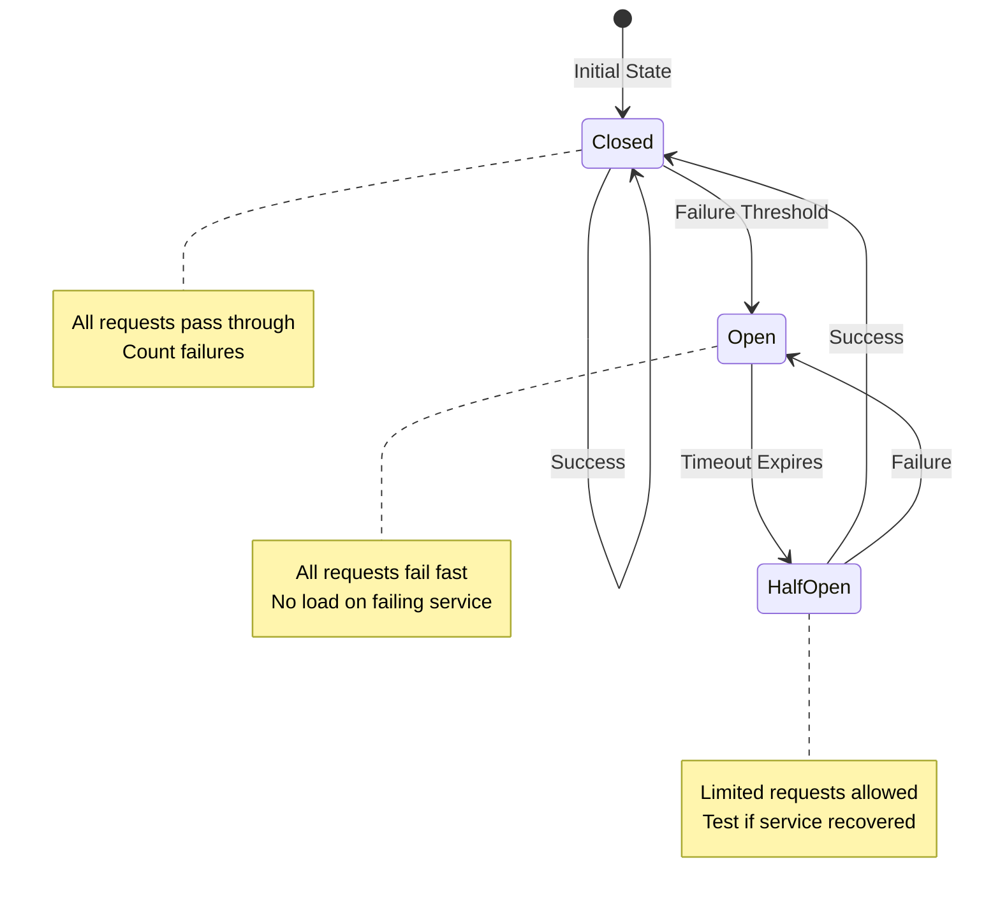

### 2. Retry and Backoff Strategy

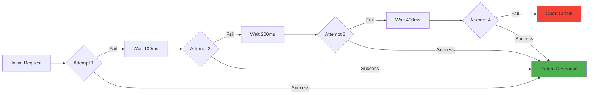

This comprehensive documentation provides:
- Complete service interaction flows
- Detailed sequence diagrams for all major operations
- Network architecture and communication patterns
- Error handling and recovery mechanisms
- High availability design
- Security considerations at each layer