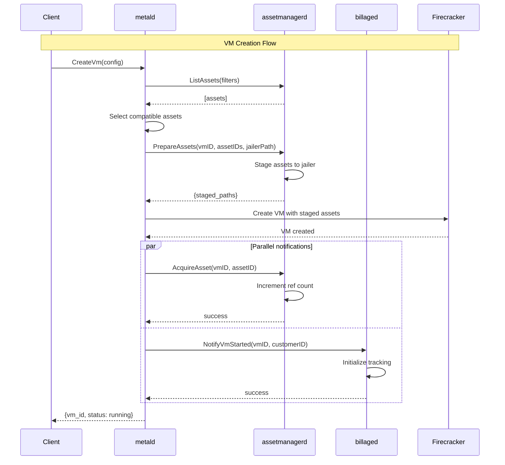
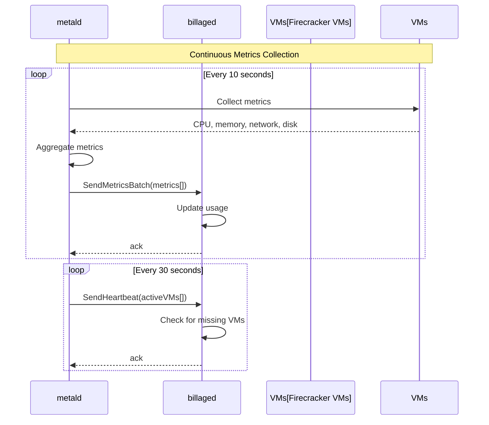
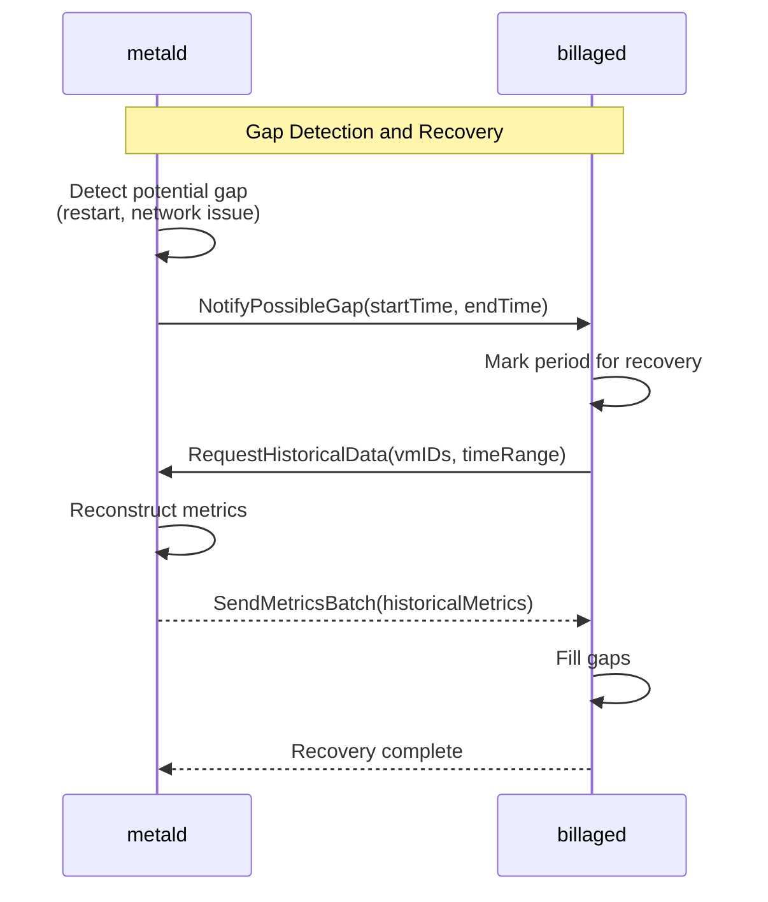
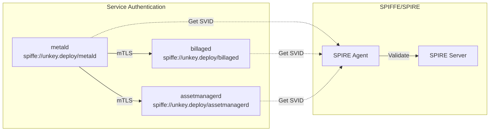

# Service Interaction Matrix

## Overview

This document provides a detailed view of how services in the Unkey Deploy system interact with each other, including API contracts, data flows, and dependency relationships.

## Service Dependency Matrix

| Caller | Callee | APIs Used | Purpose | Status |
|--------|--------|-----------|---------|---------|
| metald | assetmanagerd | `ListAssets`, `PrepareAssets`, `AcquireAsset`, `ReleaseAsset` | VM asset lifecycle | ✓ Implemented |
| metald | billaged | `SendMetricsBatch`, `NotifyVmStarted`, `NotifyVmStopped`, `SendHeartbeat`, `NotifyPossibleGap` | Usage tracking | ✓ Implemented |
| builderd | assetmanagerd | `RegisterAsset`, `StoreAsset` | Register and store built images | ✓ Implemented |

## Detailed Service Interactions

### metald → assetmanagerd

**Purpose**: Manage VM assets (kernels, rootfs, initrd) throughout VM lifecycle

#### API: ListAssets
- **When**: During VM creation to find available assets
- **Request**: Filter criteria (type, architecture, tags)
- **Response**: List of matching assets with metadata
- **Implementation**: [metald/internal/assetmanager/client.go:32](../metald/internal/assetmanager/client.go)

#### API: PrepareAssets
- **When**: Before VM creation
- **Request**: VM ID, asset IDs, jailer path
- **Response**: Staged asset paths ready for Firecracker
- **Side Effects**: Copies/links assets to jailer directory
- **Implementation**: [metald/internal/assetmanager/client.go:45](../metald/internal/assetmanager/client.go)

#### API: AcquireAsset
- **When**: After successful VM creation
- **Request**: VM ID, asset ID
- **Response**: Success/failure
- **Side Effects**: Increments reference count
- **Implementation**: [metald/internal/assetmanager/client.go:89](../metald/internal/assetmanager/client.go)

#### API: ReleaseAsset
- **When**: During VM destruction
- **Request**: VM ID, asset ID
- **Response**: Success/failure
- **Side Effects**: Decrements reference count, may trigger cleanup
- **Implementation**: [metald/internal/assetmanager/client.go:102](../metald/internal/assetmanager/client.go)

### metald → billaged

**Purpose**: Track VM usage for billing and metering

#### API: NotifyVmStarted
- **When**: Immediately after VM starts
- **Request**: VM ID, customer ID, start timestamp
- **Response**: Acknowledgment
- **Side Effects**: Initializes billing tracking for VM
- **Implementation**: [metald/internal/billing/client.go:120](../metald/internal/billing/client.go)

#### API: SendMetricsBatch
- **When**: Every 10 seconds (configurable)
- **Request**: Array of VM metrics (CPU, memory, network, disk)
- **Response**: Acknowledgment
- **Side Effects**: Updates usage counters, may trigger billing events
- **Implementation**: [metald/internal/billing/client.go:78](../metald/internal/billing/client.go)

#### API: NotifyVmStopped
- **When**: After VM stops
- **Request**: VM ID, stop timestamp
- **Response**: Acknowledgment
- **Side Effects**: Finalizes billing for VM
- **Implementation**: [metald/internal/billing/client.go:135](../metald/internal/billing/client.go)

#### API: SendHeartbeat
- **When**: Every 30 seconds
- **Request**: List of active VM IDs
- **Response**: Acknowledgment
- **Purpose**: Detect missing VMs, trigger gap recovery
- **Implementation**: [metald/internal/billing/client.go:150](../metald/internal/billing/client.go)

#### API: NotifyPossibleGap
- **When**: On metald restart or error recovery
- **Request**: Time range of possible data gap
- **Response**: Acknowledgment
- **Purpose**: Trigger historical data recovery
- **Implementation**: [metald/internal/billing/client.go:165](../metald/internal/billing/client.go)

### builderd → assetmanagerd

**Purpose**: Register and store newly built VM images

#### API: RegisterAsset
- **When**: After successful image build
- **Request**: Asset metadata, storage location
- **Response**: Asset ID
- **Side Effects**: Creates asset registry entry
- **Implementation**: [builderd/internal/service/builder.go:312](../builderd/internal/service/builder.go)

#### API: StoreAsset
- **When**: During build process for streaming uploads
- **Request**: Asset data stream, metadata
- **Response**: Storage confirmation
- **Side Effects**: Stores asset data to configured backend
- **Implementation**: [builderd/internal/service/builder.go:287](../builderd/internal/service/builder.go)

## Data Flow Diagrams

### VM Creation Flow



### Metrics Collection Flow



### Gap Recovery Flow



## Service Communication Patterns

### Synchronous RPC

All service communication uses ConnectRPC (HTTP/2):
- Request/response pattern
- Timeout: 30 seconds default
- Retries: Exponential backoff with jitter
- Circuit breaking: After 5 consecutive failures

### Error Handling

Services use consistent error patterns:
```go
// Client-side error handling
resp, err := client.PrepareAssets(ctx, req)
if err != nil {
    if connect.CodeOf(err) == connect.CodeNotFound {
        // Handle missing asset
    }
    return fmt.Errorf("failed to prepare assets: %w", err)
}

// Server-side error responses
if assetNotFound {
    return connect.NewError(connect.CodeNotFound, 
        fmt.Errorf("asset %s not found", assetID))
}
```

### Observability

All RPC calls include:
1. **Distributed tracing**: OpenTelemetry spans
2. **Metrics**: Request rate, latency, errors
3. **Logging**: Structured logs with request IDs

Example trace:
```
CreateVm (trace-id: 123)
├─ ListAssets (span-id: 124)
├─ PrepareAssets (span-id: 125)
├─ CreateFirecrackerVM (span-id: 126)
├─ AcquireAsset (span-id: 127)
└─ NotifyVmStarted (span-id: 128)
```

## Service Discovery

Services use static configuration:
```bash
# metald configuration
UNKEY_METALD_ASSETMANAGER_ENDPOINT=http://localhost:8083
UNKEY_METALD_BILLING_ENDPOINT=http://localhost:8081

# No service discovery/registry needed
# Services must be restarted if endpoints change
```

## Health Checks

Services implement health checks for dependencies:

```go
// metald health check includes dependencies
func (s *Server) CheckHealth(ctx context.Context) error {
    // Check assetmanagerd
    if err := s.assetClient.Ping(ctx); err != nil {
        return fmt.Errorf("assetmanagerd unhealthy: %w", err)
    }
    
    // Check billaged
    if err := s.billingClient.Ping(ctx); err != nil {
        return fmt.Errorf("billaged unhealthy: %w", err)
    }
    
    return nil
}
```

## Security Considerations

### Authentication Flow



### Authorization

- Service-to-service: Mutual TLS with SPIFFE IDs
- Client-to-service: Bearer tokens (metald only)
- Internal services: No additional authorization

## Performance Characteristics

### Latency Expectations

| Operation | P50 | P95 | P99 | Timeout |
|-----------|-----|-----|-----|---------|
| PrepareAssets | 100ms | 500ms | 2s | 30s |
| SendMetricsBatch | 10ms | 50ms | 100ms | 5s |
| NotifyVmStarted | 5ms | 20ms | 50ms | 5s |
| AcquireAsset | 5ms | 20ms | 50ms | 5s |

### Throughput Limits

- metald → billaged: 1000 metrics/second sustained
- metald → assetmanagerd: 100 operations/second
- Bulk operations preferred for efficiency

## Future Enhancements

### Planned Integrations

1. **builderd → assetmanagerd** (✓ Implemented):
   - Register built images automatically
   - Validate image integrity
   - Streaming asset uploads with metadata

2. **Event Bus Integration**:
   - Async notifications for non-critical paths
   - Event sourcing for audit trails
   - Pub/sub for system-wide events

3. **Service Mesh**:
   - Dynamic service discovery
   - Advanced traffic management
   - Automatic retry and circuit breaking

---

For implementation details, see individual service documentation:
- [metald](../metald/docs/)
- [billaged](../billaged/docs/)
- [assetmanagerd](../assetmanagerd/docs/)
- [builderd](../builderd/docs/)