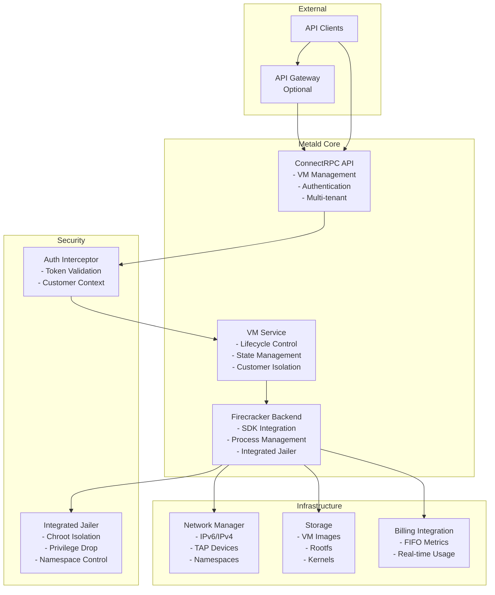
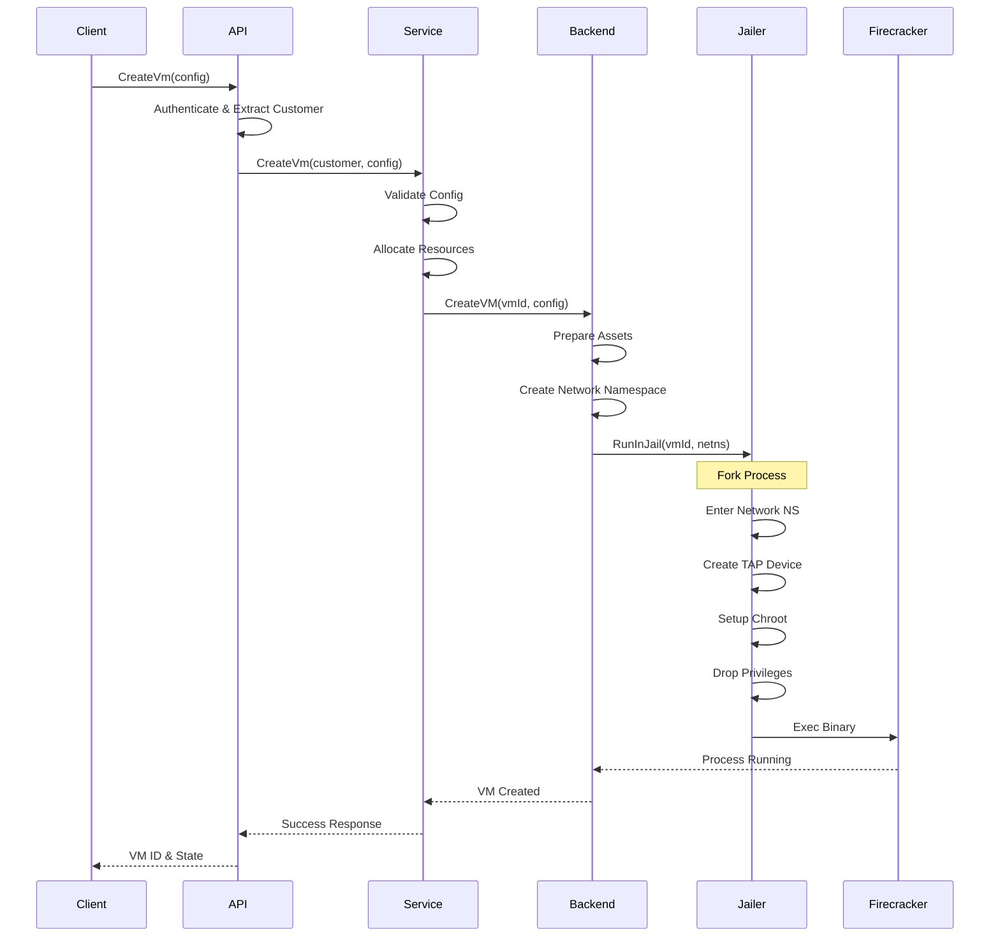
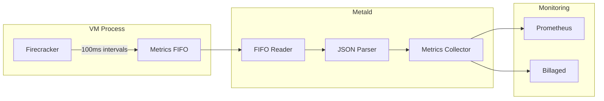
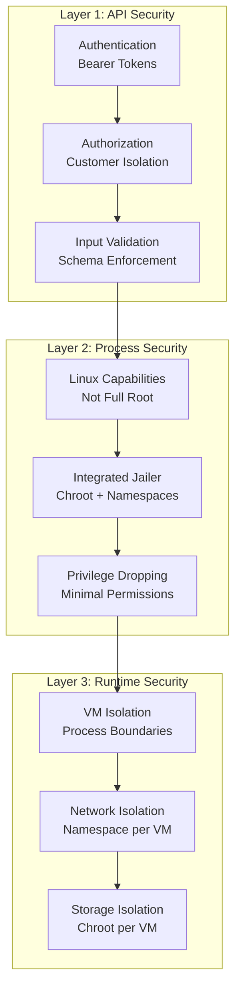

# Metald Architecture

## High-Level Overview

Metald is a high-performance VM lifecycle management service built on Firecracker microVMs. It provides secure, multi-tenant VM hosting with integrated security isolation, real-time billing, and production-grade IPv6 networking.

## Component Interactions

### Core Components

#### 1. **API Layer** (ConnectRPC)
- Provides gRPC-compatible API with HTTP/JSON support
- Handles authentication via interceptors
- Enforces customer isolation
- Manages request/response transformation

#### 2. **VM Service**
- Core business logic for VM lifecycle
- State management and transitions
- Customer ownership validation
- Resource allocation and limits

#### 3. **Firecracker Backend**
- SDK v4 integration with Firecracker
- Process-per-VM isolation model
- Integrated jailer for security
- FIFO-based metrics streaming

#### 4. **Network Manager**
- IPv6-first with dual-stack support
- TAP device creation and management
- Network namespace isolation
- Rate limiting and traffic control

#### 5. **Integrated Jailer**
- Replaces external jailer binary
- Solves TAP device visibility issues
- Maintains security isolation
- See [ADR-001](adr/001-integrated-jailer.md)

### Data Flow

#### VM Creation Flow

#### Metrics Collection Flow

## Technology Stack

### Core Technologies

| Component | Technology | Purpose |
|-----------|------------|---------|
| Language | Go 1.21+ | Primary implementation |
| API Framework | ConnectRPC | gRPC-compatible API |
| Hypervisor | Firecracker | MicroVM management |
| Database | SQLite | VM state persistence |
| Metrics | OpenTelemetry | Tracing and metrics |
| Networking | Linux netns | Network isolation |

### Dependencies

- **Firecracker SDK**: Official Go SDK for Firecracker
- **ConnectRPC**: Modern RPC framework
- **OpenTelemetry**: Observability stack
- **SPIFFE/SPIRE**: Workload identity (optional)

## Design Decisions

### 1. Integrated Jailer

**Problem**: External jailer created TAP devices outside network namespace, causing "device not found" errors.

**Solution**: Implement jailer functionality directly in metald to control operation order.

**Benefits**:
- TAP devices created inside correct namespace
- Better error handling and debugging
- No external binary dependency
- Integrated with observability

**Trade-offs**:
- Maintain security-critical code
- Diverge from Firecracker's approach

### 2. Single Backend Support

**Decision**: Only Firecracker is supported. CloudHypervisor code exists but is incomplete.

**Rationale**:
- Focus on production-tested solution
- Firecracker proven at scale
- Simplified testing and maintenance

**Future**: CloudHypervisor can be completed if needed.

### 3. Process-per-VM Model

**Architecture**: Each VM runs in a separate OS process.

**Benefits**:
- Complete isolation between VMs
- Process failures don't affect others
- Simple resource accounting
- OS-level security boundaries

**Implementation**:
- Process registry tracks all VMs
- Graceful cleanup on shutdown
- Health monitoring per process

### 4. Customer Isolation

**Design**: Strict isolation at API and data layers.

**Implementation**:
- Customer ID extracted from auth token
- All queries filtered by customer
- No cross-customer visibility
- Separate network namespaces

## Scalability Considerations

### Horizontal Scaling

- **Stateless Design**: Metald instances can be scaled horizontally
- **Shared Storage**: VM images on shared filesystem
- **Database**: SQLite limits single-node scaling
- **Load Balancing**: Use any L4/L7 load balancer

### Vertical Scaling

- **Process Limits**: ~1000 VMs per host (configurable)
- **Memory**: ~50MB overhead per VM
- **CPU**: Minimal overhead, mostly kernel
- **Network**: Namespace creation is serialized

### Performance Targets

| Metric | Target | Current |
|--------|--------|---------|
| VM Boot Time | <500ms | ~300ms |
| API Latency (p99) | <50ms | ~20ms |
| Metrics Precision | 100ms | 100ms |
| Concurrent VMs | 1000 | Tested to 500 |

## Security Architecture

### Defense in Depth

### Security Features

1. **API Layer**
   - Bearer token authentication
   - Customer context isolation
   - Request validation

2. **Process Layer**
   - Runs with capabilities, not root
   - Each VM in separate process
   - Resource limits enforced

3. **Jailer Integration**
   - Chroot jail per VM
   - Namespace isolation
   - Privilege dropping
   - Device access control

4. **Network Security**
   - Isolated network namespaces
   - TAP device permissions
   - Rate limiting support

## Integration Points

### Required Integrations

1. **Firecracker Binary**
   - Path: `/usr/local/bin/firecracker`
   - Version: 1.5.0+
   - Must be accessible by metald

2. **Storage Backend**
   - VM images and kernels
   - Can be local or shared filesystem
   - AssetManager integration (optional)

3. **Billing Service** (Optional)
   - Endpoint: Configurable
   - Protocol: ConnectRPC
   - Metrics via FIFO streaming

### Optional Integrations

1. **AssetManager**
   - Manages VM assets (kernels, rootfs)
   - Provides caching and distribution
   - Falls back to local filesystem

2. **API Gateway**
   - Handles authentication
   - Rate limiting
   - Load balancing

3. **SPIFFE/SPIRE**
   - Workload identity
   - Automatic cert rotation
   - mTLS between services

## Configuration

### Environment-Based

All configuration via environment variables:
- `UNKEY_METALD_*` prefix
- Structured by component
- Defaults for development

### Key Configuration Areas

1. **Server**: Port, address, TLS
2. **Backend**: Jailer settings
3. **Network**: IPv6/IPv4 config
4. **Billing**: Integration endpoints
5. **Observability**: OTEL settings

## Monitoring & Observability

### Metrics

- **Prometheus**: `/metrics` endpoint
- **OpenTelemetry**: OTLP export
- **Custom Metrics**: VM lifecycle events

### Tracing

- **Distributed Tracing**: Full request flow
- **Span Attributes**: Customer, VM, operations
- **Sampling**: Configurable rates

### Logging

- **Structured Logs**: JSON format
- **Log Levels**: Configurable
- **Correlation**: Trace IDs in logs

## Future Considerations

### Planned Enhancements

1. **Database**: Migrate from SQLite to distributed store
2. **CloudHypervisor**: Complete implementation
3. **GPU Support**: Pass-through for ML workloads
4. **Live Migration**: VM mobility between hosts

### Extension Points

1. **Backend Interface**: Add new hypervisors
2. **Storage Plugins**: S3, GCS support
3. **Network Plugins**: SDN integration
4. **Auth Plugins**: OIDC, SAML support