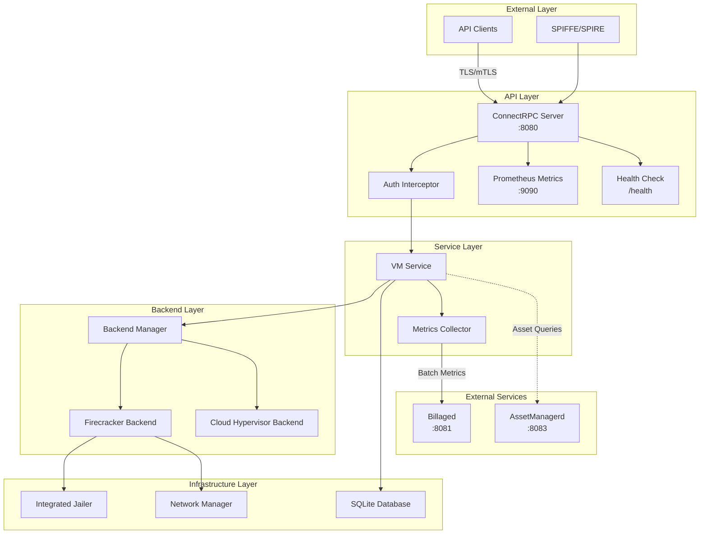
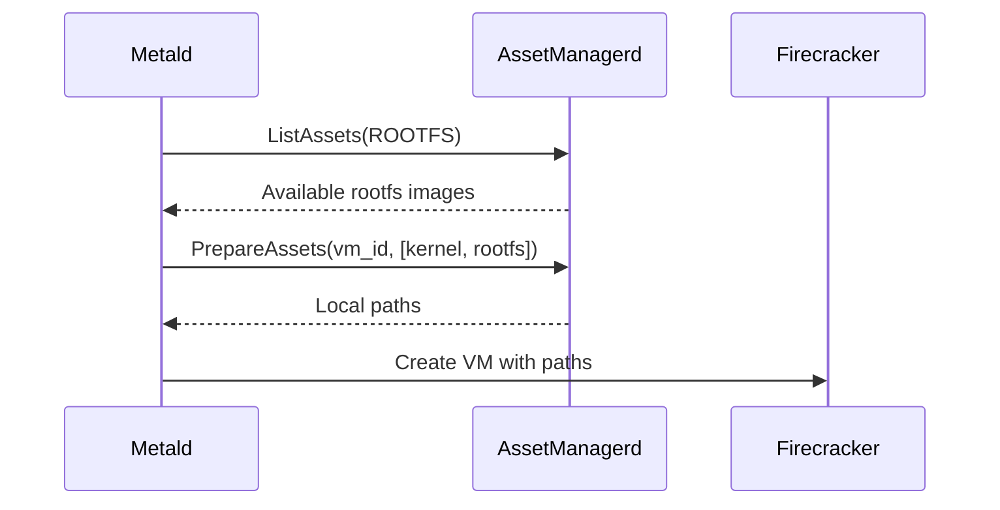
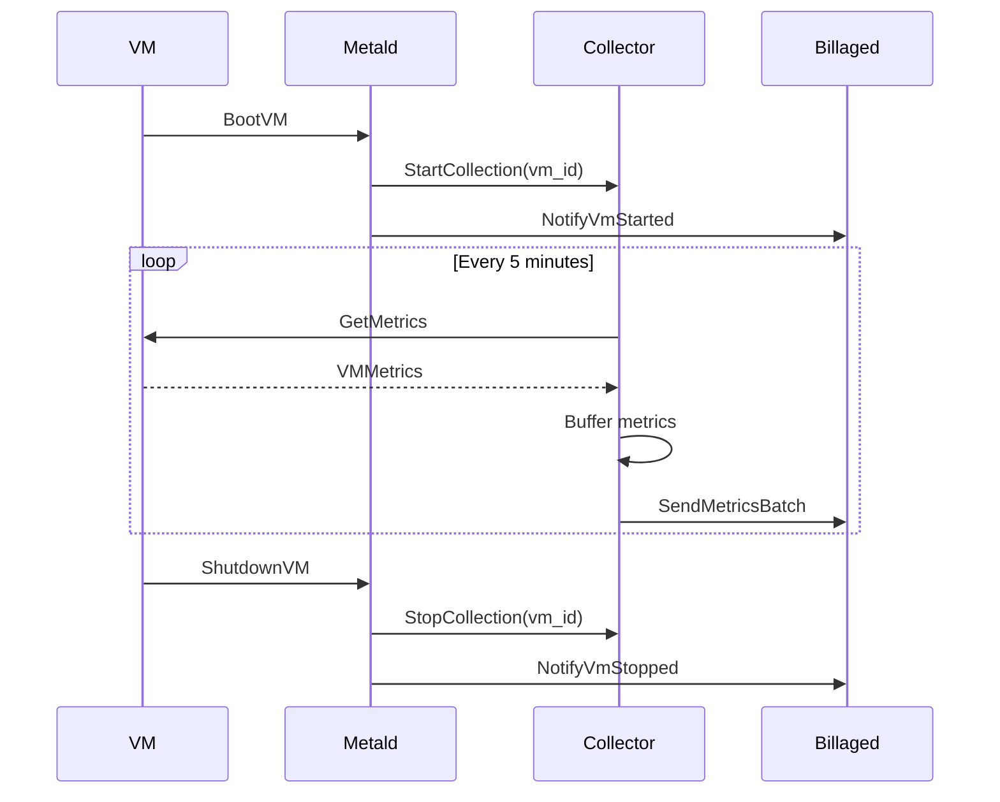
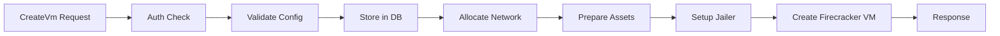
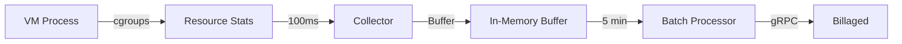
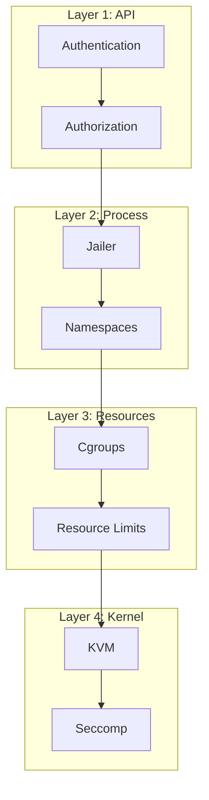

# Metald Architecture & Dependencies

This document describes the internal architecture of metald and its interactions with external services.

## Table of Contents

- [System Architecture](#system-architecture)
- [Component Overview](#component-overview)
- [Service Dependencies](#service-dependencies)
- [Data Flow](#data-flow)
- [Backend Architecture](#backend-architecture)
- [Network Architecture](#network-architecture)
- [Security Architecture](#security-architecture)

## System Architecture



## Component Overview

### API Layer

#### ConnectRPC Server
- **Location**: [main.go:398-441](../../../metald/cmd/api/main.go#L398-L441)
- **Purpose**: HTTP/2 server with optional TLS/mTLS support
- **Features**:
  - Request/response compression
  - OpenTelemetry instrumentation
  - Customer authentication middleware

#### Authentication Interceptor
- **Location**: [auth.go:42-72](../../../metald/internal/service/auth.go#L42-L72)
- **Purpose**: Extract and validate customer ID from Authorization header
- **Implementation**:
  ```go
  // Bearer token format: "Bearer dev_customer_{customer_id}"
  func authInterceptor() connect.UnaryInterceptorFunc {
      return func(next connect.UnaryFunc) connect.UnaryFunc {
          return func(ctx context.Context, req connect.AnyRequest) (connect.AnyResponse, error) {
              customerID, err := extractCustomerFromAuth(req.Header())
              if err != nil {
                  return nil, connect.NewError(connect.CodeUnauthenticated, err)
              }
              ctx = context.WithValue(ctx, customerIDKey, customerID)
              return next(ctx, req)
          }
      }
  }
  ```

### Service Layer

#### VM Service
- **Location**: [vm.go:25-33](../../../metald/internal/service/vm.go#L25-L33)
- **Responsibilities**:
  - VM lifecycle operations
  - Configuration validation
  - State persistence
  - Metrics recording
- **Dependencies**:
  - Backend interface for hypervisor operations
  - Database repository for state management
  - Billing collector for usage tracking

#### Metrics Collector
- **Location**: [collector.go:51-63](../../../metald/internal/billing/collector.go#L51-L63)
- **Purpose**: Collect high-frequency VM metrics for billing
- **Features**:
  - 5-minute collection intervals
  - Batch transmission to billaged
  - Gap detection and recovery

### Backend Layer

#### Backend Interface
- **Location**: [backend.go:11-45](../../../metald/internal/backend/types/backend.go#L11-L45)
- **Definition**:
  ```go
  type Backend interface {
      Initialize() error
      CreateVM(ctx context.Context, config *metaldv1.VmConfig) (string, error)
      DeleteVM(ctx context.Context, vmID string) error
      BootVM(ctx context.Context, vmID string) error
      ShutdownVM(ctx context.Context, vmID string) error
      PauseVM(ctx context.Context, vmID string) error
      ResumeVM(ctx context.Context, vmID string) error
      RebootVM(ctx context.Context, vmID string) error
      GetVMInfo(ctx context.Context, vmID string) (*VMInfo, error)
      GetVMMetrics(ctx context.Context, vmID string) (*VMMetrics, error)
  }
  ```

#### Firecracker Backend
- **Location**: [sdk_client_v4.go](../../../metald/internal/backend/firecracker/sdk_client_v4.go)
- **Features**:
  - SDK v4 integration
  - Integrated jailer support
  - Network namespace management
  - TAP device handling

#### Cloud Hypervisor Backend
- **Location**: [client.go](../../../metald/internal/backend/cloudhypervisor/client.go)
- **Status**: Placeholder implementation
- **Future**: Alternative to Firecracker for different workloads

### Infrastructure Layer

#### Integrated Jailer
- **Location**: [jailer.go](../../../metald/internal/jailer/jailer.go)
- **Purpose**: Security isolation for VMs
- **Features**:
  - Chroot environment setup
  - Cgroup resource limits
  - Network namespace creation
  - UID/GID isolation

#### Network Manager
- **Location**: [manager.go](../../../metald/internal/network/manager.go)
- **Responsibilities**:
  - TAP device creation
  - IP address allocation
  - Bridge configuration
  - Namespace management

#### Database Layer
- **Location**: [database.go](../../../metald/internal/database/database.go), [repository.go](../../../metald/internal/database/repository.go)
- **Technology**: SQLite with WAL mode
- **Schema**: [schema.sql](../../../metald/internal/database/schema.sql)
- **Features**:
  - VM state persistence
  - Soft deletes for audit trail
  - Indexed queries by customer

## Service Dependencies

### AssetManagerd Integration

**Client Interface**: [client.go:19-31](../../../metald/internal/assetmanager/client.go#L19-L31)
```go
type Client interface {
    ListAssets(ctx context.Context, assetType assetv1.AssetType, labels map[string]string) ([]*assetv1.Asset, error)
    PrepareAssets(ctx context.Context, assetIDs []string, targetPath string, vmID string) (map[string]string, error)
    AcquireAsset(ctx context.Context, assetID string, vmID string) (string, error)
    ReleaseAsset(ctx context.Context, leaseID string) error
}
```

**Current Implementation**:
- Client is created in [main.go:220-239](../../../metald/cmd/api/main.go#L220-L239)
- Integration points are stubbed but functional

**Intended Flow**:


### Billaged Integration

**Client Interface**: [client.go:19-35](../../../metald/internal/billing/client.go#L19-L35)
```go
type BillingClient interface {
    SendMetricsBatch(ctx context.Context, vmID, customerID string, metrics []*types.VMMetrics) error
    SendHeartbeat(ctx context.Context, instanceID string, activeVMs []string) error
    NotifyVmStarted(ctx context.Context, vmID, customerID string, startTime int64) error
    NotifyVmStopped(ctx context.Context, vmID string, stopTime int64) error
    NotifyPossibleGap(ctx context.Context, vmID string, lastSent, resumeTime int64) error
}
```

**Integration Points**:
1. VM lifecycle notifications:
   - Start: [collector.go:96](../../../metald/internal/billing/collector.go#L96)
   - Stop: [collector.go:165](../../../metald/internal/billing/collector.go#L165)

2. Metrics collection:
   - Collection interval: 5 minutes
   - Batch size: 1 (configurable)
   - Metrics: CPU, memory, disk I/O, network I/O

**Data Flow**:


## Data Flow

### VM Creation Flow



### Metrics Collection Flow



## Backend Architecture

### Firecracker Integration

The Firecracker backend uses SDK v4 with integrated jailer support:

1. **VM Creation**:
   - Allocate unique VM ID
   - Create jailer chroot environment
   - Copy kernel and rootfs to chroot
   - Configure network in namespace
   - Start Firecracker process

2. **Network Setup**:
   - Create TAP device in host namespace
   - Move TAP to VM network namespace
   - Configure bridge connectivity
   - Set up iptables rules

3. **Resource Isolation**:
   - CPU: cgroup cpu controller
   - Memory: cgroup memory controller
   - Disk I/O: cgroup blkio controller
   - Network: TC rate limiting

### State Management

VM state transitions managed in [repository.go](../../../metald/internal/database/repository.go):

```
CREATED -> RUNNING -> PAUSED -> RUNNING -> SHUTDOWN -> (deleted)
```

Each state change:
1. Validates current state
2. Performs backend operation
3. Updates database
4. Notifies billing service

## Network Architecture

### Dual-Stack Support

Metald supports both IPv4 and IPv6 networking:

- **IPv4**: Default subnet 10.100.0.0/16
- **IPv6**: Default subnet fd00::/64
- **Bridge**: metald0 with both stacks
- **DHCP/SLAAC**: Automatic configuration

### TAP Device Management

Each VM gets a unique TAP device:
1. Created in root namespace
2. Moved to VM's network namespace
3. Connected to bridge
4. Configured with rate limiting

## Security Architecture

### Multi-Tenant Isolation

1. **API Level**: Customer ID validation
2. **Process Level**: Jailer with unique UID/GID
3. **Filesystem Level**: Chroot per VM
4. **Network Level**: Network namespaces
5. **Resource Level**: Cgroup limits

### Defense in Depth



### TLS/mTLS Support

Optional TLS modes configured in [config.go:164-181](../../../metald/internal/config/config.go#L164-L181):
- `disabled`: No TLS (development only)
- `file`: Certificate from files
- `spiffe`: SPIFFE/SPIRE integration

## Performance Considerations

### Database Performance
- SQLite with WAL mode for concurrent reads
- Indexed queries on hot paths
- Soft deletes to avoid lock contention

### Network Performance
- Pre-allocated TAP devices pool (future)
- Batch network operations
- Rate limiting at TAP level

### Metrics Performance
- In-memory buffering
- Batch transmission
- Configurable collection intervals