# Billing System Architecture

> Real-time metrics collection and billing aggregation with 100ms precision

## Table of Contents
- [Overview](#overview)
- [Architecture](#architecture)
- [Component Details](#component-details)
- [Metrics Collection](#metrics-collection)
- [Data Processing Pipeline](#data-processing-pipeline)
- [Integration Architecture](#integration-architecture)
- [Reliability & Recovery](#reliability--recovery)
- [Performance Characteristics](#performance-characteristics)
- [Operational Considerations](#operational-considerations)
- [Cross-References](#cross-references)

---

## Overview

The Billing System provides real-time metrics collection from virtual machines with 100ms precision, processing and aggregating billing data for downstream analytics and reporting systems.

### Key Responsibilities
- **Real-time Metrics Collection**: 100ms precision streaming from VM FIFO streams
- **Data Processing**: JSON parsing, validation, and enrichment
- **Batch Aggregation**: Efficient batching for downstream transmission
- **Heartbeat Monitoring**: Health monitoring and failure detection
- **Integration Management**: Communication with billing aggregators and ClickHouse
- **Failure Recovery**: Automatic retry logic and data loss prevention

### Technology Stack
- **Language**: Go 1.21+
- **Data Format**: JSON streaming over FIFO
- **Communication**: HTTP/gRPC for service integration
- **Storage**: In-memory buffering with WAL persistence
- **Observability**: OpenTelemetry tracing and Prometheus metrics

---

## Architecture

### High-Level Billing Architecture

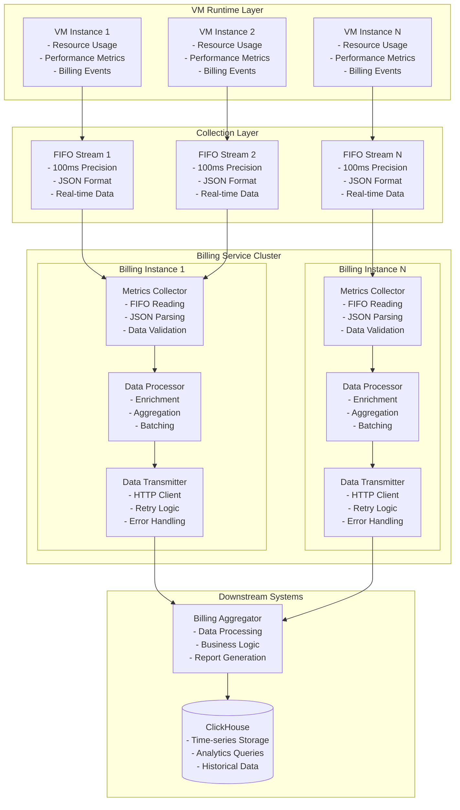

### Data Flow Architecture

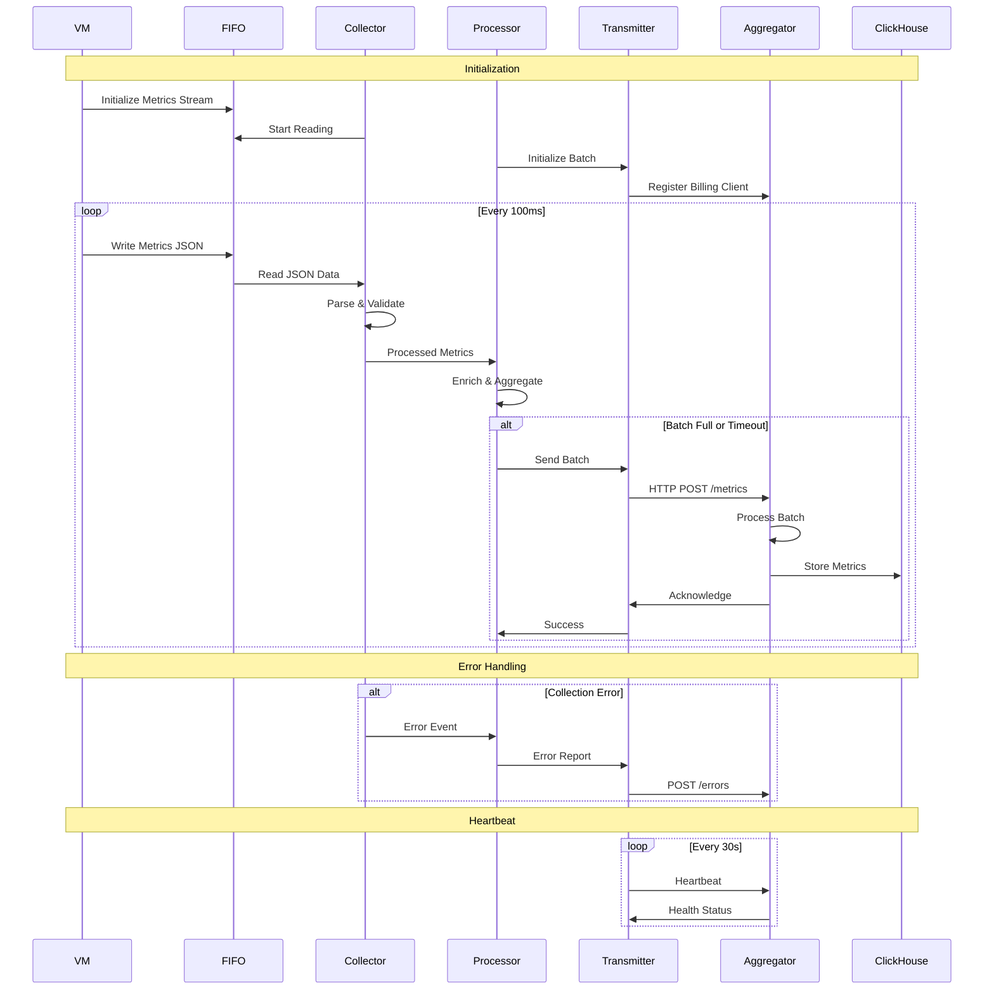

---

## Component Details

### Metrics Collector

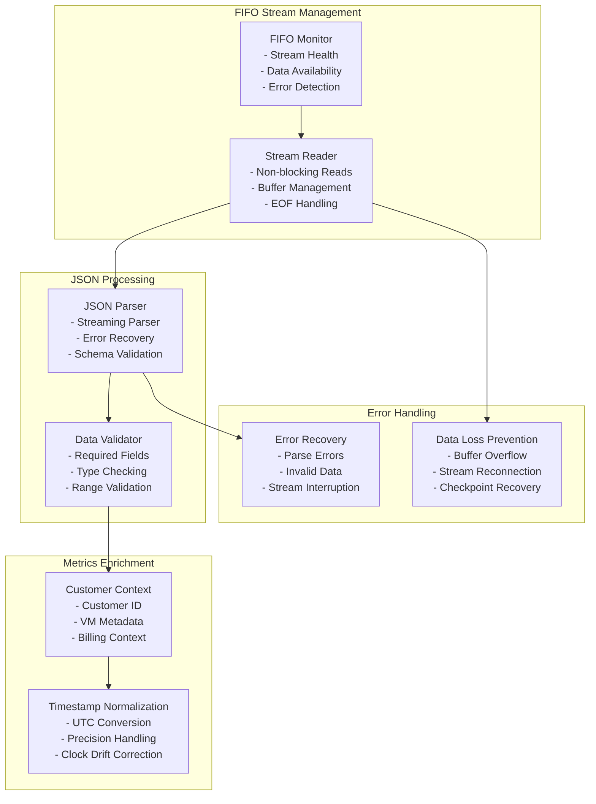

### Data Processor

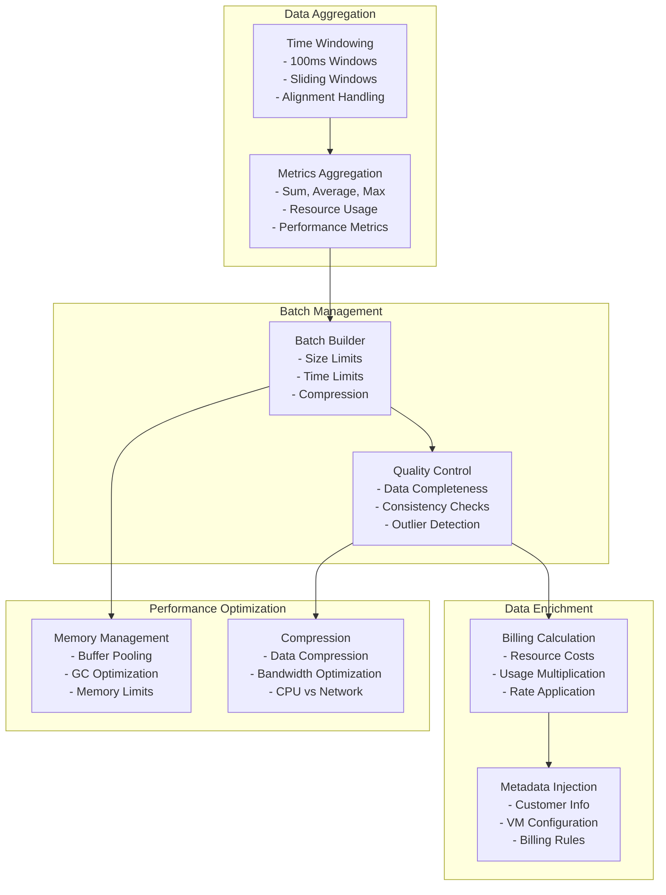

---

## Metrics Collection

### FIFO Stream Processing

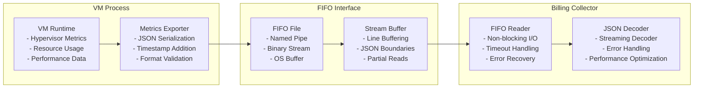

### Metrics Data Format

```json
{
  "timestamp": "2025-06-12T10:30:00.100Z",
  "vm_id": "vm-12345",
  "customer_id": "customer-abc123",
  "metrics": {
    "cpu": {
      "usage_percent": 45.2,
      "cores": 2,
      "cycles": 1234567890
    },
    "memory": {
      "used_bytes": 536870912,
      "total_bytes": 1073741824,
      "cache_bytes": 134217728
    },
    "network": {
      "rx_bytes": 1048576,
      "tx_bytes": 2097152,
      "rx_packets": 1024,
      "tx_packets": 2048
    },
    "disk": {
      "read_bytes": 4194304,
      "write_bytes": 8388608,
      "read_ops": 256,
      "write_ops": 512
    }
  },
  "billing_context": {
    "rate_id": "rate-vm-standard",
    "region": "us-east-1",
    "tier": "standard"
  }
}
```

### Collection Performance Profile

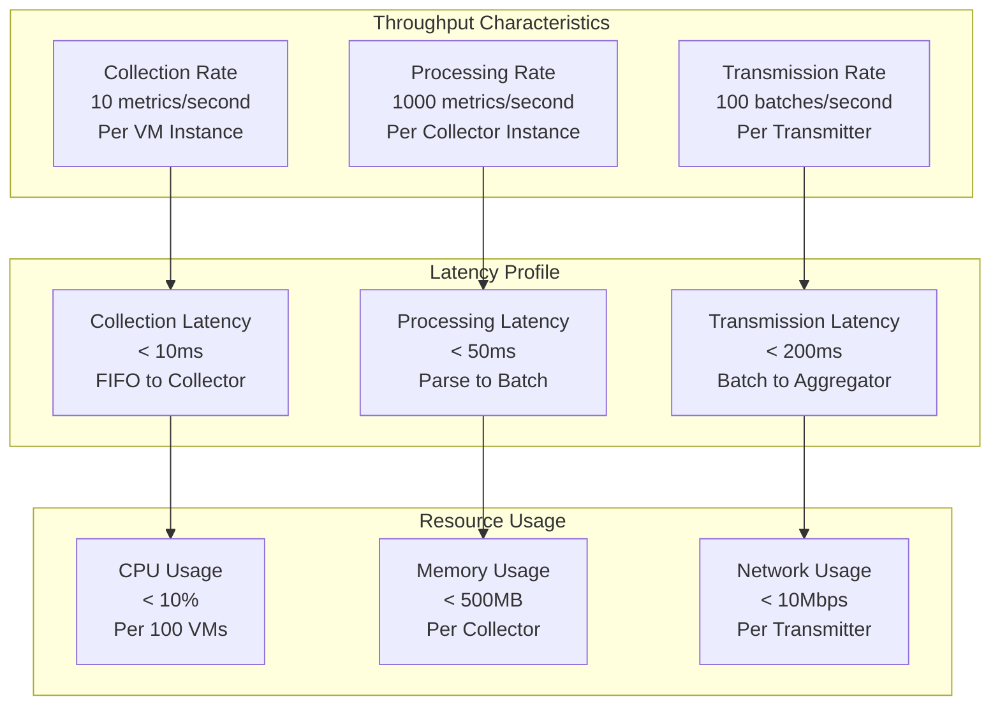

---

## Data Processing Pipeline

### Stream Processing Flow

```mermaid
graph TB
    subgraph "Input Stage"
        RawFIFO[Raw FIFO Data<br/>- JSON Lines<br/>- Timestamps<br/>- Binary Stream]
        ParsedJSON[Parsed JSON<br/>- Structured Data<br/>- Validated Schema<br/>- Type Safety]
    end
    
    subgraph "Validation Stage"
        SchemaCheck[Schema Validation<br/>- Required Fields<br/>- Data Types<br/>- Format Validation]
        BusinessRules[Business Rules<br/>- Value Ranges<br/>- Consistency Checks<br/>- Data Quality]
    end
    
    subgraph "Enrichment Stage"
        CustomerLookup[Customer Lookup<br/>- Customer Metadata<br/>- Billing Context<br/>- Rate Information]
        BillingCalculation[Billing Calculation<br/>- Usage Calculation<br/>- Rate Application<br/>- Cost Computation]
    end
    
    subgraph "Aggregation Stage"
        TimeWindowing[Time Windowing<br/>- 100ms Windows<br/>- Boundary Alignment<br/>- Late Data Handling]
        MetricsRollup[Metrics Rollup<br/>- Statistical Aggregation<br/>- Resource Summation<br/>- Performance Metrics]
    end
    
    subgraph "Output Stage"
        BatchFormation[Batch Formation<br/>- Size Optimization<br/>- Compression<br/>- Format Conversion]
        QualityAssurance[Quality Assurance<br/>- Completeness Check<br/>- Integrity Validation<br/>- Error Detection]
    end
    
    RawFIFO --> ParsedJSON
    ParsedJSON --> SchemaCheck
    SchemaCheck --> BusinessRules
    BusinessRules --> CustomerLookup
    CustomerLookup --> BillingCalculation
    BillingCalculation --> TimeWindowing
    TimeWindowing --> MetricsRollup
    MetricsRollup --> BatchFormation
    BatchFormation --> QualityAssurance
```

### Batch Processing Strategy

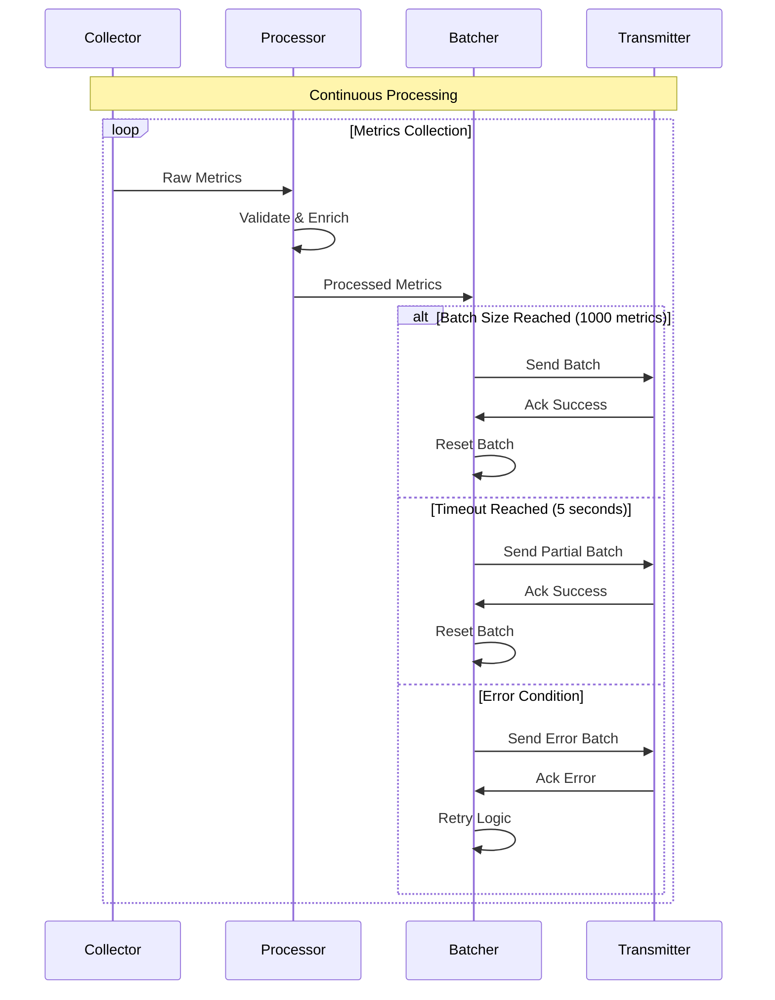

---

## Integration Architecture

### Billing Aggregator Integration

```mermaid
graph TB
    subgraph "Billing Service"
        Transmitter[Data Transmitter<br/>- HTTP Client<br/>- Retry Logic<br/>- Circuit Breaker]
        HeartbeatManager[Heartbeat Manager<br/>- Health Monitoring<br/>- Status Reporting<br/>- Connection Management]
    end
    
    subgraph "Billing Aggregator"
        APIGateway[API Gateway<br/>- Authentication<br/>- Rate Limiting<br/>- Load Balancing]
        MetricsEndpoint[/metrics Endpoint<br/>- Batch Processing<br/>- Validation<br/>- Acknowledgment]
        HealthEndpoint[/health Endpoint<br/>- Service Status<br/>- Dependency Health<br/>- Performance Metrics]
    end
    
    subgraph "Downstream Processing"
        DataProcessor[Data Processor<br/>- Business Logic<br/>- Rate Calculation<br/>- Invoice Generation]
        ClickHouseWriter[ClickHouse Writer<br/>- Batch Insertion<br/>- Schema Management<br/>- Performance Optimization]
    end
    
    Transmitter --> APIGateway
    HeartbeatManager --> APIGateway
    
    APIGateway --> MetricsEndpoint
    APIGateway --> HealthEndpoint
    
    MetricsEndpoint --> DataProcessor
    DataProcessor --> ClickHouseWriter
```

### API Contract Specification

```yaml
# Billing Aggregator API Contract
openapi: 3.0.3
info:
  title: Billing Aggregator API
  version: 1.0.0

paths:
  /v1/metrics:
    post:
      summary: Submit billing metrics batch
      requestBody:
        required: true
        content:
          application/json:
            schema:
              type: object
              properties:
                batch_id:
                  type: string
                  format: uuid
                timestamp:
                  type: string
                  format: date-time
                metrics:
                  type: array
                  items:
                    $ref: '#/components/schemas/MetricRecord'
      responses:
        '200':
          description: Batch accepted
          content:
            application/json:
              schema:
                type: object
                properties:
                  status: 
                    type: string
                    enum: [accepted, partial, rejected]
                  batch_id:
                    type: string
                  processed_count:
                    type: integer
                  error_count:
                    type: integer
        '400':
          description: Invalid batch format
        '429':
          description: Rate limit exceeded
        '500':
          description: Internal server error

  /v1/health:
    get:
      summary: Health check
      responses:
        '200':
          description: Service healthy
          content:
            application/json:
              schema:
                type: object
                properties:
                  status:
                    type: string
                    enum: [healthy, degraded, unhealthy]
                  timestamp:
                    type: string
                    format: date-time
                  dependencies:
                    type: object
                    additionalProperties:
                      type: string

components:
  schemas:
    MetricRecord:
      type: object
      required: [vm_id, customer_id, timestamp, metrics]
      properties:
        vm_id:
          type: string
        customer_id:
          type: string
        timestamp:
          type: string
          format: date-time
        metrics:
          type: object
          properties:
            cpu:
              $ref: '#/components/schemas/CPUMetrics'
            memory:
              $ref: '#/components/schemas/MemoryMetrics'
            network:
              $ref: '#/components/schemas/NetworkMetrics'
            disk:
              $ref: '#/components/schemas/DiskMetrics'
```

### Error Handling Strategy

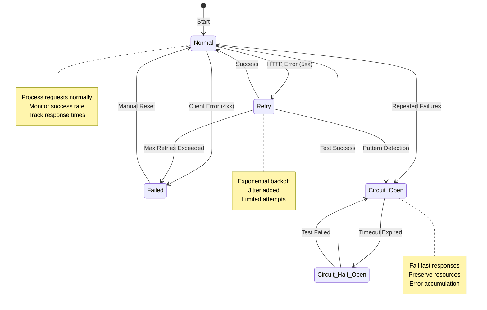

---

## Reliability & Recovery

### Failure Recovery Mechanisms

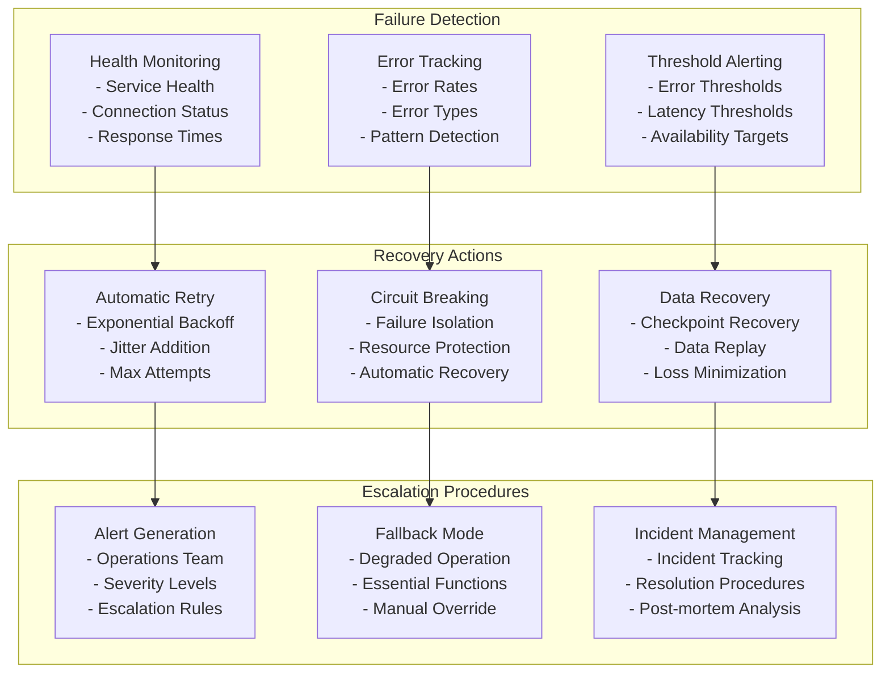

### Data Loss Prevention

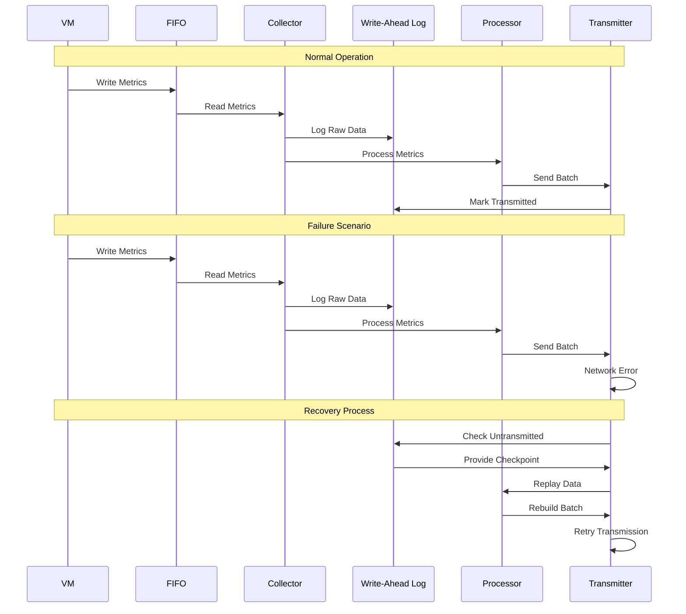

### Heartbeat Monitoring

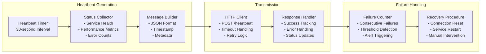

---

## Performance Characteristics

### Throughput Specifications

| Metric | Specification | Notes |
|--------|---------------|--------|
| **VM Metrics Rate** | 10 metrics/second/VM | 100ms precision |
| **Collector Throughput** | 1,000 metrics/second | Per collector instance |
| **Batch Processing** | 100 batches/second | Per processor instance |
| **Transmission Rate** | 50 batches/second | Per transmitter instance |
| **Memory Usage** | 500MB per 1,000 VMs | Including buffers |
| **CPU Overhead** | 5% per 1,000 VMs | Collection + processing |
| **Network Bandwidth** | 10Mbps per 10,000 VMs | Compressed batches |

### Latency Profile

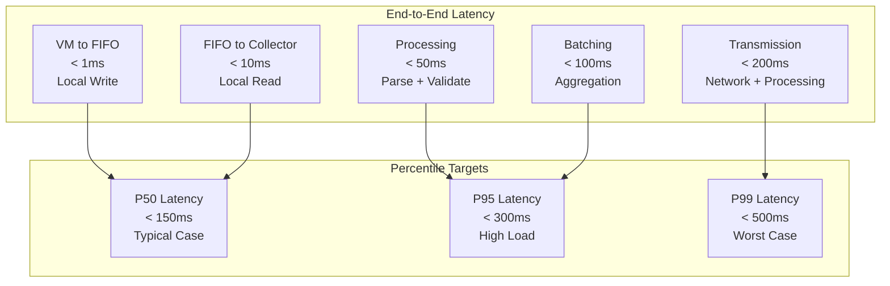

### Scalability Characteristics

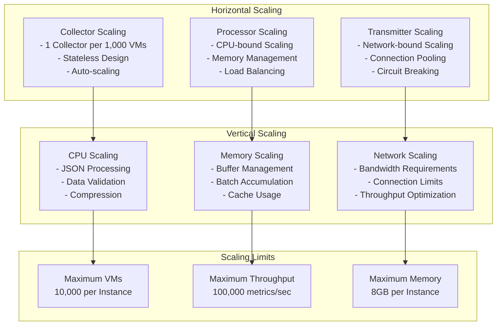

---

## Operational Considerations

### Monitoring & Alerting

```yaml
# Billing System Metrics
metrics:
  # Collection Metrics
  billing_metrics_collected_total:
    type: counter
    description: "Total metrics collected from VMs"
    labels: [vm_id, customer_id, collector_instance]
  
  billing_collection_duration_seconds:
    type: histogram
    description: "Time to collect and process metrics"
    labels: [operation_type, result]
  
  billing_fifo_read_errors_total:
    type: counter
    description: "FIFO read errors"
    labels: [vm_id, error_type]
  
  # Processing Metrics
  billing_batch_size:
    type: histogram
    description: "Size of batches sent to aggregator"
    labels: [batch_type]
  
  billing_processing_lag_seconds:
    type: gauge
    description: "Processing lag behind real-time"
    labels: [processor_instance]
  
  # Transmission Metrics
  billing_batches_sent_total:
    type: counter
    description: "Batches sent to billing aggregator"
    labels: [result, aggregator_endpoint]
  
  billing_transmission_duration_seconds:
    type: histogram
    description: "Time to transmit batch to aggregator"
    labels: [result]
  
  # Heartbeat Metrics
  billing_heartbeat_sent_total:
    type: counter
    description: "Heartbeats sent to aggregator"
    labels: [result]
  
  billing_heartbeat_failures_total:
    type: counter
    description: "Failed heartbeat attempts"
    labels: [failure_reason]

alerts:
  # Collection Alerts
  - alert: BillingCollectionLag
    expr: billing_processing_lag_seconds > 300
    for: 5m
    labels:
      severity: warning
    annotations:
      summary: "Billing collection lag exceeds 5 minutes"
  
  - alert: BillingFIFOErrors
    expr: rate(billing_fifo_read_errors_total[5m]) > 0.1
    for: 2m
    labels:
      severity: critical
    annotations:
      summary: "High rate of FIFO read errors"
  
  # Transmission Alerts
  - alert: BillingTransmissionFailures
    expr: rate(billing_batches_sent_total{result="error"}[5m]) / rate(billing_batches_sent_total[5m]) > 0.05
    for: 5m
    labels:
      severity: warning
    annotations:
      summary: "High billing transmission failure rate"
  
  - alert: BillingHeartbeatFailures
    expr: rate(billing_heartbeat_failures_total[5m]) > 0
    for: 1m
    labels:
      severity: critical
    annotations:
      summary: "Billing service heartbeat failures detected"
```

### Configuration Management

```yaml
# Billing Service Configuration
billing:
  collection:
    fifo_timeout: "1s"
    read_buffer_size: "64KB"
    max_read_size: "1MB"
    poll_interval: "10ms"
    
  processing:
    batch_size: 1000
    batch_timeout: "5s"
    worker_count: 4
    max_memory_mb: 500
    
    validation:
      schema_validation: true
      business_rules: true
      outlier_detection: true
      max_value_ranges:
        cpu_percent: 100
        memory_bytes: "10GB"
        network_mbps: 1000
  
  transmission:
    aggregator_endpoint: "https://billing-aggregator.internal/v1"
    timeout: "30s"
    retry_attempts: 3
    retry_backoff: "1s"
    max_retry_backoff: "30s"
    
    circuit_breaker:
      failure_threshold: 5
      recovery_timeout: "60s"
      half_open_requests: 3
    
    compression:
      enabled: true
      algorithm: "gzip"
      level: 6
  
  heartbeat:
    interval: "30s"
    timeout: "10s"
    endpoint: "/v1/heartbeat"
    failure_threshold: 3
  
  observability:
    metrics_enabled: true
    tracing_enabled: true
    log_level: "info"
    
    sampling:
      trace_ratio: 0.1
      error_traces: 1.0
      slow_requests: 1.0
```

### Capacity Planning

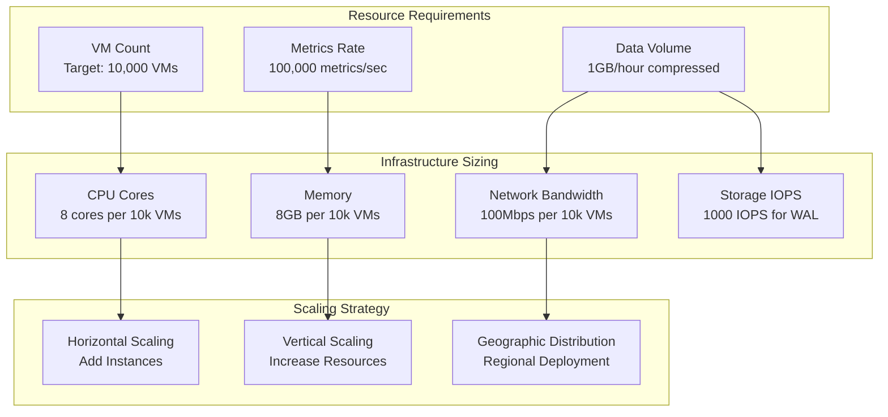

---

## Cross-References

### Architecture Documentation
- **[System Architecture Overview](../overview.md)** - Complete system design
- **[Metald Architecture](metald.md)** - VM management integration
- **[ClickHouse Architecture](clickhouse.md)** - Data storage integration

### API Documentation
- **[API Reference](../../api/reference.md)** - Complete API documentation
- **[Configuration Guide](../../api/configuration.md)** - Configuration options

### Operational Documentation
- **[Production Deployment](../../deployment/production.md)** - Deployment procedures
- **[Monitoring Setup](../../deployment/monitoring-setup.md)** - Observability setup
- **[Reliability Guide](../../operations/reliability.md)** - Operational procedures

### Development Documentation
- **[Testing Guide](../../development/testing/stress-testing.md)** - Load testing procedures
- **[Contribution Guide](../../development/contribution-guide.md)** - Development setup

---

*Last updated: 2025-06-12 | Next review: Billing Architecture Review*