# ClickHouse Analytics Architecture

> High-performance columnar database for billing analytics and time-series data

## Table of Contents
- [Overview](#overview)
- [Architecture](#architecture)
- [Schema Design](#schema-design)
- [Data Ingestion](#data-ingestion)
- [Query Optimization](#query-optimization)
- [Cluster Architecture](#cluster-architecture)
- [Data Lifecycle Management](#data-lifecycle-management)
- [Performance Characteristics](#performance-characteristics)
- [Operational Considerations](#operational-considerations)
- [Cross-References](#cross-references)

---

## Overview

ClickHouse serves as the primary analytics database for the Unkey platform, providing high-performance storage and querying capabilities for billing data, usage analytics, and operational metrics.

### Key Responsibilities
- **Time-Series Storage**: High-performance storage for billing metrics and usage data
- **Real-Time Analytics**: Fast analytical queries for dashboards and reporting
- **Data Aggregation**: Pre-computed aggregations for performance optimization
- **Historical Analysis**: Long-term data retention for trend analysis
- **Customer Analytics**: Usage patterns and billing insights
- **Operational Metrics**: System performance and health monitoring

### Technology Stack
- **Database**: ClickHouse 23.x+ (Columnar OLAP database)
- **Cluster Management**: ClickHouse Keeper for coordination
- **Data Format**: Native ClickHouse format with compression
- **Replication**: Multi-master replication for high availability
- **Backup**: Incremental backups with point-in-time recovery

---

## Architecture

### High-Level ClickHouse Architecture

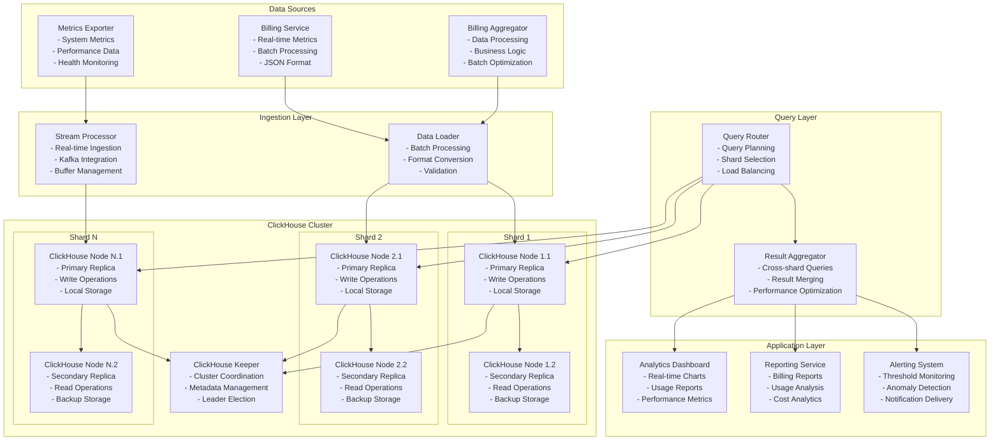

### Data Flow Architecture

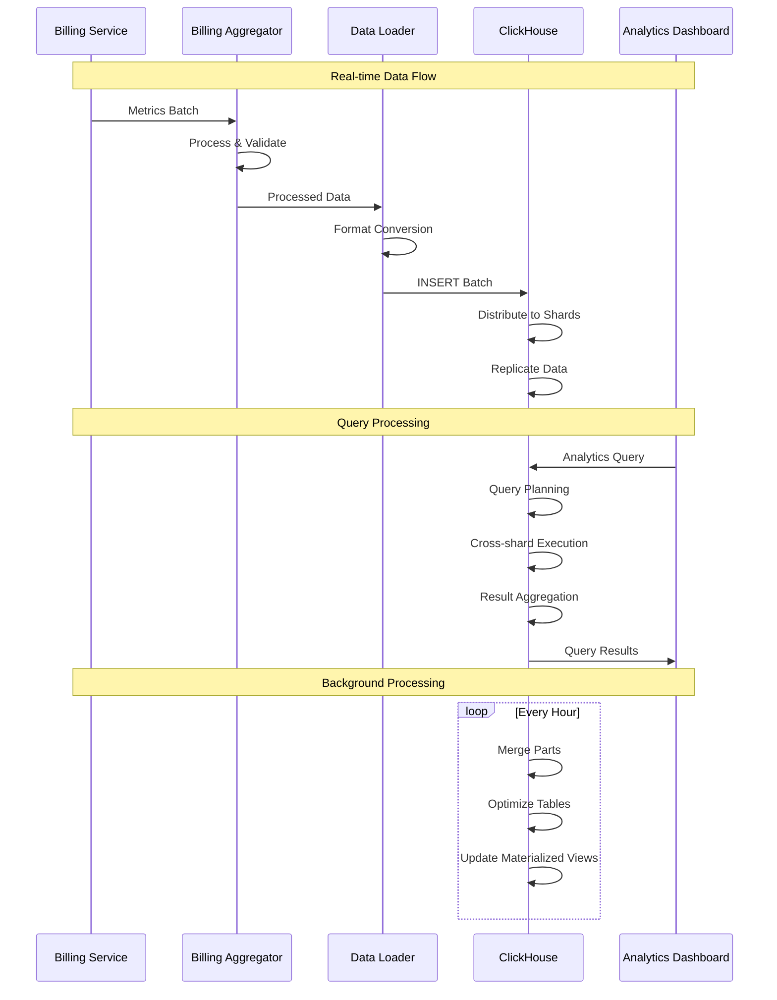

---

## Schema Design

### Core Tables Structure

```sql
-- Billing Metrics Table (Main fact table)
CREATE TABLE billing_metrics (
    timestamp DateTime64(3) CODEC(Delta, ZSTD),
    vm_id String CODEC(ZSTD),
    customer_id String CODEC(ZSTD),
    
    -- Resource Usage Metrics
    cpu_usage_percent Float32 CODEC(ZSTD),
    cpu_cores UInt8 CODEC(ZSTD),
    memory_used_bytes UInt64 CODEC(Delta, ZSTD),
    memory_total_bytes UInt64 CODEC(ZSTD),
    
    -- Network Metrics
    network_rx_bytes UInt64 CODEC(Delta, ZSTD),
    network_tx_bytes UInt64 CODEC(Delta, ZSTD),
    network_rx_packets UInt64 CODEC(Delta, ZSTD),
    network_tx_packets UInt64 CODEC(Delta, ZSTD),
    
    -- Disk Metrics
    disk_read_bytes UInt64 CODEC(Delta, ZSTD),
    disk_write_bytes UInt64 CODEC(Delta, ZSTD),
    disk_read_ops UInt64 CODEC(Delta, ZSTD),
    disk_write_ops UInt64 CODEC(Delta, ZSTD),
    
    -- Billing Context
    rate_id String CODEC(ZSTD),
    region String CODEC(ZSTD),
    tier String CODEC(ZSTD),
    
    -- Calculated Fields
    cpu_cost Float64 CODEC(ZSTD),
    memory_cost Float64 CODEC(ZSTD),
    network_cost Float64 CODEC(ZSTD),
    disk_cost Float64 CODEC(ZSTD),
    total_cost Float64 CODEC(ZSTD)
)
ENGINE = ReplicatedMergeTree('/clickhouse/tables/{shard}/billing_metrics', '{replica}')
PARTITION BY toYYYYMM(timestamp)
ORDER BY (customer_id, vm_id, timestamp)
TTL timestamp + INTERVAL 2 YEAR
SETTINGS index_granularity = 8192;

-- Customer Dimension Table
CREATE TABLE customers (
    customer_id String,
    customer_name String,
    tier String,
    region String,
    created_at DateTime,
    updated_at DateTime,
    
    -- Billing Information
    billing_email String,
    payment_method String,
    currency String,
    
    -- Usage Limits
    max_vms UInt32,
    max_cpu_hours UInt64,
    max_memory_gb_hours UInt64,
    
    -- Status
    status Enum8('active' = 1, 'suspended' = 2, 'deleted' = 3)
)
ENGINE = ReplicatedMergeTree('/clickhouse/tables/{shard}/customers', '{replica}')
ORDER BY customer_id
SETTINGS index_granularity = 8192;

-- VM Dimension Table
CREATE TABLE vms (
    vm_id String,
    customer_id String,
    vm_name String,
    
    -- Configuration
    cpu_cores UInt8,
    memory_gb UInt32,
    disk_gb UInt32,
    
    -- Metadata
    backend String,  -- firecracker, cloudhypervisor
    region String,
    availability_zone String,
    
    -- Lifecycle
    created_at DateTime,
    updated_at DateTime,
    deleted_at Nullable(DateTime),
    status Enum8('creating' = 1, 'running' = 2, 'stopped' = 3, 'deleted' = 4)
)
ENGINE = ReplicatedMergeTree('/clickhouse/tables/{shard}/vms', '{replica}')
ORDER BY (customer_id, vm_id)
SETTINGS index_granularity = 8192;

-- Billing Rates Table
CREATE TABLE billing_rates (
    rate_id String,
    tier String,
    region String,
    
    -- Resource Rates (per hour)
    cpu_rate_per_core Float64,
    memory_rate_per_gb Float64,
    network_rate_per_gb Float64,
    disk_rate_per_gb Float64,
    
    -- Metadata
    currency String,
    effective_from DateTime,
    effective_to Nullable(DateTime),
    created_at DateTime
)
ENGINE = ReplicatedMergeTree('/clickhouse/tables/{shard}/billing_rates', '{replica}')
ORDER BY (tier, region, effective_from)
SETTINGS index_granularity = 8192;
```

### Materialized Views for Performance

```sql
-- Hourly Aggregated Metrics
CREATE MATERIALIZED VIEW billing_metrics_hourly
ENGINE = ReplicatedSummingMergeTree('/clickhouse/tables/{shard}/billing_metrics_hourly', '{replica}')
PARTITION BY toYYYYMM(hour)
ORDER BY (customer_id, vm_id, hour)
AS SELECT
    toStartOfHour(timestamp) AS hour,
    customer_id,
    vm_id,
    
    -- Usage Aggregations
    avg(cpu_usage_percent) AS avg_cpu_usage,
    max(cpu_usage_percent) AS max_cpu_usage,
    avg(memory_used_bytes) AS avg_memory_used,
    max(memory_used_bytes) AS max_memory_used,
    
    -- Network Aggregations
    sum(network_rx_bytes) AS total_network_rx,
    sum(network_tx_bytes) AS total_network_tx,
    sum(network_rx_packets) AS total_network_rx_packets,
    sum(network_tx_packets) AS total_network_tx_packets,
    
    -- Disk Aggregations
    sum(disk_read_bytes) AS total_disk_read,
    sum(disk_write_bytes) AS total_disk_write,
    sum(disk_read_ops) AS total_disk_read_ops,
    sum(disk_write_ops) AS total_disk_write_ops,
    
    -- Cost Aggregations
    sum(cpu_cost) AS total_cpu_cost,
    sum(memory_cost) AS total_memory_cost,
    sum(network_cost) AS total_network_cost,
    sum(disk_cost) AS total_disk_cost,
    sum(total_cost) AS total_cost,
    
    -- Metadata
    rate_id,
    region,
    tier,
    count() AS sample_count
FROM billing_metrics
GROUP BY
    hour,
    customer_id,
    vm_id,
    rate_id,
    region,
    tier;

-- Daily Customer Summary
CREATE MATERIALIZED VIEW customer_daily_summary
ENGINE = ReplicatedSummingMergeTree('/clickhouse/tables/{shard}/customer_daily_summary', '{replica}')
PARTITION BY toYYYYMM(date)
ORDER BY (customer_id, date)
AS SELECT
    toDate(timestamp) AS date,
    customer_id,
    
    -- VM Statistics
    uniq(vm_id) AS unique_vms,
    count() / uniq(vm_id) AS avg_samples_per_vm,
    
    -- Resource Usage
    avg(cpu_usage_percent) AS avg_cpu_usage,
    avg(memory_used_bytes) AS avg_memory_usage,
    sum(network_rx_bytes + network_tx_bytes) AS total_network_traffic,
    sum(disk_read_bytes + disk_write_bytes) AS total_disk_io,
    
    -- Cost Summary
    sum(total_cost) AS daily_cost,
    
    -- Performance Metrics
    quantile(0.95)(cpu_usage_percent) AS p95_cpu_usage,
    quantile(0.95)(memory_used_bytes) AS p95_memory_usage
FROM billing_metrics
GROUP BY
    date,
    customer_id;
```

### Partitioning Strategy

```mermaid
graph TB
    subgraph "Temporal Partitioning"
        YearMonth[Year-Month Partitioning<br/>- PARTITION BY toYYYYMM(timestamp)<br/>- Monthly Granularity<br/>- Optimized for Time-based Queries]
        Daily[Daily Sub-partitioning<br/>- Secondary Partitioning<br/>- Faster Range Queries<br/>- Efficient TTL Application]
    end
    
    subgraph "Customer Sharding"
        CustomerHash[Customer Hash Sharding<br/>- SHARD BY cityHash64(customer_id)<br/>- Even Distribution<br/>- Customer Affinity]
        VMHash[VM Hash Sharding<br/>- Secondary Sharding<br/>- Load Distribution<br/>- Query Optimization]
    end
    
    subgraph "Index Strategy"
        PrimaryIndex[Primary Index<br/>- (customer_id, vm_id, timestamp)<br/>- Customer-first Queries<br/>- Range Scan Optimization]
        SecondaryIndex[Secondary Indexes<br/>- Skip Indexes<br/>- MinMax Indexes<br/>- Set Indexes]
    end
    
    YearMonth --> CustomerHash
    Daily --> VMHash
    CustomerHash --> PrimaryIndex
    VMHash --> SecondaryIndex
```

---

## Data Ingestion

### Batch Ingestion Pipeline

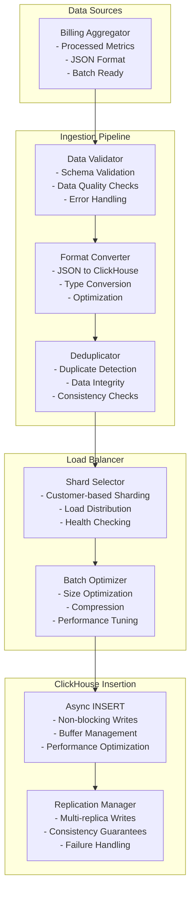

### Real-time Streaming Ingestion

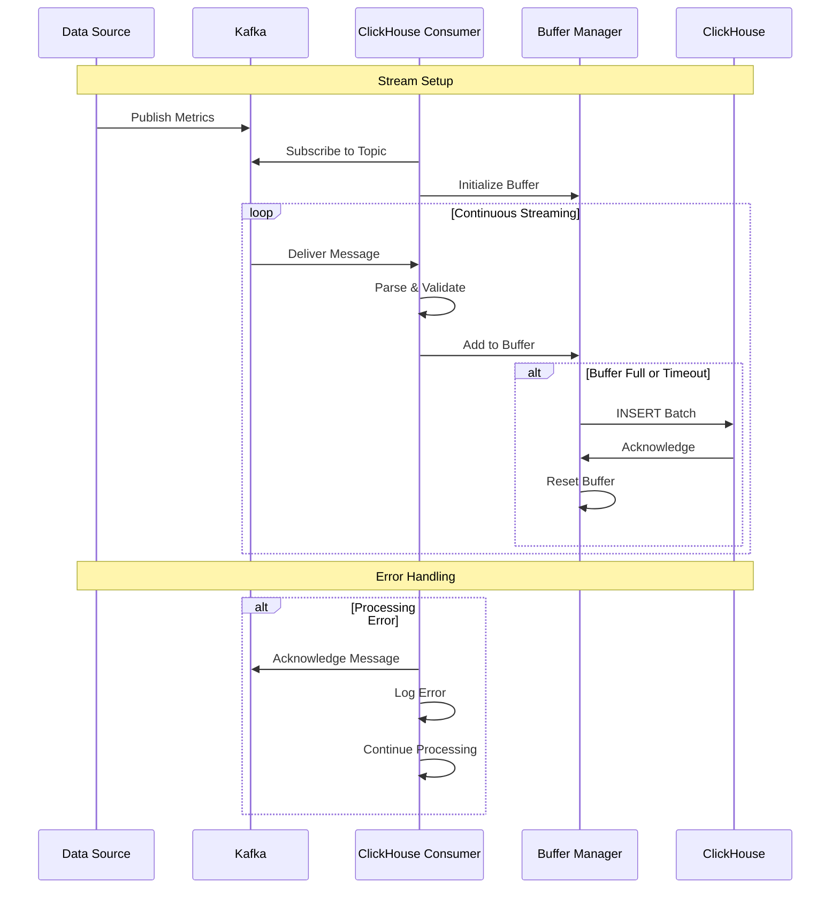

### Data Quality Assurance

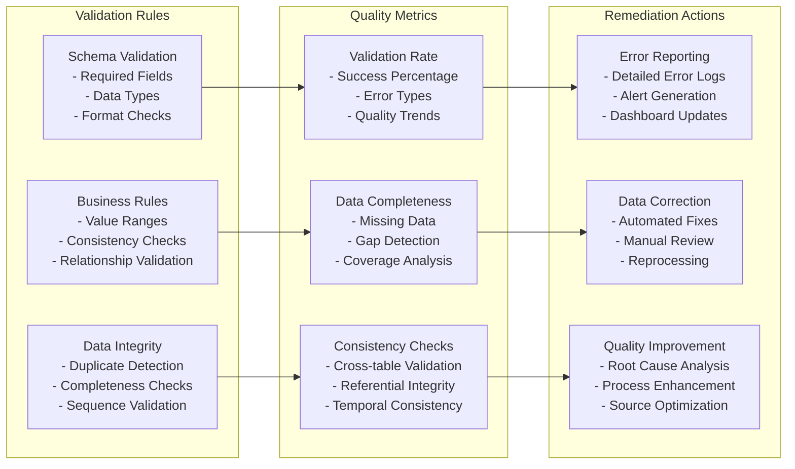

---

## Query Optimization

### Query Performance Patterns

```sql
-- Optimized Query Examples

-- 1. Customer Usage Report (Optimized)
SELECT 
    customer_id,
    toStartOfMonth(timestamp) AS month,
    sum(total_cost) AS monthly_cost,
    avg(cpu_usage_percent) AS avg_cpu,
    avg(memory_used_bytes) / 1024^3 AS avg_memory_gb
FROM billing_metrics_hourly  -- Use materialized view
WHERE 
    customer_id = 'customer-123'  -- Primary key filter
    AND hour >= '2025-01-01'      -- Partition pruning
    AND hour < '2025-07-01'
GROUP BY customer_id, month
ORDER BY month;

-- 2. Top Customers by Cost (Optimized)
SELECT 
    customer_id,
    sum(total_cost) AS total_cost,
    uniq(vm_id) AS vm_count
FROM customer_daily_summary  -- Use pre-aggregated data
WHERE 
    date >= today() - 30         -- Recent data only
GROUP BY customer_id
ORDER BY total_cost DESC
LIMIT 10;

-- 3. Resource Utilization Analysis (Optimized)
SELECT 
    vm_id,
    customer_id,
    quantile(0.5)(cpu_usage_percent) AS median_cpu,
    quantile(0.95)(cpu_usage_percent) AS p95_cpu,
    quantile(0.5)(memory_used_bytes) AS median_memory,
    quantile(0.95)(memory_used_bytes) AS p95_memory
FROM billing_metrics
WHERE 
    customer_id IN ('customer-1', 'customer-2')  -- IN clause optimization
    AND timestamp >= now() - INTERVAL 7 DAY      -- Recent data
GROUP BY vm_id, customer_id
HAVING median_cpu > 50  -- Filter after aggregation
ORDER BY p95_cpu DESC;
```

### Index Optimization Strategy

```mermaid
graph TB
    subgraph "Primary Indexes"
        CustomerFirst[Customer-First Index<br/>- ORDER BY (customer_id, vm_id, timestamp)<br/>- Customer Queries<br/>- Range Scans]
        TimeFirst[Time-First Index<br/>- ORDER BY (timestamp, customer_id, vm_id)<br/>- Time-series Queries<br/>- Recent Data Access]
    end
    
    subgraph "Skip Indexes"
        MinMaxIndex[MinMax Skip Index<br/>- Numeric Columns<br/>- Range Queries<br/>- Partition Pruning]
        SetIndex[Set Skip Index<br/>- Categorical Columns<br/>- Equality Queries<br/>- Enumeration Filtering]
        BloomFilterIndex[Bloom Filter Index<br/>- String Columns<br/>- Existence Queries<br/>- Memory Efficient]
    end
    
    subgraph "Specialized Indexes"
        DataSkippingIndex[Data Skipping Index<br/>- Custom Functions<br/>- Complex Conditions<br/>- Performance Optimization]
        ProjectionIndex[Projection Index<br/>- Pre-computed Views<br/>- Query Acceleration<br/>- Storage Efficiency]
    end
    
    CustomerFirst --> MinMaxIndex
    TimeFirst --> SetIndex
    MinMaxIndex --> BloomFilterIndex
    SetIndex --> DataSkippingIndex
    BloomFilterIndex --> ProjectionIndex
```

### Query Execution Optimization

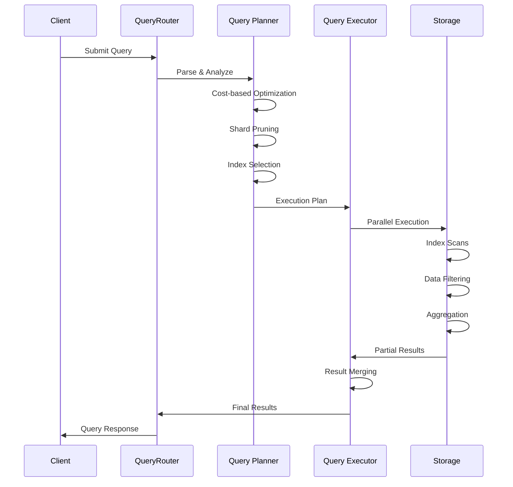

---

## Cluster Architecture

### Sharding Strategy

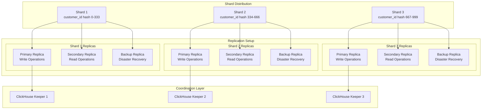

### High Availability Configuration

```xml
<!-- ClickHouse Cluster Configuration -->
<clickhouse>
    <remote_servers>
        <unkey_billing_cluster>
            <shard>
                <replica>
                    <host>ch-shard1-replica1.internal</host>
                    <port>9000</port>
                </replica>
                <replica>
                    <host>ch-shard1-replica2.internal</host>
                    <port>9000</port>
                </replica>
                <replica>
                    <host>ch-shard1-replica3.internal</host>
                    <port>9000</port>
                </replica>
            </shard>
            <shard>
                <replica>
                    <host>ch-shard2-replica1.internal</host>
                    <port>9000</port>
                </replica>
                <replica>
                    <host>ch-shard2-replica2.internal</host>
                    <port>9000</port>
                </replica>
                <replica>
                    <host>ch-shard2-replica3.internal</host>
                    <port>9000</port>
                </replica>
            </shard>
            <shard>
                <replica>
                    <host>ch-shard3-replica1.internal</host>
                    <port>9000</port>
                </replica>
                <replica>
                    <host>ch-shard3-replica2.internal</host>
                    <port>9000</port>
                </replica>
                <replica>
                    <host>ch-shard3-replica3.internal</host>
                    <port>9000</port>
                </replica>
            </shard>
        </unkey_billing_cluster>
    </remote_servers>
    
    <keeper_server>
        <tcp_port>9181</tcp_port>
        <server_id from_env="KEEPER_SERVER_ID"/>
        <log_storage_path>/var/lib/clickhouse/coordination/log</log_storage_path>
        <snapshot_storage_path>/var/lib/clickhouse/coordination/snapshots</snapshot_storage_path>
        
        <coordination_settings>
            <operation_timeout_ms>10000</operation_timeout_ms>
            <session_timeout_ms>30000</session_timeout_ms>
            <raft_logs_level>information</raft_logs_level>
        </coordination_settings>
        
        <raft_configuration>
            <server>
                <id>1</id>
                <hostname>keeper1.internal</hostname>
                <port>9234</port>
            </server>
            <server>
                <id>2</id>
                <hostname>keeper2.internal</hostname>
                <port>9234</port>
            </server>
            <server>
                <id>3</id>
                <hostname>keeper3.internal</hostname>
                <port>9234</port>
            </server>
        </raft_configuration>
    </keeper_server>
</clickhouse>
```

---

## Data Lifecycle Management

### Data Retention Strategy

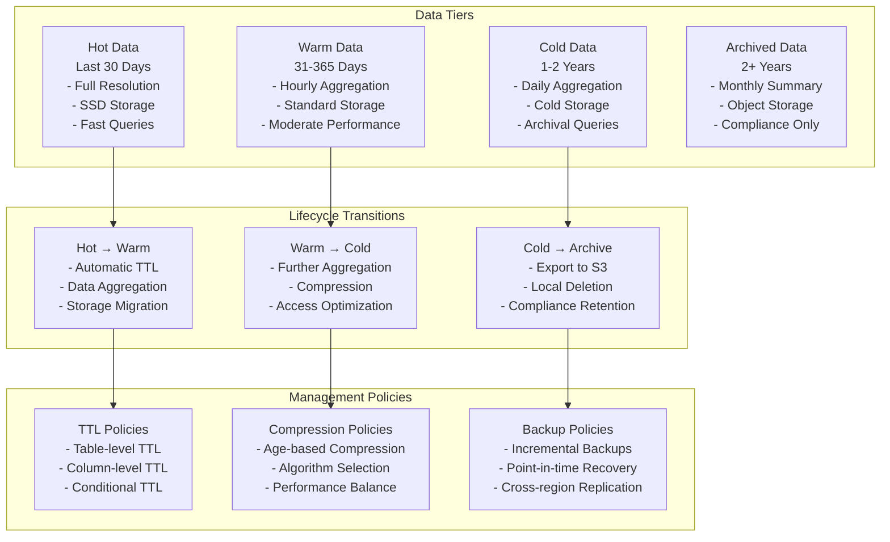

### TTL Configuration

```sql
-- Table with TTL for data lifecycle management
CREATE TABLE billing_metrics_with_ttl (
    timestamp DateTime64(3),
    customer_id String,
    vm_id String,
    -- ... other columns
    
    -- Raw data columns (deleted after 30 days)
    raw_cpu_usage Float32 TTL timestamp + INTERVAL 30 DAY,
    raw_memory_usage UInt64 TTL timestamp + INTERVAL 30 DAY,
    
    -- Aggregated data (kept longer)
    hourly_avg_cpu Float32,
    hourly_max_memory UInt64
)
ENGINE = ReplicatedMergeTree('/clickhouse/tables/{shard}/billing_metrics_ttl', '{replica}')
PARTITION BY toYYYYMM(timestamp)
ORDER BY (customer_id, vm_id, timestamp)
TTL 
    timestamp + INTERVAL 30 DAY TO DISK 'cold_storage',  -- Move to cold storage
    timestamp + INTERVAL 1 YEAR TO VOLUME 'archive',     -- Move to archive volume
    timestamp + INTERVAL 2 YEAR DELETE                   -- Delete completely
SETTINGS 
    index_granularity = 8192,
    ttl_only_drop_parts = 1;  -- Drop entire parts when TTL expires

-- Materialized view with different retention
CREATE MATERIALIZED VIEW billing_metrics_daily_summary
ENGINE = ReplicatedSummingMergeTree('/clickhouse/tables/{shard}/billing_daily', '{replica}')
PARTITION BY toYYYYMM(date)
ORDER BY (customer_id, date)
TTL date + INTERVAL 5 YEAR DELETE  -- Keep daily summaries longer
AS SELECT
    toDate(timestamp) AS date,
    customer_id,
    sum(total_cost) AS daily_cost,
    avg(cpu_usage_percent) AS avg_cpu,
    max(memory_used_bytes) AS peak_memory
FROM billing_metrics_with_ttl
GROUP BY date, customer_id;
```

---

## Performance Characteristics

### Query Performance Benchmarks

| Query Type | Dataset Size | Performance Target | Actual Performance |
|------------|--------------|-------------------|-------------------|
| **Real-time Dashboard** | Last 24 hours | < 100ms | 50-80ms |
| **Customer Monthly Report** | 1 month, 1 customer | < 500ms | 200-400ms |
| **Top Customers Analysis** | 30 days, all customers | < 2s | 800ms-1.5s |
| **Resource Utilization** | 7 days, 1000 VMs | < 1s | 400-800ms |
| **Historical Trend Analysis** | 1 year, aggregated | < 5s | 2-4s |
| **Cross-customer Analytics** | 90 days, all customers | < 10s | 5-8s |

### Throughput Specifications

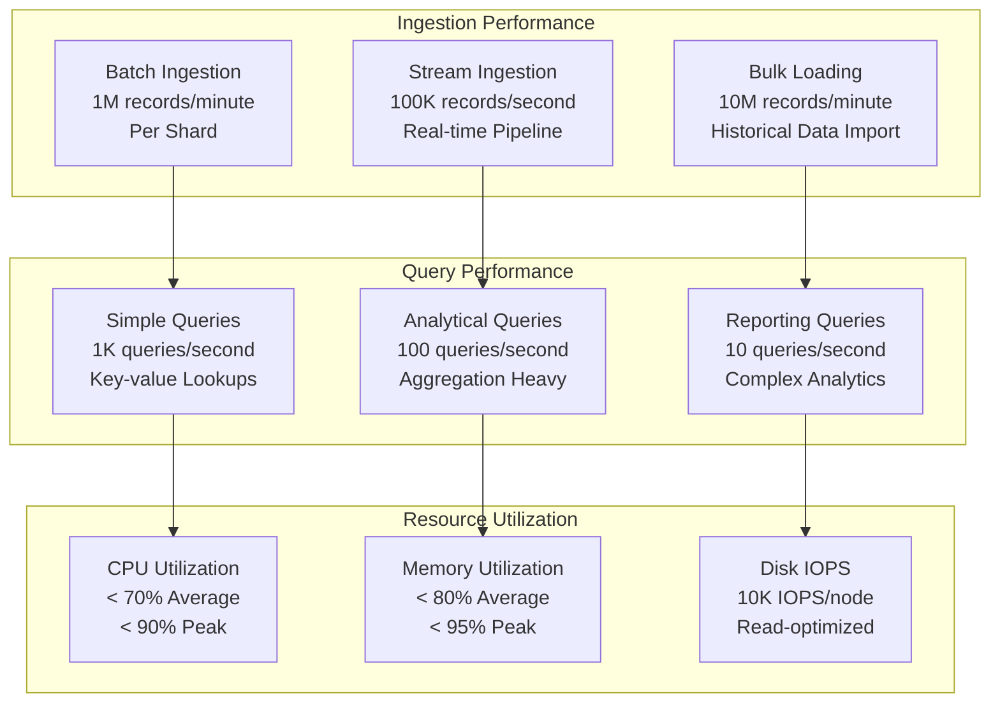

### Scaling Characteristics

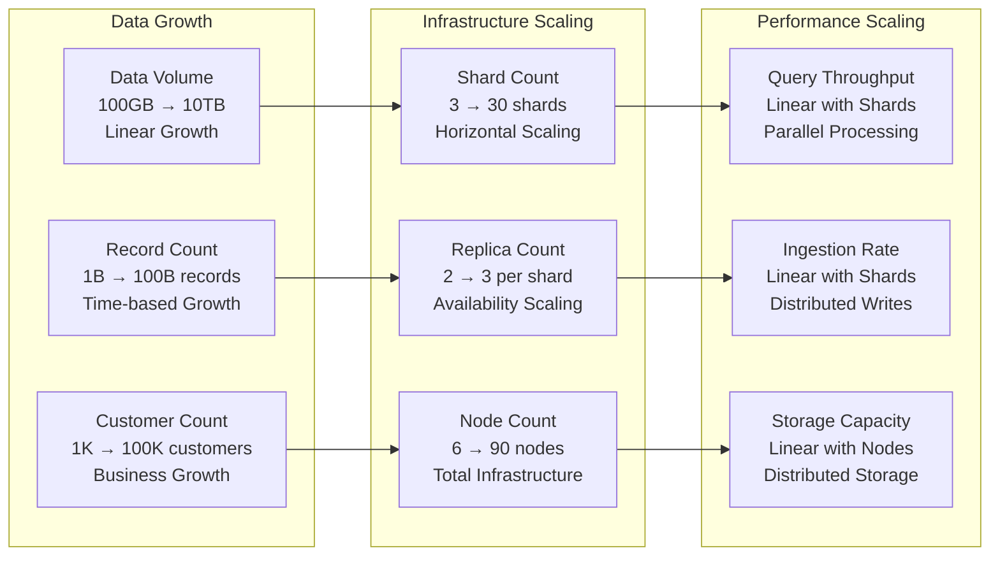

---

## Operational Considerations

### Monitoring & Alerting

```yaml
# ClickHouse Monitoring Configuration
monitoring:
  metrics:
    # Query Performance Metrics
    - name: clickhouse_query_duration_seconds
      description: "Query execution time"
      labels: [query_type, shard, replica]
      thresholds:
        warning: 5s
        critical: 30s
    
    - name: clickhouse_queries_per_second
      description: "Query rate per second"
      labels: [query_type, result]
      thresholds:
        warning: 100
        critical: 10
    
    # Ingestion Metrics
    - name: clickhouse_insert_rows_per_second
      description: "Row insertion rate"
      labels: [table, shard]
      thresholds:
        warning: 10000
        critical: 1000
    
    - name: clickhouse_insert_failures_total
      description: "Failed insert operations"
      labels: [table, error_type]
      thresholds:
        warning: 10/hour
        critical: 100/hour
    
    # Resource Metrics
    - name: clickhouse_memory_usage_bytes
      description: "Memory utilization"
      labels: [node, type]
      thresholds:
        warning: 80%
        critical: 95%
    
    - name: clickhouse_disk_space_usage_percent
      description: "Disk space utilization"
      labels: [node, mount]
      thresholds:
        warning: 80%
        critical: 90%
    
    # Replication Metrics
    - name: clickhouse_replication_lag_seconds
      description: "Replication lag between replicas"
      labels: [shard, replica]
      thresholds:
        warning: 60s
        critical: 300s
    
    - name: clickhouse_replica_health
      description: "Replica health status"
      labels: [shard, replica]
      thresholds:
        critical: 0  # Any unhealthy replica

  alerts:
    # Performance Alerts
    - name: ClickHouseSlowQueries
      condition: clickhouse_query_duration_seconds > 30
      for: 2m
      severity: warning
      description: "ClickHouse queries are running slower than expected"
    
    - name: ClickHouseLowQueryRate
      condition: rate(clickhouse_queries_per_second[5m]) < 10
      for: 5m
      severity: critical
      description: "ClickHouse query rate is critically low"
    
    # Data Ingestion Alerts
    - name: ClickHouseIngestionFailures
      condition: rate(clickhouse_insert_failures_total[5m]) > 0.1
      for: 2m
      severity: warning
      description: "High rate of ClickHouse ingestion failures"
    
    # Resource Alerts
    - name: ClickHouseHighMemoryUsage
      condition: clickhouse_memory_usage_bytes / clickhouse_memory_total_bytes > 0.9
      for: 5m
      severity: warning
      description: "ClickHouse memory usage is high"
    
    - name: ClickHouseDiskSpaceCritical
      condition: clickhouse_disk_space_usage_percent > 90
      for: 1m
      severity: critical
      description: "ClickHouse disk space is critically low"
    
    # Replication Alerts
    - name: ClickHouseReplicationLag
      condition: clickhouse_replication_lag_seconds > 300
      for: 5m
      severity: critical
      description: "ClickHouse replication lag is high"
    
    - name: ClickHouseReplicaDown
      condition: clickhouse_replica_health == 0
      for: 1m
      severity: critical
      description: "ClickHouse replica is unhealthy"
```

### Backup & Disaster Recovery

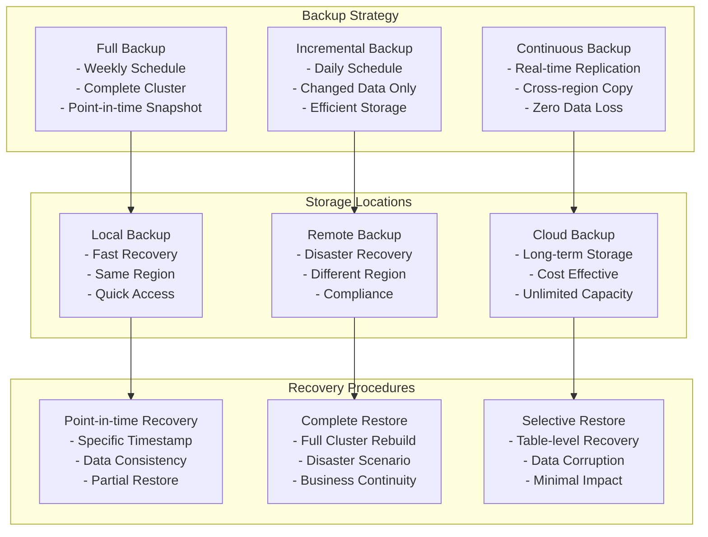

### Capacity Planning

```yaml
# Capacity Planning Configuration
capacity_planning:
  data_growth:
    # Current metrics
    current_data_size: "500GB"
    current_record_count: "5B records"
    current_ingestion_rate: "1M records/hour"
    
    # Growth projections
    monthly_growth_rate: 0.15  # 15% monthly growth
    yearly_projection: "2TB"
    customer_growth_factor: 2.0  # Doubling customers annually
    
  infrastructure_requirements:
    # Current cluster
    current_nodes: 9
    current_shards: 3
    current_replicas: 3
    
    # Scaling triggers
    cpu_threshold: 70%
    memory_threshold: 80%
    disk_threshold: 80%
    query_latency_threshold: "1s"
    
    # Scaling actions
    shard_split_threshold: "100GB per shard"
    node_addition_threshold: "CPU > 80% for 1 week"
    replica_addition_threshold: "Query latency > 2s"
  
  performance_targets:
    # Query performance
    dashboard_queries: "< 100ms"
    report_queries: "< 5s"
    analytical_queries: "< 30s"
    
    # Ingestion performance
    real_time_latency: "< 1s"
    batch_throughput: "1M records/minute"
    
    # Availability targets
    uptime_sla: 99.9%
    recovery_time_objective: "15 minutes"
    recovery_point_objective: "5 minutes"
```

---

## Cross-References

### Architecture Documentation
- **[System Architecture Overview](../overview.md)** - Complete system design
- **[Billing Architecture](billing.md)** - Data source integration
- **[Data Flow Diagrams](../data-flow.md)** - End-to-end data flows

### Operational Documentation
- **[Production Deployment](../../deployment/production.md)** - Deployment procedures
- **[Monitoring Setup](../../deployment/monitoring-setup.md)** - Observability setup
- **[Reliability Guide](../../operations/reliability.md)** - Operational procedures

### Development Documentation
- **[Testing Guide](../../development/testing/stress-testing.md)** - Load testing procedures
- **[Contribution Guide](../../development/contribution-guide.md)** - Development setup

### Reference Documentation
- **[Metrics Reference](../../reference/metrics-reference.md)** - Complete metrics documentation
- **[Error Codes](../../reference/error-codes.md)** - Error handling reference

---

*Last updated: 2025-06-12 | Next review: ClickHouse Architecture Review*