# Gateway Service Architecture

> API gateway providing authentication, routing, and traffic management for the Unkey platform

## Table of Contents
- [Overview](#overview)
- [Architecture](#architecture)
- [Component Details](#component-details)
- [Authentication System](#authentication-system)
- [Request Routing](#request-routing)
- [Rate Limiting](#rate-limiting)
- [Security Features](#security-features)
- [Performance & Scalability](#performance--scalability)
- [Operational Considerations](#operational-considerations)
- [Cross-References](#cross-references)

---

## Overview

The Gateway Service is the central entry point for all API traffic in the Unkey platform, providing authentication, authorization, request routing, and traffic management capabilities.

### Key Responsibilities
- **Authentication & Authorization**: JWT validation and customer context management
- **Request Routing**: Intelligent routing to appropriate metald instances
- **Rate Limiting**: Per-customer and global traffic control
- **Load Balancing**: Traffic distribution across metald instances
- **Security**: DDoS protection, input validation, and threat detection
- **Observability**: Request tracing, metrics collection, and logging

### Technology Stack (Recommended)
- **Language**: Go 1.21+ (for consistency with metald)
- **Framework**: Chi router or Gin (high-performance HTTP routing)
- **Authentication**: JWT libraries (golang-jwt/jwt)
- **Rate Limiting**: Redis-backed sliding window
- **Load Balancing**: Consistent hashing or round-robin
- **Observability**: OpenTelemetry integration

---

## Architecture

### High-Level Gateway Architecture

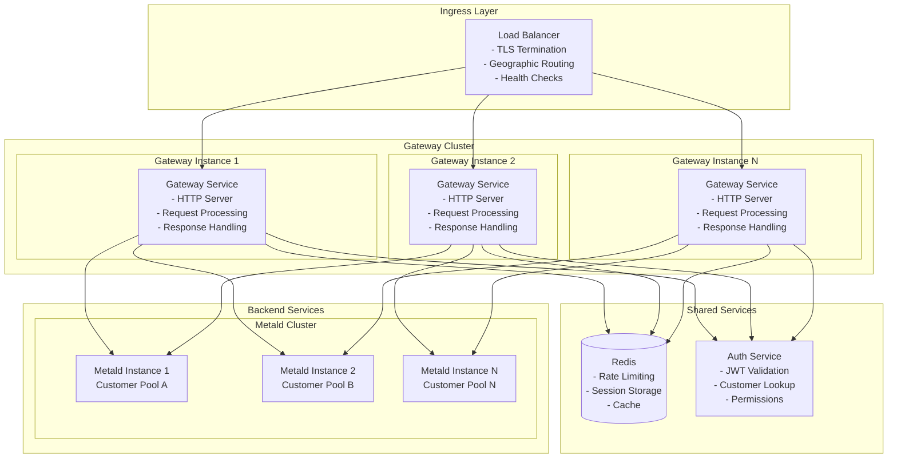

### Request Processing Pipeline

```mermaid
graph LR
    subgraph "Ingress"
        Request[Client Request<br/>- HTTP/gRPC<br/>- Headers<br/>- Payload]
    end
    
    subgraph "Pre-Processing"
        Validation[Input Validation<br/>- Schema Validation<br/>- Content-Type<br/>- Size Limits]
        Security[Security Checks<br/>- DDoS Detection<br/>- IP Filtering<br/>- Threat Analysis]
    end
    
    subgraph "Authentication"
        TokenExtract[Token Extraction<br/>- Bearer Header<br/>- Query Parameter<br/>- Cookie]
        TokenValidate[Token Validation<br/>- JWT Signature<br/>- Expiry Check<br/>- Claims Validation]
        CustomerContext[Customer Context<br/>- Customer ID<br/>- Permissions<br/>- Metadata]
    end
    
    subgraph "Authorization"
        RateLimit[Rate Limiting<br/>- Per-Customer Limits<br/>- Global Limits<br/>- Burst Handling]
        PermissionCheck[Permission Check<br/>- Operation Access<br/>- Resource Quotas<br/>- Feature Flags]
    end
    
    subgraph "Routing"
        TargetSelection[Target Selection<br/>- Customer Sharding<br/>- Load Balancing<br/>- Health Checks]
        RequestTransform[Request Transform<br/>- Header Injection<br/>- Protocol Translation<br/>- Context Propagation]
    end
    
    subgraph "Backend"
        MetaldCall[Metald Call<br/>- HTTP/gRPC Call<br/>- Timeout Handling<br/>- Retry Logic]
        ResponseTransform[Response Transform<br/>- Error Mapping<br/>- Format Conversion<br/>- Header Processing]
    end
    
    Request --> Validation
    Validation --> Security
    Security --> TokenExtract
    TokenExtract --> TokenValidate
    TokenValidate --> CustomerContext
    CustomerContext --> RateLimit
    RateLimit --> PermissionCheck
    PermissionCheck --> TargetSelection
    TargetSelection --> RequestTransform
    RequestTransform --> MetaldCall
    MetaldCall --> ResponseTransform
    ResponseTransform --> Response[Client Response]
```

---

## Component Details

### Core Gateway Components

```mermaid
graph TB
    subgraph "HTTP Server Layer"
        HTTPServer[HTTP Server<br/>- TLS Configuration<br/>- Connection Pooling<br/>- Graceful Shutdown]
        Middleware[Middleware Stack<br/>- Logging<br/>- CORS<br/>- Compression<br/>- Recovery]
    end
    
    subgraph "Request Processing"
        Router[Request Router<br/>- Path Matching<br/>- Method Validation<br/>- Version Handling]
        Validator[Request Validator<br/>- Schema Validation<br/>- Input Sanitization<br/>- Type Checking]
    end
    
    subgraph "Authentication Module"
        JWTValidator[JWT Validator<br/>- Signature Verification<br/>- Claims Extraction<br/>- Expiry Validation]
        CustomerExtractor[Customer Extractor<br/>- Customer ID<br/>- Metadata Lookup<br/>- Context Building]
    end
    
    subgraph "Rate Limiting Module"
        RateLimiter[Rate Limiter<br/>- Token Bucket<br/>- Sliding Window<br/>- Redis Backend]
        QuotaManager[Quota Manager<br/>- Customer Limits<br/>- Feature Quotas<br/>- Usage Tracking]
    end
    
    subgraph "Routing Module"
        LoadBalancer[Load Balancer<br/>- Health Checking<br/>- Consistent Hashing<br/>- Failover Logic]
        ServiceDiscovery[Service Discovery<br/>- Metald Instances<br/>- Health Status<br/>- Configuration]
    end
    
    subgraph "Backend Communication"
        HTTPClient[HTTP Client<br/>- Connection Pooling<br/>- Timeout Management<br/>- Retry Logic]
        CircuitBreaker[Circuit Breaker<br/>- Failure Detection<br/>- Automatic Recovery<br/>- Fallback Handling]
    end
    
    HTTPServer --> Middleware
    Middleware --> Router
    Router --> Validator
    
    Validator --> JWTValidator
    JWTValidator --> CustomerExtractor
    CustomerExtractor --> RateLimiter
    RateLimiter --> QuotaManager
    
    QuotaManager --> LoadBalancer
    LoadBalancer --> ServiceDiscovery
    ServiceDiscovery --> HTTPClient
    HTTPClient --> CircuitBreaker
```

---

## Authentication System

### JWT Authentication Flow

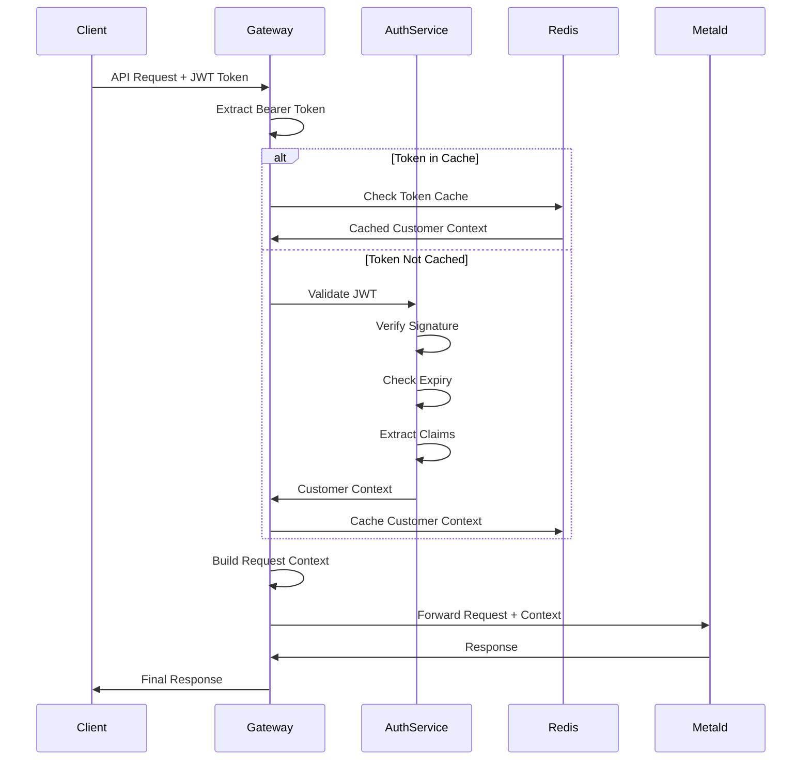

### Customer Context Management

```mermaid
graph TB
    subgraph "Token Processing"
        TokenHeader[Authorization Header<br/>Bearer <jwt-token>]
        TokenParsing[Token Parsing<br/>- Header Validation<br/>- Base64 Decoding<br/>- JSON Parsing]
        SignatureVerify[Signature Verification<br/>- Algorithm Check<br/>- Key Validation<br/>- Crypto Verification]
    end
    
    subgraph "Claims Extraction"
        StandardClaims[Standard Claims<br/>- iss (Issuer)<br/>- exp (Expiry)<br/>- iat (Issued At)]
        CustomClaims[Custom Claims<br/>- customer_id<br/>- permissions<br/>- features<br/>- quotas]
    end
    
    subgraph "Context Building"
        CustomerID[Customer ID<br/>- Primary Identifier<br/>- Routing Key<br/>- Ownership Context]
        Permissions[Permissions<br/>- API Access<br/>- Resource Limits<br/>- Feature Flags]
        Metadata[Metadata<br/>- Customer Tier<br/>- Rate Limits<br/>- Preferences]
    end
    
    TokenHeader --> TokenParsing
    TokenParsing --> SignatureVerify
    SignatureVerify --> StandardClaims
    SignatureVerify --> CustomClaims
    
    StandardClaims --> CustomerID
    CustomClaims --> CustomerID
    CustomClaims --> Permissions
    CustomClaims --> Metadata
```

### Development vs Production Authentication

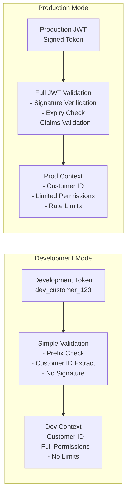

---

## Request Routing

### Customer-Based Routing Strategy

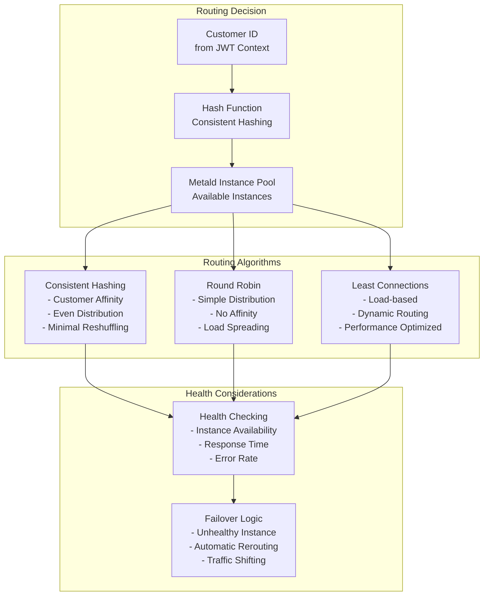

### Routing Configuration

```yaml
# Gateway Routing Configuration
routing:
  strategy: "consistent_hash"  # consistent_hash, round_robin, least_connections
  health_check_interval: "30s"
  unhealthy_threshold: 3
  recovery_threshold: 2
  
  metald_instances:
    - host: "metald-1.internal"
      port: 8080
      weight: 100
      customer_pools: ["pool_a", "pool_b"]
    - host: "metald-2.internal" 
      port: 8080
      weight: 100
      customer_pools: ["pool_c", "pool_d"]
    - host: "metald-3.internal"
      port: 8080
      weight: 50
      customer_pools: ["overflow"]
```

### Load Balancing Flow

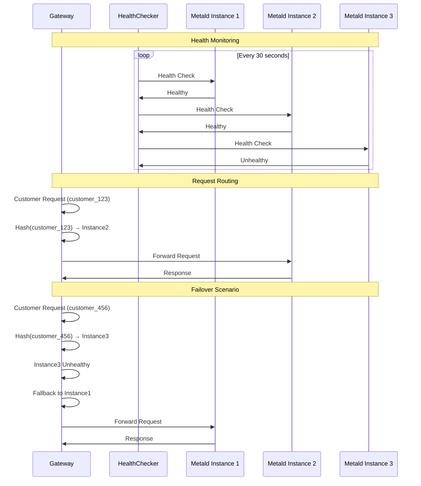

---

## Rate Limiting

### Multi-Level Rate Limiting

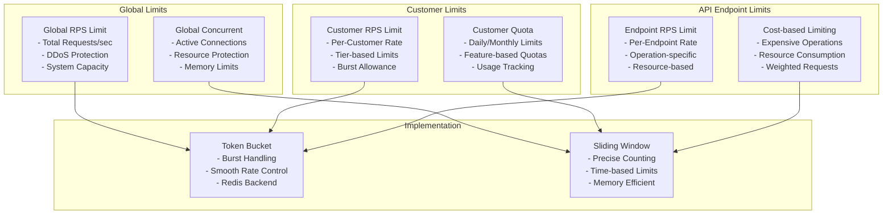

### Rate Limiting Algorithm

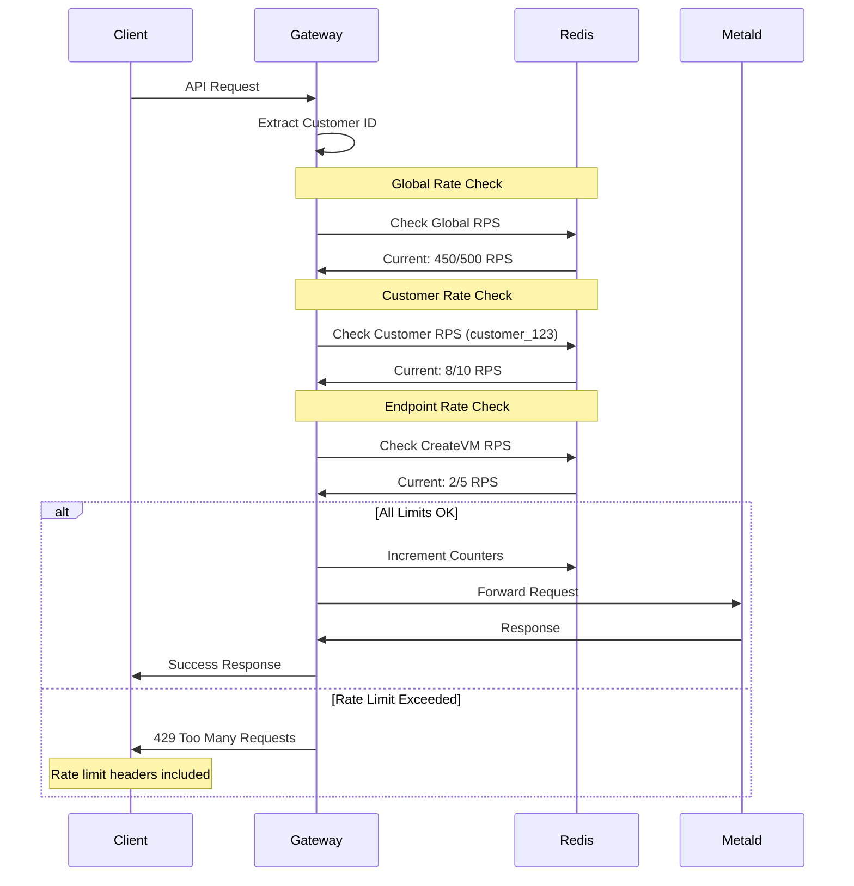

### Rate Limit Configuration

```yaml
# Rate Limiting Configuration
rate_limits:
  global:
    requests_per_second: 10000
    burst_size: 1000
    window_size: "1m"
  
  customer_tiers:
    free:
      requests_per_second: 10
      requests_per_day: 1000
      burst_size: 20
    
    pro:
      requests_per_second: 100
      requests_per_day: 100000
      burst_size: 200
    
    enterprise:
      requests_per_second: 1000
      requests_per_day: 1000000
      burst_size: 2000
  
  endpoints:
    CreateVM:
      requests_per_second: 5
      cost_weight: 10
    
    BootVM:
      requests_per_second: 20
      cost_weight: 5
    
    ListVMs:
      requests_per_second: 100
      cost_weight: 1
```

---

## Security Features

### DDoS Protection

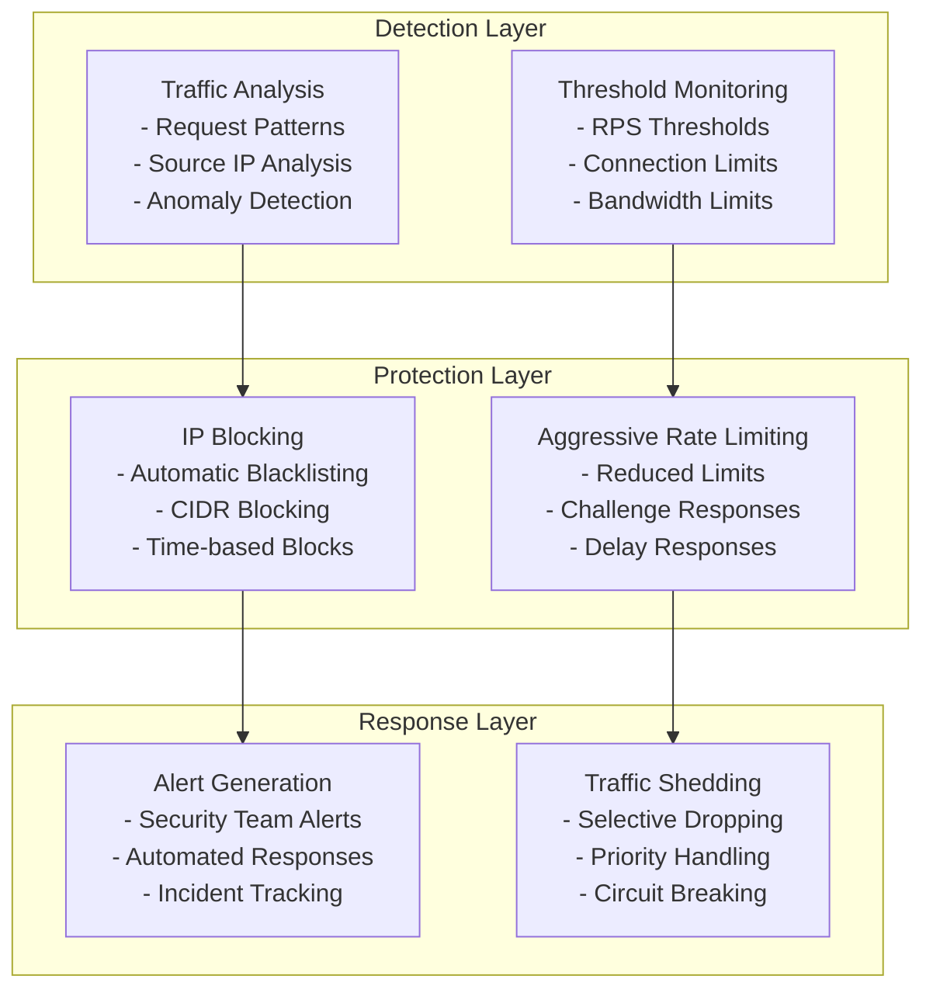

### Input Validation & Sanitization

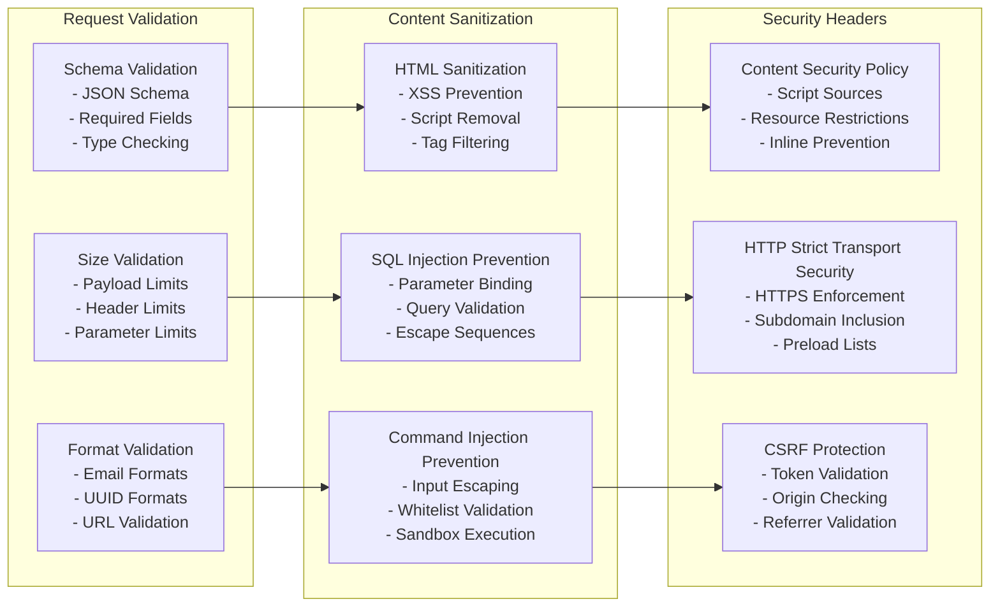

---

## Performance & Scalability

### Performance Characteristics

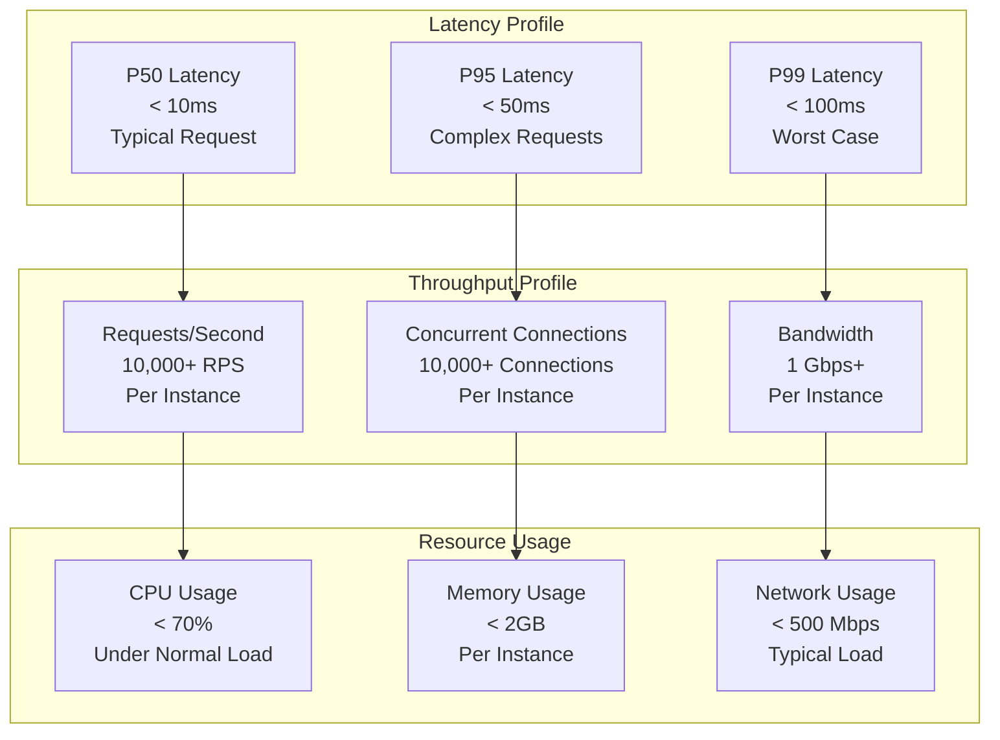

### Horizontal Scaling

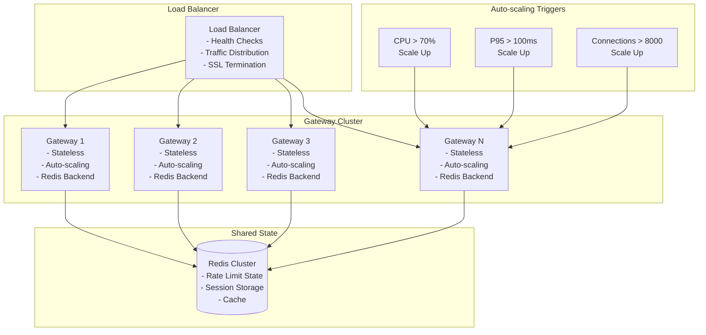

---

## Operational Considerations

### Health Monitoring

```yaml
# Health Check Endpoints
health_checks:
  # Basic health check
  - path: "/health"
    method: "GET"
    response: {"status": "healthy", "timestamp": "2025-06-12T10:30:00Z"}
  
  # Detailed health check
  - path: "/health/detailed"
    method: "GET"
    response:
      status: "healthy"
      components:
        - name: "http_server"
          status: "healthy"
          latency_ms: 1.2
        - name: "redis_connection"
          status: "healthy"
          latency_ms: 2.1
        - name: "metald_backend"
          status: "healthy"
          latency_ms: 15.3
      
  # Readiness check
  - path: "/ready"
    method: "GET"
    response: {"ready": true, "dependencies": ["redis", "metald"]}
```

### Metrics Collection

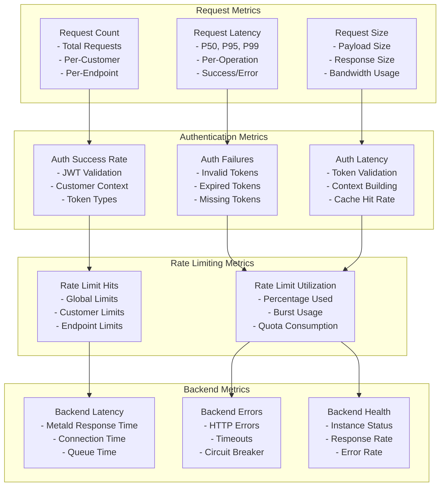

### Error Handling & Circuit Breaking

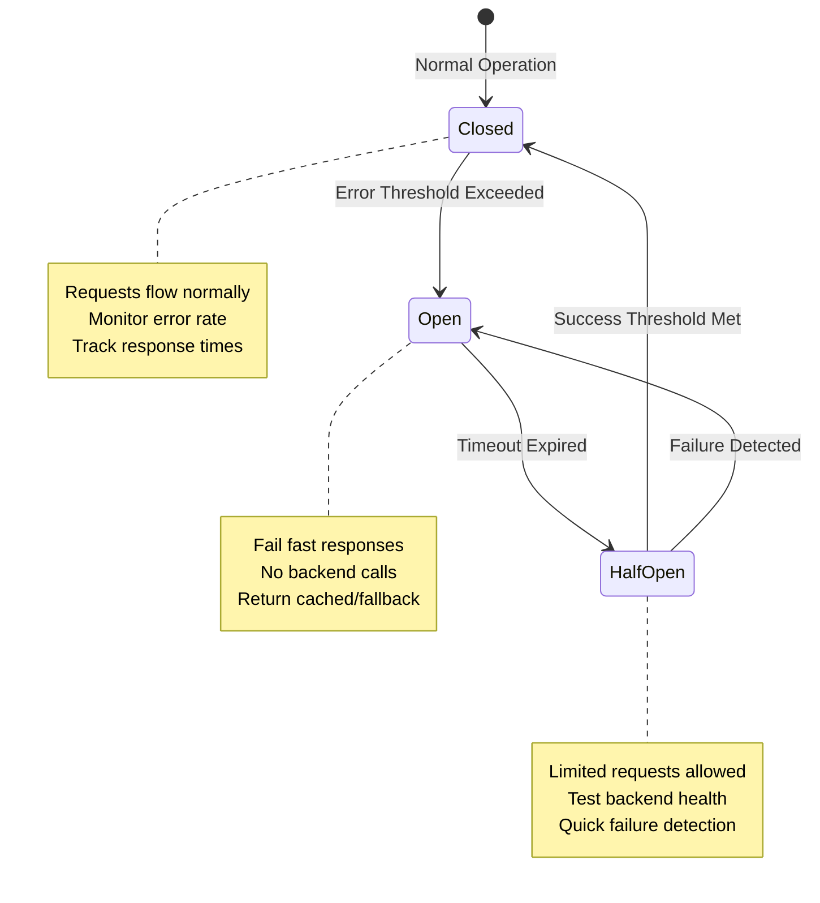

### Configuration Management

```yaml
# Gateway Configuration
gateway:
  server:
    host: "0.0.0.0"
    port: 8080
    tls:
      enabled: true
      cert_file: "/etc/ssl/gateway.crt"
      key_file: "/etc/ssl/gateway.key"
    
    timeouts:
      read: "30s"
      write: "30s"
      idle: "120s"
    
    limits:
      max_header_size: "1MB"
      max_body_size: "10MB"
      max_connections: 10000
  
  authentication:
    jwt:
      public_key_file: "/etc/keys/jwt-public.pem"
      algorithm: "RS256"
      cache_ttl: "5m"
    
    development:
      enabled: false
      token_prefix: "dev_customer_"
  
  rate_limiting:
    backend: "redis"
    redis:
      address: "redis-cluster:6379"
      password: ""
      db: 0
      pool_size: 100
  
  routing:
    strategy: "consistent_hash"
    health_check_interval: "30s"
    backend_timeout: "30s"
    retry_attempts: 3
    retry_backoff: "100ms"
  
  observability:
    metrics:
      enabled: true
      port: 9090
      path: "/metrics"
    
    tracing:
      enabled: true
      endpoint: "http://jaeger:14268/api/traces"
      sample_rate: 0.1
    
    logging:
      level: "info"
      format: "json"
      output: "stdout"
```

---

## Cross-References

### Architecture Documentation
- **[System Architecture Overview](../overview.md)** - Complete system design
- **[Metald Architecture](metald.md)** - Backend service integration
- **[Security Architecture](../security/overview.md)** - Security design

### API Documentation
- **[API Reference](../../api/reference.md)** - API endpoints and usage
- **[Configuration Guide](../../api/configuration.md)** - Configuration options

### Operational Documentation
- **[Production Deployment](../../deployment/production.md)** - Deployment procedures
- **[Security Hardening](../../deployment/security-hardening.md)** - Security configuration
- **[Monitoring Setup](../../deployment/monitoring-setup.md)** - Observability setup

### Development Documentation
- **[Testing Guide](../../development/testing/stress-testing.md)** - Load testing procedures
- **[Contribution Guide](../../development/contribution-guide.md)** - Development setup

---

*Last updated: 2025-06-12 | Next review: Gateway Design Review*