# Metald Core Architecture

> VM lifecycle management service with multi-VMM support and real-time billing integration

## Table of Contents
- [Overview](#overview)
- [Architecture](#architecture)
- [Component Details](#component-details)
- [VM Lifecycle Management](#vm-lifecycle-management)
- [Multi-Tenant Security](#multi-tenant-security)
- [Backend Abstraction](#backend-abstraction)
- [Process Management](#process-management)
- [Billing Integration](#billing-integration)
- [Operational Considerations](#operational-considerations)
- [Cross-References](#cross-references)

---

## Overview

Metald is the core VM management service that orchestrates virtual machine lifecycles across multiple hypervisor backends while providing real-time billing metrics and multi-tenant security isolation.

### Key Responsibilities
- **VM Lifecycle Management**: Create, boot, shutdown, delete, pause, resume, reboot
- **Multi-Tenant Security**: Customer authentication, authorization, and resource isolation
- **Backend Abstraction**: Unified API across Firecracker and Cloud Hypervisor
- **Process Management**: 1:1 VM-to-process isolation model for security
- **Billing Integration**: Real-time metrics streaming to billing service
- **Observability**: OpenTelemetry tracing and Prometheus metrics

### Technology Stack
- **Language**: Go 1.21+
- **API Protocol**: ConnectRPC (gRPC-compatible)
- **Observability**: OpenTelemetry, Prometheus metrics
- **Database**: SQLite with WAL mode
- **Authentication**: JWT Bearer tokens with customer context

---

## Architecture

### High-Level Component Architecture

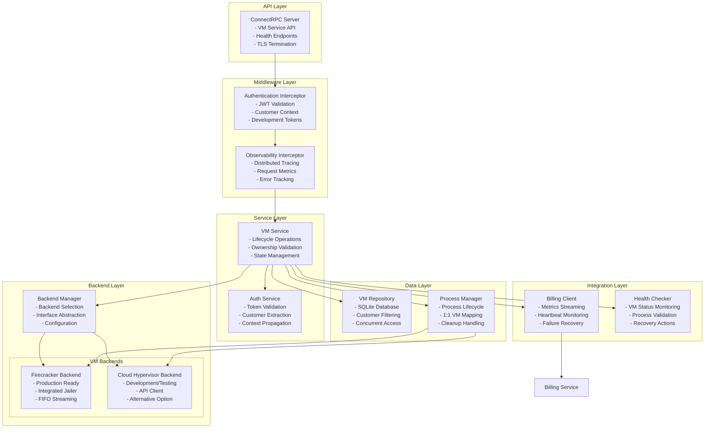

### Request Processing Architecture

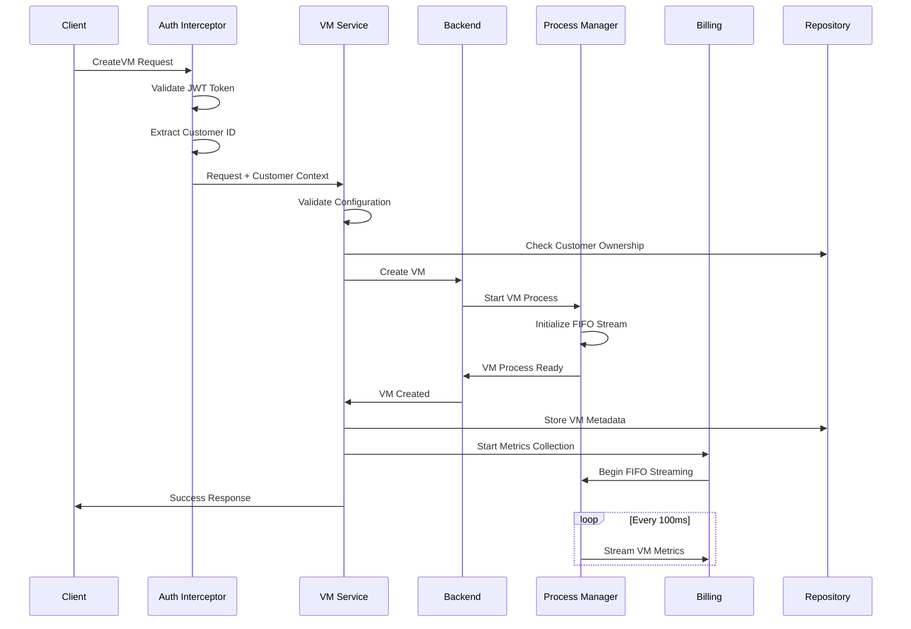

---

## Component Details

### Authentication System

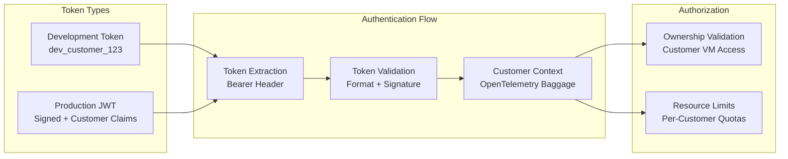

**Authentication Features**:
- **Development Tokens**: `dev_customer_<id>` format for testing
- **Production JWT**: Signed tokens with customer claims
- **Customer Context**: Propagated via OpenTelemetry baggage
- **Ownership Validation**: All VM operations check customer ownership

### Backend Abstraction Layer

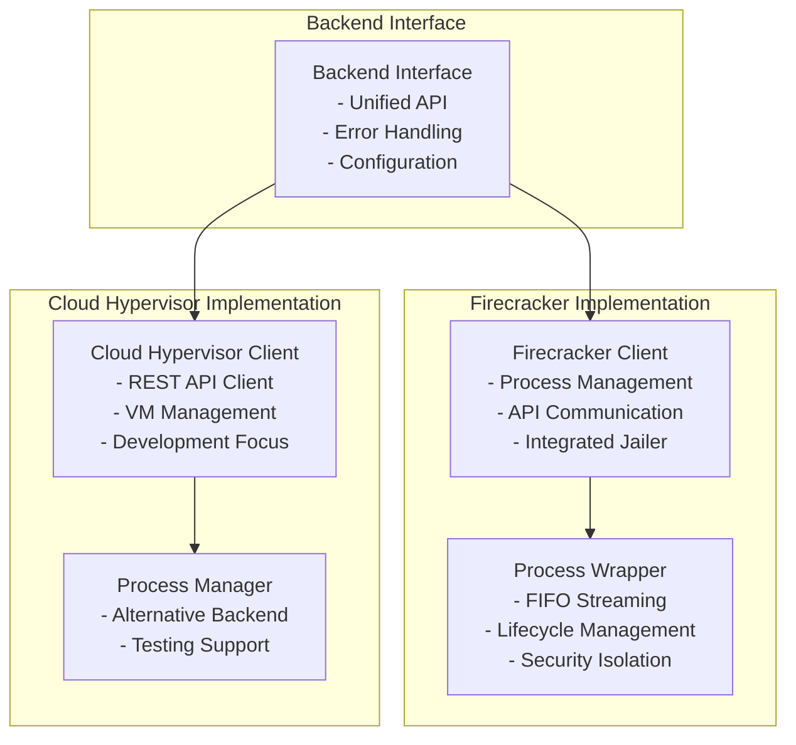

**Backend Features**:
- **Unified Interface**: Same API regardless of backend
- **Configuration-Driven**: Backend selection via environment variables
- **Error Mapping**: Backend-specific errors mapped to common interface
- **Resource Management**: Backend-specific resource allocation

### Process Management Architecture

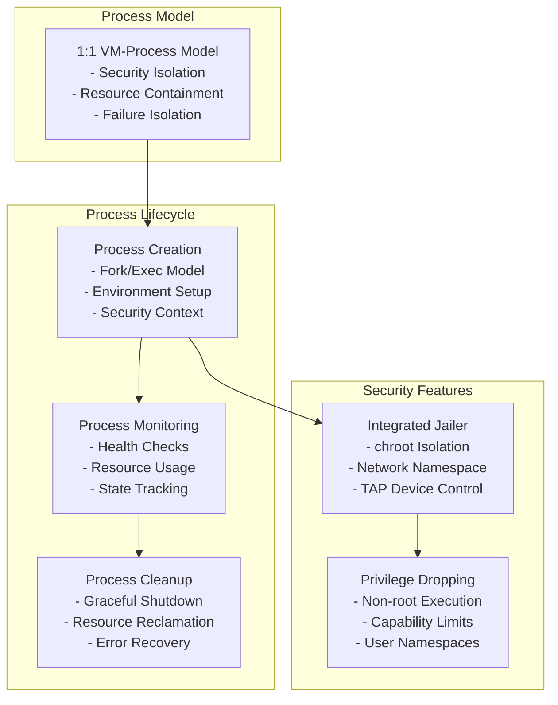

**Process Management Features**:
- **1:1 Isolation**: Each VM runs in separate process
- **Security Isolation**: Integrated jailer for production security
- **Resource Limits**: cgroups v2 for memory/CPU constraints
- **Failure Isolation**: Process failures don't affect other VMs

---

## VM Lifecycle Management

### State Machine

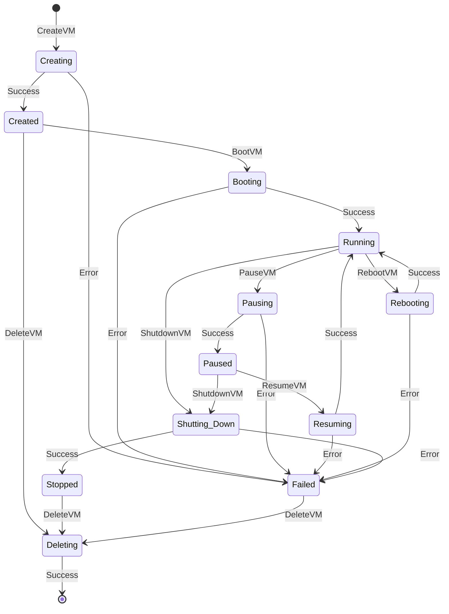

### Lifecycle Operations

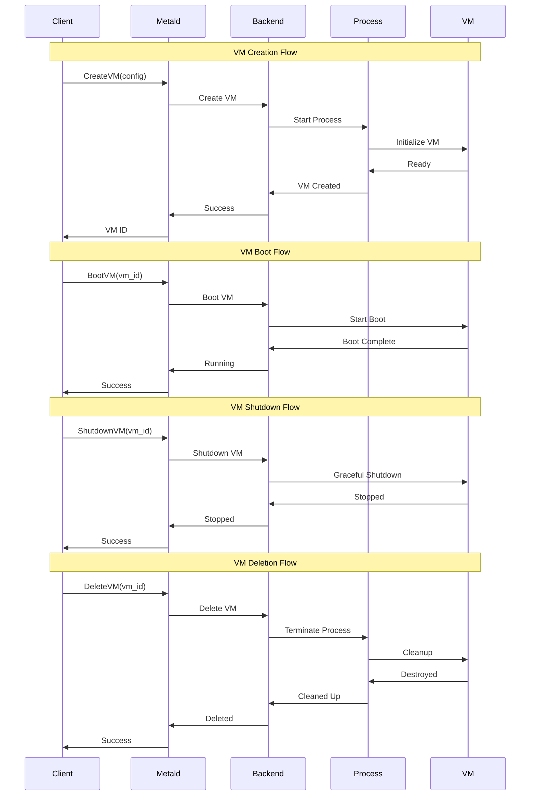

---

## Multi-Tenant Security

### Customer Isolation Model

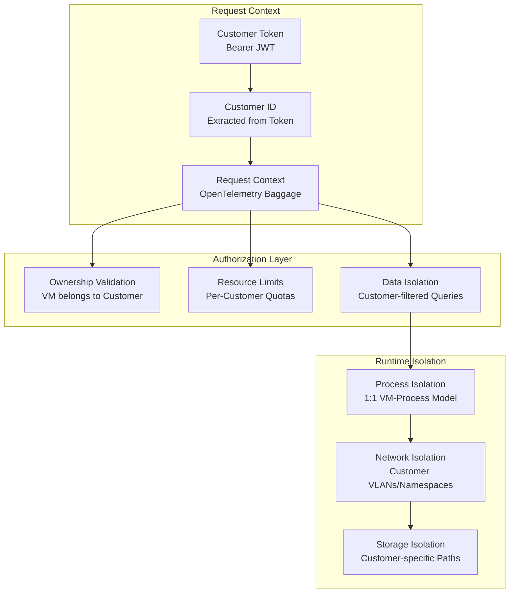

### Security Boundaries

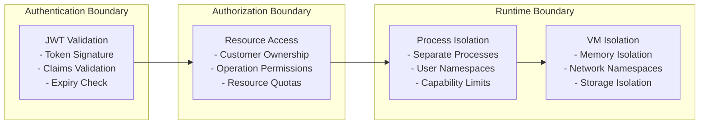

---

## Backend Abstraction

### Interface Design

```go
type Backend interface {
    // VM Lifecycle
    CreateVM(ctx context.Context, config *VMConfig) (*VM, error)
    BootVM(ctx context.Context, vmID string) error
    ShutdownVM(ctx context.Context, vmID string) error
    DeleteVM(ctx context.Context, vmID string) error
    
    // VM State Management
    PauseVM(ctx context.Context, vmID string) error
    ResumeVM(ctx context.Context, vmID string) error
    RebootVM(ctx context.Context, vmID string) error
    
    // VM Information
    GetVMInfo(ctx context.Context, vmID string) (*VMInfo, error)
    ListVMs(ctx context.Context) ([]*VM, error)
    
    // Health & Monitoring
    HealthCheck(ctx context.Context) error
    GetMetrics(ctx context.Context, vmID string) (*Metrics, error)
}
```

### Backend Comparison

| Feature | Firecracker | Cloud Hypervisor |
|---------|-------------|------------------|
| **Maturity** | Production Ready | Development/Testing |
| **Security** | Integrated Jailer | Basic Isolation |
| **Performance** | Optimized | Good |
| **Billing** | FIFO Streaming | Polling-based |
| **Networking** | IPv6 Support | IPv6 Support |
| **Process Model** | 1:1 VM-Process | 1:1 VM-Process |
| **Resource Limits** | cgroups v2 | cgroups v2 |
| **Use Case** | Production | Development |

---

## Process Management

### Process Architecture

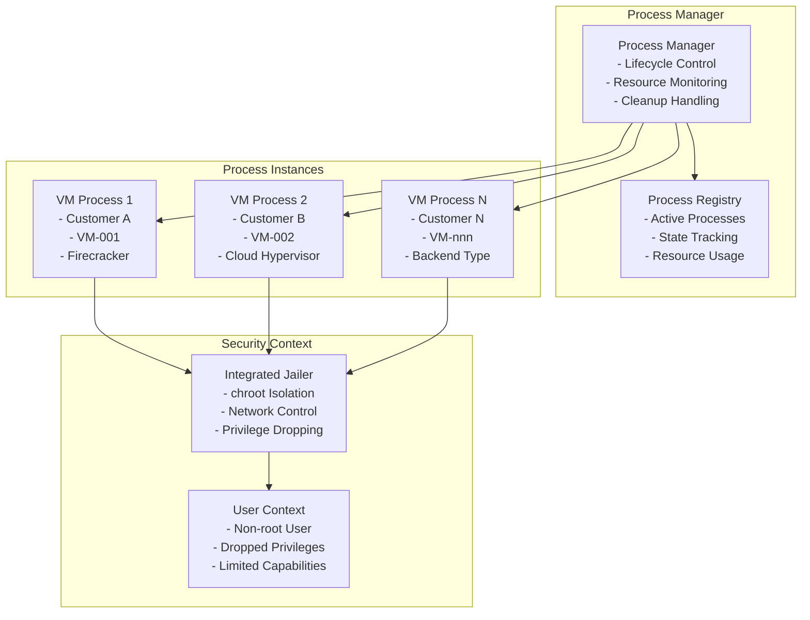

### Resource Management

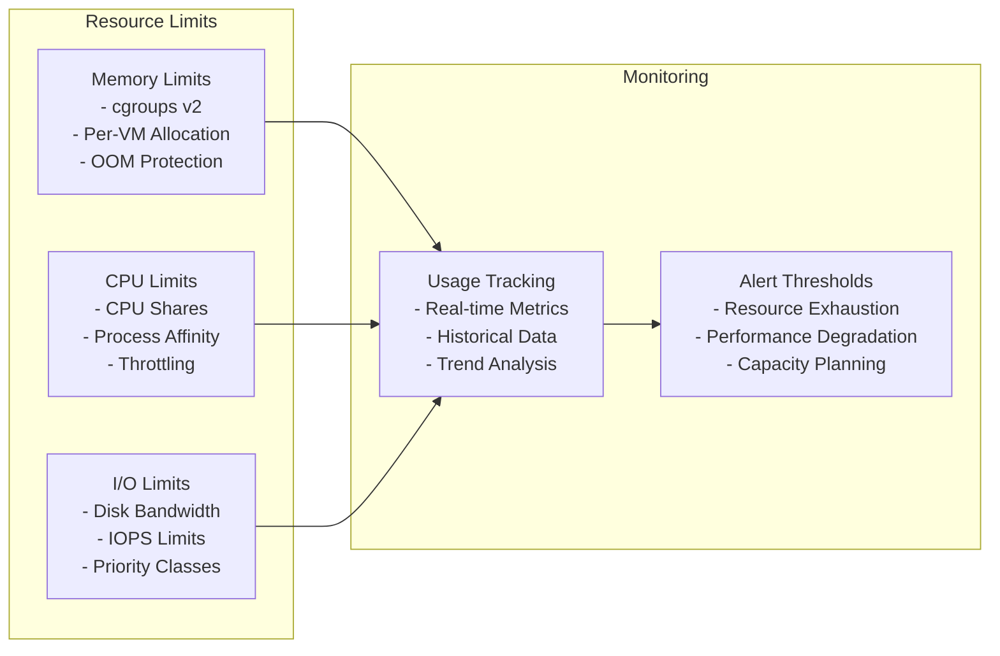

---

## Billing Integration

### Metrics Collection Architecture

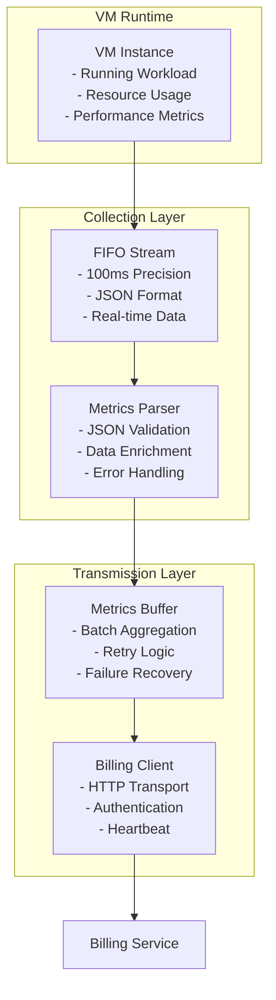

### Billing Data Flow

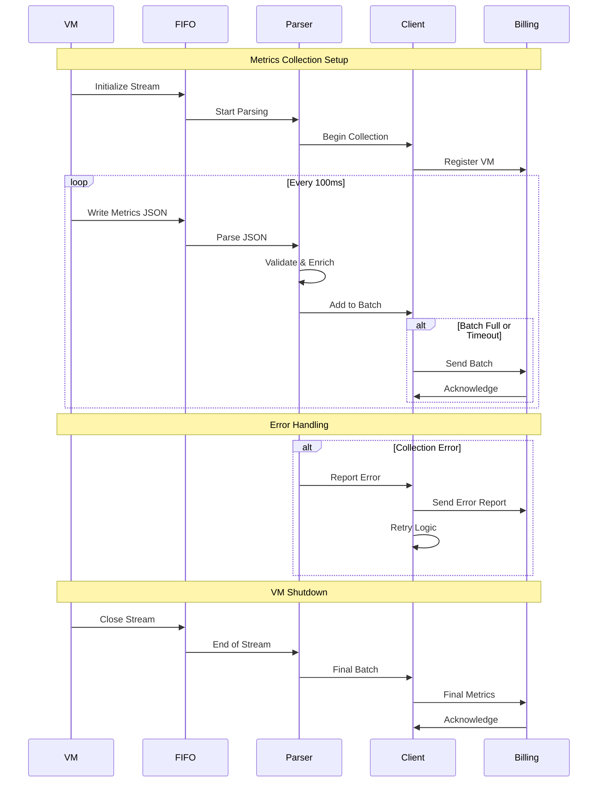

---

## Operational Considerations

### Performance Characteristics
- **VM Creation Time**: ~2-5 seconds for Firecracker, ~5-10 seconds for Cloud Hypervisor
- **Memory Overhead**: ~50MB per VM process
- **CPU Overhead**: ~2-5% per VM for management
- **Network Latency**: <1ms additional latency for API calls
- **Billing Precision**: 100ms metrics collection interval

### Scalability Limits
- **Maximum VMs per Instance**: 1000 (configurable)
- **Memory Requirements**: 8GB + (VM count × 50MB)
- **CPU Requirements**: 4 cores minimum, scales with VM count
- **Network Bandwidth**: 1Gbps recommended for 100+ VMs
- **Storage IOPS**: 1000 IOPS minimum for SQLite WAL

### High Availability
- **Process Isolation**: VM failures don't affect other VMs
- **Backend Abstraction**: Can switch backends during maintenance
- **Database Reliability**: SQLite WAL mode for crash recovery
- **Graceful Shutdown**: Clean VM termination on service restart
- **Health Monitoring**: Continuous VM and process health checks

### Monitoring & Alerting
- **VM Lifecycle Metrics**: Creation, boot, shutdown, deletion times
- **Authentication Metrics**: Success/failure rates, customer access patterns
- **Backend Performance**: Operation latencies, error rates
- **Process Health**: Memory usage, CPU usage, process counts
- **Billing Integration**: Metrics collection rates, transmission success

---

## Cross-References

### Architecture Documentation
- **[System Architecture Overview](../overview.md)** - Complete system design
- **[Gateway Architecture](gateway.md)** - API gateway integration
- **[Billing Architecture](billing.md)** - Billing system integration
- **[Security Architecture](../security/overview.md)** - Security design

### API Documentation
- **[API Reference](../../api/reference.md)** - Complete API documentation
- **[Configuration Guide](../../api/configuration.md)** - VM configuration options

### Operational Documentation
- **[Production Deployment](../../deployment/production.md)** - Deployment procedures
- **[Reliability Guide](../../operations/reliability.md)** - Operational procedures
- **[Troubleshooting](../../operations/troubleshooting.md)** - Problem resolution

### Development Documentation
- **[Testing Guide](../../development/testing/stress-testing.md)** - Load testing procedures
- **[Contribution Guide](../../development/contribution-guide.md)** - Development setup

---

*Last updated: 2025-06-12 | Next review: Metald Architecture Review*