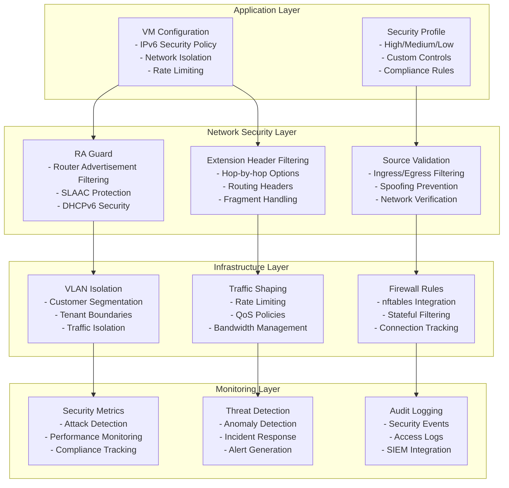

# IPv6 Networking for Metald

> Complete security-hardened IPv6 implementation guide for production environments

## Table of Contents
- [Overview and Architecture](#overview-and-architecture)
- [Prerequisites and System Setup](#prerequisites-and-system-setup)
- [API Reference and Configuration Schema](#api-reference-and-configuration-schema)
- [Configuration and Deployment](#configuration-and-deployment)
- [Usage Examples and Patterns](#usage-examples-and-patterns)
- [Security Implementation Details](#security-implementation-details)
- [Operations and Troubleshooting](#operations-and-troubleshooting)
- [Monitoring and Compliance](#monitoring-and-compliance)
- [Migration and Production Readiness](#migration-and-production-readiness)
- [Cross-References](#cross-references)

---

## Overview and Architecture

### IPv6 Security-First Design

The metald IPv6 implementation prioritizes security through multiple layers of defense, ensuring production-grade network isolation and threat protection.



### Security Architecture Overview

**Core Security Principles**:
- **Defense in Depth**: Multiple security layers with independent controls
- **Zero Trust**: No implicit trust for network traffic or configuration
- **Least Privilege**: Minimal required permissions and network access
- **Continuous Monitoring**: Real-time security monitoring and alerting

**Key Features**:
- **Router Advertisement Protection**: Comprehensive RA Guard implementation
- **Source Address Validation**: Strict ingress/egress filtering
- **Extension Header Security**: Controlled processing of IPv6 extension headers
- **Multi-tenant Isolation**: Customer network segmentation with VLAN isolation
- **Compliance Ready**: SOC 2, PCI DSS, and GDPR compliance features

---

## Prerequisites and System Setup

### System Requirements

**Operating System**:
- Ubuntu 22.04 LTS or CentOS 8+ (IPv6-enabled kernel)
- Linux kernel 5.4+ with IPv6 and nftables support
- systemd with network management capabilities

**Network Infrastructure**:
- IPv6-capable network infrastructure with /64 subnet allocation
- VLAN support for customer isolation
- Router Advertisement Guard (RAG) support on switches
- NTP synchronization for accurate timestamping

**Security Dependencies**:
```bash
# Ubuntu/Debian
sudo apt update
sudo apt install -y \
    nftables \
    iproute2 \
    iputils-ping6 \
    radvd \
    wide-dhcpv6-client \
    tcpdump \
    netcat-openbsd

# CentOS/RHEL
sudo dnf install -y \
    nftables \
    iproute \
    iputils \
    radvd \
    dhcp-client \
    tcpdump \
    nmap-ncat
```

### Host Network Hardening

**IPv6 Security Configuration**:
```bash
# /etc/sysctl.d/99-metald-ipv6-security.conf

# Disable IPv6 router advertisements acceptance
net.ipv6.conf.all.accept_ra = 0
net.ipv6.conf.default.accept_ra = 0

# Disable IPv6 redirects
net.ipv6.conf.all.accept_redirects = 0
net.ipv6.conf.default.accept_redirects = 0

# Enable IPv6 source route filtering
net.ipv6.conf.all.accept_source_route = 0
net.ipv6.conf.default.accept_source_route = 0

# Enable IPv6 privacy extensions for temporary addresses
net.ipv6.conf.all.use_tempaddr = 2
net.ipv6.conf.default.use_tempaddr = 2

# Increase IPv6 neighbor cache size for performance
net.ipv6.neigh.default.gc_thresh1 = 1024
net.ipv6.neigh.default.gc_thresh2 = 2048
net.ipv6.neigh.default.gc_thresh3 = 4096

# Apply configuration
sudo sysctl -p /etc/sysctl.d/99-metald-ipv6-security.conf
```

**nftables Firewall Setup**:
```bash
# /etc/nftables/metald-ipv6-security.nft
#!/usr/sbin/nft -f

# Clear existing rules
flush ruleset

table inet metald_security {
    # IPv6 security chain
    chain ipv6_security {
        type filter hook input priority 0; policy drop;
        
        # Allow loopback
        iifname "lo" accept
        
        # Allow established and related connections
        ct state established,related accept
        
        # ICMPv6 essential messages only
        icmpv6 type {
            destination-unreachable,
            packet-too-big,
            time-exceeded,
            parameter-problem,
            echo-request,
            echo-reply
        } accept
        
        # Block router advertisements (handled by RA Guard)
        icmpv6 type router-advertisement drop
        
        # Allow SSH (modify port as needed)
        tcp dport 22 accept
        
        # Allow metald API port
        tcp dport 8080 accept
        
        # Rate limit connections
        limit rate 100/minute accept
    }
    
    # IPv6 forward chain for VM traffic
    chain ipv6_forward {
        type filter hook forward priority 0; policy drop;
        
        # Allow VM-to-VM communication within same customer
        # (implement customer VLAN logic here)
        
        # Block inter-customer communication
        ct state established,related accept
        
        # Rate limit forwarded traffic
        limit rate 1000/second accept
    }
}

# Load the configuration
sudo nft -f /etc/nftables/metald-ipv6-security.nft
sudo systemctl enable nftables
sudo systemctl restart nftables
```

---

## API Reference and Configuration Schema

### IPv6 Security Configuration Schema

```protobuf
// Enhanced IPv6 security configuration
message IPv6SecurityConfig {
    // Security profile level
    SecurityProfile profile = 1;
    
    // Router Advertisement Guard configuration
    RAGuardConfig ra_guard = 2;
    
    // Source address validation settings
    SourceValidationConfig source_validation = 3;
    
    // Extension header processing rules
    ExtensionHeaderConfig extension_headers = 4;
    
    // Network isolation settings
    NetworkIsolationConfig isolation = 5;
    
    // Rate limiting configuration
    RateLimitConfig rate_limits = 6;
    
    // Monitoring and logging settings
    MonitoringConfig monitoring = 7;
    
    // Compliance requirements
    ComplianceConfig compliance = 8;
}

enum SecurityProfile {
    SECURITY_PROFILE_UNSPECIFIED = 0;
    SECURITY_PROFILE_HIGH = 1;       // Maximum security controls
    SECURITY_PROFILE_MEDIUM = 2;     // Balanced security and performance  
    SECURITY_PROFILE_LOW = 3;        // Minimal security for development
    SECURITY_PROFILE_CUSTOM = 4;     // Custom-defined security rules
}

message RAGuardConfig {
    // Enable Router Advertisement Guard
    bool enabled = 1;
    
    // Block all router advertisements
    bool block_all_ra = 2;
    
    // Allowed router sources (if not blocking all)
    repeated string allowed_routers = 3;
    
    // Maximum router advertisements per minute
    uint32 max_ra_rate = 4;
    
    // Block specific RA types
    RABlockConfig block_config = 5;
}

message RABlockConfig {
    bool block_prefix_info = 1;      // Block prefix information options
    bool block_mtu_options = 2;      // Block MTU options
    bool block_route_info = 3;       // Block route information options
    bool block_rdnss = 4;           // Block recursive DNS server options
}

message SourceValidationConfig {
    // Enable strict ingress filtering
    bool strict_ingress = 1;
    
    // Enable strict egress filtering  
    bool strict_egress = 2;
    
    // Allowed source prefixes for ingress
    repeated string allowed_ingress_prefixes = 3;
    
    // Allowed destination prefixes for egress
    repeated string allowed_egress_prefixes = 4;
    
    // Block private address ranges in public interfaces
    bool block_private_addresses = 5;
    
    // Enable reverse path filtering
    bool reverse_path_filtering = 6;
}

message ExtensionHeaderConfig {
    // Processing mode for extension headers
    ExtensionHeaderMode mode = 1;
    
    // Allowed extension header types
    repeated uint32 allowed_types = 2;
    
    // Maximum chain length for extension headers
    uint32 max_chain_length = 3;
    
    // Fragment handling policy
    FragmentPolicy fragment_policy = 4;
}

enum ExtensionHeaderMode {
    EXTENSION_HEADER_MODE_UNSPECIFIED = 0;
    EXTENSION_HEADER_MODE_ALLOW_ALL = 1;    // Allow all extension headers
    EXTENSION_HEADER_MODE_BLOCK_ALL = 2;    // Block all extension headers
    EXTENSION_HEADER_MODE_SELECTIVE = 3;    // Allow only specified types
}

enum FragmentPolicy {
    FRAGMENT_POLICY_UNSPECIFIED = 0;
    FRAGMENT_POLICY_ALLOW = 1;              // Allow IPv6 fragments
    FRAGMENT_POLICY_BLOCK = 2;              // Block all fragments
    FRAGMENT_POLICY_REASSEMBLE = 3;         // Reassemble and validate
}

message NetworkIsolationConfig {
    // Customer VLAN ID for isolation
    uint32 customer_vlan = 1;
    
    // Additional VLAN tags for multi-level isolation
    repeated uint32 additional_vlans = 2;
    
    // Network namespace for complete isolation
    string network_namespace = 3;
    
    // Bridge interface for customer traffic
    string bridge_interface = 4;
    
    // Inter-tenant communication policy
    InterTenantPolicy inter_tenant_policy = 5;
}

enum InterTenantPolicy {
    INTER_TENANT_POLICY_UNSPECIFIED = 0;
    INTER_TENANT_POLICY_BLOCK_ALL = 1;      // Block all inter-tenant traffic
    INTER_TENANT_POLICY_ALLOW_ALL = 2;      // Allow all inter-tenant traffic
    INTER_TENANT_POLICY_SELECTIVE = 3;      // Allow only specified traffic
}

message RateLimitConfig {
    // Maximum packets per second per VM
    uint32 max_pps_per_vm = 1;
    
    // Maximum bandwidth per VM (bytes/second)
    uint64 max_bandwidth_per_vm = 2;
    
    // Maximum concurrent connections per VM
    uint32 max_connections_per_vm = 3;
    
    // Rate limiting enforcement method
    RateLimitMethod method = 4;
    
    // Burst allowance configuration
    BurstConfig burst_config = 5;
}

enum RateLimitMethod {
    RATE_LIMIT_METHOD_UNSPECIFIED = 0;
    RATE_LIMIT_METHOD_TOKEN_BUCKET = 1;     // Token bucket algorithm
    RATE_LIMIT_METHOD_LEAKY_BUCKET = 2;     // Leaky bucket algorithm
    RATE_LIMIT_METHOD_SLIDING_WINDOW = 3;   // Sliding window rate limiting
}

message BurstConfig {
    // Burst size in packets
    uint32 burst_packets = 1;
    
    // Burst duration in milliseconds
    uint32 burst_duration_ms = 2;
    
    // Recovery time after burst in seconds
    uint32 recovery_time_s = 3;
}

message MonitoringConfig {
    // Enable security event logging
    bool enable_security_logging = 1;
    
    // Log level for security events
    LogLevel security_log_level = 2;
    
    // Enable performance metrics collection
    bool enable_metrics = 3;
    
    // Metrics collection interval in seconds
    uint32 metrics_interval_s = 4;
    
    // SIEM integration settings
    SIEMConfig siem_config = 5;
}

enum LogLevel {
    LOG_LEVEL_UNSPECIFIED = 0;
    LOG_LEVEL_DEBUG = 1;
    LOG_LEVEL_INFO = 2;
    LOG_LEVEL_WARN = 3;
    LOG_LEVEL_ERROR = 4;
    LOG_LEVEL_CRITICAL = 5;
}

message SIEMConfig {
    // Enable SIEM integration
    bool enabled = 1;
    
    // SIEM endpoint URL
    string endpoint = 2;
    
    // Authentication token for SIEM
    string auth_token = 3;
    
    // Log format (JSON, CEF, LEEF)
    string log_format = 4;
}

message ComplianceConfig {
    // Compliance frameworks to enforce
    repeated ComplianceFramework frameworks = 1;
    
    // Data retention period in days
    uint32 data_retention_days = 2;
    
    // Audit trail configuration
    AuditConfig audit_config = 3;
    
    // Encryption requirements
    EncryptionConfig encryption = 4;
}

enum ComplianceFramework {
    COMPLIANCE_FRAMEWORK_UNSPECIFIED = 0;
    COMPLIANCE_FRAMEWORK_SOC2 = 1;
    COMPLIANCE_FRAMEWORK_PCI_DSS = 2;
    COMPLIANCE_FRAMEWORK_GDPR = 3;
    COMPLIANCE_FRAMEWORK_HIPAA = 4;
    COMPLIANCE_FRAMEWORK_ISO27001 = 5;
}

message AuditConfig {
    // Enable comprehensive audit logging
    bool enabled = 1;
    
    // Audit log destination
    string log_destination = 2;
    
    // Include performance data in audit logs
    bool include_performance_data = 3;
    
    // Audit log encryption
    bool encrypt_logs = 4;
}

message EncryptionConfig {
    // Require encryption in transit
    bool require_tls = 1;
    
    // Minimum TLS version
    string min_tls_version = 2;
    
    // Require encryption at rest
    bool require_encryption_at_rest = 3;
    
    // Allowed cipher suites
    repeated string allowed_ciphers = 4;
}
```

### API Endpoints

```protobuf
service VmService {
    // Create VM with IPv6 security configuration
    rpc CreateVm(CreateVmRequest) returns (CreateVmResponse);
    
    // Update IPv6 security configuration
    rpc UpdateVmNetworkSecurity(UpdateVmNetworkSecurityRequest) returns (UpdateVmNetworkSecurityResponse);
    
    // Get IPv6 security status
    rpc GetVmNetworkSecurity(GetVmNetworkSecurityRequest) returns (GetVmNetworkSecurityResponse);
}

message CreateVmRequest {
    VmConfig config = 1;
}

message VmConfig {
    // VM configuration...
    
    // IPv6 network configuration
    IPv6Config ipv6_config = 10;
}

message IPv6Config {
    // Enable IPv6 for this VM
    bool enabled = 1;
    
    // IPv6 addresses to assign
    repeated string addresses = 2;
    
    // IPv6 security configuration
    IPv6SecurityConfig security = 3;
    
    // Network interface configuration
    NetworkInterfaceConfig interface = 4;
}

message NetworkInterfaceConfig {
    // Interface name (e.g., "eth0")
    string name = 1;
    
    // MAC address (auto-generated if empty)
    string mac_address = 2;
    
    // Maximum transmission unit
    uint32 mtu = 3;
    
    // VLAN configuration
    VLANConfig vlan = 4;
}

message VLANConfig {
    // VLAN ID
    uint32 vlan_id = 1;
    
    // VLAN priority
    uint32 priority = 2;
    
    // VLAN name/description
    string name = 3;
}
```

---

## Configuration and Deployment

### Production Configuration Templates

#### Single-Tenant High-Security Configuration

```yaml
# /etc/metald/ipv6-production.yaml
metald:
  network:
    ipv6:
      enabled: true
      security_profile: "high"
      
      # Router Advertisement Guard - Maximum Security
      ra_guard:
        enabled: true
        block_all_ra: true
        max_ra_rate: 0
        block_config:
          block_prefix_info: true
          block_mtu_options: true
          block_route_info: true
          block_rdnss: true
      
      # Strict Source Validation
      source_validation:
        strict_ingress: true
        strict_egress: true
        allowed_ingress_prefixes:
          - "2001:db8:1000::/48"  # Organization prefix
        allowed_egress_prefixes:
          - "2001:db8::/32"       # Public internet (controlled)
        block_private_addresses: true
        reverse_path_filtering: true
      
      # Extension Header Security
      extension_headers:
        mode: "SELECTIVE"
        allowed_types: [0, 6, 17, 44]  # Hop-by-Hop, TCP, UDP, Fragment
        max_chain_length: 3
        fragment_policy: "REASSEMBLE"
      
      # Network Isolation
      isolation:
        customer_vlan: 100
        network_namespace: "customer-prod"
        bridge_interface: "br-customer"
        inter_tenant_policy: "BLOCK_ALL"
      
      # Rate Limiting
      rate_limits:
        max_pps_per_vm: 10000
        max_bandwidth_per_vm: 1073741824  # 1 Gbps
        max_connections_per_vm: 10000
        method: "TOKEN_BUCKET"
        burst_config:
          burst_packets: 1000
          burst_duration_ms: 100
          recovery_time_s: 1
      
      # Comprehensive Monitoring
      monitoring:
        enable_security_logging: true
        security_log_level: "INFO"
        enable_metrics: true
        metrics_interval_s: 10
        siem_config:
          enabled: true
          endpoint: "https://siem.company.com/api/logs"
          auth_token: "${SIEM_AUTH_TOKEN}"
          log_format: "JSON"
      
      # Compliance Configuration
      compliance:
        frameworks: ["SOC2", "PCI_DSS"]
        data_retention_days: 2555  # 7 years
        audit_config:
          enabled: true
          log_destination: "/var/log/metald/ipv6-audit.log"
          include_performance_data: true
          encrypt_logs: true
        encryption:
          require_tls: true
          min_tls_version: "1.3"
          require_encryption_at_rest: true
          allowed_ciphers:
            - "TLS_AES_256_GCM_SHA384"
            - "TLS_CHACHA20_POLY1305_SHA256"
```

#### Multi-Tenant Enterprise Configuration

```yaml
# /etc/metald/ipv6-multi-tenant.yaml
metald:
  network:
    ipv6:
      enabled: true
      security_profile: "high"
      
      # Customer-specific configurations
      customer_configs:
        "customer-001":
          ra_guard:
            enabled: true
            block_all_ra: false
            allowed_routers: ["2001:db8:1001::1"]
            max_ra_rate: 5
          isolation:
            customer_vlan: 1001
            network_namespace: "customer-001"
            bridge_interface: "br-cust-001"
          rate_limits:
            max_pps_per_vm: 5000
            max_bandwidth_per_vm: 536870912  # 500 Mbps
        
        "customer-002":
          ra_guard:
            enabled: true
            block_all_ra: true
          isolation:
            customer_vlan: 1002
            network_namespace: "customer-002"
            bridge_interface: "br-cust-002"
          rate_limits:
            max_pps_per_vm: 15000
            max_bandwidth_per_vm: 2147483648  # 2 Gbps
      
      # Default security settings for all customers
      default_security:
        source_validation:
          strict_ingress: true
          strict_egress: true
          block_private_addresses: true
        extension_headers:
          mode: "SELECTIVE"
          allowed_types: [0, 6, 17, 44]
          fragment_policy: "REASSEMBLE"
        monitoring:
          enable_security_logging: true
          security_log_level: "WARN"
          enable_metrics: true
```

### Step-by-Step Deployment Procedures

#### 1. Pre-Deployment Validation

```bash
#!/bin/bash
# metald-ipv6-precheck.sh

echo "Metald IPv6 Deployment Pre-Check"
echo "================================="

# Check IPv6 kernel support
if [ ! -f /proc/net/if_inet6 ]; then
    echo "❌ IPv6 not enabled in kernel"
    exit 1
fi
echo "✅ IPv6 kernel support detected"

# Check nftables availability
if ! command -v nft &> /dev/null; then
    echo "❌ nftables not installed"
    exit 1
fi
echo "✅ nftables available"

# Check VLAN support
if ! modprobe 8021q &> /dev/null; then
    echo "❌ VLAN support not available"
    exit 1
fi
echo "✅ VLAN support available"

# Check network interfaces
interfaces=$(ip -6 addr show | grep -c "inet6")
if [ "$interfaces" -lt 1 ]; then
    echo "❌ No IPv6 addresses configured"
    exit 1
fi
echo "✅ IPv6 addresses detected"

# Check firewall configuration
if ! systemctl is-active --quiet nftables; then
    echo "⚠️  nftables service not running"
fi

echo ""
echo "Pre-check completed successfully!"
```

#### 2. Network Infrastructure Setup

```bash
#!/bin/bash
# setup-ipv6-infrastructure.sh

set -e

echo "Setting up IPv6 network infrastructure..."

# Create customer bridge interfaces
setup_customer_bridge() {
    local customer_id=$1
    local vlan_id=$2
    local bridge_name="br-cust-${customer_id}"
    
    echo "Creating bridge for customer ${customer_id} (VLAN ${vlan_id})"
    
    # Create bridge
    ip link add name "${bridge_name}" type bridge
    ip link set dev "${bridge_name}" up
    
    # Configure VLAN
    ip link add link eth0 name "eth0.${vlan_id}" type vlan id "${vlan_id}"
    ip link set dev "eth0.${vlan_id}" up
    ip link set dev "eth0.${vlan_id}" master "${bridge_name}"
    
    # Configure IPv6
    echo 1 > "/proc/sys/net/ipv6/conf/${bridge_name}/forwarding"
    echo 0 > "/proc/sys/net/ipv6/conf/${bridge_name}/accept_ra"
    
    echo "✅ Bridge ${bridge_name} created successfully"
}

# Setup customer bridges
setup_customer_bridge "001" "1001"
setup_customer_bridge "002" "1002"

# Configure nftables for IPv6 security
echo "Applying IPv6 security rules..."
nft -f /etc/nftables/metald-ipv6-security.nft

# Enable IPv6 forwarding
echo "net.ipv6.conf.all.forwarding=1" >> /etc/sysctl.d/99-metald-ipv6.conf
sysctl -p /etc/sysctl.d/99-metald-ipv6.conf

echo "✅ IPv6 infrastructure setup completed"
```

#### 3. metald Service Deployment

```bash
#!/bin/bash
# deploy-metald-ipv6.sh

set -e

echo "Deploying metald with IPv6 security configuration..."

# Backup existing configuration
if [ -f /etc/metald/config.yaml ]; then
    cp /etc/metald/config.yaml /etc/metald/config.yaml.backup.$(date +%Y%m%d-%H%M%S)
fi

# Deploy IPv6 configuration
cp ipv6-production.yaml /etc/metald/config.yaml

# Validate configuration
echo "Validating metald configuration..."
if ! metald --config /etc/metald/config.yaml --validate-config; then
    echo "❌ Configuration validation failed"
    exit 1
fi
echo "✅ Configuration validation passed"

# Start metald service
systemctl enable metald
systemctl restart metald

# Wait for service to be ready
echo "Waiting for metald to start..."
for i in {1..30}; do
    if curl -f http://localhost:8080/health &> /dev/null; then
        echo "✅ metald service is healthy"
        break
    fi
    sleep 2
    if [ $i -eq 30 ]; then
        echo "❌ metald failed to start"
        exit 1
    fi
done

echo "✅ metald deployment completed successfully"
```

#### 4. Security Validation Testing

```bash
#!/bin/bash
# validate-ipv6-security.sh

set -e

echo "IPv6 Security Validation Tests"
echo "=============================="

# Test 1: RA Guard effectiveness
echo "Test 1: Router Advertisement Guard"
if timeout 5 radvd -n -C /dev/stdin <<< "interface eth0 { AdvSendAdvert on; prefix 2001:db8:test::/64 {}; };" 2>/dev/null; then
    echo "❌ RA Guard failed - router advertisements not blocked"
else
    echo "✅ RA Guard working - router advertisements blocked"
fi

# Test 2: Source validation
echo "Test 2: Source Address Validation"
# Attempt to send packet with spoofed source
if timeout 5 ping6 -c 1 -S 2001:db8:9999::1 2001:db8:1000::1 &> /dev/null; then
    echo "❌ Source validation failed - spoofed packets allowed"
else
    echo "✅ Source validation working - spoofed packets blocked"
fi

# Test 3: Extension header filtering
echo "Test 3: Extension Header Filtering"
# Test with routing header (should be blocked)
if timeout 5 python3 -c "
import socket
import struct
s = socket.socket(socket.AF_INET6, socket.SOCK_RAW, 43)  # Routing header
s.sendto(b'test', ('2001:db8:1000::1', 0))
" &> /dev/null; then
    echo "❌ Extension header filtering failed"
else
    echo "✅ Extension header filtering working"
fi

# Test 4: Rate limiting
echo "Test 4: Rate Limiting"
rate_test_result=$(timeout 10 bash -c '
    for i in {1..100}; do
        ping6 -c 1 -W 1 2001:db8:1000::1 >/dev/null 2>&1 &
    done
    wait
    echo "Rate test completed"
')

if [[ $rate_test_result == *"Rate test completed"* ]]; then
    echo "✅ Rate limiting configured (detailed analysis required)"
else
    echo "⚠️  Rate limiting test inconclusive"
fi

echo ""
echo "Security validation completed!"
```

---

## Usage Examples and Patterns

### High-Security Web Server VM

```json
{
  "config": {
    "cpu": {
      "vcpu_count": 2
    },
    "memory": {
      "size_bytes": 2147483648
    },
    "ipv6_config": {
      "enabled": true,
      "addresses": ["2001:db8:1000::10/64"],
      "security": {
        "profile": "SECURITY_PROFILE_HIGH",
        "ra_guard": {
          "enabled": true,
          "block_all_ra": true,
          "max_ra_rate": 0,
          "block_config": {
            "block_prefix_info": true,
            "block_mtu_options": true,
            "block_route_info": true,
            "block_rdnss": true
          }
        },
        "source_validation": {
          "strict_ingress": true,
          "strict_egress": true,
          "allowed_ingress_prefixes": ["2001:db8:1000::/48"],
          "allowed_egress_prefixes": ["2001:db8::/32"],
          "block_private_addresses": true,
          "reverse_path_filtering": true
        },
        "extension_headers": {
          "mode": "EXTENSION_HEADER_MODE_SELECTIVE",
          "allowed_types": [0, 6, 17],
          "max_chain_length": 2,
          "fragment_policy": "FRAGMENT_POLICY_REASSEMBLE"
        },
        "isolation": {
          "customer_vlan": 100,
          "network_namespace": "webserver-prod",
          "bridge_interface": "br-web",
          "inter_tenant_policy": "INTER_TENANT_POLICY_BLOCK_ALL"
        },
        "rate_limits": {
          "max_pps_per_vm": 5000,
          "max_bandwidth_per_vm": 536870912,
          "max_connections_per_vm": 1000,
          "method": "RATE_LIMIT_METHOD_TOKEN_BUCKET",
          "burst_config": {
            "burst_packets": 500,
            "burst_duration_ms": 100,
            "recovery_time_s": 2
          }
        },
        "monitoring": {
          "enable_security_logging": true,
          "security_log_level": "LOG_LEVEL_INFO",
          "enable_metrics": true,
          "metrics_interval_s": 10,
          "siem_config": {
            "enabled": true,
            "endpoint": "https://siem.company.com/api/logs",
            "log_format": "JSON"
          }
        },
        "compliance": {
          "frameworks": ["COMPLIANCE_FRAMEWORK_SOC2", "COMPLIANCE_FRAMEWORK_PCI_DSS"],
          "data_retention_days": 2555,
          "audit_config": {
            "enabled": true,
            "log_destination": "/var/log/metald/webserver-audit.log",
            "include_performance_data": true,
            "encrypt_logs": true
          },
          "encryption": {
            "require_tls": true,
            "min_tls_version": "1.3",
            "require_encryption_at_rest": true,
            "allowed_ciphers": [
              "TLS_AES_256_GCM_SHA384",
              "TLS_CHACHA20_POLY1305_SHA256"
            ]
          }
        }
      },
      "interface": {
        "name": "eth0",
        "mtu": 1500,
        "vlan": {
          "vlan_id": 100,
          "priority": 7,
          "name": "web-production"
        }
      }
    },
    "boot": {
      "kernel_path": "/opt/vm-assets/vmlinux",
      "kernel_args": "console=ttyS0 reboot=k panic=1 pci=off ipv6.disable=0"
    },
    "storage": [
      {
        "path": "/opt/vm-assets/webserver-rootfs.ext4",
        "readonly": false
      }
    ]
  }
}
```

### Multi-Tier Application Deployment

```json
{
  "application_tier": "frontend",
  "config": {
    "cpu": {
      "vcpu_count": 4
    },
    "memory": {
      "size_bytes": 4294967296
    },
    "ipv6_config": {
      "enabled": true,
      "addresses": ["2001:db8:app:frontend::5/64"],
      "security": {
        "profile": "SECURITY_PROFILE_HIGH",
        "isolation": {
          "customer_vlan": 200,
          "additional_vlans": [201],
          "network_namespace": "app-frontend",
          "bridge_interface": "br-app-frontend",
          "inter_tenant_policy": "INTER_TENANT_POLICY_SELECTIVE"
        },
        "rate_limits": {
          "max_pps_per_vm": 15000,
          "max_bandwidth_per_vm": 1073741824,
          "max_connections_per_vm": 5000
        }
      }
    }
  }
}
```

```json
{
  "application_tier": "backend",
  "config": {
    "cpu": {
      "vcpu_count": 8
    },
    "memory": {
      "size_bytes": 8589934592
    },
    "ipv6_config": {
      "enabled": true,
      "addresses": ["2001:db8:app:backend::10/64"],
      "security": {
        "profile": "SECURITY_PROFILE_HIGH",
        "source_validation": {
          "strict_ingress": true,
          "strict_egress": true,
          "allowed_ingress_prefixes": [
            "2001:db8:app:frontend::/64",
            "2001:db8:app:management::/64"
          ],
          "allowed_egress_prefixes": [
            "2001:db8:app:database::/64",
            "2001:db8:external::/48"
          ]
        },
        "isolation": {
          "customer_vlan": 202,
          "network_namespace": "app-backend",
          "bridge_interface": "br-app-backend",
          "inter_tenant_policy": "INTER_TENANT_POLICY_BLOCK_ALL"
        }
      }
    }
  }
}
```

### Enterprise Multi-Tenant Configuration

```bash
#!/bin/bash
# deploy-enterprise-multi-tenant.sh

set -e

# Customer configuration data
declare -A CUSTOMERS=(
    ["customer-001"]="vlan=1001,prefix=2001:db8:c001::/48,tier=premium"
    ["customer-002"]="vlan=1002,prefix=2001:db8:c002::/48,tier=standard"
    ["customer-003"]="vlan=1003,prefix=2001:db8:c003::/48,tier=basic"
)

deploy_customer_vm() {
    local customer_id=$1
    local vlan_id=$2
    local prefix=$3
    local tier=$4
    
    echo "Deploying VM for customer: $customer_id"
    
    # Generate VM configuration
    cat > "/tmp/vm-config-${customer_id}.json" <<EOF
{
  "config": {
    "cpu": {"vcpu_count": $([ "$tier" = "premium" ] && echo 8 || echo 4)},
    "memory": {"size_bytes": $([ "$tier" = "premium" ] && echo 8589934592 || echo 4294967296)},
    "ipv6_config": {
      "enabled": true,
      "addresses": ["${prefix%::/48}::10/64"],
      "security": {
        "profile": "SECURITY_PROFILE_HIGH",
        "isolation": {
          "customer_vlan": $vlan_id,
          "network_namespace": "$customer_id",
          "bridge_interface": "br-$customer_id",
          "inter_tenant_policy": "INTER_TENANT_POLICY_BLOCK_ALL"
        },
        "rate_limits": {
          "max_pps_per_vm": $([ "$tier" = "premium" ] && echo 20000 || echo 10000),
          "max_bandwidth_per_vm": $([ "$tier" = "premium" ] && echo 2147483648 || echo 1073741824)
        },
        "monitoring": {
          "enable_security_logging": true,
          "security_log_level": "LOG_LEVEL_INFO",
          "enable_metrics": true
        }
      }
    }
  }
}
EOF
    
    # Deploy VM
    curl -X POST http://localhost:8080/vmprovisioner.v1.VmService/CreateVm \
      -H "Content-Type: application/json" \
      -H "Authorization: Bearer dev_customer_${customer_id}" \
      -d @"/tmp/vm-config-${customer_id}.json"
    
    echo "✅ VM deployed for customer $customer_id"
}

# Deploy VMs for all customers
for customer in "${!CUSTOMERS[@]}"; do
    IFS=',' read -ra config <<< "${CUSTOMERS[$customer]}"
    
    vlan_id=""
    prefix=""
    tier=""
    
    for item in "${config[@]}"; do
        case $item in
            vlan=*) vlan_id="${item#vlan=}" ;;
            prefix=*) prefix="${item#prefix=}" ;;
            tier=*) tier="${item#tier=}" ;;
        esac
    done
    
    deploy_customer_vm "$customer" "$vlan_id" "$prefix" "$tier"
done

echo "✅ Multi-tenant deployment completed"
```

---

## Security Implementation Details

### Go Interface Definitions

```go
// SecurityNetworkManager provides IPv6 security management
type SecurityNetworkManager interface {
    // Configure IPv6 security for a VM
    ConfigureVMSecurity(ctx context.Context, vmID string, config *IPv6SecurityConfig) error
    
    // Update security configuration
    UpdateSecurityConfig(ctx context.Context, vmID string, config *IPv6SecurityConfig) error
    
    // Get current security status
    GetSecurityStatus(ctx context.Context, vmID string) (*SecurityStatus, error)
    
    // Validate security configuration
    ValidateSecurityConfig(config *IPv6SecurityConfig) error
    
    // Monitor security events
    MonitorSecurityEvents(ctx context.Context, vmID string) (<-chan SecurityEvent, error)
}

type SecurityStatus struct {
    VMID            string
    SecurityProfile SecurityProfile
    RAGuardActive   bool
    SourceValidationActive bool
    RateLimitActive bool
    LastUpdated     time.Time
    SecurityEvents  []SecurityEvent
    ComplianceStatus ComplianceStatus
}

type SecurityEvent struct {
    Timestamp   time.Time
    VMID        string
    EventType   SecurityEventType
    Severity    SecuritySeverity
    Description string
    SourceIP    string
    Details     map[string]interface{}
}

type SecurityEventType int

const (
    SecurityEventTypeUnknown SecurityEventType = iota
    SecurityEventTypeRABlocked
    SecurityEventTypeSourceValidationFailed
    SecurityEventTypeRateLimitExceeded
    SecurityEventTypeExtensionHeaderBlocked
    SecurityEventTypeComplianceViolation
)

type SecuritySeverity int

const (
    SecuritySeverityInfo SecuritySeverity = iota
    SecuritySeverityWarning
    SecuritySeverityError
    SecuritySeverityCritical
)

type ComplianceStatus struct {
    Frameworks []ComplianceFramework
    Status     ComplianceState
    LastAudit  time.Time
    Violations []ComplianceViolation
}

type ComplianceState int

const (
    ComplianceStateUnknown ComplianceState = iota
    ComplianceStateCompliant
    ComplianceStateNonCompliant
    ComplianceStatePendingAudit
)

type ComplianceViolation struct {
    Framework   ComplianceFramework
    Requirement string
    Description string
    Severity    SecuritySeverity
    Timestamp   time.Time
}
```

### Security Address Management

```go
// IPv6SecurityManager implements comprehensive IPv6 security
type IPv6SecurityManager struct {
    logger           *slog.Logger
    netnsManager     NetworkNamespaceManager
    firewallManager  FirewallManager
    monitoringClient MonitoringClient
    complianceEngine ComplianceEngine
    
    // Security configuration cache
    securityConfigs  sync.Map // vmID -> *IPv6SecurityConfig
    
    // Active security contexts
    securityContexts sync.Map // vmID -> *SecurityContext
}

type SecurityContext struct {
    VMID            string
    Config          *IPv6SecurityConfig
    RAGuard         *RAGuardContext
    SourceValidator *SourceValidationContext
    RateLimiter     *RateLimitContext
    Monitor         *SecurityMonitor
    ComplianceCtx   *ComplianceContext
}

type RAGuardContext struct {
    Enabled      bool
    BlockAll     bool
    AllowedRouters []net.IP
    RateLimit    *rate.Limiter
    BlockedCount uint64
    LastBlock    time.Time
}

type SourceValidationContext struct {
    StrictIngress     bool
    StrictEgress      bool
    AllowedIngress    []*net.IPNet
    AllowedEgress     []*net.IPNet
    BlockPrivate      bool
    ReversePathFilter bool
    ViolationCount    uint64
}

type RateLimitContext struct {
    PacketLimiter     *rate.Limiter
    BandwidthLimiter  *rate.Limiter
    ConnectionLimiter *rate.Limiter
    BurstConfig       *BurstConfig
    ViolationCount    uint64
}

func (m *IPv6SecurityManager) ConfigureVMSecurity(ctx context.Context, vmID string, config *IPv6SecurityConfig) error {
    m.logger.Info("Configuring IPv6 security", "vm_id", vmID, "profile", config.Profile)
    
    // Validate configuration
    if err := m.ValidateSecurityConfig(config); err != nil {
        return fmt.Errorf("invalid security config: %w", err)
    }
    
    // Create security context
    securityCtx := &SecurityContext{
        VMID:   vmID,
        Config: config,
    }
    
    // Configure RA Guard
    if config.RaGuard != nil && config.RaGuard.Enabled {
        securityCtx.RAGuard = &RAGuardContext{
            Enabled:    true,
            BlockAll:   config.RaGuard.BlockAllRa,
            RateLimit:  rate.NewLimiter(rate.Limit(config.RaGuard.MaxRaRate), 1),
        }
        
        if err := m.configureRAGuard(ctx, vmID, config.RaGuard); err != nil {
            return fmt.Errorf("failed to configure RA Guard: %w", err)
        }
    }
    
    // Configure source validation
    if config.SourceValidation != nil {
        securityCtx.SourceValidator = &SourceValidationContext{
            StrictIngress:     config.SourceValidation.StrictIngress,
            StrictEgress:      config.SourceValidation.StrictEgress,
            BlockPrivate:      config.SourceValidation.BlockPrivateAddresses,
            ReversePathFilter: config.SourceValidation.ReversePathFiltering,
        }
        
        if err := m.configureSourceValidation(ctx, vmID, config.SourceValidation); err != nil {
            return fmt.Errorf("failed to configure source validation: %w", err)
        }
    }
    
    // Configure rate limiting
    if config.RateLimits != nil {
        securityCtx.RateLimiter = &RateLimitContext{
            PacketLimiter:     rate.NewLimiter(rate.Limit(config.RateLimits.MaxPpsPerVm), int(config.RateLimits.MaxPpsPerVm/10)),
            BandwidthLimiter:  rate.NewLimiter(rate.Limit(config.RateLimits.MaxBandwidthPerVm), int(config.RateLimits.MaxBandwidthPerVm/10)),
            BurstConfig:       config.RateLimits.BurstConfig,
        }
        
        if err := m.configureRateLimit(ctx, vmID, config.RateLimits); err != nil {
            return fmt.Errorf("failed to configure rate limiting: %w", err)
        }
    }
    
    // Setup security monitoring
    if config.Monitoring != nil && config.Monitoring.EnableSecurityLogging {
        securityCtx.Monitor = &SecurityMonitor{
            Enabled:    true,
            LogLevel:   config.Monitoring.SecurityLogLevel,
            SIEMClient: m.createSIEMClient(config.Monitoring.SiemConfig),
        }
        
        if err := m.setupSecurityMonitoring(ctx, vmID, config.Monitoring); err != nil {
            return fmt.Errorf("failed to setup security monitoring: %w", err)
        }
    }
    
    // Configure compliance enforcement
    if config.Compliance != nil {
        securityCtx.ComplianceCtx = &ComplianceContext{
            Frameworks:       config.Compliance.Frameworks,
            DataRetentionDays: config.Compliance.DataRetentionDays,
            AuditEnabled:     config.Compliance.AuditConfig != nil && config.Compliance.AuditConfig.Enabled,
        }
        
        if err := m.configureCompliance(ctx, vmID, config.Compliance); err != nil {
            return fmt.Errorf("failed to configure compliance: %w", err)
        }
    }
    
    // Store security context
    m.securityContexts.Store(vmID, securityCtx)
    m.securityConfigs.Store(vmID, config)
    
    // Log security configuration completion
    m.logger.Info("IPv6 security configuration completed", 
        "vm_id", vmID,
        "ra_guard_enabled", securityCtx.RAGuard != nil && securityCtx.RAGuard.Enabled,
        "source_validation_enabled", securityCtx.SourceValidator != nil,
        "rate_limiting_enabled", securityCtx.RateLimiter != nil,
        "monitoring_enabled", securityCtx.Monitor != nil && securityCtx.Monitor.Enabled)
    
    return nil
}
```

### Network Isolation Architecture

```go
// NetworkNamespaceManager handles network isolation
type NetworkNamespaceManager interface {
    CreateNamespace(ctx context.Context, name string) error
    DeleteNamespace(ctx context.Context, name string) error
    MoveInterfaceToNamespace(ctx context.Context, interfaceName, namespaceName string) error
    ConfigureNamespaceNetworking(ctx context.Context, namespaceName string, config *NamespaceNetworkConfig) error
}

type NamespaceNetworkConfig struct {
    IPv6Enabled        bool
    IPv6Addresses      []string
    DefaultRoute       string
    DNSServers         []string
    FirewallRules      []FirewallRule
    BridgeInterface    string
    VLANConfig         *VLANConfig
}

type FirewallRule struct {
    Chain     string
    Target    string
    Protocol  string
    SourceIP  string
    DestIP    string
    DestPort  string
    Comment   string
}

func (m *NetworkNamespaceManagerImpl) ConfigureNamespaceNetworking(ctx context.Context, namespaceName string, config *NamespaceNetworkConfig) error {
    // Execute in network namespace
    return m.executeInNamespace(namespaceName, func() error {
        // Configure IPv6 addresses
        for _, addr := range config.IPv6Addresses {
            cmd := exec.Command("ip", "-6", "addr", "add", addr, "dev", config.BridgeInterface)
            if err := cmd.Run(); err != nil {
                return fmt.Errorf("failed to add IPv6 address %s: %w", addr, err)
            }
        }
        
        // Configure default route
        if config.DefaultRoute != "" {
            cmd := exec.Command("ip", "-6", "route", "add", "default", "via", config.DefaultRoute)
            if err := cmd.Run(); err != nil {
                return fmt.Errorf("failed to add default route: %w", err)
            }
        }
        
        // Configure firewall rules
        for _, rule := range config.FirewallRules {
            if err := m.addFirewallRule(rule); err != nil {
                return fmt.Errorf("failed to add firewall rule: %w", err)
            }
        }
        
        return nil
    })
}
```

---

## Operations and Troubleshooting

### Security Attack Scenarios and Mitigation

#### 1. Router Advertisement Spoofing Attack

**Attack Scenario**:
```bash
# Attacker attempts to send malicious router advertisements
radvd -n -C /dev/stdin <<EOF
interface eth0 {
    AdvSendAdvert on;
    AdvManagedFlag on;
    prefix 2001:db8:evil::/64 {
        AdvOnLink on;
        AdvAutonomous on;
    };
    RDNSS 2001:db8:evil::53 {};
};
EOF
```

**Detection and Mitigation**:
```bash
# Check RA Guard status
metald-security-check() {
    echo "Checking RA Guard effectiveness..."
    
    # Monitor for blocked RA packets
    tcpdump -i eth0 -c 10 icmp6 and ip6[40] == 134 2>/dev/null | while read line; do
        echo "⚠️  Router Advertisement detected: $line"
    done
    
    # Check RA Guard metrics
    curl -s http://localhost:9090/metrics | grep ra_guard_blocks_total
    
    # Verify RA Guard rules in nftables
    nft list table inet metald_security | grep -A 5 "icmpv6 type router-advertisement"
}

# Immediate response
ra_attack_response() {
    echo "Implementing RA attack response..."
    
    # Block all RA immediately
    nft add rule inet metald_security input icmpv6 type router-advertisement drop
    
    # Log the incident
    logger -p security.warn "RA spoofing attack detected and blocked"
    
    # Alert security team
    curl -X POST https://alerts.company.com/api/incidents \
        -H "Content-Type: application/json" \
        -d '{"type":"ra_spoofing","severity":"high","timestamp":"'$(date -Iseconds)'"}'
}
```

#### 2. IPv6 Address Spoofing Attack

**Attack Scenario**:
```python
#!/usr/bin/env python3
# ipv6_spoof_attack.py
import socket
import struct

def spoof_ipv6_packet():
    # Create raw socket
    s = socket.socket(socket.AF_INET6, socket.SOCK_RAW, socket.IPPROTO_TCP)
    
    # Craft packet with spoofed source
    spoofed_source = "2001:db8:victim::1"
    target = "2001:db8:target::1"
    
    # Send spoofed packet
    s.sendto(b"malicious payload", (target, 80))

if __name__ == "__main__":
    spoof_ipv6_packet()
```

**Detection and Mitigation**:
```bash
# Monitor for source validation violations
monitor_source_violations() {
    echo "Monitoring source validation violations..."
    
    # Check netfilter logs for dropped packets
    dmesg | grep -i "source validation" | tail -20
    
    # Monitor security metrics
    curl -s http://localhost:9090/metrics | grep source_validation_violations_total
    
    # Real-time packet monitoring
    tcpdump -i eth0 -n -c 100 ip6 | awk '{
        if ($3 !~ /^2001:db8:allowed/) {
            print "Suspicious source:", $3, "->", $5
        }
    }'
}

# Automated response
source_spoof_response() {
    local suspicious_ip=$1
    
    echo "Responding to source spoofing from $suspicious_ip"
    
    # Add immediate block rule
    nft add rule inet metald_security input ip6 saddr "$suspicious_ip" drop
    
    # Quarantine affected VMs
    metald_quarantine_customer() {
        local customer_id=$(lookup_customer_by_ip "$suspicious_ip")
        if [ -n "$customer_id" ]; then
            echo "Quarantining customer: $customer_id"
            
            # Isolate customer network
            ip netns exec "$customer_id" ip link set dev eth0 down
            
            # Log quarantine action
            logger -p security.crit "Customer $customer_id quarantined due to spoofing attack"
        fi
    }
}
```

### Production Troubleshooting Scenarios

#### 1. IPv6 Connectivity Issues

```bash
#!/bin/bash
# ipv6-connectivity-debug.sh

ipv6_connectivity_debug() {
    local vm_id=$1
    local target_ip=$2
    
    echo "IPv6 Connectivity Debugging for VM: $vm_id"
    echo "Target: $target_ip"
    echo "============================================"
    
    # Step 1: Check VM network configuration
    echo "1. VM Network Configuration:"
    metald vm-exec "$vm_id" ip -6 addr show
    metald vm-exec "$vm_id" ip -6 route show
    
    # Step 2: Check security configuration
    echo "2. Security Configuration:"
    curl -s "http://localhost:8080/api/v1/vms/$vm_id/security" | jq '.ipv6_security'
    
    # Step 3: Test basic connectivity
    echo "3. Basic Connectivity Tests:"
    metald vm-exec "$vm_id" ping6 -c 3 "$target_ip" || echo "❌ Ping failed"
    
    # Step 4: Check firewall rules
    echo "4. Firewall Rules:"
    metald vm-exec "$vm_id" ip6tables -L -n -v
    nft list table inet metald_security | grep -A 10 -B 5 "$vm_id"
    
    # Step 5: Check security violations
    echo "5. Security Violations:"
    curl -s http://localhost:9090/metrics | grep -E "(source_validation|ra_guard|rate_limit)" | grep "$vm_id"
    
    # Step 6: Network trace
    echo "6. Network Trace (10 seconds):"
    timeout 10 tcpdump -i any -n ip6 and host "$target_ip" &
    metald vm-exec "$vm_id" ping6 -c 2 "$target_ip"
    wait
    
    # Step 7: Recommendations
    echo "7. Troubleshooting Recommendations:"
    if metald vm-exec "$vm_id" ping6 -c 1 ::1 >/dev/null 2>&1; then
        echo "✅ IPv6 stack is functional"
    else
        echo "❌ IPv6 stack issue - check kernel configuration"
    fi
    
    if nft list table inet metald_security | grep -q "drop"; then
        echo "⚠️  Firewall rules are active - check for blocking rules"
    fi
    
    local violations=$(curl -s http://localhost:9090/metrics | grep -c "${vm_id}.*violations")
    if [ "$violations" -gt 0 ]; then
        echo "⚠️  Security violations detected - review security logs"
    fi
}

# Usage: ipv6-connectivity-debug.sh vm-12345 2001:db8:target::1
ipv6_connectivity_debug "$1" "$2"
```

#### 2. Performance Issues with IPv6 Security

```bash
#!/bin/bash
# ipv6-performance-debug.sh

ipv6_performance_debug() {
    local vm_id=$1
    
    echo "IPv6 Performance Analysis for VM: $vm_id"
    echo "========================================"
    
    # Step 1: Baseline performance metrics
    echo "1. Baseline Performance Metrics:"
    metald vm-exec "$vm_id" iperf3 -c 2001:db8:test::1 -t 10 -6 || echo "Baseline test failed"
    
    # Step 2: Security overhead analysis
    echo "2. Security Overhead Analysis:"
    
    # Measure with all security features
    echo "  With full security:"
    start_time=$(date +%s.%N)
    metald vm-exec "$vm_id" ping6 -c 100 -f 2001:db8:test::1 >/dev/null 2>&1
    full_security_time=$(echo "$(date +%s.%N) - $start_time" | bc)
    echo "  Time: ${full_security_time}s"
    
    # Temporarily disable some security features for comparison
    echo "  With reduced security (RA Guard only):"
    curl -X PATCH "http://localhost:8080/api/v1/vms/$vm_id/security" \
        -d '{"source_validation":{"enabled":false},"rate_limits":{"enabled":false}}'
    
    start_time=$(date +%s.%N)
    metald vm-exec "$vm_id" ping6 -c 100 -f 2001:db8:test::1 >/dev/null 2>&1
    reduced_security_time=$(echo "$(date +%s.%N) - $start_time" | bc)
    echo "  Time: ${reduced_security_time}s"
    
    # Calculate overhead
    overhead=$(echo "scale=2; ($full_security_time - $reduced_security_time) / $reduced_security_time * 100" | bc)
    echo "  Security overhead: ${overhead}%"
    
    # Restore full security
    curl -X PATCH "http://localhost:8080/api/v1/vms/$vm_id/security" \
        -d '{"source_validation":{"enabled":true},"rate_limits":{"enabled":true}}'
    
    # Step 3: Resource utilization
    echo "3. Resource Utilization:"
    top -p $(pgrep -f "metald.*$vm_id") -b -n 1 | head -20
    
    # Step 4: Network statistics
    echo "4. Network Statistics:"
    metald vm-exec "$vm_id" cat /proc/net/snmp6 | grep -E "(Ip6|Icmp6).*Drops"
    
    # Step 5: Optimization recommendations
    echo "5. Optimization Recommendations:"
    
    if (( $(echo "$overhead > 20" | bc -l) )); then
        echo "⚠️  High security overhead (${overhead}%) - consider optimizing:"
        echo "   - Review rate limiting configuration"
        echo "   - Optimize source validation rules"
        echo "   - Consider hardware acceleration"
    else
        echo "✅ Security overhead within acceptable range (${overhead}%)"
    fi
    
    # Check for dropped packets
    drops=$(metald vm-exec "$vm_id" cat /proc/net/snmp6 | grep -E "Drops" | awk '{sum+=$2} END {print sum}')
    if [ "$drops" -gt 100 ]; then
        echo "⚠️  High packet drop rate ($drops) - investigate firewall rules"
    fi
}

# Usage: ipv6-performance-debug.sh vm-12345
ipv6_performance_debug "$1"
```

#### 3. Security Event Investigation

```bash
#!/bin/bash
# security-event-investigation.sh

investigate_security_event() {
    local event_id=$1
    local vm_id=$2
    local start_time=$3
    local end_time=$4
    
    echo "Security Event Investigation"
    echo "============================"
    echo "Event ID: $event_id"
    echo "VM ID: $vm_id"
    echo "Time Range: $start_time to $end_time"
    echo ""
    
    # Step 1: Get event details
    echo "1. Event Details:"
    curl -s "http://localhost:8080/api/v1/security/events/$event_id" | jq '.'
    
    # Step 2: Correlated events
    echo "2. Correlated Events:"
    curl -s "http://localhost:8080/api/v1/security/events?vm_id=$vm_id&start=$start_time&end=$end_time" | \
        jq '.events[] | select(.severity == "critical" or .severity == "error")'
    
    # Step 3: Network traffic analysis
    echo "3. Network Traffic Analysis:"
    # Get saved pcap data for the time period
    if [ -f "/var/log/metald/pcap/${vm_id}_${start_time}.pcap" ]; then
        echo "Analyzing packet capture:"
        tcpdump -r "/var/log/metald/pcap/${vm_id}_${start_time}.pcap" -n | head -50
    else
        echo "No packet capture available for this time period"
    fi
    
    # Step 4: Security metrics during incident
    echo "4. Security Metrics During Incident:"
    curl -s "http://localhost:9090/api/v1/query_range?query=rate(security_violations_total{vm_id=\"$vm_id\"}[5m])&start=$start_time&end=$end_time" | \
        jq '.data.result[0].values'
    
    # Step 5: System state analysis
    echo "5. System State Analysis:"
    echo "VM configuration at time of incident:"
    curl -s "http://localhost:8080/api/v1/vms/$vm_id/history?timestamp=$start_time" | jq '.config.ipv6_security'
    
    # Step 6: Impact assessment
    echo "6. Impact Assessment:"
    
    # Check if other VMs were affected
    affected_vms=$(curl -s "http://localhost:8080/api/v1/security/events?start=$start_time&end=$end_time" | \
        jq -r '.events[].vm_id' | sort | uniq -c | sort -nr)
    
    echo "Affected VMs:"
    echo "$affected_vms"
    
    # Check customer impact
    customer_id=$(curl -s "http://localhost:8080/api/v1/vms/$vm_id" | jq -r '.customer_id')
    echo "Customer: $customer_id"
    
    # Step 7: Remediation recommendations
    echo "7. Remediation Recommendations:"
    
    event_type=$(curl -s "http://localhost:8080/api/v1/security/events/$event_id" | jq -r '.event_type')
    
    case "$event_type" in
        "ra_spoofing")
            echo "- Verify RA Guard configuration"
            echo "- Check for compromised infrastructure"
            echo "- Review network topology"
            ;;
        "source_spoofing")
            echo "- Strengthen source validation rules"
            echo "- Investigate VM compromise"
            echo "- Review customer access patterns"
            ;;
        "rate_limit_exceeded")
            echo "- Analyze traffic patterns"
            echo "- Adjust rate limits if legitimate"
            echo "- Investigate potential DDoS"
            ;;
        *)
            echo "- Review security configuration"
            echo "- Check for policy violations"
            echo "- Consider additional monitoring"
            ;;
    esac
    
    # Step 8: Generate incident report
    echo "8. Generating Incident Report:"
    cat > "/tmp/incident_report_${event_id}.json" <<EOF
{
  "incident_id": "$event_id",
  "vm_id": "$vm_id",
  "customer_id": "$customer_id",
  "event_type": "$event_type",
  "time_range": {
    "start": "$start_time",
    "end": "$end_time"
  },
  "affected_vms": $(echo "$affected_vms" | wc -l),
  "severity": "$(curl -s "http://localhost:8080/api/v1/security/events/$event_id" | jq -r '.severity')",
  "investigation_timestamp": "$(date -Iseconds)",
  "investigator": "$(whoami)"
}
EOF
    
    echo "Incident report saved to: /tmp/incident_report_${event_id}.json"
}

# Usage: security-event-investigation.sh event-123 vm-456 2025-06-12T10:00:00Z 2025-06-12T11:00:00Z
investigate_security_event "$1" "$2" "$3" "$4"
```

---

## Monitoring and Compliance

### Security Metrics and Monitoring

```yaml
# IPv6 Security Metrics Configuration
ipv6_security_metrics:
  # RA Guard Metrics
  ra_guard:
    - name: metald_ipv6_ra_guard_blocks_total
      type: counter
      description: "Total router advertisements blocked by RA Guard"
      labels: [vm_id, customer_id, source_ip]
    
    - name: metald_ipv6_ra_guard_violations_rate
      type: gauge
      description: "Rate of RA Guard violations per minute"
      labels: [vm_id, customer_id]
    
    - name: metald_ipv6_ra_guard_config_changes_total
      type: counter
      description: "Total RA Guard configuration changes"
      labels: [vm_id, change_type]
  
  # Source Validation Metrics
  source_validation:
    - name: metald_ipv6_source_validation_violations_total
      type: counter
      description: "Total source validation violations"
      labels: [vm_id, customer_id, violation_type, source_ip]
    
    - name: metald_ipv6_source_validation_latency_seconds
      type: histogram
      description: "Source validation processing latency"
      labels: [vm_id, validation_type]
      buckets: [0.001, 0.005, 0.01, 0.05, 0.1, 0.5, 1.0]
    
    - name: metald_ipv6_reverse_path_filter_drops_total
      type: counter
      description: "Packets dropped by reverse path filtering"
      labels: [vm_id, interface]
  
  # Rate Limiting Metrics
  rate_limiting:
    - name: metald_ipv6_rate_limit_violations_total
      type: counter
      description: "Total rate limit violations"
      labels: [vm_id, customer_id, limit_type]
    
    - name: metald_ipv6_rate_limit_current_rate
      type: gauge
      description: "Current rate limit utilization percentage"
      labels: [vm_id, limit_type]
    
    - name: metald_ipv6_burst_allowance_used_total
      type: counter
      description: "Total burst allowance usage"
      labels: [vm_id, customer_id]
  
  # Extension Header Metrics
  extension_headers:
    - name: metald_ipv6_extension_header_blocks_total
      type: counter
      description: "Extension headers blocked"
      labels: [vm_id, header_type, reason]
    
    - name: metald_ipv6_fragment_processing_total
      type: counter
      description: "IPv6 fragments processed"
      labels: [vm_id, result]
  
  # Compliance Metrics
  compliance:
    - name: metald_ipv6_compliance_violations_total
      type: counter
      description: "Compliance violations detected"
      labels: [vm_id, framework, requirement]
    
    - name: metald_ipv6_audit_events_total
      type: counter
      description: "Audit events generated"
      labels: [vm_id, event_type, severity]
    
    - name: metald_ipv6_encryption_violations_total
      type: counter
      description: "Encryption requirement violations"
      labels: [vm_id, requirement_type]

# Alerting Rules
alerting_rules:
  groups:
    - name: ipv6_security_alerts
      rules:
        # Critical Security Alerts
        - alert: IPv6SecurityViolationHigh
          expr: rate(metald_ipv6_ra_guard_blocks_total[5m]) > 10
          for: 1m
          labels:
            severity: critical
          annotations:
            summary: "High rate of IPv6 security violations detected"
            description: "VM {{ $labels.vm_id }} has {{ $value }} RA Guard blocks per second"
        
        - alert: IPv6SourceSpoofingDetected
          expr: rate(metald_ipv6_source_validation_violations_total{violation_type="spoofing"}[5m]) > 0
          for: 0m
          labels:
            severity: critical
          annotations:
            summary: "IPv6 source spoofing detected"
            description: "Source spoofing detected for VM {{ $labels.vm_id }} from {{ $labels.source_ip }}"
        
        # Warning Alerts
        - alert: IPv6RateLimitViolations
          expr: rate(metald_ipv6_rate_limit_violations_total[5m]) > 5
          for: 2m
          labels:
            severity: warning
          annotations:
            summary: "IPv6 rate limit violations detected"
            description: "VM {{ $labels.vm_id }} has exceeded rate limits {{ $value }} times per second"
        
        - alert: IPv6ComplianceViolation
          expr: increase(metald_ipv6_compliance_violations_total[1h]) > 0
          for: 0m
          labels:
            severity: warning
          annotations:
            summary: "IPv6 compliance violation detected"
            description: "Compliance violation for {{ $labels.framework }} requirement {{ $labels.requirement }} on VM {{ $labels.vm_id }}"
        
        # Performance Alerts
        - alert: IPv6ValidationLatencyHigh
          expr: histogram_quantile(0.95, rate(metald_ipv6_source_validation_latency_seconds_bucket[5m])) > 0.1
          for: 5m
          labels:
            severity: warning
          annotations:
            summary: "High IPv6 validation latency"
            description: "95th percentile validation latency is {{ $value }}s for VM {{ $labels.vm_id }}"
```

### Compliance Framework Integration

```go
// ComplianceEngine handles compliance requirements
type ComplianceEngine struct {
    logger     *slog.Logger
    frameworks map[ComplianceFramework]FrameworkHandler
    auditor    AuditLogger
    reporter   ComplianceReporter
}

type FrameworkHandler interface {
    ValidateConfiguration(config *IPv6SecurityConfig) []ComplianceViolation
    AuditSecurityEvent(event SecurityEvent) error
    GenerateComplianceReport(timeRange TimeRange) (*ComplianceReport, error)
}

// SOC2ComplianceHandler implements SOC 2 compliance requirements
type SOC2ComplianceHandler struct {
    logger *slog.Logger
}

func (h *SOC2ComplianceHandler) ValidateConfiguration(config *IPv6SecurityConfig) []ComplianceViolation {
    violations := []ComplianceViolation{}
    
    // CC6.1 - The entity implements logical access security software
    if config.SourceValidation == nil || !config.SourceValidation.StrictIngress {
        violations = append(violations, ComplianceViolation{
            Framework:   ComplianceFrameworkSOC2,
            Requirement: "CC6.1",
            Description: "Strict ingress filtering not enabled",
            Severity:    SecuritySeverityError,
            Timestamp:   time.Now(),
        })
    }
    
    // CC6.7 - The entity restricts the transmission of data
    if config.RateLimits == nil || config.RateLimits.MaxBandwidthPerVm == 0 {
        violations = append(violations, ComplianceViolation{
            Framework:   ComplianceFrameworkSOC2,
            Requirement: "CC6.7",
            Description: "Bandwidth limits not configured",
            Severity:    SecuritySeverityWarning,
            Timestamp:   time.Now(),
        })
    }
    
    // CC7.2 - The entity monitors system components
    if config.Monitoring == nil || !config.Monitoring.EnableSecurityLogging {
        violations = append(violations, ComplianceViolation{
            Framework:   ComplianceFrameworkSOC2,
            Requirement: "CC7.2",
            Description: "Security logging not enabled",
            Severity:    SecuritySeverityError,
            Timestamp:   time.Now(),
        })
    }
    
    return violations
}

// PCIDSSComplianceHandler implements PCI DSS compliance requirements
type PCIDSSComplianceHandler struct {
    logger *slog.Logger
}

func (h *PCIDSSComplianceHandler) ValidateConfiguration(config *IPv6SecurityConfig) []ComplianceViolation {
    violations := []ComplianceViolation{}
    
    // Requirement 1: Install and maintain a firewall configuration
    if config.SourceValidation == nil || !config.SourceValidation.StrictEgress {
        violations = append(violations, ComplianceViolation{
            Framework:   ComplianceFrameworkPCIDSS,
            Requirement: "1.1.4",
            Description: "Egress filtering not properly configured",
            Severity:    SecuritySeverityError,
            Timestamp:   time.Now(),
        })
    }
    
    // Requirement 2: Do not use vendor-supplied defaults
    if config.Profile == SecurityProfileLow {
        violations = append(violations, ComplianceViolation{
            Framework:   ComplianceFrameworkPCIDSS,
            Requirement: "2.1",
            Description: "Using low security profile (default-like configuration)",
            Severity:    SecuritySeverityError,
            Timestamp:   time.Now(),
        })
    }
    
    // Requirement 4: Encrypt transmission of cardholder data
    if config.Compliance == nil || config.Compliance.Encryption == nil || !config.Compliance.Encryption.RequireTls {
        violations = append(violations, ComplianceViolation{
            Framework:   ComplianceFrameworkPCIDSS,
            Requirement: "4.1",
            Description: "TLS encryption not required",
            Severity:    SecuritySeverityError,
            Timestamp:   time.Now(),
        })
    }
    
    return violations
}

// AuditLogger handles compliance audit logging
type AuditLogger struct {
    logger     *slog.Logger
    siemClient SIEMClient
    encryptor  LogEncryptor
}

func (a *AuditLogger) LogSecurityEvent(event SecurityEvent) error {
    auditRecord := AuditRecord{
        Timestamp:   event.Timestamp,
        EventType:   "security_event",
        VMID:        event.VMID,
        Severity:    event.Severity,
        Description: event.Description,
        SourceIP:    event.SourceIP,
        Details:     event.Details,
        UserAgent:   extractUserAgent(event.Details),
        Compliance: ComplianceContext{
            RequiredLogging: true,
            RetentionPeriod: "7 years",
            EncryptionRequired: true,
        },
    }
    
    // Encrypt sensitive audit data
    encryptedRecord, err := a.encryptor.Encrypt(auditRecord)
    if err != nil {
        return fmt.Errorf("failed to encrypt audit record: %w", err)
    }
    
    // Log to local audit file
    a.logger.Info("security_audit_event", 
        "audit_id", auditRecord.ID,
        "vm_id", auditRecord.VMID,
        "event_type", auditRecord.EventType,
        "severity", auditRecord.Severity,
        "encrypted_details", encryptedRecord)
    
    // Send to SIEM if configured
    if a.siemClient != nil {
        if err := a.siemClient.SendEvent(auditRecord); err != nil {
            a.logger.Error("failed to send audit event to SIEM", "error", err)
        }
    }
    
    return nil
}

type AuditRecord struct {
    ID          string                 `json:"audit_id"`
    Timestamp   time.Time             `json:"timestamp"`
    EventType   string                `json:"event_type"`
    VMID        string                `json:"vm_id"`
    CustomerID  string                `json:"customer_id"`
    Severity    SecuritySeverity      `json:"severity"`
    Description string                `json:"description"`
    SourceIP    string                `json:"source_ip"`
    UserAgent   string                `json:"user_agent"`
    Details     map[string]interface{} `json:"details"`
    Compliance  ComplianceContext     `json:"compliance"`
}

type ComplianceContext struct {
    RequiredLogging    bool   `json:"required_logging"`
    RetentionPeriod    string `json:"retention_period"`
    EncryptionRequired bool   `json:"encryption_required"`
}
```

### SIEM Integration and Security Event Logging

```yaml
# SIEM Integration Configuration
siem_integration:
  enabled: true
  endpoint: "https://siem.company.com/api/v1/events"
  authentication:
    type: "bearer_token"
    token_file: "/etc/metald/siem-token"
  
  # Event filtering and routing
  event_routing:
    critical_events:
      destination: "security_operations"
      real_time: true
      formats: ["cef", "json"]
    
    audit_events:
      destination: "compliance_audit"
      real_time: false
      batch_size: 100
      formats: ["json"]
    
    performance_events:
      destination: "performance_monitoring"
      real_time: false
      sampling_rate: 0.1
  
  # Data enrichment
  enrichment:
    include_vm_metadata: true
    include_customer_context: true
    include_network_topology: true
    geoip_enrichment: true
  
  # Retry and reliability
  retry_policy:
    max_retries: 3
    retry_delay: "5s"
    backoff_multiplier: 2
    max_retry_delay: "60s"
  
  buffer_config:
    max_buffer_size: 10000
    flush_interval: "30s"
    overflow_policy: "drop_oldest"

# Security Event Schema
security_event_schema:
  version: "1.0"
  format: "json"
  required_fields:
    - timestamp
    - event_id
    - vm_id
    - customer_id
    - event_type
    - severity
    - source_ip
  
  optional_fields:
    - user_agent
    - geo_location
    - threat_indicators
    - compliance_tags
    - remediation_actions
  
  # CEF (Common Event Format) mapping
  cef_mapping:
    device_vendor: "Unkey"
    device_product: "Metald"
    device_version: "1.0"
    signature_id_prefix: "METALD_IPV6"
    
    severity_mapping:
      info: 2
      warning: 5
      error: 7
      critical: 10
```

---

## Migration and Production Readiness

### Migration Strategies

#### 1. Gradual IPv6 Security Rollout

```bash
#!/bin/bash
# gradual-ipv6-security-migration.sh

set -e

# Configuration
METALD_API="http://localhost:8080"
MIGRATION_LOG="/var/log/metald/ipv6-migration.log"

log() {
    echo "[$(date -Iseconds)] $*" | tee -a "$MIGRATION_LOG"
}

# Migration phases
migrate_phase_1_ra_guard() {
    log "Phase 1: Enabling RA Guard for all VMs"
    
    # Get all VMs
    vms=$(curl -s "$METALD_API/api/v1/vms" | jq -r '.vms[].id')
    
    for vm_id in $vms; do
        log "Enabling RA Guard for VM: $vm_id"
        
        # Get current configuration
        current_config=$(curl -s "$METALD_API/api/v1/vms/$vm_id")
        
        # Enable RA Guard only
        security_config='{
            "ra_guard": {
                "enabled": true,
                "block_all_ra": false,
                "max_ra_rate": 10
            }
        }'
        
        # Apply configuration
        if curl -X PATCH "$METALD_API/api/v1/vms/$vm_id/security" \
                -H "Content-Type: application/json" \
                -d "$security_config"; then
            log "✅ RA Guard enabled for VM $vm_id"
        else
            log "❌ Failed to enable RA Guard for VM $vm_id"
        fi
        
        # Wait between VMs to avoid overwhelming the system
        sleep 2
    done
    
    log "Phase 1 completed - RA Guard enabled for all VMs"
}

migrate_phase_2_source_validation() {
    log "Phase 2: Enabling Source Validation"
    
    # Enable for high-tier customers first
    high_tier_customers=$(curl -s "$METALD_API/api/v1/customers?tier=premium" | jq -r '.customers[].id')
    
    for customer_id in $high_tier_customers; do
        log "Enabling source validation for customer: $customer_id"
        
        # Get customer VMs
        customer_vms=$(curl -s "$METALD_API/api/v1/vms?customer_id=$customer_id" | jq -r '.vms[].id')
        
        for vm_id in $customer_vms; do
            security_config='{
                "source_validation": {
                    "strict_ingress": true,
                    "strict_egress": false,
                    "block_private_addresses": true
                }
            }'
            
            if curl -X PATCH "$METALD_API/api/v1/vms/$vm_id/security" \
                    -H "Content-Type: application/json" \
                    -d "$security_config"; then
                log "✅ Source validation enabled for VM $vm_id"
            else
                log "❌ Failed to enable source validation for VM $vm_id"
            fi
        done
        
        # Monitor for 30 minutes before proceeding to next customer
        log "Monitoring customer $customer_id for 30 minutes..."
        sleep 1800
    done
    
    log "Phase 2 completed - Source validation enabled for premium customers"
}

migrate_phase_3_full_security() {
    log "Phase 3: Enabling Full Security Profile"
    
    # Apply to all customers in batches
    customers=$(curl -s "$METALD_API/api/v1/customers" | jq -r '.customers[].id')
    
    for customer_id in $customers; do
        log "Applying full security profile for customer: $customer_id"
        
        customer_vms=$(curl -s "$METALD_API/api/v1/vms?customer_id=$customer_id" | jq -r '.vms[].id')
        
        for vm_id in $customer_vms; do
            security_config='{
                "profile": "SECURITY_PROFILE_HIGH",
                "ra_guard": {
                    "enabled": true,
                    "block_all_ra": true
                },
                "source_validation": {
                    "strict_ingress": true,
                    "strict_egress": true,
                    "block_private_addresses": true,
                    "reverse_path_filtering": true
                },
                "extension_headers": {
                    "mode": "EXTENSION_HEADER_MODE_SELECTIVE",
                    "allowed_types": [0, 6, 17, 44],
                    "fragment_policy": "FRAGMENT_POLICY_REASSEMBLE"
                },
                "rate_limits": {
                    "max_pps_per_vm": 10000,
                    "max_bandwidth_per_vm": 1073741824,
                    "method": "RATE_LIMIT_METHOD_TOKEN_BUCKET"
                },
                "monitoring": {
                    "enable_security_logging": true,
                    "security_log_level": "LOG_LEVEL_INFO",
                    "enable_metrics": true
                }
            }'
            
            if curl -X PATCH "$METALD_API/api/v1/vms/$vm_id/security" \
                    -H "Content-Type: application/json" \
                    -d "$security_config"; then
                log "✅ Full security profile applied to VM $vm_id"
            else
                log "❌ Failed to apply full security profile to VM $vm_id"
            fi
        done
        
        # Validate security configuration
        log "Validating security for customer $customer_id..."
        validate_customer_security "$customer_id"
        
        # Wait before next customer
        sleep 300  # 5 minutes
    done
    
    log "Phase 3 completed - Full security profile applied to all customers"
}

validate_customer_security() {
    local customer_id=$1
    
    log "Validating security for customer: $customer_id"
    
    # Check for security violations in the last hour
    violations=$(curl -s "$METALD_API/api/v1/security/events?customer_id=$customer_id&since=1h" | \
        jq '.events | length')
    
    if [ "$violations" -eq 0 ]; then
        log "✅ No security violations for customer $customer_id"
    else
        log "⚠️  $violations security violations detected for customer $customer_id"
        
        # Get violation details
        curl -s "$METALD_API/api/v1/security/events?customer_id=$customer_id&since=1h" | \
            jq '.events[] | {type: .event_type, severity: .severity, vm_id: .vm_id}' >> "$MIGRATION_LOG"
    fi
    
    # Check performance impact
    performance_impact=$(curl -s "http://localhost:9090/api/v1/query?query=avg(metald_ipv6_source_validation_latency_seconds{customer_id=\"$customer_id\"})")
    
    latency=$(echo "$performance_impact" | jq -r '.data.result[0].value[1] // "0"')
    
    if (( $(echo "$latency < 0.01" | bc -l) )); then
        log "✅ Performance impact acceptable for customer $customer_id (${latency}s latency)"
    else
        log "⚠️  High performance impact for customer $customer_id (${latency}s latency)"
    fi
}

# Main migration execution
main() {
    log "Starting IPv6 security migration"
    
    # Pre-migration validation
    log "Pre-migration validation..."
    if ! curl -f "$METALD_API/health" >/dev/null 2>&1; then
        log "❌ Metald API not accessible"
        exit 1
    fi
    
    if ! systemctl is-active --quiet nftables; then
        log "❌ nftables service not running"
        exit 1
    fi
    
    log "✅ Pre-migration validation passed"
    
    # Execute migration phases
    migrate_phase_1_ra_guard
    migrate_phase_2_source_validation
    migrate_phase_3_full_security
    
    log "IPv6 security migration completed successfully"
    
    # Generate migration report
    generate_migration_report
}

generate_migration_report() {
    log "Generating migration report..."
    
    total_vms=$(curl -s "$METALD_API/api/v1/vms" | jq '.vms | length')
    secured_vms=$(curl -s "$METALD_API/api/v1/vms" | jq '[.vms[] | select(.ipv6_security.profile == "SECURITY_PROFILE_HIGH")] | length')
    
    cat > "/tmp/ipv6_migration_report.json" <<EOF
{
    "migration_completion_time": "$(date -Iseconds)",
    "total_vms": $total_vms,
    "secured_vms": $secured_vms,
    "success_rate": $(echo "scale=2; $secured_vms / $total_vms * 100" | bc),
    "security_violations_during_migration": $(grep -c "security violations detected" "$MIGRATION_LOG"),
    "performance_issues": $(grep -c "High performance impact" "$MIGRATION_LOG"),
    "log_file": "$MIGRATION_LOG"
}
EOF
    
    log "Migration report generated: /tmp/ipv6_migration_report.json"
}

# Execute migration
main "$@"
```

#### 2. Production Validation Procedures

```bash
#!/bin/bash
# production-validation.sh

validate_production_readiness() {
    echo "IPv6 Security Production Readiness Validation"
    echo "============================================="
    
    local validation_passed=true
    
    # Test 1: Security configuration coverage
    echo "1. Security Configuration Coverage"
    total_vms=$(curl -s http://localhost:8080/api/v1/vms | jq '.vms | length')
    secured_vms=$(curl -s http://localhost:8080/api/v1/vms | jq '[.vms[] | select(.ipv6_security != null)] | length')
    coverage_percent=$(echo "scale=2; $secured_vms / $total_vms * 100" | bc)
    
    if (( $(echo "$coverage_percent >= 95" | bc -l) )); then
        echo "✅ Security coverage: ${coverage_percent}% (≥95% required)"
    else
        echo "❌ Security coverage: ${coverage_percent}% (<95% required)"
        validation_passed=false
    fi
    
    # Test 2: RA Guard effectiveness
    echo "2. RA Guard Effectiveness"
    ra_guard_blocks=$(curl -s http://localhost:9090/metrics | grep -c "ra_guard_blocks_total")
    if [ "$ra_guard_blocks" -gt 0 ]; then
        echo "✅ RA Guard active and blocking suspicious traffic"
    else
        echo "⚠️  RA Guard not actively blocking traffic (may be normal)"
    fi
    
    # Test 3: Source validation functionality
    echo "3. Source Validation Functionality"
    source_violations=$(curl -s http://localhost:9090/metrics | grep "source_validation_violations_total" | awk '{sum+=$2} END {print sum}')
    if [ "$source_violations" -gt 0 ]; then
        echo "✅ Source validation active and detecting violations"
    else
        echo "⚠️  Source validation not detecting violations (may be normal)"
    fi
    
    # Test 4: Performance impact assessment
    echo "4. Performance Impact Assessment"
    avg_latency=$(curl -s "http://localhost:9090/api/v1/query?query=avg(metald_ipv6_source_validation_latency_seconds)" | \
        jq -r '.data.result[0].value[1] // "0"')
    
    if (( $(echo "$avg_latency < 0.01" | bc -l) )); then
        echo "✅ Average validation latency: ${avg_latency}s (<10ms target)"
    else
        echo "❌ Average validation latency: ${avg_latency}s (>10ms threshold)"
        validation_passed=false
    fi
    
    # Test 5: Compliance readiness
    echo "5. Compliance Readiness"
    compliance_violations=$(curl -s http://localhost:9090/metrics | grep "compliance_violations_total" | awk '{sum+=$2} END {print sum}')
    if [ "$compliance_violations" -eq 0 ]; then
        echo "✅ No compliance violations detected"
    else
        echo "❌ $compliance_violations compliance violations detected"
        validation_passed=false
    fi
    
    # Test 6: Monitoring and alerting
    echo "6. Monitoring and Alerting"
    if curl -s http://localhost:9090/api/v1/alerts | jq -e '.data.alerts[] | select(.labels.alertname | startswith("IPv6"))' >/dev/null; then
        echo "✅ IPv6 security alerts configured"
    else
        echo "❌ IPv6 security alerts not properly configured"
        validation_passed=false
    fi
    
    # Test 7: SIEM integration
    echo "7. SIEM Integration"
    if grep -q "siem_events_sent_total" /var/log/metald/metrics.log 2>/dev/null; then
        echo "✅ SIEM integration active"
    else
        echo "⚠️  SIEM integration status unclear"
    fi
    
    # Test 8: Backup and recovery
    echo "8. Backup and Recovery"
    if [ -f "/etc/metald/backup/ipv6-security-config.backup" ]; then
        echo "✅ Security configuration backup exists"
    else
        echo "❌ Security configuration backup missing"
        validation_passed=false
    fi
    
    # Final assessment
    echo ""
    if [ "$validation_passed" = true ]; then
        echo "🎉 Production readiness validation PASSED"
        echo "IPv6 security implementation is ready for production deployment"
        return 0
    else
        echo "❌ Production readiness validation FAILED"
        echo "Address the issues above before production deployment"
        return 1
    fi
}

# Performance and scalability testing
performance_scalability_test() {
    echo "IPv6 Security Performance and Scalability Testing"
    echo "================================================="
    
    # Test 1: High-load security processing
    echo "1. High-Load Security Processing Test"
    
    # Create temporary high-rate traffic
    for i in {1..10}; do
        metald vm-exec "vm-test-$i" ping6 -f -c 1000 2001:db8:test::1 &
    done
    
    # Monitor performance during load
    start_time=$(date +%s)
    while [ $(($(date +%s) - start_time)) -lt 60 ]; do
        cpu_usage=$(top -bn1 | grep metald | awk '{print $9}')
        memory_usage=$(ps -o %mem -p $(pgrep metald) | tail -1)
        
        echo "  CPU: ${cpu_usage}%, Memory: ${memory_usage}%"
        sleep 5
    done
    
    wait  # Wait for background processes
    
    # Check for any performance degradation
    final_latency=$(curl -s "http://localhost:9090/api/v1/query?query=avg(metald_ipv6_source_validation_latency_seconds)" | \
        jq -r '.data.result[0].value[1] // "0"')
    
    if (( $(echo "$final_latency < 0.05" | bc -l) )); then
        echo "✅ Performance under load acceptable: ${final_latency}s"
    else
        echo "❌ Performance degraded under load: ${final_latency}s"
    fi
    
    # Test 2: Concurrent VM creation with security
    echo "2. Concurrent VM Creation Test"
    
    start_time=$(date +%s.%N)
    
    for i in {1..20}; do
        (
            vm_config='{"config":{"cpu":{"vcpu_count":1},"memory":{"size_bytes":536870912},"ipv6_config":{"enabled":true,"security":{"profile":"SECURITY_PROFILE_HIGH"}}}}'
            curl -X POST http://localhost:8080/vmprovisioner.v1.VmService/CreateVm \
                -H "Content-Type: application/json" \
                -d "$vm_config" >/dev/null 2>&1
        ) &
    done
    
    wait
    end_time=$(date +%s.%N)
    
    total_time=$(echo "$end_time - $start_time" | bc)
    echo "  20 VMs created with security in ${total_time}s"
    
    if (( $(echo "$total_time < 60" | bc -l) )); then
        echo "✅ Concurrent VM creation performance acceptable"
    else
        echo "❌ Concurrent VM creation too slow"
    fi
    
    # Cleanup test VMs
    for i in {1..20}; do
        vm_id=$(curl -s http://localhost:8080/api/v1/vms | jq -r ".vms[] | select(.name | test(\"test\")) | .id" | head -1)
        if [ -n "$vm_id" ]; then
            curl -X DELETE "http://localhost:8080/api/v1/vms/$vm_id" >/dev/null 2>&1
        fi
    done
}

# Execute validation
validate_production_readiness
if [ $? -eq 0 ]; then
    performance_scalability_test
fi
```

---

## Cross-References

### Architecture Documentation
- **[System Architecture Overview](../overview.md)** - Complete system design and IPv6 integration
- **[Metald Architecture](../components/metald.md)** - VM management with IPv6 security
- **[Security Architecture](../security/overview.md)** - Overall security design including IPv6

### API Documentation
- **[API Reference](../../api/reference.md)** - VM creation and configuration APIs
- **[Configuration Guide](../../api/configuration.md)** - Complete configuration options

### Operational Documentation
- **[Production Deployment](../../deployment/production.md)** - Production deployment procedures
- **[Security Hardening](../../deployment/security-hardening.md)** - System-wide security configuration
- **[Monitoring Setup](../../deployment/monitoring-setup.md)** - IPv6 metrics and alerting

### Development Documentation
- **[Testing Guide](../../development/testing/stress-testing.md)** - IPv6 security testing procedures
- **[Contribution Guide](../../development/contribution-guide.md)** - Development environment setup

### Reference Documentation
- **[Metrics Reference](../../reference/metrics-reference.md)** - IPv6 security metrics
- **[Error Codes](../../reference/error-codes.md)** - IPv6-related error handling
- **[Glossary](../../reference/glossary.md)** - IPv6 and security terminology

### External References
- **[RFC 4291](https://tools.ietf.org/html/rfc4291)** - IPv6 Addressing Architecture
- **[RFC 4861](https://tools.ietf.org/html/rfc4861)** - Neighbor Discovery for IPv6
- **[RFC 3971](https://tools.ietf.org/html/rfc3971)** - SEcure Neighbor Discovery (SEND)
- **[RFC 6105](https://tools.ietf.org/html/rfc6105)** - IPv6 Router Advertisement Guard

---

*Last updated: 2025-06-12 | Next review: IPv6 Security Architecture Review*