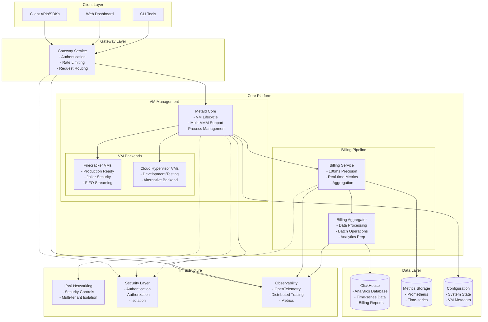
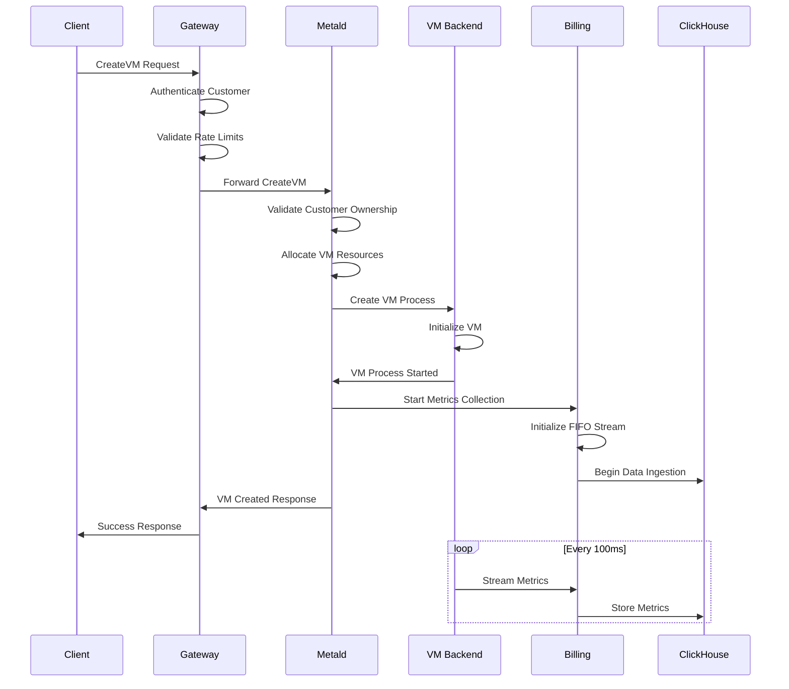
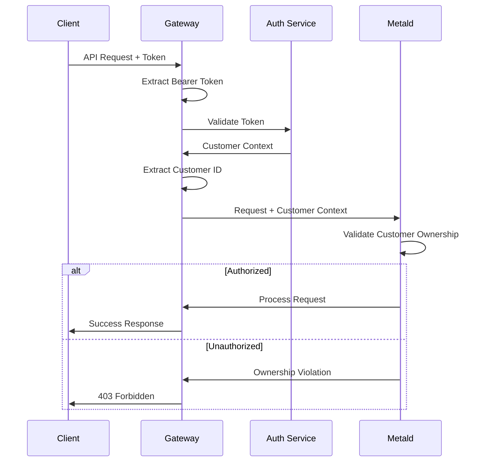
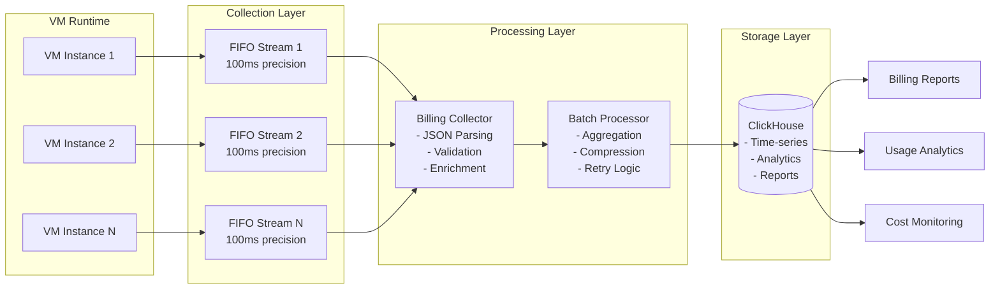
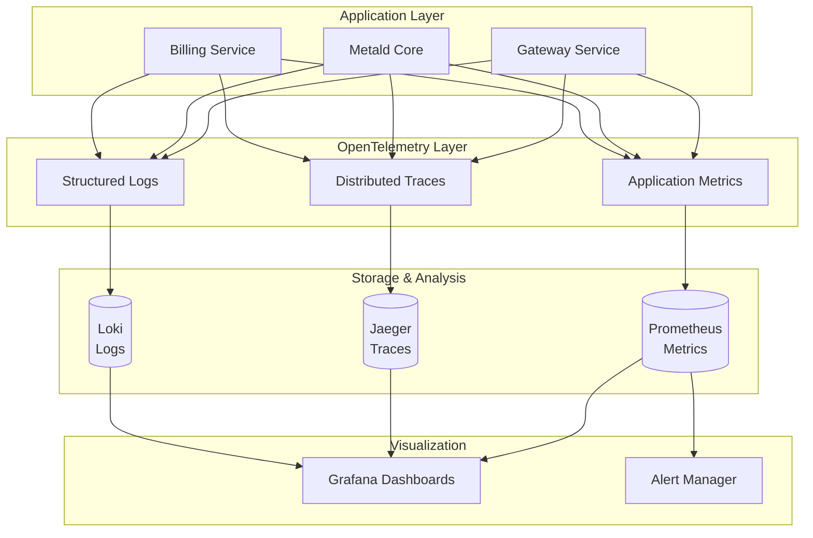
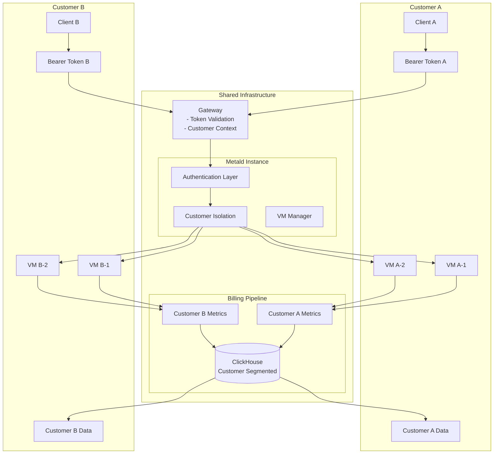
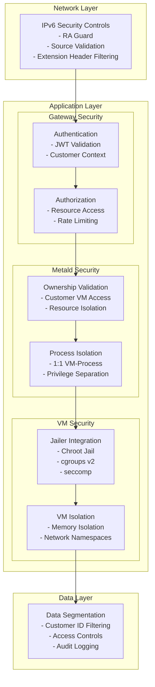
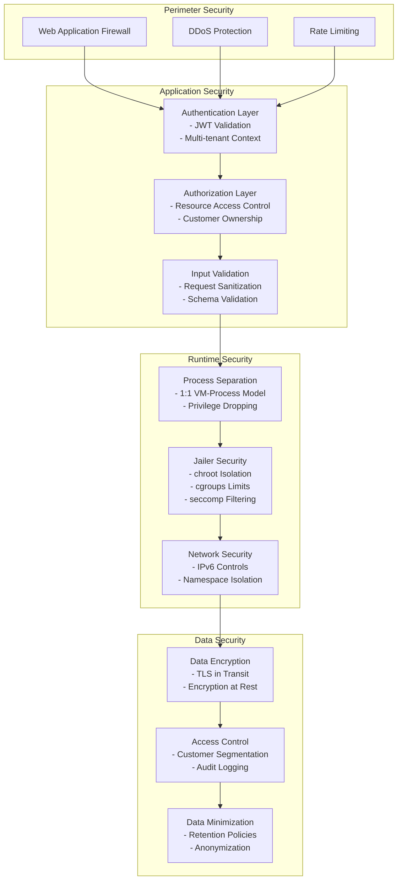
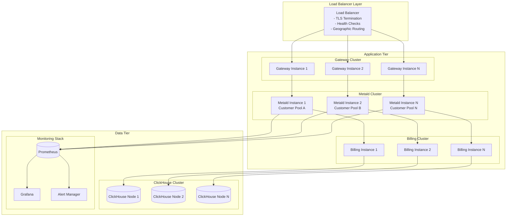

# System Architecture Overview

> Comprehensive guide to the Unkey VM management platform architecture

## Table of Contents
- [High-Level Architecture](#high-level-architecture)
- [Component Overview](#component-overview)
- [Request Flow Architecture](#request-flow-architecture)
- [Data Flow Architecture](#data-flow-architecture)
- [Multi-Tenant Architecture](#multi-tenant-architecture)
- [Security Architecture](#security-architecture)
- [Deployment Architecture](#deployment-architecture)
- [Cross-References](#cross-references)

---

## High-Level Architecture

The Unkey platform consists of four core components orchestrating VM lifecycle management, billing, and analytics:

---

## Component Overview

### Gateway Service
**Purpose**: API gateway handling authentication, routing, and rate limiting  
**Technology**: [To be determined - awaiting implementation]  
**Key Responsibilities**:
- Customer authentication and JWT validation
- Request routing to appropriate metald instances
- Rate limiting and DDoS protection
- Request/response transformation
- API versioning and compatibility

### Metald Core
**Purpose**: VM lifecycle management and multi-VMM orchestration  
**Technology**: Go, ConnectRPC, OpenTelemetry  
**Key Responsibilities**:
- VM creation, boot, shutdown, deletion
- Multi-tenant customer isolation
- Process management (1:1 VM-to-process model)
- Real-time metrics collection
- Backend abstraction (Firecracker/Cloud Hypervisor)

### Billing Service
**Purpose**: Real-time metrics collection and billing aggregation  
**Technology**: Go, 100ms precision streaming, JSON parsing  
**Key Responsibilities**:
- FIFO metrics streaming from VMs
- 100ms precision data collection
- Batch processing and aggregation
- Heartbeat monitoring and failure recovery
- Integration with billing aggregator

### ClickHouse Database
**Purpose**: Analytics database for billing and operational metrics  
**Technology**: ClickHouse (columnar time-series database)  
**Key Responsibilities**:
- Time-series billing data storage
- Real-time analytics queries
- Customer usage reports
- Historical trend analysis
- Data retention management

---

## Request Flow Architecture

### VM Creation Flow

### Authentication Flow

---

## Data Flow Architecture

### Billing Data Pipeline

### Observability Data Flow

---

## Multi-Tenant Architecture

### Customer Isolation Model

### Security Boundaries

---

## Security Architecture

### Defense in Depth Model

---

## Deployment Architecture

### Production Deployment Model

---

## Cross-References

### Component Deep-Dives
- **[Gateway Architecture](components/gateway.md)** - Authentication, routing, and rate limiting
- **[Metald Architecture](components/metald.md)** - VM lifecycle and multi-VMM support
- **[Billing Architecture](components/billing.md)** - Real-time metrics and aggregation
- **[ClickHouse Architecture](components/clickhouse.md)** - Analytics and data storage

### Specialized Architecture Topics
- **[IPv6 Networking](networking/ipv6.md)** - Network architecture and security
- **[Security Overview](security/overview.md)** - Comprehensive security architecture
- **[Data Flow Diagrams](data-flow.md)** - Detailed end-to-end flows

### Operational Architecture
- **[Production Deployment](../deployment/production.md)** - Complete deployment guide
- **[Monitoring Setup](../deployment/monitoring-setup.md)** - Observability architecture
- **[Reliability Guide](../operations/reliability.md)** - High availability and recovery

---

*Last updated: 2025-06-12 | Next review: Architecture Review Board*