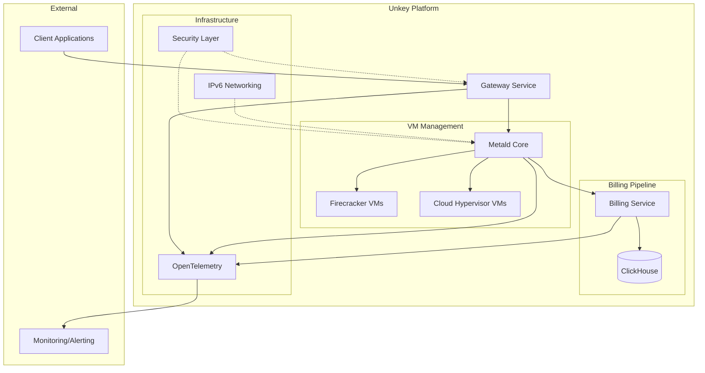

# Metald Documentation

> High-performance VM management platform with multi-tenant billing and IPv6-first networking

## Quick Navigation

### 🏗️ **Architecture & Design**
- **[System Architecture Overview](architecture/overview.md)** - Complete system design and component interactions
- **[Data Flow Diagrams](architecture/data-flow.md)** - End-to-end request and billing flows
- **[Component Architecture](architecture/components/)** - Deep-dive into each system component:
  - [Gateway](architecture/components/gateway.md) - API gateway and request routing
  - [Metald](architecture/components/metald.md) - VM lifecycle management core
  - [Billing System](architecture/components/billing.md) - Real-time metrics and billing
  - [ClickHouse](architecture/components/clickhouse.md) - Analytics and billing aggregation
- **[IPv6 Networking](architecture/networking/ipv6.md)** - Production IPv6 implementation
- **[Security Architecture](architecture/security/overview.md)** - Multi-tenant security and isolation

### 📚 **API Reference**
- **[API Reference](api/reference.md)** - Complete ConnectRPC API documentation
- **[Configuration Guide](api/configuration.md)** - VM and system configuration

### 🚀 **Deployment & Operations**
- **[Production Deployment](deployment/production.md)** - Complete production setup guide
- **[Security Hardening](deployment/security-hardening.md)** - Production security configuration
- **[Monitoring Setup](deployment/monitoring-setup.md)** - Observability and alerting

### 🔧 **Operations & Maintenance**
- **[Operational Runbooks](operations/runbooks/)** - Day-to-day operational procedures:
  - [Common Procedures](operations/runbooks/common-procedures.md) - Routine maintenance
  - [Incident Response](operations/runbooks/incident-response.md) - Emergency procedures
  - [Maintenance Guide](operations/runbooks/maintenance.md) - Planned maintenance
- **[Reliability Guide](operations/reliability.md)** - Health monitoring and recovery
- **[Troubleshooting](operations/troubleshooting.md)** - Problem diagnosis and resolution

### 🛠️ **Development**
- **[Testing Guide](development/testing/stress-testing.md)** - Load testing and validation
- **[Contribution Guide](development/contribution-guide.md)** - Development setup and guidelines

### 📋 **Reference**
- **[Glossary](reference/glossary.md)** - System terminology and concepts
- **[Error Codes](reference/error-codes.md)** - Complete error reference
- **[Metrics Reference](reference/metrics-reference.md)** - Monitoring and alerting metrics

---

## System Overview

## Key Features

- **🔄 Multi-VMM Support** - Unified API for Firecracker and Cloud Hypervisor
- **💰 Real-time Billing** - 100ms precision metrics with ClickHouse analytics
- **🌐 IPv6-First** - Production-hardened IPv6 with security controls
- **🏢 Multi-tenant** - Customer isolation and authentication
- **📊 Observability** - OpenTelemetry tracing and Prometheus metrics
- **⚡ High Performance** - Process-per-VM isolation with FIFO streaming
- **🔒 Security-First** - [Integrated jailer](integrated-jailer.md) and privilege separation

## Getting Started

1. **Understanding the System**: Start with [System Architecture Overview](architecture/overview.md)
2. **API Exploration**: Review [API Reference](api/reference.md) for available operations
3. **Local Development**: Follow [Contribution Guide](development/contribution-guide.md)
4. **Production Deployment**: Use [Production Deployment](deployment/production.md) guide

## Support

- **Documentation Issues**: Found unclear documentation? See [Contribution Guide](development/contribution-guide.md)
- **Operational Issues**: Check [Troubleshooting Guide](operations/troubleshooting.md)
- **Security Issues**: Follow [Incident Response](operations/runbooks/incident-response.md) procedures

---

*Last updated: $(date +%Y-%m-%d) | Version: 1.0*