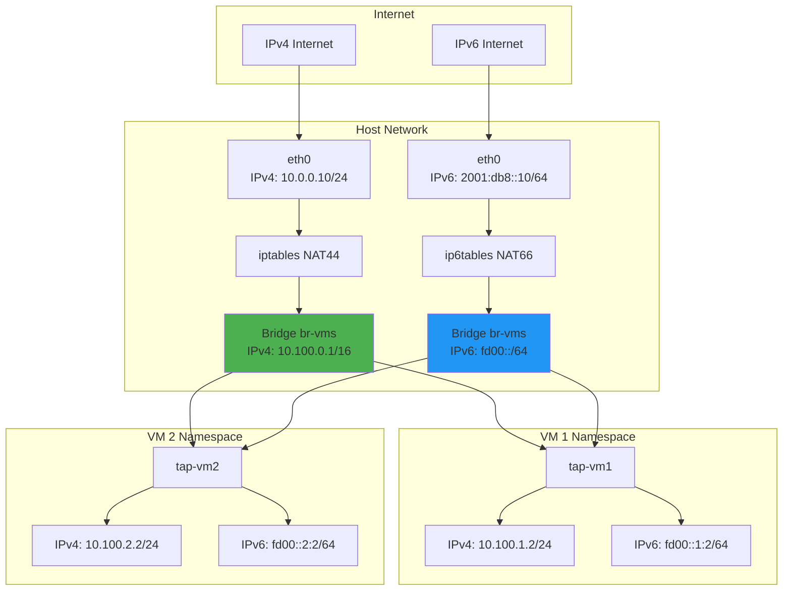

# Dual-Stack (IPv4 + IPv6) Networking Guide

## Overview

This guide details the implementation of dual-stack networking for microVMs, supporting both IPv4 and IPv6 simultaneously, with a migration path to pure IPv6.

## Architecture



## Implementation Changes

### 1. Updated Network Configuration

```go
// internal/network/config.go
package network

import "net"

type Config struct {
    // IPv4 Configuration
    EnableIPv4      bool     `envconfig:"UNKEY_METALD_NETWORK_IPV4_ENABLED" default:"true"`
    BridgeIPv4      string   `envconfig:"UNKEY_METALD_NETWORK_BRIDGE_IPV4" default:"10.100.0.1/16"`
    VMSubnetIPv4    string   `envconfig:"UNKEY_METALD_NETWORK_VM_SUBNET_IPV4" default:"10.100.0.0/16"`
    DNSServersIPv4  []string `envconfig:"UNKEY_METALD_NETWORK_DNS_IPV4" default:"8.8.8.8,8.8.4.4"`
    
    // IPv6 Configuration
    EnableIPv6      bool     `envconfig:"UNKEY_METALD_NETWORK_IPV6_ENABLED" default:"true"`
    BridgeIPv6      string   `envconfig:"UNKEY_METALD_NETWORK_BRIDGE_IPV6" default:"fd00::1/64"`
    VMSubnetIPv6    string   `envconfig:"UNKEY_METALD_NETWORK_VM_SUBNET_IPV6" default:"fd00::/64"`
    DNSServersIPv6  []string `envconfig:"UNKEY_METALD_NETWORK_DNS_IPV6" default:"2606:4700:4700::1111,2606:4700:4700::1001"`
    IPv6Mode        string   `envconfig:"UNKEY_METALD_NETWORK_IPV6_MODE" default:"dual-stack"` // "dual-stack", "ipv6-only", "ipv4-only"
    
    // Common Configuration
    BridgeName      string   `envconfig:"UNKEY_METALD_NETWORK_BRIDGE" default:"br-vms"`
    EnableRateLimit bool     `envconfig:"UNKEY_METALD_NETWORK_RATE_LIMIT" default:"true"`
    RateLimitMbps   int      `envconfig:"UNKEY_METALD_NETWORK_RATE_LIMIT_MBPS" default:"100"`
    
    // IPv6 Specific Options
    IPv6Privacy     bool     `envconfig:"UNKEY_METALD_NETWORK_IPV6_PRIVACY" default:"false"`     // Privacy extensions
    IPv6NATMode     string   `envconfig:"UNKEY_METALD_NETWORK_IPV6_NAT_MODE" default:"masquerade"` // "masquerade", "prefix-translation", "none"
    IPv6Prefix      string   `envconfig:"UNKEY_METALD_NETWORK_IPV6_PREFIX" default:""`          // Public IPv6 prefix if available
}

func DefaultDualStackConfig() *Config {
    return &Config{
        // IPv4
        EnableIPv4:     true,
        BridgeIPv4:     "10.100.0.1/16",
        VMSubnetIPv4:   "10.100.0.0/16",
        DNSServersIPv4: []string{"8.8.8.8", "8.8.4.4"},
        
        // IPv6
        EnableIPv6:     true,
        BridgeIPv6:     "fd00::1/64",
        VMSubnetIPv6:   "fd00::/64",
        DNSServersIPv6: []string{"2606:4700:4700::1111", "2606:4700:4700::1001"},
        IPv6Mode:       "dual-stack",
        
        // Common
        BridgeName:      "br-vms",
        EnableRateLimit: true,
        RateLimitMbps:   100,
    }
}

func PureIPv6Config() *Config {
    config := DefaultDualStackConfig()
    config.EnableIPv4 = false
    config.IPv6Mode = "ipv6-only"
    return config
}
```

### 2. Dual-Stack IP Allocator

```go
// internal/network/allocator_v6.go
package network

import (
    "fmt"
    "net"
    "sync"
)

// DualStackAllocator manages both IPv4 and IPv6 addresses
type DualStackAllocator struct {
    ipv4Allocator *IPAllocator
    ipv6Allocator *IPv6Allocator
    mu            sync.Mutex
}

// IPv6Allocator handles IPv6 address allocation
type IPv6Allocator struct {
    prefix     *net.IPNet
    allocated  map[string]bool
    vmToIP     map[string]net.IP
    mu         sync.Mutex
    
    // IPv6 specific options
    useEUI64   bool // Use EUI-64 for address generation
    usePrivacy bool // Use privacy extensions
}

func NewDualStackAllocator(ipv4Subnet, ipv6Prefix *net.IPNet) *DualStackAllocator {
    return &DualStackAllocator{
        ipv4Allocator: NewIPAllocator(ipv4Subnet),
        ipv6Allocator: NewIPv6Allocator(ipv6Prefix),
    }
}

func NewIPv6Allocator(prefix *net.IPNet) *IPv6Allocator {
    return &IPv6Allocator{
        prefix:    prefix,
        allocated: make(map[string]bool),
        vmToIP:    make(map[string]net.IP),
    }
}

// AllocateIPv6 allocates an IPv6 address
func (a *IPv6Allocator) AllocateIPv6(vmID string, macAddr string) (net.IP, error) {
    a.mu.Lock()
    defer a.mu.Unlock()
    
    var ip net.IP
    
    if a.useEUI64 {
        // Generate IPv6 address using EUI-64 from MAC address
        ip = a.generateEUI64Address(macAddr)
    } else {
        // Sequential allocation for predictable addresses
        ip = a.allocateSequential(vmID)
    }
    
    if ip == nil {
        return nil, fmt.Errorf("failed to allocate IPv6 address")
    }
    
    a.allocated[ip.String()] = true
    a.vmToIP[vmID] = ip
    
    return ip, nil
}

// generateEUI64Address creates an IPv6 address using EUI-64
func (a *IPv6Allocator) generateEUI64Address(macAddr string) net.IP {
    mac, err := net.ParseMAC(macAddr)
    if err != nil {
        return nil
    }
    
    // Convert MAC to EUI-64
    eui64 := make([]byte, 8)
    copy(eui64[:3], mac[:3])
    eui64[3] = 0xff
    eui64[4] = 0xfe
    copy(eui64[5:], mac[3:])
    
    // Flip the universal/local bit
    eui64[0] ^= 0x02
    
    // Combine prefix with EUI-64
    ip := make(net.IP, 16)
    copy(ip, a.prefix.IP)
    copy(ip[8:], eui64)
    
    return ip
}

// allocateSequential allocates addresses sequentially
func (a *IPv6Allocator) allocateSequential(vmID string) net.IP {
    // For fd00::/64, allocate fd00::1:1, fd00::1:2, etc.
    baseIP := make(net.IP, 16)
    copy(baseIP, a.prefix.IP)
    
    // Use a simple counter for the interface ID
    for i := uint32(1); i < 65536; i++ {
        // Set the interface ID
        baseIP[14] = byte(i >> 8)
        baseIP[15] = byte(i & 0xff)
        
        if !a.allocated[baseIP.String()] {
            ip := make(net.IP, 16)
            copy(ip, baseIP)
            return ip
        }
    }
    
    return nil
}

// AllocateDualStack allocates both IPv4 and IPv6 addresses
func (d *DualStackAllocator) AllocateDualStack(vmID, macAddr string) (ipv4, ipv6 net.IP, err error) {
    d.mu.Lock()
    defer d.mu.Unlock()
    
    // Allocate IPv4
    if d.ipv4Allocator != nil {
        ipv4, err = d.ipv4Allocator.AllocateIP()
        if err != nil {
            return nil, nil, fmt.Errorf("failed to allocate IPv4: %w", err)
        }
        d.ipv4Allocator.AssignIPToVM(vmID, ipv4)
    }
    
    // Allocate IPv6
    if d.ipv6Allocator != nil {
        ipv6, err = d.ipv6Allocator.AllocateIPv6(vmID, macAddr)
        if err != nil {
            // Rollback IPv4 allocation
            if ipv4 != nil {
                d.ipv4Allocator.ReleaseIP(ipv4)
            }
            return nil, nil, fmt.Errorf("failed to allocate IPv6: %w", err)
        }
    }
    
    return ipv4, ipv6, nil
}
```

### 3. Updated Network Manager for Dual-Stack

```go
// internal/network/manager_v6.go
package network

import (
    "context"
    "fmt"
    "log/slog"
    "net"
    "os"
    "os/exec"
)

// DualStackManager handles both IPv4 and IPv6 networking
type DualStackManager struct {
    *Manager // Embed the original manager
    
    ipv6Config   *IPv6Config
    ipv6Subnet   *net.IPNet
    dsAllocator  *DualStackAllocator
}

// IPv6Config holds IPv6-specific configuration
type IPv6Config struct {
    Enabled      bool
    BridgeIPv6   string
    VMSubnetIPv6 string
    DNSServersV6 []string
    Mode         string // "dual-stack", "ipv6-only"
    UseNAT66     bool
    PublicPrefix string // If you have a public IPv6 prefix
}

// NewDualStackManager creates a manager supporting both IPv4 and IPv6
func NewDualStackManager(logger *slog.Logger, config *Config) (*DualStackManager, error) {
    // Create base manager for IPv4
    baseMgr, err := NewManager(logger, config)
    if err != nil && config.EnableIPv4 {
        return nil, fmt.Errorf("failed to create IPv4 manager: %w", err)
    }
    
    dsm := &DualStackManager{
        Manager: baseMgr,
    }
    
    // Setup IPv6 if enabled
    if config.EnableIPv6 {
        _, ipv6Subnet, err := net.ParseCIDR(config.VMSubnetIPv6)
        if err != nil {
            return nil, fmt.Errorf("invalid IPv6 subnet: %w", err)
        }
        
        dsm.ipv6Subnet = ipv6Subnet
        dsm.ipv6Config = &IPv6Config{
            Enabled:      config.EnableIPv6,
            BridgeIPv6:   config.BridgeIPv6,
            VMSubnetIPv6: config.VMSubnetIPv6,
            DNSServersV6: config.DNSServersIPv6,
            Mode:         config.IPv6Mode,
            UseNAT66:     config.IPv6NATMode != "none",
            PublicPrefix: config.IPv6Prefix,
        }
        
        // Create dual-stack allocator
        var ipv4Subnet *net.IPNet
        if config.EnableIPv4 {
            _, ipv4Subnet, _ = net.ParseCIDR(config.VMSubnetIPv4)
        }
        dsm.dsAllocator = NewDualStackAllocator(ipv4Subnet, ipv6Subnet)
        
        // Initialize IPv6 on host
        if err := dsm.initializeIPv6(); err != nil {
            return nil, fmt.Errorf("failed to initialize IPv6: %w", err)
        }
    }
    
    return dsm, nil
}

// initializeIPv6 sets up IPv6 on the host
func (m *DualStackManager) initializeIPv6() error {
    // Enable IPv6 forwarding
    if err := os.WriteFile("/proc/sys/net/ipv6/conf/all/forwarding", []byte("1\n"), 0644); err != nil {
        return fmt.Errorf("failed to enable IPv6 forwarding: %w", err)
    }
    
    // Disable IPv6 autoconf on bridge (we'll manage addresses)
    if err := os.WriteFile("/proc/sys/net/ipv6/conf/br-vms/autoconf", []byte("0\n"), 0644); err != nil {
        // Non-fatal, bridge might not exist yet
        m.logger.Debug("could not disable IPv6 autoconf on bridge", "error", err)
    }
    
    // Add IPv6 address to bridge
    if err := m.ensureBridgeIPv6(); err != nil {
        return fmt.Errorf("failed to setup bridge IPv6: %w", err)
    }
    
    // Setup IPv6 NAT if needed
    if m.ipv6Config.UseNAT66 {
        if err := m.setupIPv6NAT(); err != nil {
            return fmt.Errorf("failed to setup IPv6 NAT: %w", err)
        }
    }
    
    return nil
}

// ensureBridgeIPv6 adds IPv6 address to the bridge
func (m *DualStackManager) ensureBridgeIPv6() error {
    br, err := netlink.LinkByName(m.config.BridgeName)
    if err != nil {
        return fmt.Errorf("bridge not found: %w", err)
    }
    
    addr, err := netlink.ParseAddr(m.ipv6Config.BridgeIPv6)
    if err != nil {
        return fmt.Errorf("invalid bridge IPv6 address: %w", err)
    }
    
    // Check if address already exists
    addrs, err := netlink.AddrList(br, netlink.FAMILY_V6)
    if err != nil {
        return fmt.Errorf("failed to list addresses: %w", err)
    }
    
    for _, existing := range addrs {
        if existing.Equal(*addr) {
            return nil // Already configured
        }
    }
    
    // Add the address
    if err := netlink.AddrAdd(br, addr); err != nil {
        return fmt.Errorf("failed to add IPv6 address to bridge: %w", err)
    }
    
    m.logger.Info("added IPv6 address to bridge",
        slog.String("address", m.ipv6Config.BridgeIPv6),
    )
    
    return nil
}

// setupIPv6NAT configures NAT66 for IPv6
func (m *DualStackManager) setupIPv6NAT() error {
    // Get default IPv6 route interface
    routes, err := netlink.RouteList(nil, netlink.FAMILY_V6)
    if err != nil {
        return fmt.Errorf("failed to list IPv6 routes: %w", err)
    }
    
    var defaultIface string
    for _, route := range routes {
        if route.Dst == nil && route.Gw != nil { // Default route with gateway
            link, err := netlink.LinkByIndex(route.LinkIndex)
            if err == nil {
                defaultIface = link.Attrs().Name
                break
            }
        }
    }
    
    if defaultIface == "" {
        m.logger.Warn("no default IPv6 route found, skipping NAT66 setup")
        return nil
    }
    
    // Setup NAT66 rules
    rules := [][]string{
        // Enable NAT66 for private IPv6 subnet
        {"-t", "nat", "-A", "POSTROUTING", "-s", m.ipv6Config.VMSubnetIPv6, "-o", defaultIface, "-j", "MASQUERADE"},
        
        // Allow forwarding
        {"-A", "FORWARD", "-i", m.config.BridgeName, "-o", defaultIface, "-j", "ACCEPT"},
        {"-A", "FORWARD", "-i", defaultIface, "-o", m.config.BridgeName, "-m", "state", "--state", "RELATED,ESTABLISHED", "-j", "ACCEPT"},
    }
    
    for _, rule := range rules {
        cmd := exec.Command("ip6tables", rule...)
        if err := cmd.Run(); err != nil {
            m.logger.Warn("failed to add ip6tables rule",
                slog.String("rule", strings.Join(rule, " ")),
                slog.String("error", err.Error()),
            )
        }
    }
    
    return nil
}

// CreateVMNetwork creates dual-stack networking for a VM
func (m *DualStackManager) CreateVMNetwork(ctx context.Context, vmID string) (*DualStackVMNetwork, error) {
    m.mu.Lock()
    defer m.mu.Unlock()
    
    // Generate MAC address
    mac := m.generateMAC(vmID)
    
    // Allocate IPs
    ipv4, ipv6, err := m.dsAllocator.AllocateDualStack(vmID, mac)
    if err != nil {
        return nil, fmt.Errorf("failed to allocate IPs: %w", err)
    }
    
    // Create namespace and setup networking
    nsName := fmt.Sprintf("vm-%s", vmID)
    if err := m.createNamespace(nsName); err != nil {
        m.dsAllocator.ReleaseDualStack(ipv4, ipv6)
        return nil, fmt.Errorf("failed to create namespace: %w", err)
    }
    
    // Setup TAP and networking
    tapName := fmt.Sprintf("tap%s", vmID[:8])
    if err := m.setupDualStackNetworking(nsName, tapName, ipv4, ipv6, mac); err != nil {
        m.dsAllocator.ReleaseDualStack(ipv4, ipv6)
        m.deleteNamespace(nsName)
        return nil, fmt.Errorf("failed to setup networking: %w", err)
    }
    
    // Create network info
    vmNet := &DualStackVMNetwork{
        VMNetwork: VMNetwork{
            VMID:       vmID,
            Namespace:  nsName,
            TapDevice:  tapName,
            MacAddress: mac,
            CreatedAt:  time.Now(),
        },
        IPv4Config: &IPv4Config{
            Address:    ipv4,
            Netmask:    net.IPv4Mask(255, 255, 255, 0),
            Gateway:    m.getIPv4Gateway(),
            DNSServers: m.config.DNSServersIPv4,
        },
        IPv6Config: &IPv6Config{
            Address:    ipv6,
            Prefix:     64,
            Gateway:    m.getIPv6Gateway(),
            DNSServers: m.ipv6Config.DNSServersV6,
        },
        Mode: m.ipv6Config.Mode,
    }
    
    m.vmNetworks[vmID] = vmNet
    
    m.logger.Info("created dual-stack VM network",
        slog.String("vm_id", vmID),
        slog.String("ipv4", ipv4.String()),
        slog.String("ipv6", ipv6.String()),
        slog.String("mac", mac),
    )
    
    return vmNet, nil
}

// setupDualStackNetworking configures both IPv4 and IPv6 in the namespace
func (m *DualStackManager) setupDualStackNetworking(nsName, tapName string, ipv4, ipv6 net.IP, mac string) error {
    // First setup the basic infrastructure (veth, tap, bridge)
    if err := m.setupVMNetworking(nsName, tapName, ipv4, mac); err != nil {
        return err
    }
    
    // Now add IPv6 configuration
    if ipv6 != nil && m.ipv6Config.Enabled {
        if err := m.addIPv6ToNamespace(nsName, ipv6); err != nil {
            return fmt.Errorf("failed to add IPv6: %w", err)
        }
    }
    
    return nil
}

// addIPv6ToNamespace adds IPv6 configuration to existing namespace
func (m *DualStackManager) addIPv6ToNamespace(nsName string, ipv6 net.IP) error {
    ns, err := netns.GetFromName(nsName)
    if err != nil {
        return fmt.Errorf("failed to get namespace: %w", err)
    }
    defer ns.Close()
    
    origNS, err := netns.Get()
    if err != nil {
        return fmt.Errorf("failed to get current namespace: %w", err)
    }
    defer origNS.Close()
    
    // Switch to target namespace
    if err := netns.Set(ns); err != nil {
        return fmt.Errorf("failed to set namespace: %w", err)
    }
    defer netns.Set(origNS)
    
    // Get the bridge interface
    br, err := netlink.LinkByName("br0")
    if err != nil {
        return fmt.Errorf("failed to get bridge in namespace: %w", err)
    }
    
    // Add IPv6 address
    addr := &netlink.Addr{
        IPNet: &net.IPNet{
            IP:   ipv6,
            Mask: net.CIDRMask(64, 128),
        },
    }
    
    if err := netlink.AddrAdd(br, addr); err != nil {
        return fmt.Errorf("failed to add IPv6 address: %w", err)
    }
    
    // Add IPv6 default route
    route := &netlink.Route{
        Dst:      nil, // default route
        Gw:       m.getIPv6Gateway(),
        Protocol: 2, // boot protocol
    }
    
    if err := netlink.RouteAdd(route); err != nil {
        return fmt.Errorf("failed to add IPv6 route: %w", err)
    }
    
    // Enable IPv6 on interfaces
    for _, iface := range []string{"br0", tapName, "lo"} {
        path := fmt.Sprintf("/proc/sys/net/ipv6/conf/%s/disable_ipv6", iface)
        os.WriteFile(path, []byte("0\n"), 0644)
    }
    
    return nil
}

func (m *DualStackManager) getIPv6Gateway() net.IP {
    // Use ::1 address of the subnet as gateway
    _, subnet, _ := net.ParseCIDR(m.ipv6Config.VMSubnetIPv6)
    gw := make(net.IP, 16)
    copy(gw, subnet.IP)
    gw[15] = 1
    return gw
}
```

### 4. Updated VM Network Types

```go
// internal/network/types_v6.go
package network

import (
    "fmt"
    "net"
    "time"
)

// DualStackVMNetwork contains both IPv4 and IPv6 configuration
type DualStackVMNetwork struct {
    VMNetwork          // Embed base network info
    IPv4Config *IPv4Config `json:"ipv4_config,omitempty"`
    IPv6Config *IPv6Config `json:"ipv6_config,omitempty"`
    Mode       string      `json:"mode"` // "dual-stack", "ipv4-only", "ipv6-only"
}

type IPv4Config struct {
    Address    net.IP   `json:"address"`
    Netmask    net.IPMask `json:"netmask"`
    Gateway    net.IP   `json:"gateway"`
    DNSServers []string `json:"dns_servers"`
}

type IPv6Config struct {
    Address       net.IP   `json:"address"`
    Prefix        int      `json:"prefix_length"`
    Gateway       net.IP   `json:"gateway"`
    DNSServers    []string `json:"dns_servers"`
    LinkLocal     net.IP   `json:"link_local,omitempty"`
    PrivacyAddr   net.IP   `json:"privacy_address,omitempty"`
}

// GenerateCloudInitNetworkV2 generates cloud-init v2 network config for dual-stack
func (n *DualStackVMNetwork) GenerateCloudInitNetworkV2() map[string]interface{} {
    config := map[string]interface{}{
        "version": 2,
        "ethernets": map[string]interface{}{
            "eth0": map[string]interface{}{
                "match": map[string]interface{}{
                    "macaddress": n.MacAddress,
                },
            },
        },
    }
    
    eth0Config := config["ethernets"].(map[string]interface{})["eth0"].(map[string]interface{})
    addresses := []string{}
    
    // Add IPv4 configuration
    if n.IPv4Config != nil && n.Mode != "ipv6-only" {
        addresses = append(addresses, fmt.Sprintf("%s/24", n.IPv4Config.Address.String()))
        eth0Config["gateway4"] = n.IPv4Config.Gateway.String()
        
        if len(n.IPv4Config.DNSServers) > 0 {
            if eth0Config["nameservers"] == nil {
                eth0Config["nameservers"] = map[string]interface{}{}
            }
            ns := eth0Config["nameservers"].(map[string]interface{})
            ns["addresses"] = append(ns["addresses"].([]string), n.IPv4Config.DNSServers...)
        }
    }
    
    // Add IPv6 configuration
    if n.IPv6Config != nil && n.Mode != "ipv4-only" {
        addresses = append(addresses, fmt.Sprintf("%s/%d", n.IPv6Config.Address.String(), n.IPv6Config.Prefix))
        eth0Config["gateway6"] = n.IPv6Config.Gateway.String()
        
        // Disable IPv6 privacy extensions for servers
        eth0Config["ipv6-privacy"] = false
        
        if len(n.IPv6Config.DNSServers) > 0 {
            if eth0Config["nameservers"] == nil {
                eth0Config["nameservers"] = map[string]interface{}{}
            }
            ns := eth0Config["nameservers"].(map[string]interface{})
            if ns["addresses"] == nil {
                ns["addresses"] = []string{}
            }
            ns["addresses"] = append(ns["addresses"].([]string), n.IPv6Config.DNSServers...)
        }
    }
    
    eth0Config["addresses"] = addresses
    
    return config
}

// KernelCmdlineArgs returns kernel cmdline for dual-stack
func (n *DualStackVMNetwork) KernelCmdlineArgs() string {
    args := ""
    
    // IPv4 configuration
    if n.IPv4Config != nil && n.Mode != "ipv6-only" {
        args += fmt.Sprintf("ip=%s::%s:%s:vm::off ",
            n.IPv4Config.Address.String(),
            n.IPv4Config.Gateway.String(),
            n.IPv4Config.Netmask.String(),
        )
    }
    
    // IPv6 configuration (using ip= syntax with IPv6)
    if n.IPv6Config != nil && n.Mode != "ipv4-only" {
        args += fmt.Sprintf("ip=%s::%s:64:vm::off ",
            n.IPv6Config.Address.String(),
            n.IPv6Config.Gateway.String(),
        )
    }
    
    return args
}

// GenerateSystemdNetworkConfig generates systemd-networkd configuration
func (n *DualStackVMNetwork) GenerateSystemdNetworkConfig() string {
    config := "[Match]\n"
    config += fmt.Sprintf("MACAddress=%s\n", n.MacAddress)
    config += "\n[Network]\n"
    
    // IPv4
    if n.IPv4Config != nil && n.Mode != "ipv6-only" {
        config += fmt.Sprintf("Address=%s/24\n", n.IPv4Config.Address.String())
        config += fmt.Sprintf("Gateway=%s\n", n.IPv4Config.Gateway.String())
        for _, dns := range n.IPv4Config.DNSServers {
            config += fmt.Sprintf("DNS=%s\n", dns)
        }
    }
    
    // IPv6
    if n.IPv6Config != nil && n.Mode != "ipv4-only" {
        config += fmt.Sprintf("Address=%s/%d\n", n.IPv6Config.Address.String(), n.IPv6Config.Prefix)
        config += fmt.Sprintf("Gateway=%s\n", n.IPv6Config.Gateway.String())
        for _, dns := range n.IPv6Config.DNSServers {
            config += fmt.Sprintf("DNS=%s\n", dns)
        }
        config += "IPv6PrivacyExtensions=no\n"
        config += "IPv6AcceptRA=no\n"
    }
    
    return config
}
```

### 5. Host Setup Script for Dual-Stack

```bash
#!/bin/bash
# setup-dual-stack-host.sh

set -e

echo "=== Setting up Dual-Stack Networking for MicroVMs ==="

# Enable IP forwarding for both IPv4 and IPv6
echo 1 > /proc/sys/net/ipv4/ip_forward
echo 1 > /proc/sys/net/ipv6/conf/all/forwarding

# Create bridge
ip link add name br-vms type bridge 2>/dev/null || true

# Add IPv4 address
ip addr add 10.100.0.1/16 dev br-vms 2>/dev/null || true

# Add IPv6 address
ip -6 addr add fd00::1/64 dev br-vms 2>/dev/null || true

# Bring up bridge
ip link set br-vms up

# Get default interfaces
DEFAULT_V4=$(ip -4 route | grep default | awk '{print $5}' | head -1)
DEFAULT_V6=$(ip -6 route | grep default | awk '{print $5}' | head -1)

echo "Default IPv4 interface: $DEFAULT_V4"
echo "Default IPv6 interface: $DEFAULT_V6"

# Setup IPv4 NAT
iptables -t nat -C POSTROUTING -s 10.100.0.0/16 -o $DEFAULT_V4 -j MASQUERADE 2>/dev/null || \
iptables -t nat -A POSTROUTING -s 10.100.0.0/16 -o $DEFAULT_V4 -j MASQUERADE

iptables -C FORWARD -i br-vms -o $DEFAULT_V4 -j ACCEPT 2>/dev/null || \
iptables -A FORWARD -i br-vms -o $DEFAULT_V4 -j ACCEPT

iptables -C FORWARD -i $DEFAULT_V4 -o br-vms -m state --state RELATED,ESTABLISHED -j ACCEPT 2>/dev/null || \
iptables -A FORWARD -i $DEFAULT_V4 -o br-vms -m state --state RELATED,ESTABLISHED -j ACCEPT

# Setup IPv6 NAT (if no public prefix available)
if [ -n "$DEFAULT_V6" ]; then
    ip6tables -t nat -C POSTROUTING -s fd00::/64 -o $DEFAULT_V6 -j MASQUERADE 2>/dev/null || \
    ip6tables -t nat -A POSTROUTING -s fd00::/64 -o $DEFAULT_V6 -j MASQUERADE
    
    ip6tables -C FORWARD -i br-vms -o $DEFAULT_V6 -j ACCEPT 2>/dev/null || \
    ip6tables -A FORWARD -i br-vms -o $DEFAULT_V6 -j ACCEPT
    
    ip6tables -C FORWARD -i $DEFAULT_V6 -o br-vms -m state --state RELATED,ESTABLISHED -j ACCEPT 2>/dev/null || \
    ip6tables -A FORWARD -i $DEFAULT_V6 -o br-vms -m state --state RELATED,ESTABLISHED -j ACCEPT
fi

# Optimize for performance
cat >> /etc/sysctl.conf << EOF
# Dual-stack optimizations
net.ipv4.conf.all.forwarding = 1
net.ipv6.conf.all.forwarding = 1
net.ipv6.conf.default.forwarding = 1

# Disable IPv6 router advertisements on bridge
net.ipv6.conf.br-vms.accept_ra = 0
net.ipv6.conf.br-vms.autoconf = 0

# Increase neighbor cache
net.ipv4.neigh.default.gc_thresh1 = 1024
net.ipv4.neigh.default.gc_thresh2 = 2048
net.ipv4.neigh.default.gc_thresh3 = 4096
net.ipv6.neigh.default.gc_thresh1 = 1024
net.ipv6.neigh.default.gc_thresh2 = 2048
net.ipv6.neigh.default.gc_thresh3 = 4096
EOF

sysctl -p

echo "=== Dual-Stack Setup Complete ==="
echo "IPv4 subnet: 10.100.0.0/16"
echo "IPv6 subnet: fd00::/64"
```

### 6. Testing Dual-Stack

```go
// internal/network/manager_test.go
func TestDualStackNetworking(t *testing.T) {
    config := &Config{
        EnableIPv4:     true,
        EnableIPv6:     true,
        IPv6Mode:       "dual-stack",
        BridgeName:     "br-test",
        BridgeIPv4:     "172.16.0.1/16",
        BridgeIPv6:     "fd00:test::1/64",
        VMSubnetIPv4:   "172.16.0.0/16",
        VMSubnetIPv6:   "fd00:test::/64",
    }
    
    mgr, err := NewDualStackManager(testLogger, config)
    require.NoError(t, err)
    defer mgr.Shutdown(context.Background())
    
    // Create VM network
    vmNet, err := mgr.CreateVMNetwork(context.Background(), "test-vm-1")
    require.NoError(t, err)
    
    // Verify both addresses allocated
    assert.NotNil(t, vmNet.IPv4Config)
    assert.NotNil(t, vmNet.IPv6Config)
    assert.Equal(t, "dual-stack", vmNet.Mode)
    
    // Test connectivity
    testDualStackConnectivity(t, vmNet)
}

func TestIPv6OnlyMode(t *testing.T) {
    config := PureIPv6Config()
    config.BridgeName = "br-test-v6"
    
    mgr, err := NewDualStackManager(testLogger, config)
    require.NoError(t, err)
    defer mgr.Shutdown(context.Background())
    
    vmNet, err := mgr.CreateVMNetwork(context.Background(), "test-vm-v6")
    require.NoError(t, err)
    
    // Verify only IPv6 allocated
    assert.Nil(t, vmNet.IPv4Config)
    assert.NotNil(t, vmNet.IPv6Config)
    assert.Equal(t, "ipv6-only", vmNet.Mode)
}
```

### 7. Migration Path to Pure IPv6

```go
// Migration utilities
package network

// MigrateToIPv6Only helps transition from dual-stack to IPv6-only
type MigrationHelper struct {
    manager *DualStackManager
    logger  *slog.Logger
}

func (m *MigrationHelper) PrepareIPv6OnlyMigration(ctx context.Context) error {
    // 1. Ensure all VMs have IPv6 addresses
    for vmID, net := range m.manager.vmNetworks {
        if net.IPv6Config == nil {
            m.logger.Warn("VM missing IPv6 config",
                slog.String("vm_id", vmID),
            )
        }
    }
    
    // 2. Update DNS to include AAAA records
    // 3. Test IPv6 connectivity for all services
    // 4. Update load balancers to support IPv6
    
    return nil
}

func (m *MigrationHelper) SwitchToIPv6Only(ctx context.Context) error {
    // 1. Update configuration
    m.manager.config.EnableIPv4 = false
    m.manager.config.IPv6Mode = "ipv6-only"
    
    // 2. Remove IPv4 addresses from new VMs
    // 3. Keep existing VMs dual-stack until recreation
    
    return nil
}
```

## Summary

This dual-stack implementation provides:

1. **Full IPv4/IPv6 Support**: Both protocols work simultaneously
2. **Flexible Configuration**: Can run dual-stack, IPv4-only, or IPv6-only
3. **Migration Path**: Gradual transition from IPv4 to IPv6
4. **Standards Compliance**: Proper IPv6 addressing (EUI-64, privacy extensions)
5. **Performance**: No overhead for IPv6-only deployments
6. **Compatibility**: Works with existing IPv4-only infrastructure

The system defaults to dual-stack but can be configured for pure IPv6 deployments, making it future-proof while maintaining compatibility with current infrastructure.