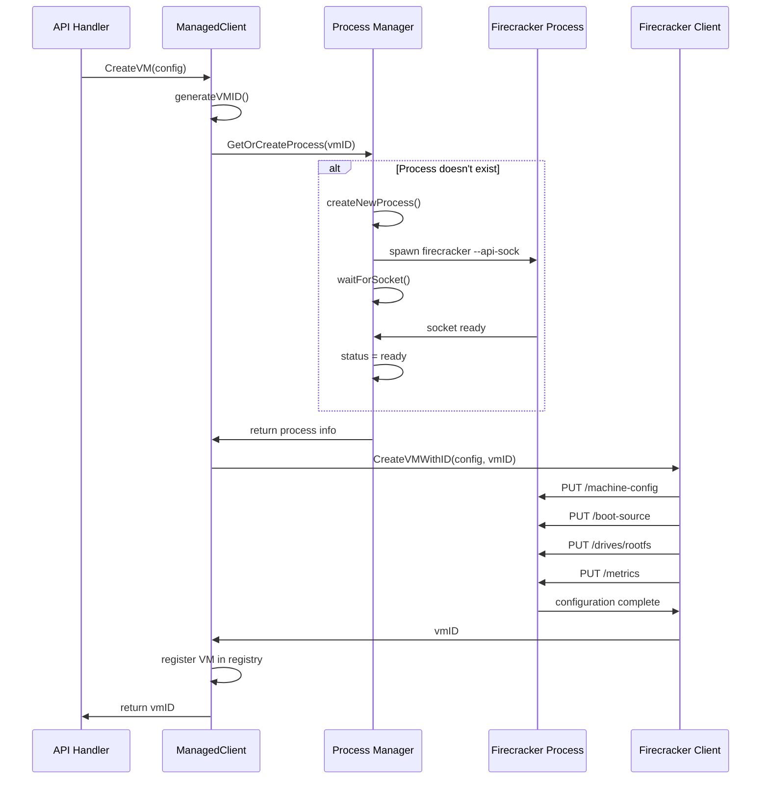
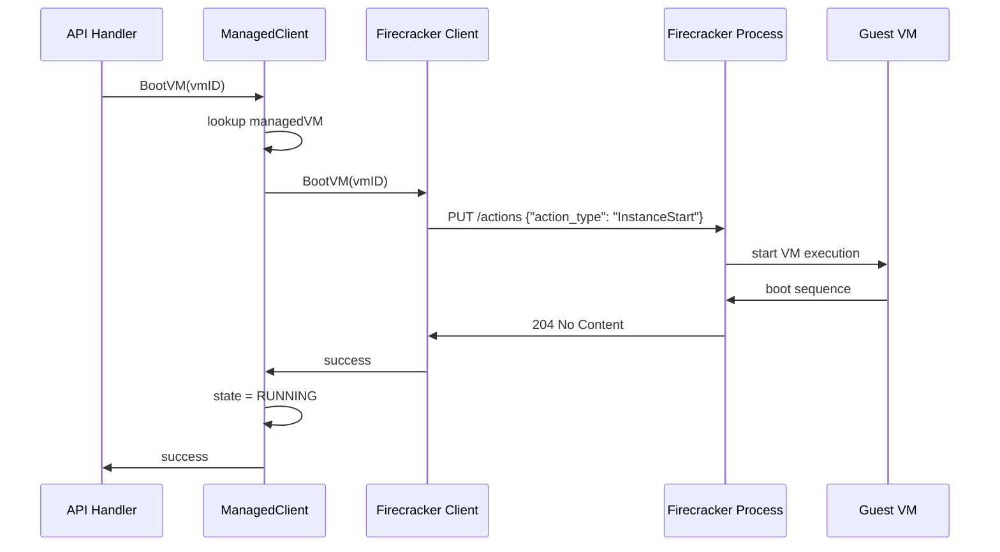
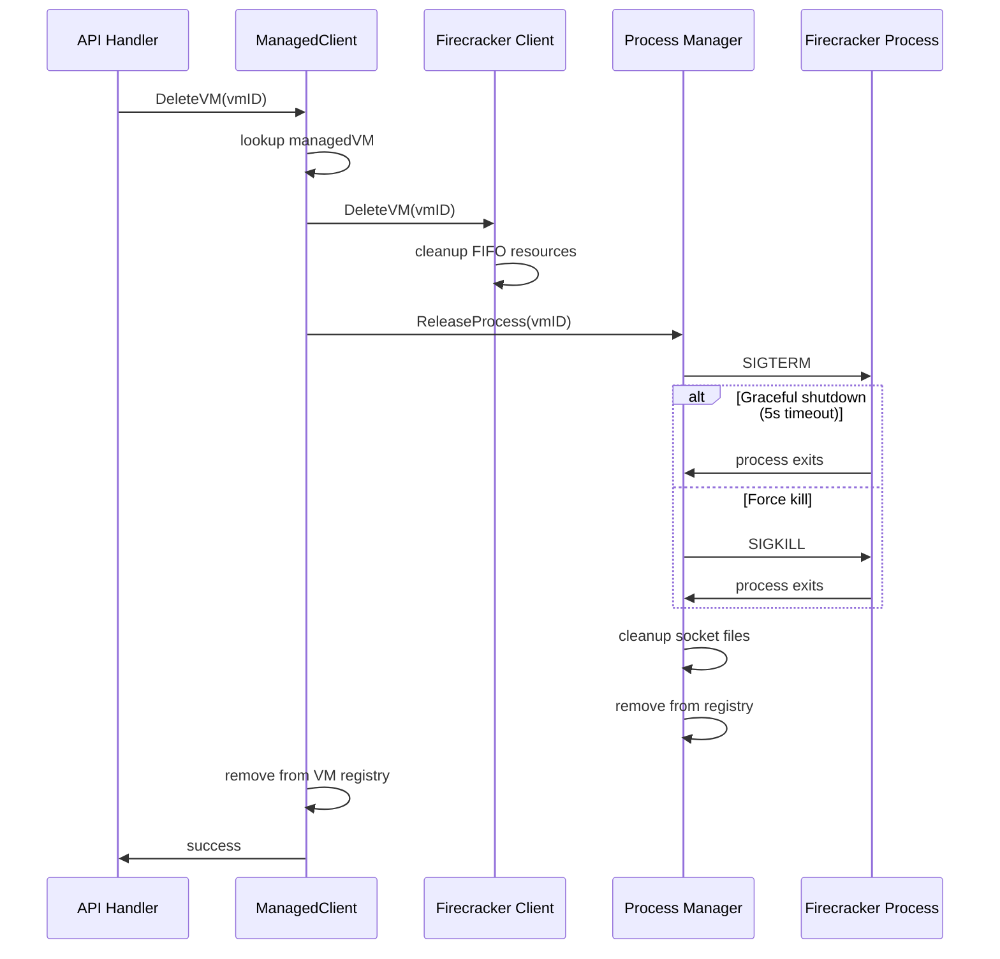
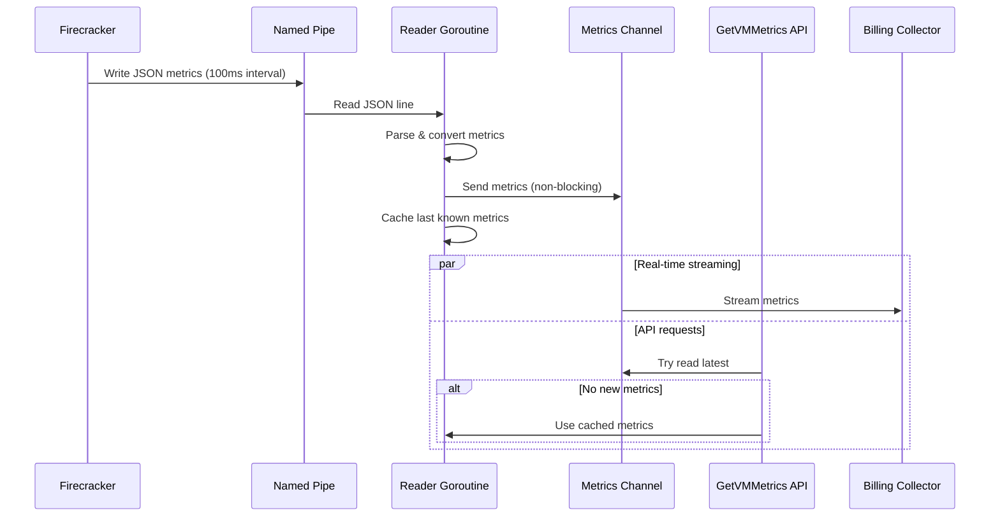

# Firecracker Process Manager Architecture

## Overview

The metald Firecracker Process Manager implements a **1:1 VM-to-Process model** where each VM gets its own dedicated Firecracker process. This architecture provides strong isolation, security, and predictable resource management at the cost of slightly higher resource overhead.

## Architecture Components

### Core Components

```
┌─────────────────────────────────────────────────────────────────┐
│                      metald Service Layer                       │
├─────────────────────────────────────────────────────────────────┤
│  ManagedClient (Firecracker Backend Interface)                  │
│  ├─ VM Registry (vmID → managedVM mapping)                      │
│  └─ Client Pool (per-process Firecracker clients)               │
├─────────────────────────────────────────────────────────────────┤
│  Process Manager                                                │
│  ├─ Process Registry (processID → FirecrackerProcess)           │
│  ├─ Socket Management (/tmp/.../sockets/)                       │
│  ├─ Process Lifecycle (spawn, monitor, cleanup)                 │
│  └─ Resource Limits (max 25 processes)                          │
├─────────────────────────────────────────────────────────────────┤
│  Firecracker Processes (1:1 with VMs)                           │
│  ├─ Process 1: VM-abc123 (/tmp/.../fc-1234.sock)                │
│  ├─ Process 2: VM-def456 (/tmp/.../fc-5678.sock)                │
│  └─ Process N: VM-xyz789 (/tmp/.../fc-9999.sock)                │
└─────────────────────────────────────────────────────────────────┘
```

### Component Relationships

- **ManagedClient**: Main backend interface that coordinates VM operations
- **Process Manager**: Handles Firecracker process lifecycle and socket management
- **FirecrackerProcess**: Represents individual Firecracker daemon instances
- **Client**: Per-process HTTP client for Firecracker API communication

## Process Lifecycle Flow

### 1. VM Creation Flow



### 2. VM Boot Flow



### 3. VM Deletion Flow



## Process Management Details

### Process Isolation Model

Each VM gets a **dedicated Firecracker process** with:

- **Isolated socket**: `/tmp/.../sockets/fc-{timestamp}.sock`
- **Dedicated log file**: `/tmp/.../logs/fc-{timestamp}.log`
- **Process group isolation**: `setpgid(true)` for clean termination
- **Resource isolation**: Memory and CPU usage per process
- **Security isolation**: Process-level permissions and capabilities

### Socket Management

The process manager maintains Unix domain sockets for communication:

```
/tmp/github.com/unkeyed/unkey/go/deploy/metald/sockets/
├── fc-1749624850123456789.sock  (VM: ud-a1b2c3d4)
├── fc-1749624851234567890.sock  (VM: ud-e5f6g7h8)
└── fc-1749624852345678901.sock  (VM: ud-i9j0k1l2)
```

### Process Monitoring

Each process is monitored by a dedicated goroutine that:

1. **Waits for process exit** using `Process.Wait()`
2. **Logs unexpected exits** with exit codes and uptime
3. **Cleans up resources** (sockets, registry entries, log files)
4. **Handles panics** with recovery and logging

### Resource Limits

- **Max processes**: 25 (configurable, optimized for 32-core hosts)
- **Startup timeout**: 30 seconds for socket availability
- **Graceful shutdown**: 5 seconds before force kill
- **Memory overhead**: ~50MB per Firecracker process

## FIFO Metrics Streaming

### Architecture

```mermaid
graph TB
    subgraph "Firecracker Process"
        FC[Firecracker VMM]
        FIFO[/tmp/firecracker-metrics-{vmID}.fifo]
        FC --> FIFO
    end

    subgraph "metald Process"
        Reader[FIFO Reader Goroutine]
        Channel[Buffered Channel<br/>100 metrics]
        Cache[Last Known Metrics]
        API[GetVMMetrics API]

        FIFO --> Reader
        Reader --> Channel
        Reader --> Cache
        Channel --> API
        Cache --> API
    end

    subgraph "Billing System"
        Collector[Billing Collector]
        Stream[Real-time Stream]

        API --> Collector
        Channel --> Stream
    end
```

### FIFO Lifecycle

1. **FIFO Creation**: Created during VM configuration with `syscall.Mkfifo()`
2. **Reader Goroutine**: Spawned to continuously read JSON metrics from FIFO
3. **Stream Processing**: Metrics sent to buffered channel (100 item capacity)
4. **Fallback Caching**: Last known metrics cached for API requests
5. **Cleanup**: FIFO file removed during VM deletion

### Metrics Flow



## Context Management & Tracing

### Context Isolation Problem

The process manager solves a critical context lifecycle issue:

- **Request contexts** are short-lived (seconds)
- **Firecracker processes** are long-lived (minutes to hours)
- **Tracing data** needs to flow from requests to processes

### Solution: Context Bridging

```go
func (m *Manager) createProcessContext(requestCtx context.Context, processID string) context.Context {
    // Start with long-lived application context
    processCtx := m.appCtx

    // Copy observability data from short-lived request context
    if span := trace.SpanFromContext(requestCtx); span.SpanContext().IsValid() {
        processCtx = trace.ContextWithSpan(processCtx, span)
    }

    // Copy baggage for multi-tenant context (tenant_id, user_id)
    if requestBaggage := baggage.FromContext(requestCtx); len(requestBaggage.Members()) > 0 {
        processCtx = baggage.ContextWithBaggage(processCtx, requestBaggage)
    }

    return processCtx
}
```

This enables:
- **Distributed tracing** across process boundaries
- **Multi-tenant isolation** with proper tenant context
- **Process longevity** independent of request lifecycle

## Security Model

### Process Isolation

Each Firecracker process provides:

- **Memory isolation**: Separate address spaces
- **File descriptor isolation**: Independent socket connections
- **Signal isolation**: Process group separation
- **Resource isolation**: CPU and memory limits per process

### Socket Security

- **Unix domain sockets**: No network exposure
- **File permissions**: 0755 on socket directory
- **Cleanup on exit**: Automatic socket removal
- **No authentication**: Relies on filesystem permissions

### Tenant Isolation

- **Baggage propagation**: Tenant ID flows through contexts
- **Process assignment**: No cross-tenant process reuse
- **Audit logging**: Tenant context logged for security

## Performance Characteristics

### Resource Overhead

Per VM resource costs:
- **Memory**: ~50MB Firecracker process overhead
- **File descriptors**: 2-3 per VM (socket, logs, FIFO)
- **CPU**: Minimal when VM is idle
- **Startup time**: 2-3 seconds including socket wait

### Scaling Limits

- **Max VMs**: 25 (limited by max processes)
- **Process density**: Optimized for 32-core hosts
- **Memory scaling**: Linear with VM count
- **Socket scaling**: Limited by filesystem performance

### Performance Benefits

- **Isolation**: VM failures don't affect other VMs
- **Resource predictability**: Fixed overhead per VM
- **Clean shutdown**: Process termination guarantees cleanup
- **Security**: Strong isolation boundaries

## Error Handling & Recovery

### Process Failure Scenarios

1. **Firecracker crashes**: Detected by monitor goroutine
2. **Socket corruption**: Detected by HTTP client errors
3. **Resource exhaustion**: Detected during process creation
4. **Graceful shutdown timeout**: Handled with force kill

### Recovery Mechanisms

- **Automatic cleanup**: Monitor goroutines clean up failed processes
- **Registry consistency**: Failed processes removed from tracking
- **Resource cleanup**: Sockets and files removed on failure
- **Error propagation**: Failures surfaced to API layer

### Monitoring & Observability

Built-in monitoring includes:
- **Process lifecycle events**: Start, stop, crash, cleanup
- **Resource usage tracking**: Memory, CPU, file descriptors
- **Socket health checks**: Connection testing during startup
- **Metrics collection**: FIFO streaming status and performance

This architecture provides robust, secure, and scalable VM management with strong isolation guarantees and comprehensive observability.
