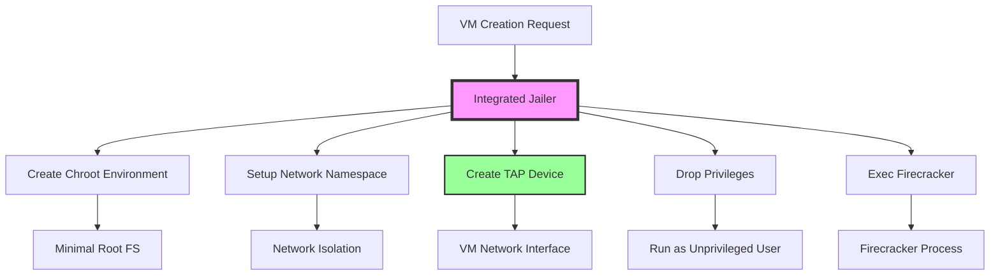
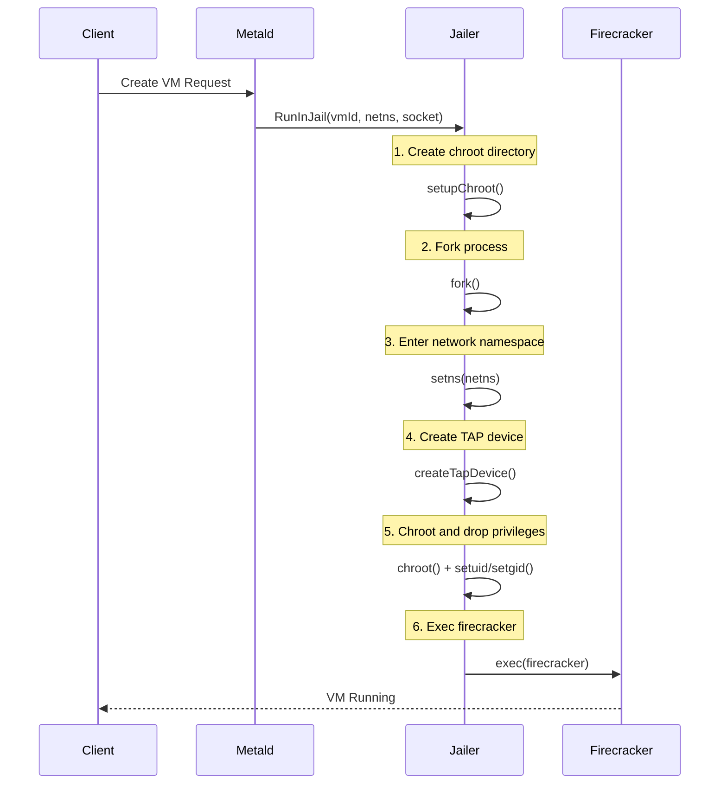
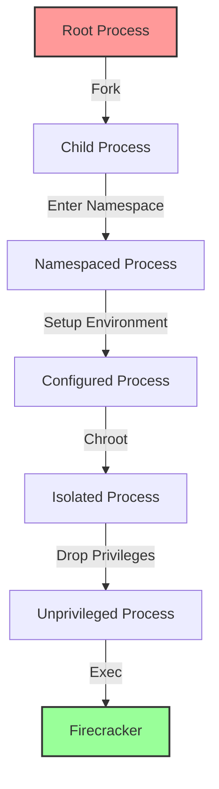

# Integrated Jailer Implementation

## Overview

The integrated jailer is a custom implementation that replaces the external Firecracker jailer binary. This approach provides better control over the isolation process and solves critical networking issues that were present with the standalone jailer.

## Architecture

The integrated jailer (`internal/jailer/jailer.go`) implements the core security isolation features of the original jailer while providing better integration with metald's networking requirements.

### Key Components

// AIDEV-UNCLEAR: What does this diagram show?


### Process Flow

// AIDEV-UNCLEAR: What kind of sequence is this if it's just one item with 5 things looping


## Implementation Details

### 1. Chroot Environment Setup

The integrated jailer creates a minimal chroot environment for each VM:

```
/srv/jailer/firecracker/<vm-id>/root/
├── dev/
│   ├── kvm         # KVM device
│   ├── net/
│   │   └── tun     # TUN/TAP device
│   ├── null        # Null device
│   ├── random      # Random device
│   └── urandom     # Urandom device
└── run/
    └── firecracker.socket  # API socket
```

### 2. Network Namespace Integration

Unlike the external jailer, the integrated implementation:
- Enters the network namespace **before** creating the TAP device
- Creates the TAP device **inside** the network namespace
- Ensures proper device ownership and permissions

### 3. Privilege Dropping

The jailer follows this security sequence:
1. Starts with necessary privileges (CAP_NET_ADMIN, CAP_SYS_ADMIN)
2. Sets up the isolation environment
3. Drops all capabilities
4. Changes to unprivileged UID/GID
5. Execs into firecracker

### 4. TAP Device Creation

The integrated jailer creates TAP devices with proper permissions:

```go
// Create TAP device inside network namespace
tap, err := water.New(water.Config{
    DeviceType: water.TAP,
    PlatformSpecificParams: water.PlatformSpecificParams{
        Name: tapName,
    },
})
```

## Configuration

The integrated jailer is configured through environment variables:

| Variable | Description | Default |
|----------|-------------|---------|
| `UNKEY_METALD_JAILER_UID` | User ID for jailer process | 1000 |
| `UNKEY_METALD_JAILER_GID` | Group ID for jailer process | 1000 |
| `UNKEY_METALD_JAILER_CHROOT_DIR` | Base directory for chroot environments | /srv/jailer |

## Advantages Over External Jailer

### 1. Network Namespace Control
- Creates TAP devices inside the correct namespace
- Eliminates "device not found" errors
- Better integration with CNI networking

### 2. Process Management
- Direct control over forking and exec
- Better error handling and reporting
- Integrated tracing and observability

### 3. Security
- Same isolation guarantees as external jailer
- Minimal attack surface
- No external binary dependencies

### 4. Performance
- Reduced overhead (no external process spawn)
- Faster VM startup times
- Better resource utilization

## Security Model

The integrated jailer maintains the same security isolation as the external jailer:



### Security Features

1. **Namespace Isolation**
   - Network namespace per VM
   - PID namespace isolation
   - Mount namespace isolation

2. **Filesystem Isolation**
   - Chroot jail per VM
   - Minimal device access
   - Read-only root filesystem

3. **Privilege Separation**
   - Drops all capabilities after setup
   - Runs as unprivileged user
   - No privilege escalation possible

## Troubleshooting

### Common Issues

1. **Permission Denied**
   - Ensure metald is running with appropriate capabilities
   - Check UID/GID configuration
   - Verify chroot directory permissions

2. **TAP Device Creation Failed**
   - Verify CAP_NET_ADMIN capability
   - Check network namespace access
   - Ensure /dev/net/tun is accessible

3. **Chroot Setup Failed**
   - Check disk space in chroot directory
   - Verify directory permissions
   - Ensure required devices are available

### Debug Commands

```bash
# Check capabilities
getcap /usr/local/bin/metald

# Verify chroot directory
ls -la /srv/jailer/

# Check network namespaces
ip netns list

# Monitor jailer logs
journalctl -u metald -f | grep jailer
```

## Migration from External Jailer

The integrated jailer is a drop-in replacement:

1. **No Configuration Changes Required**
   - Uses same UID/GID settings
   - Same chroot directory structure
   - Compatible with existing VMs

2. **Removed Configuration**
   - `UNKEY_METALD_JAILER_BINARY` - No longer needed
   - `UNKEY_METALD_FIRECRACKER_BINARY` - Hardcoded to `/usr/local/bin/firecracker`

3. **Updated Systemd Service**
   - Removed external binary references
   - Same capability requirements
   - Same user/group configuration

## Future Enhancements

1. **Configurable Firecracker Path**
   - Currently hardcoded to `/usr/local/bin/firecracker`
   - Could be made configurable if needed

2. **Enhanced Security Options**
   - Additional namespace types
   - Seccomp profiles
   - AppArmor/SELinux integration

3. **Performance Optimizations**
   - Chroot template caching
   - Parallel device creation
   - Resource pooling
