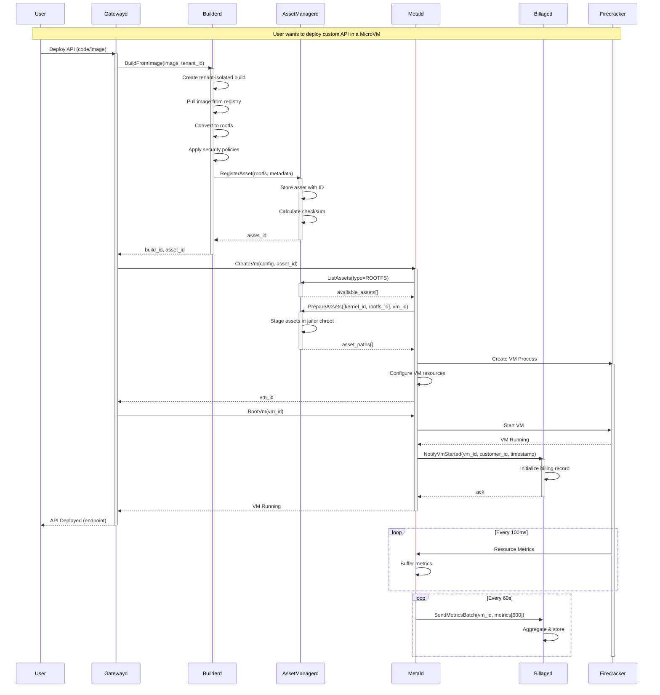
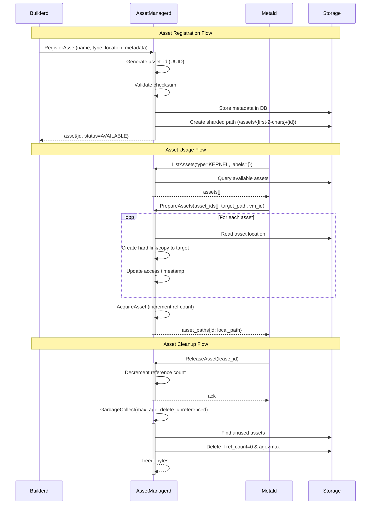
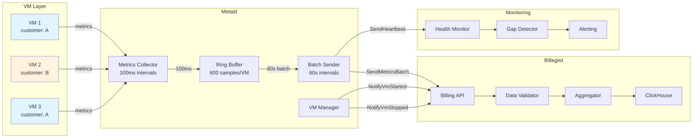
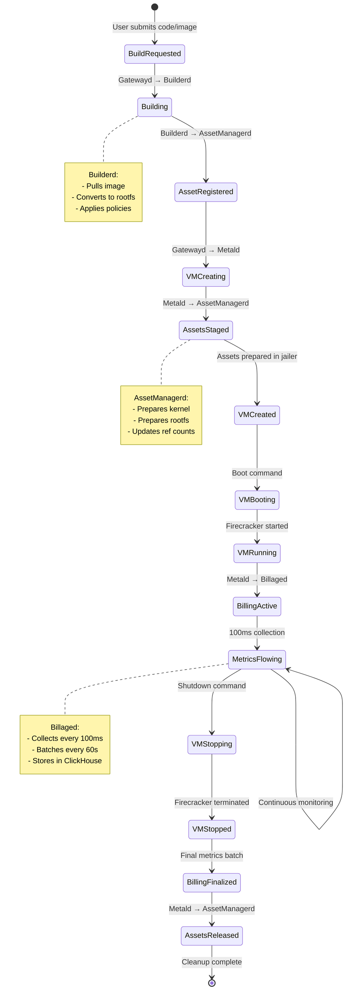
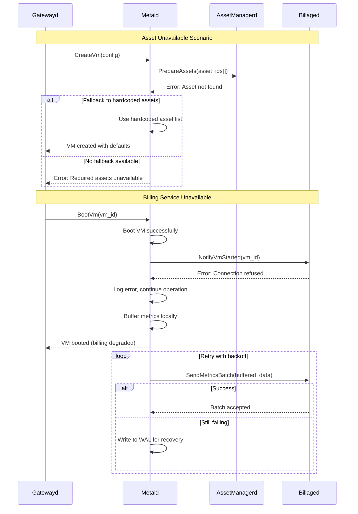

# Service Interaction Diagrams

## Overview

This document illustrates the interactions between gatewayd, metald, builderd, assetmanagerd, and billaged services in the Unkey infrastructure.

## 1. Complete System Architecture Flow

```mermaid
flowchart TB
    subgraph "External Layer"
        USER[Customer/User]
        REGISTRY[Container Registry]
    end

    subgraph "API Gateway Layer"
        GATEWAYD[Gatewayd<br/>API Gateway & Orchestrator]
    end

    subgraph "Build Layer"
        BUILDERD[Builderd<br/>Multi-tenant Build Sandbox]
    end

    subgraph "VM Management Layer"
        METALD[Metald<br/>VM Lifecycle Manager]
        ASSETMGR[AssetManagerd<br/>VM Asset Registry]
    end

    subgraph "Billing Layer"
        BILLAGED[Billaged<br/>Usage Tracking & Billing]
    end

    subgraph "Storage Layer"
        ASSETS[(VM Assets<br/>Kernels, RootFS)]
        METRICS[(Metrics DB<br/>Time Series)]
    end

    subgraph "Compute Layer"
        FC1[Firecracker VM 1]
        FC2[Firecracker VM 2]
        FCN[Firecracker VM N]
    end

    %% User flows
    USER -->|API Requests| GATEWAYD
    
    %% Gatewayd orchestration
    GATEWAYD -->|Build Request| BUILDERD
    GATEWAYD -->|VM Create/Boot| METALD
    
    %% Build flow
    BUILDERD -->|Pull Image| REGISTRY
    BUILDERD -->|Register Built Asset| ASSETMGR
    BUILDERD -->|Store RootFS| ASSETS
    
    %% VM Management flow
    METALD -->|List/Prepare Assets| ASSETMGR
    METALD -->|VM Lifecycle Events| BILLAGED
    METALD -->|Metrics (100ms)| BILLAGED
    METALD -->|Manage| FC1
    METALD -->|Manage| FC2
    METALD -->|Manage| FCN
    
    %% Asset management
    ASSETMGR -->|Read/Write| ASSETS
    
    %% Billing flow
    BILLAGED -->|Store| METRICS
    
    %% Styling
    classDef gateway fill:#f9a825,stroke:#f57c00,stroke-width:2px
    classDef build fill:#7b1fa2,stroke:#4a148c,stroke-width:2px
    classDef vm fill:#1976d2,stroke:#0d47a1,stroke-width:2px
    classDef billing fill:#388e3c,stroke:#1b5e20,stroke-width:2px
    classDef storage fill:#455a64,stroke:#263238,stroke-width:2px
    
    class GATEWAYD gateway
    class BUILDERD build
    class METALD,ASSETMGR vm
    class BILLAGED billing
    class ASSETS,METRICS storage
```

## 2. VM Creation and Build Sequence



## 3. Asset Lifecycle Management



## 4. Billing Integration Flow



## 5. Complete VM Lifecycle with All Services



## 6. Error Handling and Recovery Flows



## Key Integration Points

### 1. **Gatewayd → Builderd**
- Initiates builds for customer code/images
- Tracks build status and completion
- Receives asset IDs for VM creation

### 2. **Builderd → AssetManagerd**
- Registers built rootfs images
- Provides metadata (size, checksum, labels)
- Receives unique asset IDs

### 3. **Gatewayd → Metald**
- Creates and manages VM lifecycle
- Provides VM configuration
- Receives VM status updates

### 4. **Metald → AssetManagerd**
- Queries available assets (kernels, rootfs)
- Prepares assets in jailer chroot
- Manages asset reference counting

### 5. **Metald → Billaged**
- Sends VM lifecycle events (start/stop)
- Streams resource metrics (100ms intervals)
- Handles billing data reliability

## Service Responsibilities

### **Gatewayd**
- API gateway and request routing
- Orchestrates build and VM workflows
- Manages customer authentication

### **Builderd**
- Multi-tenant build isolation
- Container → rootfs conversion
- Security policy enforcement

### **AssetManagerd**
- VM asset registry and storage
- Reference counting and GC
- Asset staging for jailer

### **Metald**
- VM lifecycle management
- Firecracker process management
- Metrics collection

### **Billaged**
- Usage tracking and aggregation
- Billing data persistence
- Cost calculation

## Data Flows

### Build Flow
`Customer Code → Gatewayd → Builderd → RootFS → AssetManagerd → Asset ID`

### VM Creation Flow
`Asset ID → Gatewayd → Metald → AssetManagerd → Firecracker → Running VM`

### Billing Flow
`VM Metrics → Metald → Billaged → ClickHouse → Usage Reports`