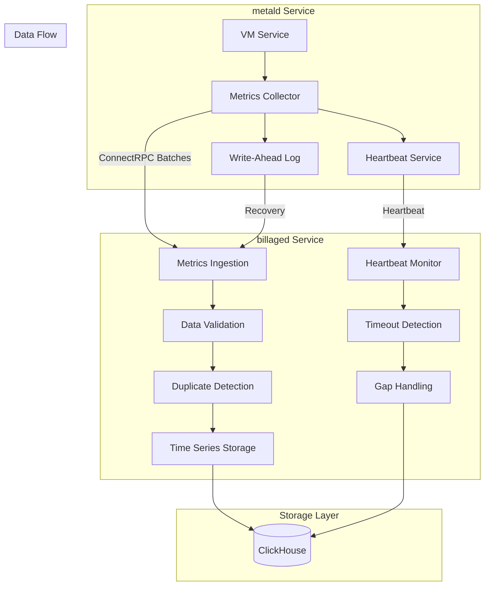
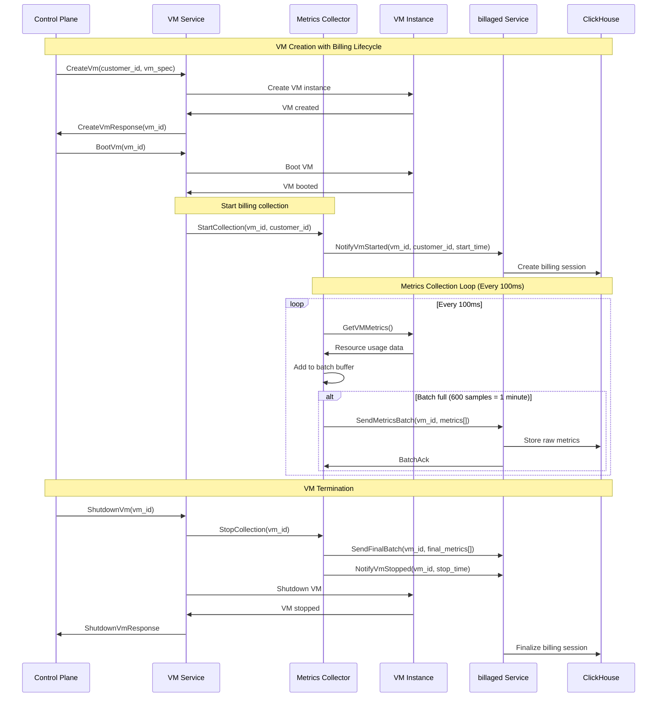
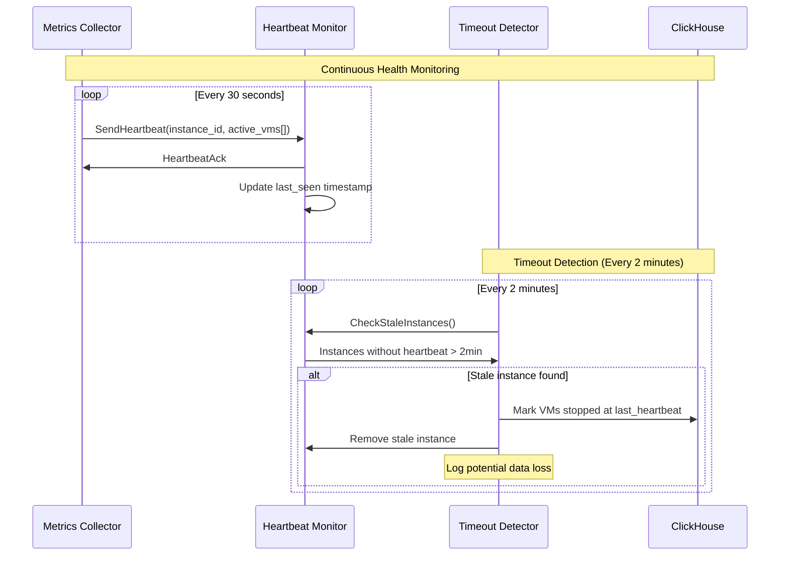
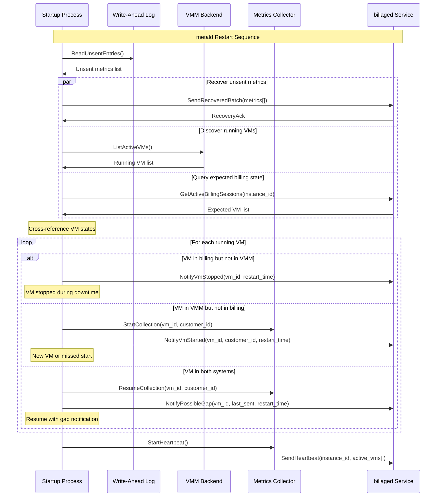
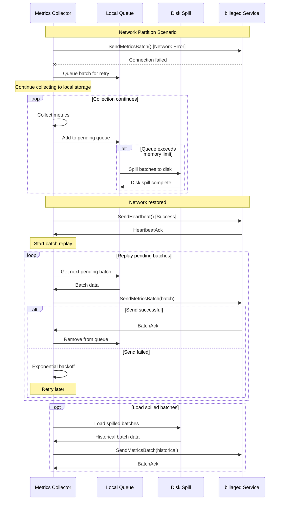
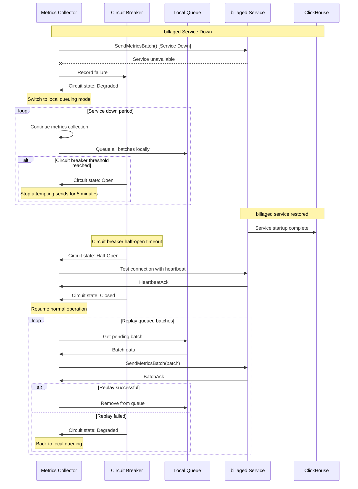
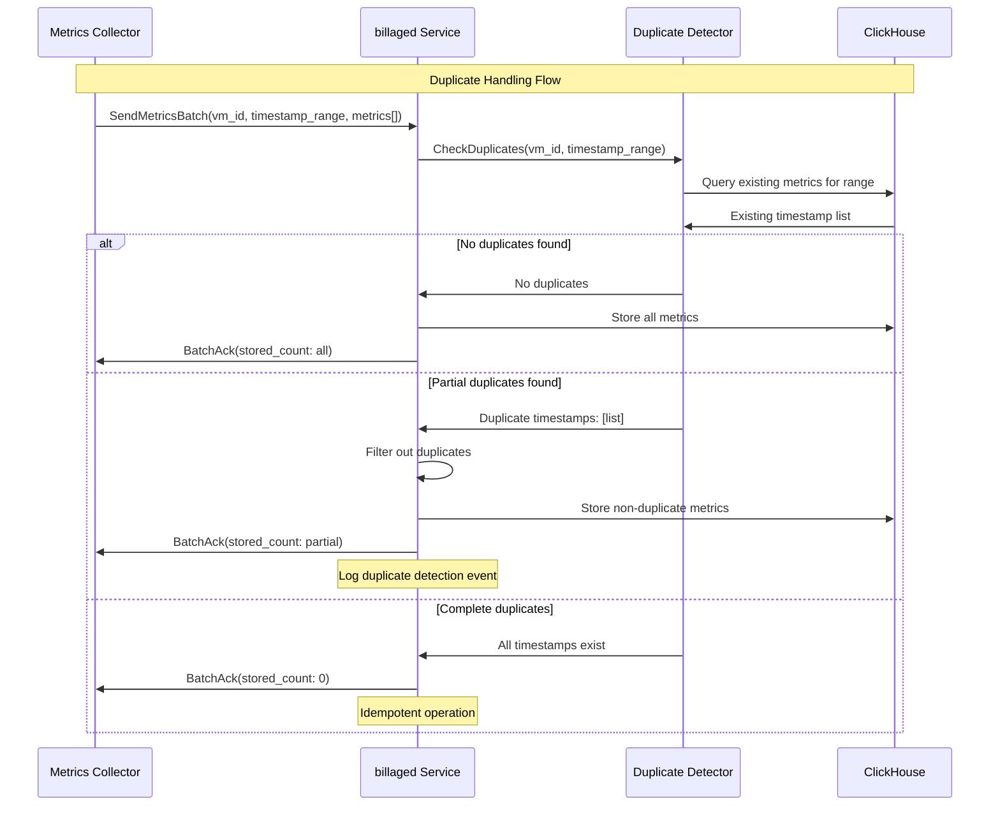
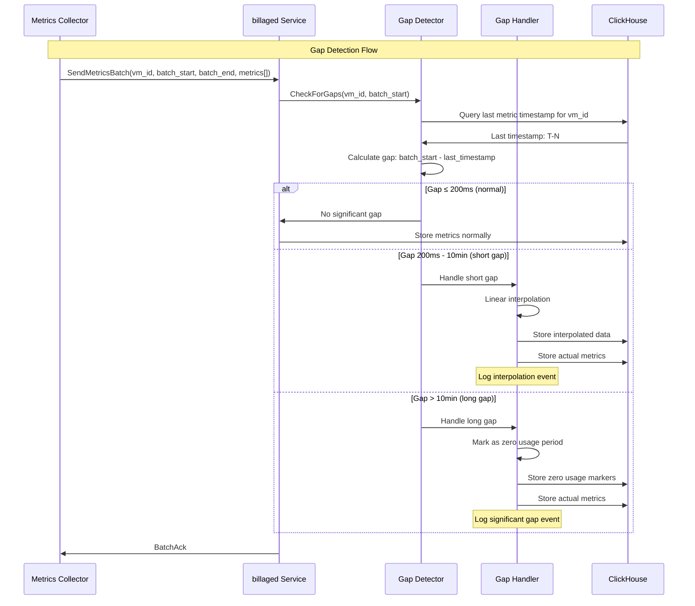

# Billing Integration Flows

## Overview

This document describes the integration flows between metald metrics collection and the billaged service, showing how the two systems work together to provide accurate usage accounting.

**Cross-Reference**: This document integrates with:
- [`billaged/docs/billing-architecture.md`](../../billaged/docs/billing-architecture.md) - Overall billing system design
- [`billaged/docs/billing-flows.md`](../../billaged/docs/billing-flows.md) - End-to-end billing workflows
- [`billing-metrics-architecture.md`](./billing-metrics-architecture.md) - metald metrics collection design

## Integration Architecture



## Normal Operation Flow

### VM Lifecycle with Billing Integration



### Heartbeat and Health Monitoring



## Failure Recovery Flows

### metald Restart Recovery



### Network Partition Recovery



### billaged Service Recovery



## Data Consistency Flows

### Duplicate Detection and Deduplication



### Gap Detection and Interpolation



### Precision and Unit Conversion

```mermaid
flowchart TD
    subgraph "metald Collection (High Precision)"
        CPU_NS[CPU: nanoseconds]
        MEM_B[Memory: bytes]
        IO_B[I/O: bytes] 
        NET_B[Network: bytes]
    end
    
    subgraph "billaged Storage (Raw Precision)"
        CPU_NS --> CPU_NS_STORE[Store: int64 nanoseconds]
        MEM_B --> MEM_B_STORE[Store: int64 bytes]
        IO_B --> IO_B_STORE[Store: int64 bytes]
        NET_B --> NET_B_STORE[Store: int64 bytes]
    end
    
    subgraph "billaged Aggregation (Time Windows)"
        CPU_NS_STORE --> CPU_HOUR[Aggregate: CPU nanoseconds → core-hours]
        MEM_B_STORE --> MEM_HOUR[Aggregate: Memory byte-seconds → GB-hours]
        IO_B_STORE --> IO_TOTAL[Aggregate: I/O bytes → total GB]
        NET_B_STORE --> NET_TOTAL[Aggregate: Network bytes → total GB]
    end
    
    subgraph "billaged Billing (Customer Precision)"
        CPU_HOUR --> CPU_BILL[Bill: millisecond precision]
        MEM_HOUR --> MEM_BILL[Bill: KB precision (rounded up)]
        IO_TOTAL --> IO_BILL[Bill: KB precision (rounded up)]
        NET_TOTAL --> NET_BILL[Bill: KB precision (rounded up)]
    end
```

## Integration Points with billaged

### ConnectRPC Service Definitions

**Metrics Ingestion Service**:
```protobuf
service MetricsIngestionService {
  // Send batch of metrics for a VM
  rpc SendMetricsBatch(SendMetricsBatchRequest) returns (SendMetricsBatchResponse);
  
  // Notify VM lifecycle events
  rpc NotifyVmStarted(NotifyVmStartedRequest) returns (NotifyVmStartedResponse);
  rpc NotifyVmStopped(NotifyVmStoppedRequest) returns (NotifyVmStoppedResponse);
  rpc NotifyPossibleGap(NotifyPossibleGapRequest) returns (NotifyPossibleGapResponse);
  
  // Heartbeat for health monitoring
  rpc SendHeartbeat(SendHeartbeatRequest) returns (SendHeartbeatResponse);
  
  // Recovery operations
  rpc GetActiveBillingSessions(GetActiveBillingSessionsRequest) returns (GetActiveBillingSessionsResponse);
}

message SendMetricsBatchRequest {
  string vm_id = 1;
  string customer_id = 2;
  string metald_instance_id = 3;
  int64 batch_start_timestamp = 4;
  int64 batch_end_timestamp = 5;
  repeated VmMetric metrics = 6;
}

message VmMetric {
  int64 timestamp_nanos = 1;
  int64 cpu_time_nanos = 2;
  int64 memory_usage_bytes = 3;
  int64 disk_read_bytes = 4;
  int64 disk_write_bytes = 5;
  int64 network_rx_bytes = 6;
  int64 network_tx_bytes = 7;
}

message SendHeartbeatRequest {
  string metald_instance_id = 1;
  repeated string active_vm_ids = 2;
  int64 timestamp_nanos = 3;
}
```

### Data Flow Alignment

**Batch Timing Alignment**:
- metald: 100ms collection → 600 samples → 1-minute batches
- billaged: Expects 1-minute batches → Hourly rollups → Monthly billing
- **✓ Aligned**: Batch windows match billaged aggregation periods

**Precision Alignment**:
- metald: Nanosecond CPU, byte-level I/O collection
- billaged: Raw storage preserves precision, billing rounds appropriately
- **✓ Aligned**: No precision loss in collection → storage → billing pipeline

**Gap Handling Alignment**:
- metald: WAL recovery ensures no gaps from process failures
- billaged: Gap detection and interpolation for network failures
- **✓ Aligned**: Comprehensive gap coverage across failure modes

### Error Handling Coordination

**Retry Policy Coordination**:
```
metald Retry Policy:
- Initial retry: 1 minute
- Exponential backoff: 2^attempt minutes (max 60 minutes)
- Drop after: 24 hours

billaged Timeout Policy:
- Heartbeat timeout: 2 minutes
- Instance cleanup: After 2 minutes without heartbeat
- Billing session finalization: Immediate on timeout

✓ Coordination: billaged timeout (2min) < metald first retry (1min)
```

**Circuit Breaker Coordination**:
```
metald Circuit Breaker:
- Degraded: After 3 failures → local queuing
- Open: After 10 failures → stop sending for 5 minutes
- Half-open: Test with heartbeat

billaged Health Endpoint:
- /health/ready: Service can accept requests
- /health/live: Service is running
- Used by metald circuit breaker for state decisions
```

## Monitoring and Observability Integration

### Shared Metrics

**Data Flow Metrics**:
- `metald_metrics_sent_total` ↔ `billaged_metrics_received_total`
- `metald_batch_send_errors_total` ↔ `billaged_batch_receive_errors_total`
- `metald_heartbeat_sent_total` ↔ `billaged_heartbeat_received_total`

**Data Quality Metrics**:
- `billaged_duplicate_metrics_total`: Duplicates detected from metald retries
- `billaged_gap_interpolations_total`: Gaps filled from metald failures
- `billaged_billing_sessions_active`: Active VMs being billed

**SLA Metrics**:
- End-to-end latency: Metric collection → billaged storage
- Data completeness: % of expected metrics received
- Billing accuracy: Variance in expected vs actual billing periods

### Alerting Coordination

**Critical Alerts** (Both systems):
- Metrics collection stopped for any VM > 5 minutes
- Heartbeat failures > 3 consecutive
- WAL recovery failures
- Data gaps > 10 minutes for any VM

**Warning Alerts**:
- Pending batch queue growing > 100 batches
- Circuit breaker state changes
- Significant interpolation events (gaps 2-10 minutes)

## Performance and Scaling

### Throughput Alignment

**metald Capacity**:
- 100ms collection × 1000 VMs = 10,000 metrics/second
- 1-minute batches × 1000 VMs = ~17 batches/second
- Network bandwidth: ~1MB/second for metrics data

**billaged Capacity** (from billaged docs):
- Target: 10K metrics/second ingestion
- Peak: 50K metrics/second capacity
- **✓ Aligned**: metald peak (10K/sec) < billaged target (10K/sec)

### Scaling Considerations

**Horizontal Scaling**:
- Multiple metald instances → Single billaged cluster
- Each metald sends unique instance_id in heartbeats
- billaged partitions data by customer_id and time

**Resource Requirements**:
- metald: ~1MB memory per 1000 VMs (buffering)
- billaged: ClickHouse storage scales with retention period
- **Network**: Steady-state traffic, minimal bursts

## Conclusion

The integration between metald metrics collection and billaged service provides:

1. **Seamless Data Flow**: 100ms precision collection → 1-minute batches → hourly aggregation
2. **Comprehensive Reliability**: WAL recovery + heartbeat monitoring + gap detection
3. **Coordinated Error Handling**: Aligned retry policies and circuit breaker patterns
4. **Consistent Monitoring**: Shared metrics and alerting across service boundaries

This integration ensures accurate billing with sub-second precision while maintaining high availability and data consistency under all failure scenarios.