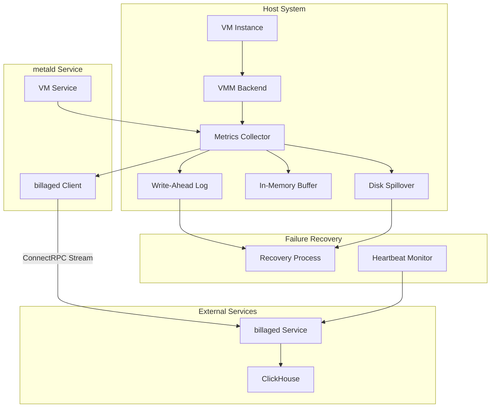
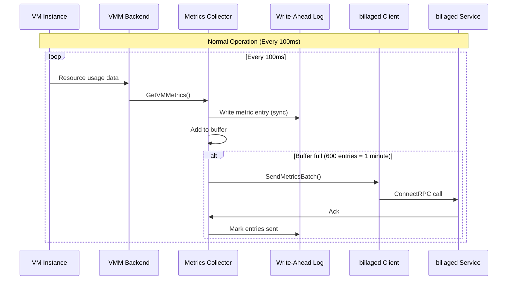
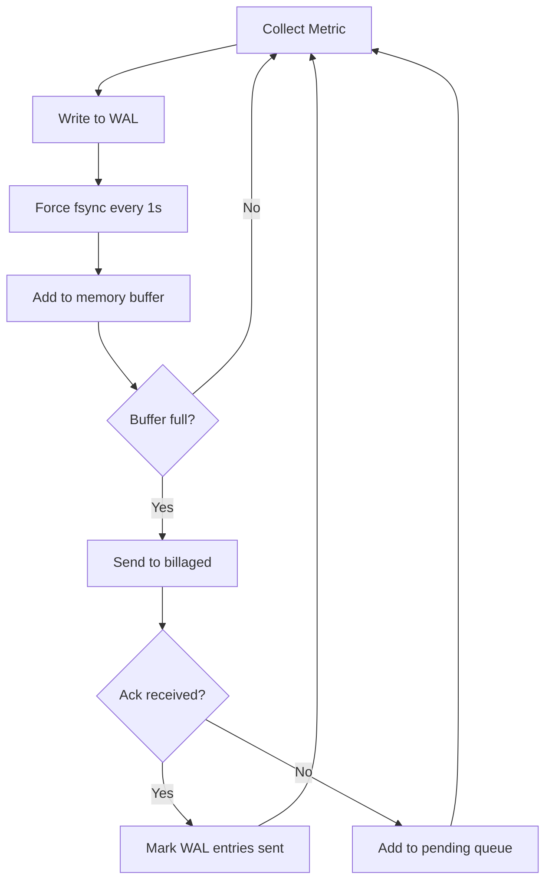
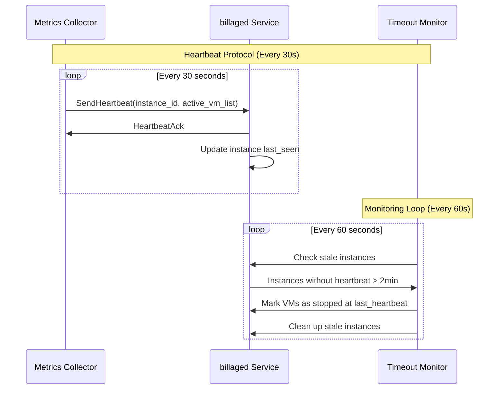
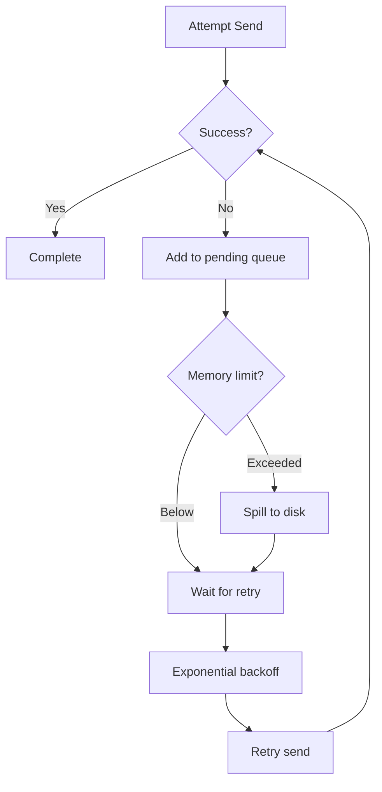
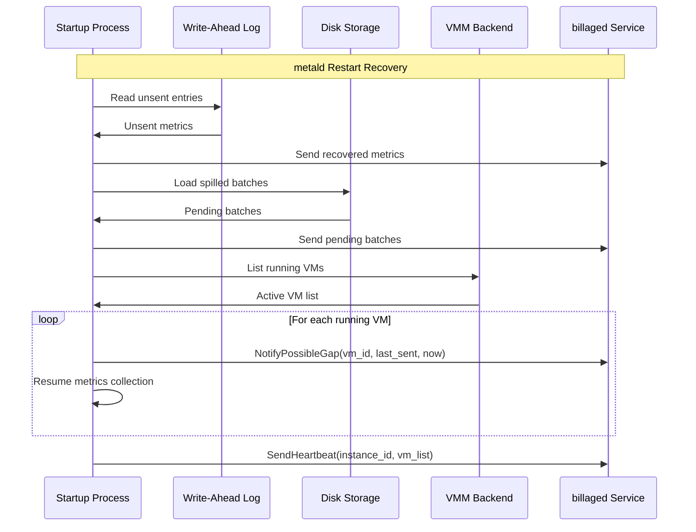
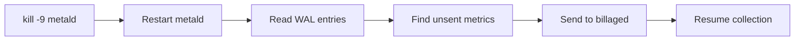
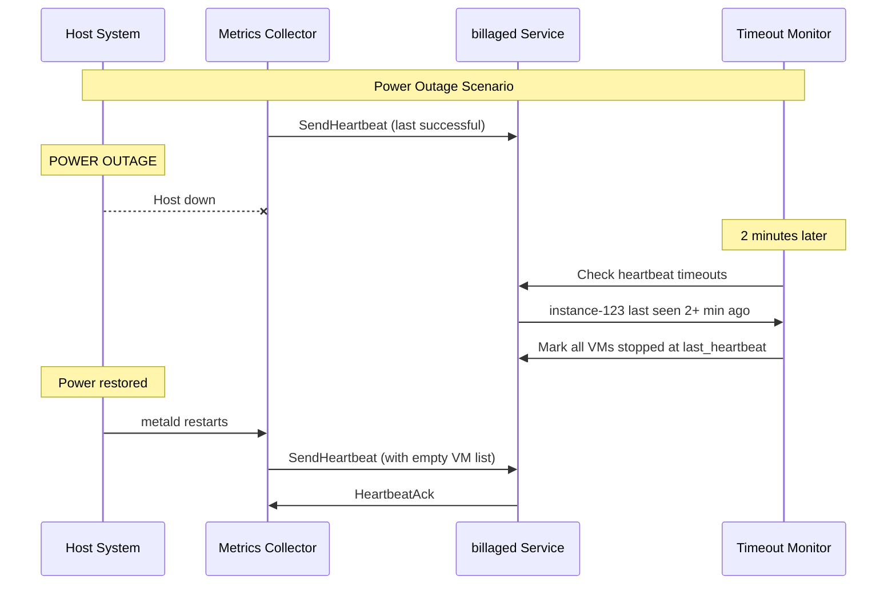
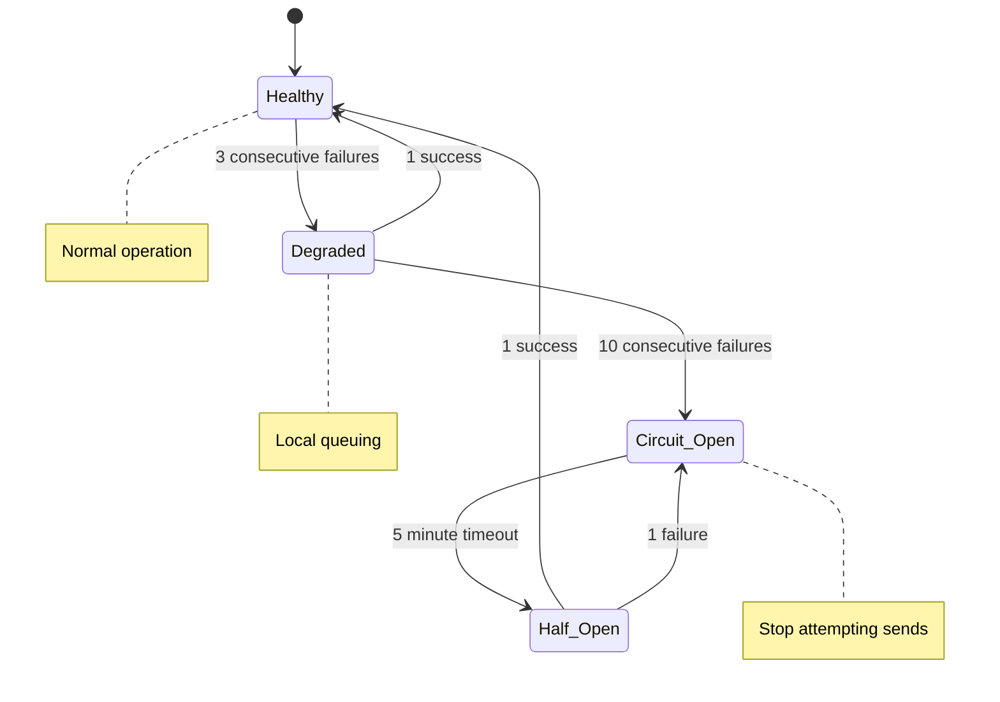

# Billing Metrics Collection Architecture

## Overview

This document defines the integrated metrics collection architecture for accurate VM resource billing. The system provides ~100ms precision resource accounting with guarantees for data consistency, fault tolerance, and billing accuracy even under catastrophic failures.

**Key Design Goals:**
- **Accuracy**: Sub-second precision resource measurement
- **Reliability**: No data loss under any failure scenario
- **Simplicity**: Minimal moving parts and coordination complexity
- **Performance**: Low overhead on VM operations

## Architecture Decision

**Selected Architecture: Integrated Metrics Collection in metald**



### Data Flow Architecture



## Component Design

### 1. Metrics Collector Service

**Location**: Integrated within metald VMService
**Responsibility**: High-frequency metrics collection and reliable delivery

```go
type MetricsCollector struct {
    // Core components
    backend       types.Backend
    billingClient billaged.BillingServiceClient
    logger        *slog.Logger
    
    // State management
    activeVMs     map[string]*VMMetricsTracker
    instanceID    string
    
    // Reliability components
    wal           *WriteAheadLog
    pendingBatches []PendingBatch
    spillStorage  *DiskSpillStorage
    
    // Configuration
    collectionInterval time.Duration // 100ms
    batchSize         int           // 600 samples
    maxPendingBatches int           // 1440 (24 hours)
}

type VMMetricsTracker struct {
    vmID         string
    customerID   string
    startTime    time.Time
    lastSent     time.Time
    buffer       []*VmMetrics
    ticker       *time.Ticker
    stopCh       chan struct{}
    
    // Error handling
    consecutiveErrors int
    lastError        time.Time
}
```

### 2. Write-Ahead Log (WAL)

**Purpose**: Guarantee no metric loss even under process termination



**WAL Entry Format:**
```json
{
  "timestamp": 1703123456789000000,
  "vm_id": "vm-abc123",
  "customer_id": "cust-xyz789",
  "metrics": {
    "cpu_time_nanos": 1234567890123,
    "memory_usage_bytes": 536870912,
    "disk_read_bytes": 1048576,
    "disk_write_bytes": 2097152,
    "network_rx_bytes": 4194304,
    "network_tx_bytes": 8388608
  },
  "sent": false
}
```

### 3. Reliability Mechanisms

#### A. Heartbeat Monitoring



#### B. Network Partition Handling



**Retry Policy:**
- Initial retry: 1 minute
- Exponential backoff: 2^attempt minutes (max 60 minutes)
- Drop after: 24 hours of consecutive failures
- Disk spill: When pending queue > 100 batches

#### C. Startup Recovery Process



## Failure Scenarios & Error Handling

### 1. Process Termination (kill -9)

**Problem**: Metrics collection stops immediately, buffered data lost
**Solution**: Write-Ahead Log with signal handling



**Implementation:**
```go
func (mc *MetricsCollector) collectMetric(metric *VmMetrics) error {
    // CRITICAL: WAL write must complete before anything else
    if err := mc.wal.WriteEntry(metric); err != nil {
        return fmt.Errorf("WAL write failed: %w", err)
    }
    
    // Periodic fsync for durability vs performance balance
    if time.Since(mc.wal.lastSync) > time.Second {
        mc.wal.Sync()
    }
    
    // Only after WAL, add to memory buffer
    mc.buffer = append(mc.buffer, metric)
    return nil
}
```

### 2. Power Outage / Host Crash

**Problem**: Entire host goes down, all VMs stop
**Solution**: Heartbeat timeout detection in billaged



### 3. Network Partition

**Problem**: metald can't reach billaged, metrics accumulate
**Solution**: Local queuing with disk spillover

**Network Partition Timeline:**

```mermaid
gantt
    title Network Partition Recovery
    dateFormat X
    axisFormat %H:%M
    
    section Normal Operation
    Metrics Collection     :0, 3600
    
    section Network Down
    Local Queuing         :3600, 7200
    Disk Spillover        :7200, 14400
    
    section Recovery
    Batch Replay          :14400, 15600
    Normal Operation      :15600, 18000
```


**Storage Tiers:**
1. **Memory Queue**: First 100 batches (~1.5 hours)
2. **Disk Spill**: Batches 101-1440 (~22.5 hours)  
3. **Drop Policy**: After 24 hours total

### 4. billaged Service Unavailable

**Problem**: billaged is down but metald continues running
**Solution**: Circuit breaker with graceful degradation



## Correctness Guarantees

### 1. Data Consistency Guarantees

**At-Least-Once Delivery**: Every metric is delivered to billaged at least once
- WAL ensures no data loss on process termination
- Retry logic ensures eventual delivery during network issues
- Duplicate detection in billaged handles retransmissions

**Temporal Accuracy**: Billing periods are accurate to within 100ms
- Collection frequency: 100ms ± 10ms (OS scheduler variance)
- Batch timestamps mark exact collection times
- Gap detection identifies missing periods > 200ms

**Resource Accuracy**: VM resource usage measured with highest available precision
- CPU: nanosecond precision from VMM APIs
- Memory: byte precision from cgroups/VMM
- I/O: byte precision from block layer statistics
- Network: byte precision from network interface counters

### 2. Failure Recovery Guarantees

**Process Restart**: Zero data loss on metald restart
```
PROOF: Every metric written to WAL before processing
→ WAL persisted to disk with fsync
→ Restart recovery reads WAL and replays unsent metrics
→ Duplicate detection in billaged handles replays
∴ No metrics lost
```

**Host Crash**: Billing stops accurately at crash time
```
PROOF: Heartbeat every 30s with VM list
→ billaged timeout detection at 2min intervals  
→ VMs marked stopped at last heartbeat time
→ Gap ≤ 2.5 minutes maximum
∴ Billing accuracy within acceptable bounds
```

**Network Partition**: All metrics eventually delivered
```
PROOF: Local queuing for 24 hours
→ Exponential backoff retry on reconnection
→ Disk spillover for extended outages
→ Drop only after 24h (acceptable business risk)
∴ High probability of eventual delivery
```

### 3. Performance Guarantees

**Collection Overhead**: < 1% CPU impact per 100 VMs
- VMM API calls: ~100µs per call
- WAL writes: Batched with 1s fsync interval
- Memory usage: ~1MB per 1000 VMs (buffering)

**VM Operation Impact**: < 10ms additional latency
- Metrics collection runs in separate goroutines
- No blocking operations in VM lifecycle calls
- Resource access through existing VMM connections

## Alternative Architectures Considered

### 1. Separate Billing Collector Service

**Architecture:**
```
VM → metald → Event Stream → Billing Collector → billaged
```

**Why Dismissed:**
- **Complexity**: Event bus, service coordination, state synchronization
- **Race Conditions**: VM lifecycle events vs metrics collection timing
- **Network Dependencies**: Additional failure points between services
- **Resource Access**: Complex permissions for VMM socket access
- **Debugging**: Split state across multiple services

**Specific Problems:**
- Event ordering issues (VM_CREATED before VM_STARTED)
- Split-brain scenarios (collector thinks VM running, metald knows stopped)
- Stream disconnection recovery complexity
- Clock skew between services affecting timestamps

### 2. Host-Level Metrics Collection

**Architecture:**
```
VM → Host Agent → Resource Scanner → billaged
```

**Why Dismissed:**
- **Attribution Problem**: Can't reliably map host resources to specific VMs
- **Multi-tenancy Issues**: No customer context at host level
- **Precision Loss**: Host-level aggregation loses per-VM granularity
- **VM Lifecycle**: No knowledge of VM start/stop events
- **Scale Issues**: Single host agent for hundreds of VMs

### 3. Pull-Based Metrics (billaged queries metald)

**Architecture:**
```
billaged → Query metald → VMM APIs → Response
```

**Why Dismissed:**
- **Timing Control**: billaged controls collection frequency, not optimal
- **Scaling Issues**: billaged must track all metald instances
- **Error Handling**: Complex retry logic for failed queries
- **Network Efficiency**: Many small requests vs batched pushes
- **State Management**: billaged must track VM lifecycle

### 4. Queue-Based Architecture (Message Bus)

**Architecture:**
```
metald → Message Queue → billaged
```

**Why Dismissed:**
- **Additional Infrastructure**: Redis/RabbitMQ deployment and management
- **Ordering Guarantees**: Complex to ensure metric ordering per VM
- **Failure Modes**: Queue service becomes single point of failure
- **Operational Complexity**: Another service to monitor and scale
- **Cost**: Additional infrastructure cost vs embedded solution

## Implementation Phases

### Phase 1: Core Integration (Week 1-2)
- Integrate MetricsCollector into VMService
- Implement basic 100ms collection loop
- Add ConnectRPC client to billaged
- Basic error logging and retry

### Phase 2: Reliability Layer (Week 3-4)
- Implement Write-Ahead Log
- Add heartbeat monitoring
- Implement startup recovery
- Add circuit breaker pattern

### Phase 3: Advanced Resilience (Week 5-6)
- Add disk spillover for extended outages
- Implement exponential backoff retry
- Add comprehensive monitoring
- Performance optimization

### Phase 4: Production Hardening (Week 7-8)
- Load testing with 1000+ VMs
- Failure injection testing
- Performance tuning
- Documentation and runbooks

## Monitoring & Observability

### Key Metrics

**Collection Metrics:**
- `metald_metrics_collected_total{vm_id, customer_id}`: Total metrics collected
- `metald_metrics_collection_duration_ms{vm_id}`: Collection latency per VM
- `metald_metrics_wal_writes_total`: WAL write operations
- `metald_metrics_wal_sync_duration_ms`: WAL fsync latency

**Delivery Metrics:**
- `metald_metrics_sent_total{vm_id, customer_id}`: Successfully sent batches
- `metald_metrics_send_errors_total{vm_id, error_type}`: Send failures by type
- `metald_metrics_pending_batches{vm_id}`: Queued batches per VM
- `metald_metrics_spilled_batches_total`: Batches spilled to disk

**System Health:**
- `metald_heartbeat_sent_total`: Heartbeats sent to billaged
- `metald_heartbeat_errors_total`: Heartbeat failures
- `metald_active_vms`: Currently tracked VMs
- `metald_recovery_events_total{type}`: Recovery operations (WAL, disk, etc.)

### Alerting Rules

**Critical Alerts:**
- WAL write failures > 0 (immediate notification)
- Heartbeat failures > 3 consecutive (within 5 minutes)
- Pending batch queue > 100 (within 15 minutes)
- Collection errors > 5% for any VM (within 10 minutes)

**Warning Alerts:**
- Disk spill events > 0 (within 1 hour)
- Average collection latency > 50ms (within 30 minutes)
- Recovery events > 0 (within 1 hour)

## Cross-References

This architecture integrates with the billaged service design documented in:
- [`billaged/docs/billing-architecture.md`](../../billaged/docs/billing-architecture.md) - Overall billing system design
- [`billaged/docs/billing-flows.md`](../../billaged/docs/billing-flows.md) - End-to-end billing workflows
- [`billaged/docs/billing-validation.md`](../../billaged/docs/billing-validation.md) - Data validation requirements

**Integration Points:**
- Metrics format aligns with billaged ClickHouse schema (billing-architecture.md:248-290)
- Batch timing matches billaged aggregation windows (billing-flows.md:104-119)
- Gap handling follows billaged interpolation rules (billing-flows.md:120-128)
- Precision requirements match billing conversion logic (billing-flows.md:130-151)

## Conclusion

The integrated metrics collection architecture provides the optimal balance of:
- **Simplicity**: Single service ownership reduces coordination complexity
- **Reliability**: Multiple failure recovery mechanisms ensure data consistency
- **Performance**: Direct VMM access with minimal overhead
- **Accuracy**: 100ms precision with comprehensive error handling

This design ensures accurate billing under all failure scenarios while maintaining operational simplicity and high performance.