# Metald Visual Documentation

This document contains all architectural and flow diagrams for the Metald service. Diagrams are provided in Mermaid format for easy maintenance and version control.

## System Architecture Diagrams

### High-Level System Architecture

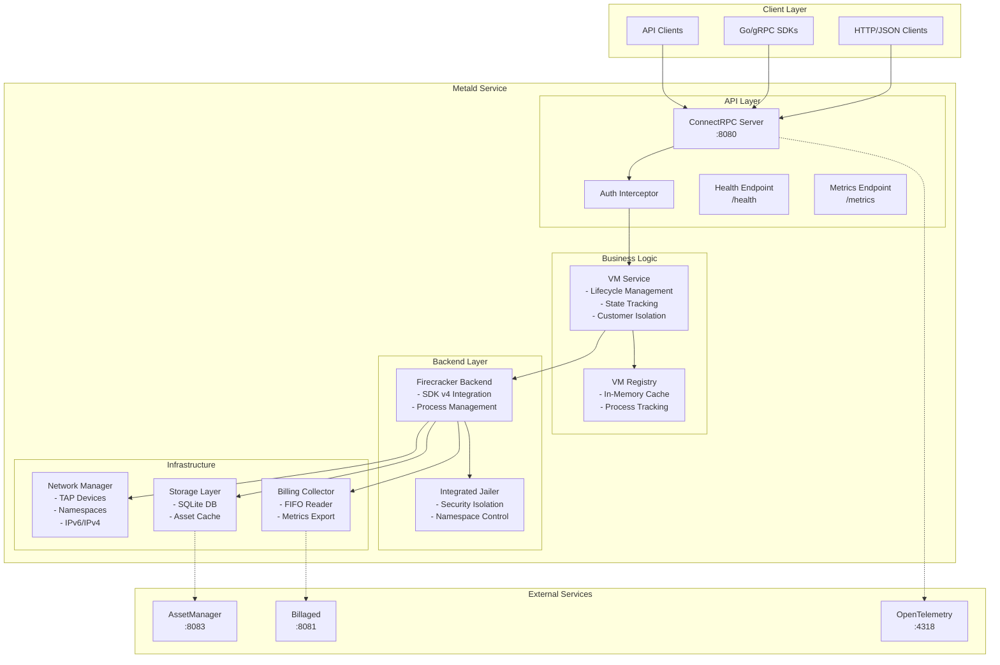

### Component Interaction Diagram

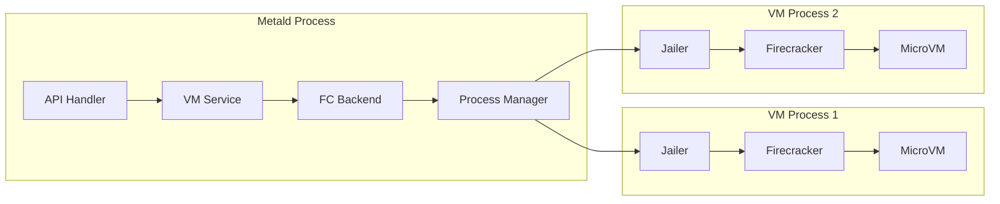

## Sequence Diagrams

### VM Creation Flow

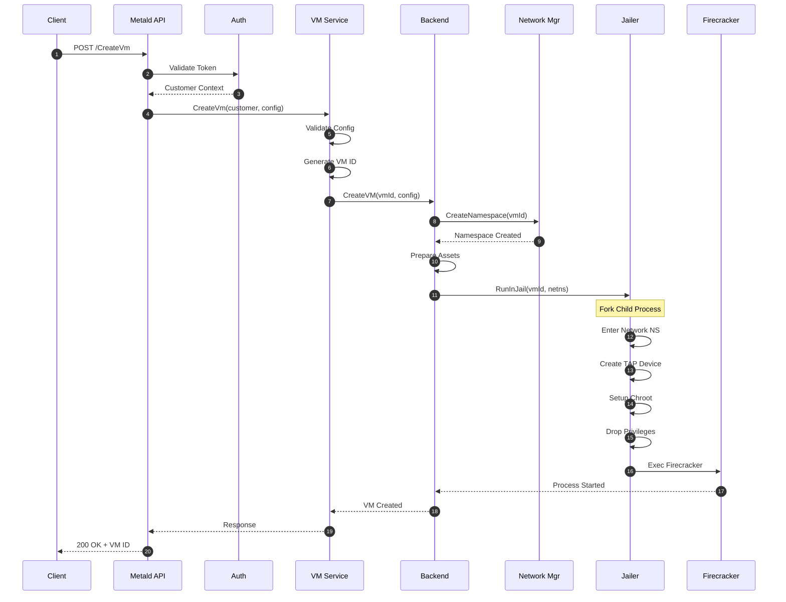

### VM Boot Sequence

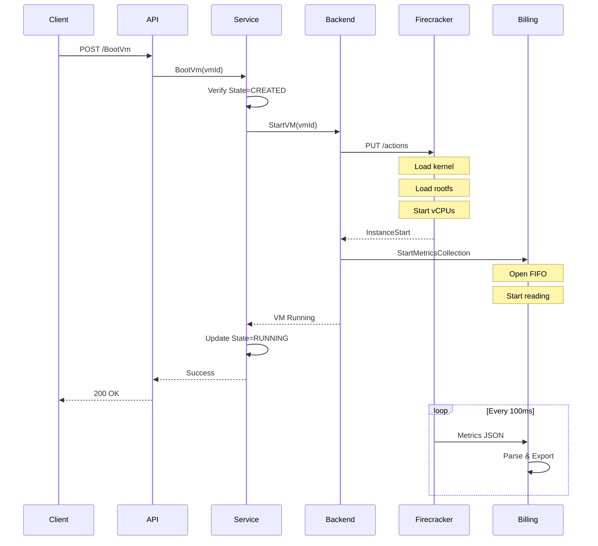

### Network Setup Flow

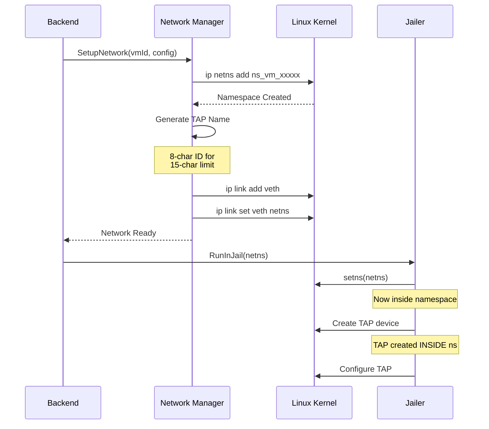

### Authentication Flow

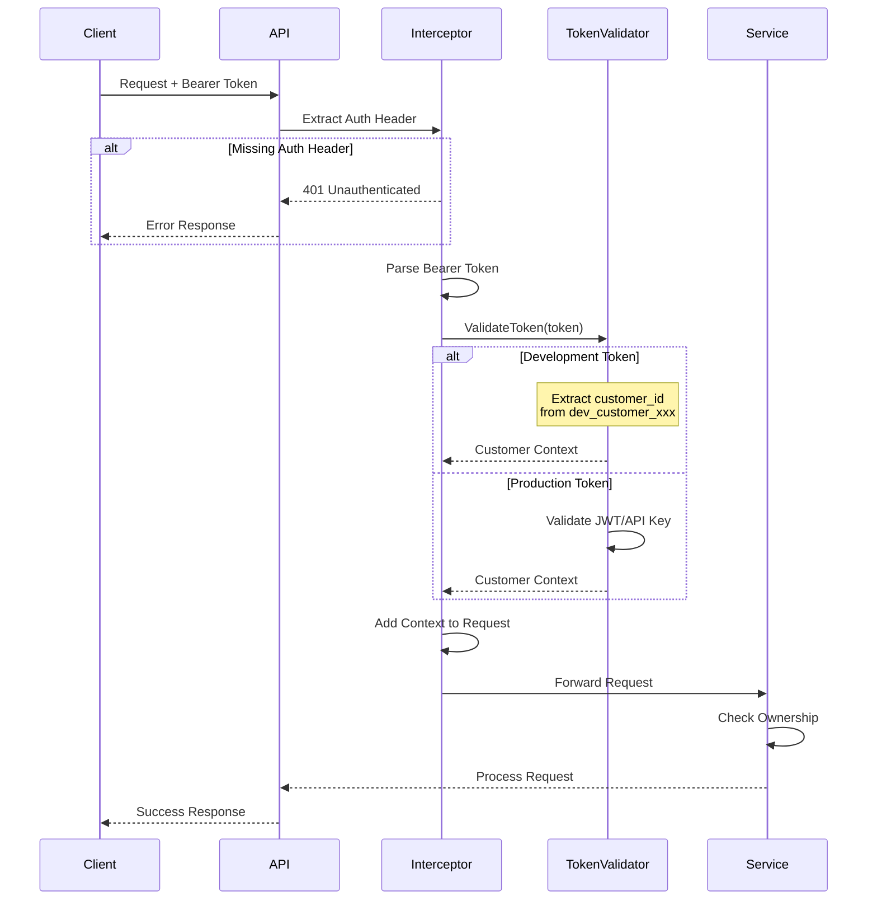

## Data Flow Diagrams

### Metrics Collection Flow

```mermaid
graph TB
    subgraph "VM Process"
        FC[Firecracker]
        FIFO[/tmp/vm-xxx/metrics.fifo]
    end
    
    subgraph "Metald Process"
        Reader[FIFO Reader<br/>Goroutine]
        Parser[JSON Parser]
        Buffer[Metrics Buffer]
        Exporter[Metrics Exporter]
    end
    
    subgraph "External Systems"
        Prom[Prometheus<br/>:9464]
        Billaged[Billaged<br/>:8081]
        OTEL[OpenTelemetry<br/>:4318]
    end
    
    FC -->|Write 100ms| FIFO
    FIFO -->|Read| Reader
    Reader --> Parser
    Parser --> Buffer
    Buffer --> Exporter
    Exporter --> Prom
    Exporter --> Billaged
    Exporter --> OTEL
```

### Storage Architecture

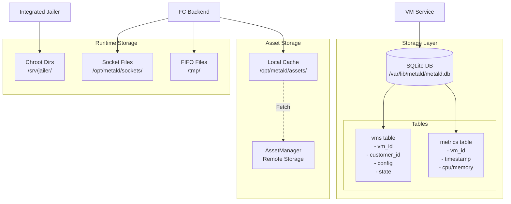

## Network Topology

### VM Network Architecture

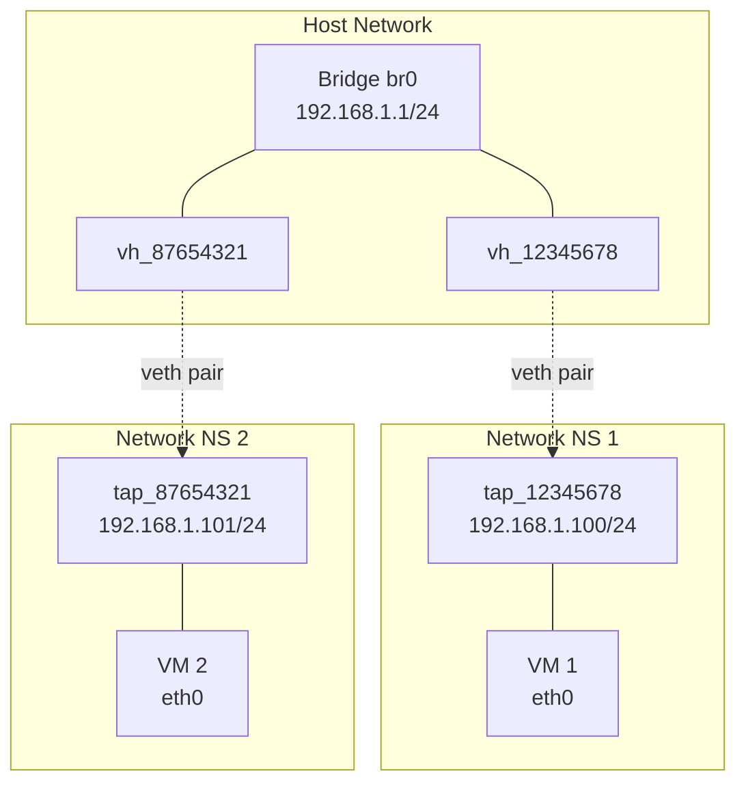

### IPv6 Network Layout

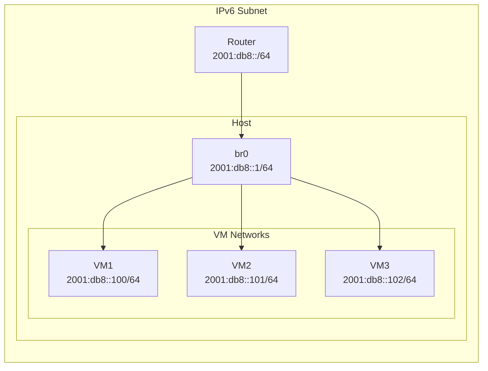

## Deployment Architecture

### Single Node Deployment

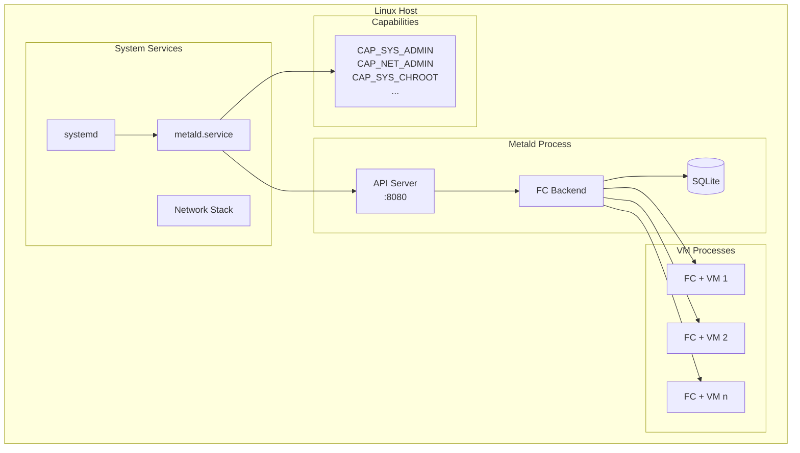

### Multi-Node Architecture (Future)

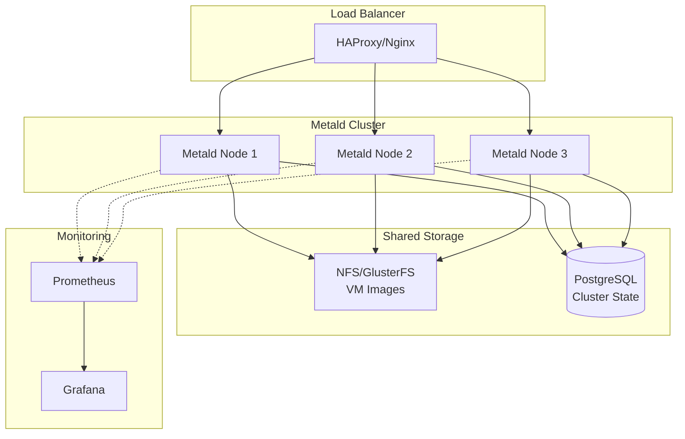

## Security Model

### Privilege Dropping Flow

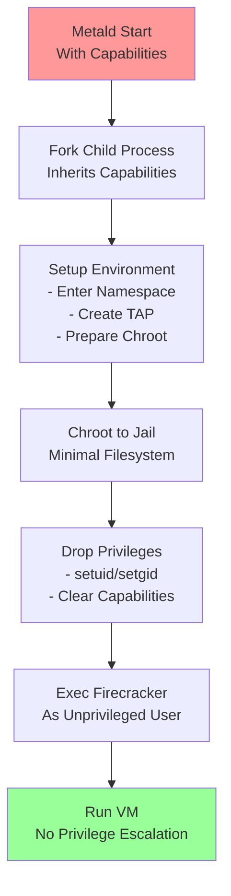

### Defense in Depth

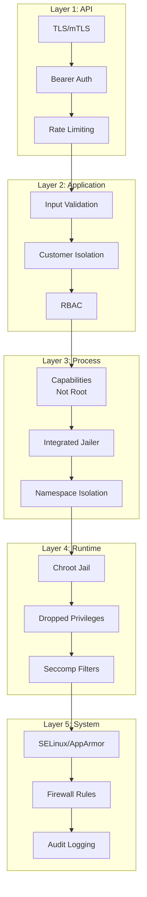

## Monitoring and Alerting

### Observability Stack

```mermaid
graph LR
    subgraph "Metald"
        App[Application]
        OTEL[OTEL SDK]
        Metrics[/metrics]
    end
    
    subgraph "Collection"
        Collector[OTEL Collector<br/>:4318]
        Prom[Prometheus<br/>:9090]
    end
    
    subgraph "Storage"
        Cortex[Cortex/Thanos]
        Loki[Loki]
        Tempo[Tempo]
    end
    
    subgraph "Visualization"
        Grafana[Grafana<br/>:3000]
        Alert[Alertmanager]
    end
    
    App --> OTEL
    OTEL --> Collector
    App --> Metrics
    Metrics --> Prom
    
    Collector --> Cortex
    Collector --> Loki
    Collector --> Tempo
    Prom --> Cortex
    
    Cortex --> Grafana
    Loki --> Grafana
    Tempo --> Grafana
    
    Cortex --> Alert
```

## Source Files

All diagrams in this document are maintained in Mermaid format for version control. To render:

1. **Mermaid CLI**: `mmdc -i diagrams.md -o diagrams.pdf`
2. **Online**: Use [mermaid.live](https://mermaid.live)
3. **VS Code**: Install Mermaid preview extension
4. **GitHub**: Renders automatically in markdown

For complex diagrams requiring more detail, see the architecture document and component-specific documentation.