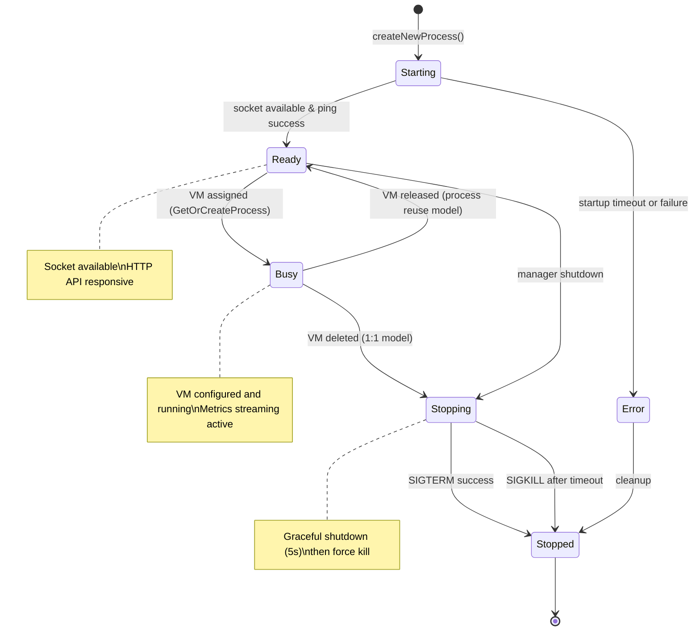
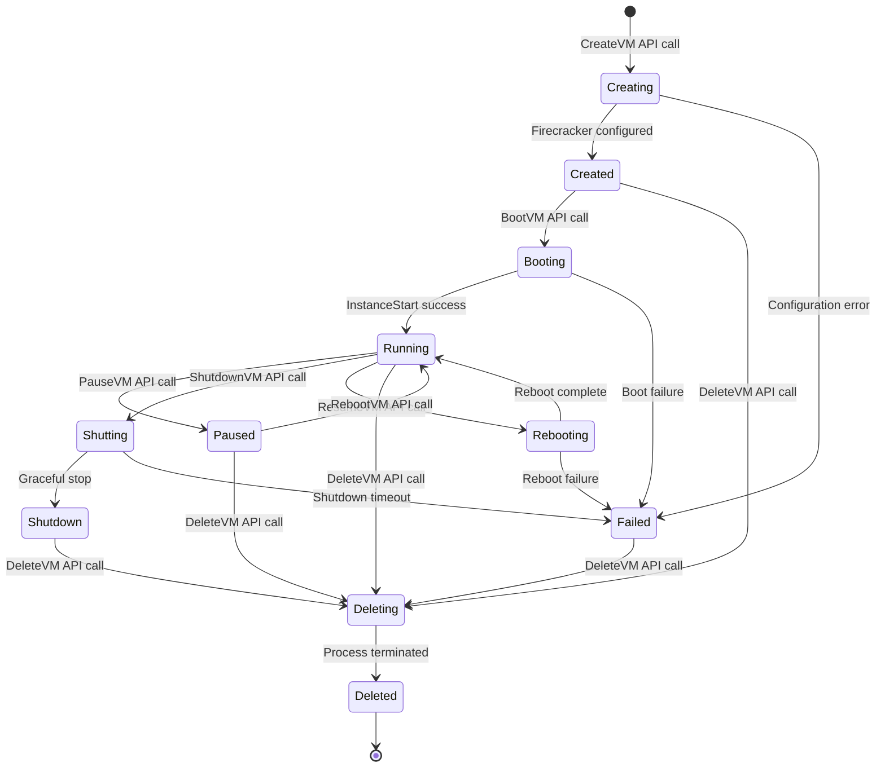
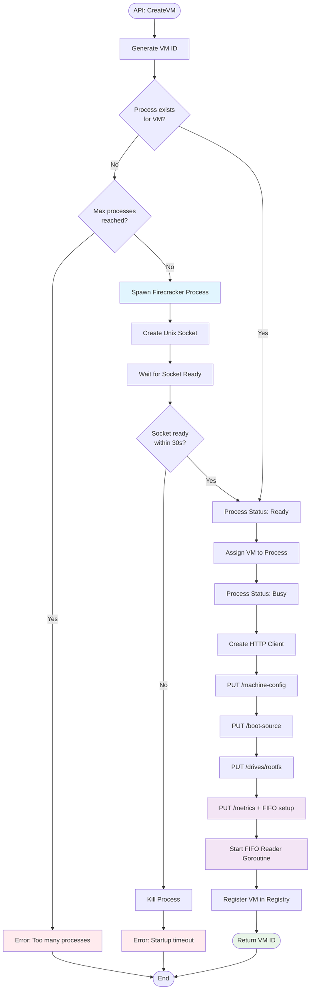
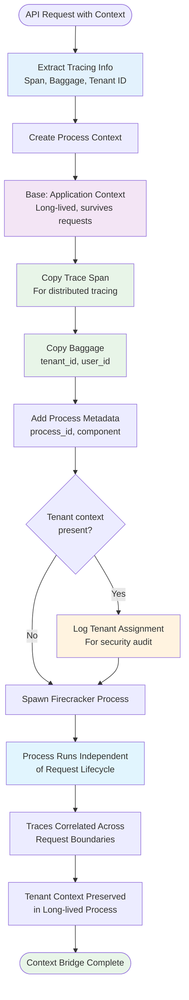
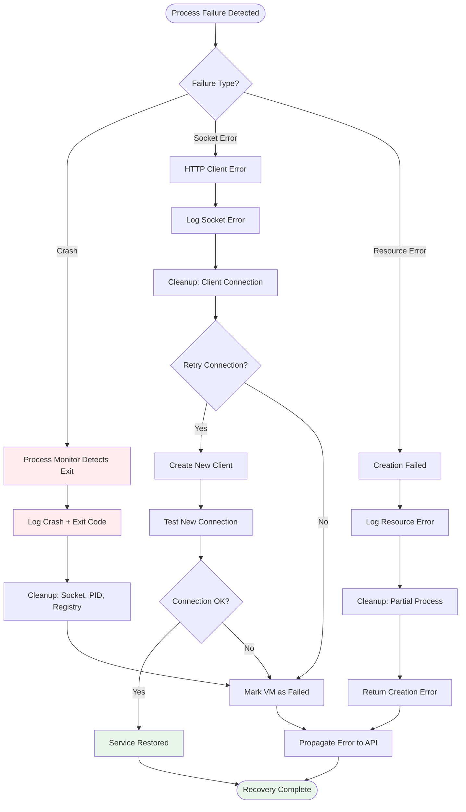
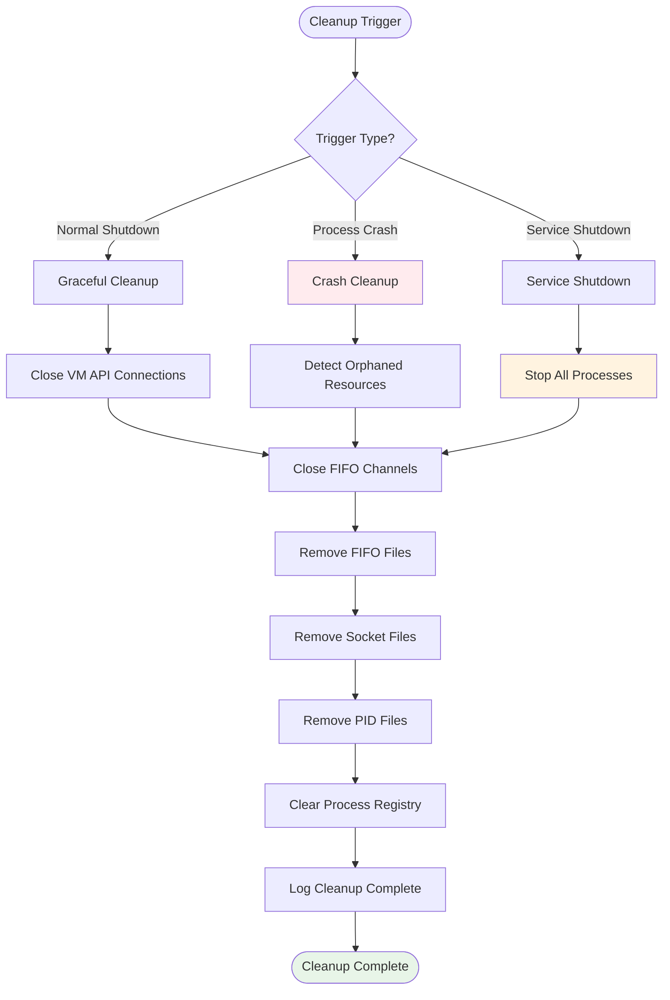

# Firecracker Process Management Flows

## Process State Machine



## VM Lifecycle State Transitions



## Complete VM Creation Flow



## VM Deletion Flow

```mermaid
flowchart TD
    Start([API: DeleteVM]) --> LookupVM{VM exists in<br/>registry?}
    LookupVM -->|No| Error1[Error: VM not found]
    LookupVM -->|Yes| GetClient[Get VM's Firecracker Client]
    
    GetClient --> CleanupFIFO[Close FIFO Channel]
    CleanupFIFO --> RemoveFIFO[Remove FIFO File]
    RemoveFIFO --> ReleaseProc[Release Process]
    
    ReleaseProc --> FindProc{Find process<br/>for VM?}
    FindProc -->|No| Error2[Error: Process not found]
    FindProc -->|Yes| CheckModel{Process reuse<br/>or 1:1 model?}
    
    CheckModel -->|Reuse| MarkReady[Mark Process Ready]
    CheckModel -->|1:1| TermProc[Terminate Process]
    
    TermProc --> SendSIGTERM[Send SIGTERM]
    SendSIGTERM --> WaitExit[Wait for Exit (5s)]
    WaitExit --> ExitTimeout{Process exited<br/>gracefully?}
    
    ExitTimeout -->|Yes| CleanupFiles[Remove Socket & PID Files]
    ExitTimeout -->|No| SendSIGKILL[Send SIGKILL]
    SendSIGKILL --> ForceWait[Wait for Force Exit]
    ForceWait --> CleanupFiles
    
    CleanupFiles --> RemoveFromRegistry[Remove from Process Registry]
    MarkReady --> UnregisterVM[Remove VM from Registry]
    RemoveFromRegistry --> UnregisterVM
    UnregisterVM --> Success([VM Deleted])
    
    Error1 --> End([End])
    Error2 --> End
    Success --> End
    
    style CleanupFIFO fill:#fff3e0
    style TermProc fill:#ffebee
    style SendSIGKILL fill:#ff5722,color:#fff
    style Success fill:#e8f5e8
    style Error1 fill:#ffebee
    style Error2 fill:#ffebee
```

## Process Monitoring Flow

```mermaid
flowchart TD
    Start([Process Created]) --> SpawnMonitor[Spawn Monitor Goroutine]
    SpawnMonitor --> WaitExit[Process.Wait()]
    WaitExit --> ProcessExit[Process Exited]
    ProcessExit --> LockRegistry[Lock Process Registry]
    
    LockRegistry --> StillExists{Process still in<br/>registry?}
    StillExists -->|No| UnlockExit[Unlock & Exit]
    StillExists -->|Yes| CheckError{Exit with<br/>error?}
    
    CheckError -->|Yes| LogError[Log Error + Exit Code]
    CheckError -->|No| LogExit[Log Unexpected Exit]
    
    LogError --> SetErrorStatus[Status: Error]
    LogExit --> SetStoppedStatus[Status: Stopped]
    
    SetErrorStatus --> CleanupSocket[Remove Socket File]
    SetStoppedStatus --> CleanupSocket
    CleanupSocket --> CleanupPID[Remove PID File]
    CleanupPID --> RemoveRegistry[Remove from Registry]
    RemoveRegistry --> UnlockRegistry[Unlock Registry]
    UnlockRegistry --> LogCleanup[Log Cleanup Complete]
    LogCleanup --> End([Monitor Exit])
    
    UnlockExit --> End
    
    style WaitExit fill:#e3f2fd
    style LogError fill:#ffebee
    style LogExit fill:#fff3e0
    style CleanupSocket fill:#f3e5f5
    style End fill:#e8f5e8
```

## FIFO Metrics Collection Flow

```mermaid
flowchart TD
    Start([VM Configuration]) --> CreateFIFO[Create Named Pipe<br/>syscall.Mkfifo()]
    CreateFIFO --> ConfigFC[Configure Firecracker<br/>PUT /metrics]
    ConfigFC --> InitChannel[Initialize Buffered Channel<br/>100 metrics capacity]
    InitChannel --> SpawnReader[Spawn FIFO Reader Goroutine]
    
    SpawnReader --> OpenFIFO[Open FIFO for Reading<br/>Blocks until FC connects]
    OpenFIFO --> FCConnected[Firecracker Connected]
    FCConnected --> JsonDecoder[Create JSON Decoder]
    
    JsonDecoder --> ReadLoop{Read JSON Line}
    ReadLoop --> DecodeMetrics[Decode Firecracker Metrics]
    DecodeMetrics --> ConvertMetrics[Convert to Standard Format]
    ConvertMetrics --> CacheMetrics[Cache Last Known Metrics]
    CacheMetrics --> SendChannel{Channel<br/>Available?}
    
    SendChannel -->|Yes| SendSuccess[Send to Channel]
    SendChannel -->|No| DropOldest[Drop Oldest Metric]
    DropOldest --> RetrySend[Retry Send]
    RetrySend --> SendSuccess
    SendSuccess --> ReadLoop
    
    ReadLoop -->|EOF| FCDisconnected[Firecracker Disconnected]
    ReadLoop -->|JSON Error| LogError[Log Parse Error]
    LogError --> ReadLoop
    
    FCDisconnected --> CloseChannel[Close Metrics Channel]
    CloseChannel --> RemoveFIFO[Remove FIFO File]
    RemoveFIFO --> CleanupCache[Clear Cached Metrics]
    CleanupCache --> End([FIFO Collection Stopped])
    
    style CreateFIFO fill:#e1f5fe
    style OpenFIFO fill:#fff3e0
    style SendChannel fill:#f3e5f5
    style DropOldest fill:#ffebee
    style End fill:#e8f5e8
```

## Context Management Flow



## Error Recovery Patterns

### Process Failure Recovery



### Resource Cleanup Patterns



This comprehensive flow documentation covers all major operational patterns in the Firecracker process manager, from normal operations to failure recovery scenarios.