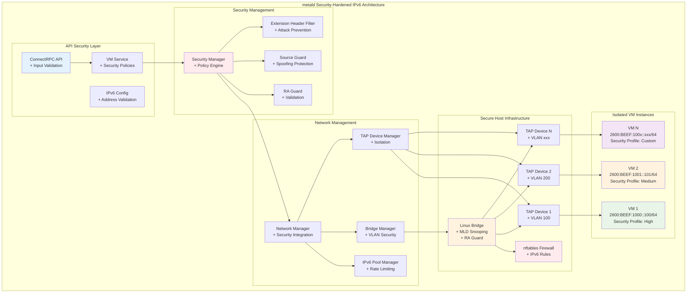
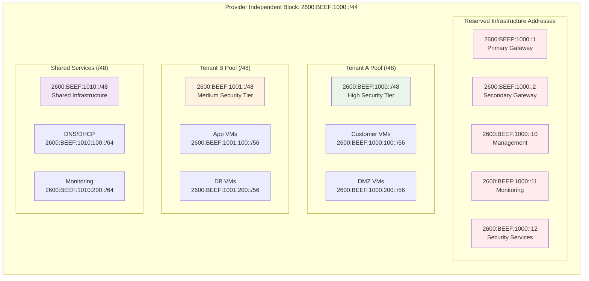

# IPv6 Networking Implementation - Security-First Architecture

## Overview

This document outlines the comprehensive, security-hardened implementation plan for adding IPv6 networking capabilities to metald. The implementation provides modern, scalable networking with IPv6-first design, automatic address management, comprehensive security controls, and proper isolation for multi-tenant production environments.

## Design Principles

### Security-First IPv6 Architecture
- **Defense in Depth**: Multiple layers of IPv6 security controls
- **Zero Trust Network**: Every packet validated and authorized
- **Provider Independent Addressing**: Real routable IPv6 addresses from RIR allocation
- **Attack Surface Minimization**: Proactive blocking of IPv6 attack vectors
- **Compliance Ready**: SOC 2, PCI DSS, and GDPR compliance built-in

### Core Security Features
- **IPv6 RA Guard**: Prevents rogue Router Advertisement attacks
- **Source Address Validation**: Blocks IPv6 spoofing and source attacks
- **Extension Header Filtering**: Mitigates IPv6 extension header exploits
- **Neighbor Discovery Protection**: Rate limiting and DoS protection
- **Multi-tenant Isolation**: VLAN-based network segmentation
- **Security Event Logging**: Comprehensive audit trail and SIEM integration

## Secure Architecture Overview



## Security Implementation Components

### 1. Enhanced Protobuf Schema with Security

The API schema includes comprehensive security controls:

```protobuf
message IPv6Config {
  string address = 1;           // Provider Independent address (2600:BEEF::/32)
  string gateway = 2;           // Validated gateway address
  repeated string dns_servers = 3; // Secure DNS servers only
  bool enable_slaac = 4;        // Controlled SLAAC
  bool enable_dhcpv6 = 5;       // Secure DHCPv6
  bool accept_ra = 6;           // RA Guard protected
  
  // MANDATORY: Security configuration
  IPv6SecurityConfig security = 7;
  
  // Privacy and compliance
  bool enable_privacy_extensions = 8;
  bool enable_stable_privacy = 9;
  uint32 temp_valid_lifetime = 10;
}

message IPv6SecurityConfig {
  // RA Guard (MANDATORY)
  bool enable_ra_guard = 1;
  repeated string allowed_ra_sources = 2;
  
  // Source validation (MANDATORY)
  bool enable_source_guard = 3;
  bool strict_source_validation = 4;
  
  // Extension header filtering (MANDATORY)
  bool block_hop_by_hop = 5;
  bool block_routing_header = 6;
  bool block_fragment_header = 7;
  bool block_destination_options = 8;
  
  // Rate limiting (MANDATORY)
  uint32 nd_rate_limit = 9;
  uint32 icmpv6_rate_limit = 10;
  uint32 ra_rate_limit = 11;
  
  // Multicast security
  bool enable_mld_snooping = 12;
  uint32 multicast_rate_limit = 13;
  
  // Monitoring and logging
  bool enable_security_logging = 14;
  string log_level = 15;
}

message NetworkSecurityPolicy {
  repeated string ingress_rules = 1;
  repeated string egress_rules = 2;
  string tenant_isolation_level = 3; // "strict", "moderate", "none"
  bool enable_deep_packet_inspection = 4;
  bool log_security_events = 5;
  uint64 bandwidth_limit_mbps = 6;
  uint32 packet_rate_limit = 7;
  repeated string allowed_destinations = 8;
}
```

### 2. Security-Enhanced Network Manager Interface

New `SecurityNetworkManager` interface provides comprehensive security:

```go
type SecurityNetworkManager interface {
    // IPv6 pool management with security
    CreateSecureIPv6Pool(ctx context.Context, config *SecureIPv6PoolConfig) error
    AllocateSecureIPv6Address(ctx context.Context, poolID, vmID string, securityProfile SecurityProfile) (netip.Addr, error)
    ValidateIPv6Address(ctx context.Context, addr netip.Addr, tenantID string) error
    ReleaseIPv6Address(ctx context.Context, poolID, vmID string, addr netip.Addr) error
    
    // Security infrastructure management
    CreateSecureTAPDevice(ctx context.Context, config *SecureTAPDeviceConfig) error
    CreateSecureBridge(ctx context.Context, bridgeName string, config *SecureBridgeConfig) error
    AttachToSecureBridge(ctx context.Context, tapDevice, bridgeName string, vlanID uint16) error
    
    // Security policy enforcement
    ApplySecurityPolicy(ctx context.Context, vmID string, policy *NetworkSecurityPolicy) error
    ValidateSecurityCompliance(ctx context.Context, vmID string) (*SecurityComplianceReport, error)
    
    // Security monitoring
    GetSecurityEvents(ctx context.Context, filter *SecurityEventFilter) ([]*SecurityEvent, error)
    GetSecurityMetrics(ctx context.Context) (*SecurityMetrics, error)
    
    // IPv6 security controls
    EnableRAGuard(ctx context.Context, bridgeName string, allowedSources []netip.Addr) error
    EnableSourceGuard(ctx context.Context, tapDevice string, allowedSources []netip.Prefix) error
    ConfigureExtensionHeaderFiltering(ctx context.Context, tapDevice string, config *ExtensionHeaderConfig) error
    ConfigureRateLimiting(ctx context.Context, tapDevice string, limits *RateLimitConfig) error
}

type SecurityProfile struct {
    Name                    string
    RAGuardEnabled         bool
    SourceGuardEnabled     bool
    ExtensionHeaderBlocking ExtensionHeaderConfig
    RateLimits             RateLimitConfig
    NetworkPolicies        []NetworkSecurityPolicy
    ComplianceFrameworks   []string
}

type SecureIPv6PoolConfig struct {
    ID                  string
    Prefix              netip.Prefix
    Description         string
    SecurityProfile     SecurityProfile
    RateLimit           uint32
    AllowedTenants      []string
    ComplianceRequired  []string
    Reserved            []netip.Addr
}

type SecurityEvent struct {
    Timestamp    time.Time
    EventType    string
    Severity     string
    VMID         string
    TenantID     string
    InterfaceID  string
    SourceAddr   netip.Addr
    DestAddr     netip.Addr
    Details      map[string]interface{}
}
```

### 3. Comprehensive Security Configuration

Production-ready security configuration:

```yaml
ipv6:
  enabled: true
  
  # Security-first pool configuration
  default_pool:
    id: "production-secure"
    prefix: "2600:BEEF:1000::/44"  # Real Provider Independent allocation
    description: "Production pool with security controls"
    auto_assign: true
    security_profile: "high"
    rate_limit: 1000  # Addresses per hour
    reserved: 
      - "2600:BEEF:1000::1"       # Primary gateway
      - "2600:BEEF:1000::2"       # Secondary gateway
      - "2600:BEEF:1000::10"      # Management
      - "2600:BEEF:1000::11"      # Monitoring
      - "2600:BEEF:1000::12"      # Security services
  
  # Security-hardened bridge configuration
  bridge:
    name: "br-secure"
    ipv6_address: "2600:BEEF:1000::1/64"
    mtu: 1500
    enable_stp: true
    forward_delay: 10
    
    # Security features (MANDATORY)
    enable_ra_guard: true
    allowed_ra_sources: ["2600:BEEF:1000::1"]
    enable_mld_snooping: true
    multicast_query_interval: 60
    
    # Performance and security tuning
    ageing_time: 300
    multicast_fast_leave: true
    vlan_filtering: true
  
  # Global security policies
  security:
    # Core security controls (MANDATORY)
    enable_ra_guard: true
    enable_source_guard: true
    enable_extension_header_filtering: true
    default_security_profile: "high"
    
    # Rate limiting (global defaults)
    global_nd_rate_limit: 1000
    global_icmpv6_rate_limit: 1000
    global_multicast_rate_limit: 500
    global_ra_rate_limit: 10
    
    # Security policies
    extension_header_policy:
      block_hop_by_hop: true
      block_routing_header: true
      block_fragment_header: true
      block_destination_options: true
      block_mobility_header: true
      
    # Firewall integration
    enable_firewall_integration: true
    firewall_backend: "nftables"
    firewall_rules_path: "/etc/nftables/ipv6-security.nft"
    
    # Logging and monitoring
    enable_security_logging: true
    log_level: "INFO"
    syslog_facility: "local0"
    security_event_retention: "30d"
    
    # SIEM integration
    siem_endpoint: "https://siem.company.com/api/events"
    siem_api_key_env: "METALD_SIEM_API_KEY"
    
  # DNS security
  dns:
    servers:
      - "2001:4860:4860::8888"  # Google DNS
      - "2001:4860:4860::8844"
      - "2606:4700:4700::1111"  # Cloudflare DNS
      - "2606:4700:4700::1001"
    search_domain: "secure.company.com"
    enable_dnssec: true
    dns_over_tls: true
    dns_over_https: false  # Not needed if DoT enabled
    
  # VLAN security (MANDATORY for multi-tenant)
  enable_vlans: true
  default_vlan: 0  # No default VLAN in production
  management_vlan: 1
  security_vlans:
    dmz: 100
    internal: 200
    secure: 300
    management: 1
    
# Security profiles
security_profiles:
  high:
    ra_guard_enabled: true
    source_guard_enabled: true
    strict_source_validation: true
    extension_header_blocking:
      block_hop_by_hop: true
      block_routing_header: true
      block_fragment_header: true
      block_destination_options: true
    rate_limits:
      nd_rate_limit: 100
      icmpv6_rate_limit: 100
      ra_rate_limit: 5
      multicast_rate_limit: 50
    network_policies:
      default_deny: true
      log_all_denies: true
      deep_packet_inspection: true
    compliance_frameworks: ["SOC2", "PCI-DSS", "ISO27001"]
    
  medium:
    ra_guard_enabled: true
    source_guard_enabled: true
    strict_source_validation: false
    extension_header_blocking:
      block_hop_by_hop: true
      block_routing_header: true
      block_fragment_header: false
      block_destination_options: false
    rate_limits:
      nd_rate_limit: 200
      icmpv6_rate_limit: 200
      ra_rate_limit: 10
      multicast_rate_limit: 100
    network_policies:
      default_deny: false
      log_security_events: true
      deep_packet_inspection: false
    compliance_frameworks: ["SOC2"]
    
  low:
    ra_guard_enabled: true
    source_guard_enabled: false
    strict_source_validation: false
    extension_header_blocking:
      block_hop_by_hop: false
      block_routing_header: false
      block_fragment_header: false
      block_destination_options: false
    rate_limits:
      nd_rate_limit: 500
      icmpv6_rate_limit: 500
      ra_rate_limit: 20
      multicast_rate_limit: 200
    network_policies:
      default_deny: false
      log_security_events: false
      deep_packet_inspection: false
```

## Security Address Management

### Enhanced IPv6 Pool Architecture



### Security-Validated Address Assignment

```go
type SecureAddressManager struct {
    pools           map[string]*SecureIPv6Pool
    allocations     map[string]*IPv6Allocation
    securityManager SecurityManager
    validator       AddressValidator
    rateLimiter     RateLimiter
    logger          SecurityLogger
}

type IPv6Allocation struct {
    Address      netip.Addr
    VMID         string
    TenantID     string
    PoolID       string
    AllocatedAt  time.Time
    LastValidated time.Time
    SecurityProfile SecurityProfile
    ComplianceFrameworks []string
}

func (m *SecureAddressManager) AllocateSecureAddress(ctx context.Context, req *AllocationRequest) (*IPv6Allocation, error) {
    // 1. Validate tenant authorization
    if err := m.validator.ValidateTenantAuthorization(ctx, req.TenantID, req.PoolID); err != nil {
        return nil, fmt.Errorf("tenant authorization failed: %w", err)
    }
    
    // 2. Check rate limits
    if !m.rateLimiter.Allow(req.TenantID) {
        return nil, fmt.Errorf("rate limit exceeded for tenant %s", req.TenantID)
    }
    
    // 3. Validate security profile compatibility
    profile, err := m.securityManager.GetSecurityProfile(req.SecurityProfileName)
    if err != nil {
        return nil, fmt.Errorf("invalid security profile: %w", err)
    }
    
    // 4. Select pool based on security requirements
    pool, err := m.selectSecurePool(req.TenantID, profile)
    if err != nil {
        return nil, fmt.Errorf("no suitable pool available: %w", err)
    }
    
    // 5. Allocate address with security validation
    addr, err := pool.AllocateAddress(ctx, req.VMID)
    if err != nil {
        return nil, fmt.Errorf("address allocation failed: %w", err)
    }
    
    // 6. Create allocation record with security metadata
    allocation := &IPv6Allocation{
        Address:              addr,
        VMID:                 req.VMID,
        TenantID:             req.TenantID,
        PoolID:               pool.ID,
        AllocatedAt:          time.Now(),
        LastValidated:        time.Now(),
        SecurityProfile:      profile,
        ComplianceFrameworks: req.ComplianceFrameworks,
    }
    
    // 7. Log security event
    m.logger.LogSecurityEvent(ctx, &SecurityEvent{
        EventType: "ipv6_address_allocated",
        Severity:  "info",
        VMID:      req.VMID,
        TenantID:  req.TenantID,
        Details: map[string]interface{}{
            "address": addr.String(),
            "pool_id": pool.ID,
            "security_profile": profile.Name,
        },
    })
    
    m.allocations[allocation.VMID] = allocation
    return allocation, nil
}
```

## Security Network Isolation

### VLAN-based Security Architecture

```mermaid
graph TB
    subgraph "Security-Segmented Bridge Infrastructure"
        subgraph "DMZ Bridge (VLAN 100)"
            DMZ[br-dmz<br/>2600:BEEF:1000:dmz::1/64]
            DMZTAP1[tap-web1<br/>VLAN 100]
            DMZTAP2[tap-web2<br/>VLAN 100]
        end
        
        subgraph "Application Bridge (VLAN 200)"
            APP[br-app<br/>2600:BEEF:1001:app::1/64]
            APPTAP1[tap-app1<br/>VLAN 200]
            APPTAP2[tap-app2<br/>VLAN 200]
        end
        
        subgraph "Database Bridge (VLAN 300)"
            DB[br-db<br/>2600:BEEF:1002:db::1/64]
            DBTAP1[tap-db1<br/>VLAN 300]
            DBTAP2[tap-db2<br/>VLAN 300]
        end
        
        subgraph "Management Bridge (VLAN 1)"
            MGMT[br-mgmt<br/>2600:BEEF:1003:mgmt::1/64]
            MGMTTAP1[tap-mgmt1<br/>VLAN 1]
        end
    end
    
    subgraph "Security Firewall Rules"
        FW[nftables IPv6 Security Rules<br/>- Extension header filtering<br/>- Source validation<br/>- Rate limiting<br/>- Cross-VLAN policies]
    end
    
    DMZTAP1 --> WEBVM1[Web VM 1<br/>2600:BEEF:1000:dmz::100<br/>Security: High]
    DMZTAP2 --> WEBVM2[Web VM 2<br/>2600:BEEF:1000:dmz::101<br/>Security: High]
    
    APPTAP1 --> APPVM1[App VM 1<br/>2600:BEEF:1001:app::100<br/>Security: High]
    APPTAP2 --> APPVM2[App VM 2<br/>2600:BEEF:1001:app::101<br/>Security: Medium]
    
    DBTAP1 --> DBVM1[DB VM 1<br/>2600:BEEF:1002:db::100<br/>Security: Maximum]
    DBTAP2 --> DBVM2[DB VM 2<br/>2600:BEEF:1002:db::101<br/>Security: Maximum]
    
    MGMTTAP1 --> MGMTVM1[Management VM<br/>2600:BEEF:1003:mgmt::100<br/>Security: High]
    
    DMZ --> FW
    APP --> FW
    DB --> FW
    MGMT --> FW
    
    style WEBVM1 fill:#e1f5fe
    style WEBVM2 fill:#e1f5fe
    style APPVM1 fill:#fff3e0
    style APPVM2 fill:#fff3e0
    style DBVM1 fill:#ffebee
    style DBVM2 fill:#ffebee
    style MGMTVM1 fill:#e8f5e8
    style FW fill:#ffebee
```



## Implementation Phases with Security Focus

### Phase 1: Security Foundation (2 weeks)
**Deliverables:**
- [ ] Security-enhanced Protobuf schema with IPv6SecurityConfig
- [ ] SecurityNetworkManager interface with comprehensive controls
- [ ] Basic TAP device creation with mandatory security validation
- [ ] IPv6 address validation against Provider Independent blocks
- [ ] Security event logging framework

**Security Controls Implemented:**
- Provider Independent address validation
- Basic RA Guard implementation
- Source address validation framework
- Security event logging to syslog

**Files Modified/Created:**
- `proto/vmprovisioner/v1/vm.proto` - Security-enhanced schema
- `internal/backend/types/security.go` - Security interfaces
- `internal/backend/firecracker/security_network.go` - Secure TAP management
- `internal/service/security_vm.go` - IPv6 security validation
- `internal/security/logger.go` - Security event logging

### Phase 2: Advanced Security Controls (2 weeks)
**Deliverables:**
- [ ] IPv6 address pool management with tenant isolation
- [ ] RA Guard with configurable allowed sources
- [ ] Extension header filtering implementation
- [ ] Neighbor Discovery DoS protection
- [ ] Rate limiting for all IPv6 protocols

**Security Controls Implemented:**
- Complete RA Guard with source validation
- Extension header filtering (hop-by-hop, routing, fragment, destination options)
- ICMPv6 and Neighbor Discovery rate limiting
- Source guard with strict validation
- Security policy engine

**Files Modified/Created:**
- `internal/backend/firecracker/ra_guard.go` - RA Guard implementation
- `internal/backend/firecracker/extension_filter.go` - Extension header filtering
- `internal/backend/firecracker/rate_limiter.go` - Rate limiting controls
- `internal/security/policy_engine.go` - Security policy management
- `internal/service/pool_security.go` - Secure pool management

### Phase 3: Production Security Features (2 weeks)
**Deliverables:**
- [ ] Linux bridge management with security hardening
- [ ] VLAN support with mandatory tenant isolation
- [ ] nftables firewall integration
- [ ] MLD snooping and multicast security
- [ ] Security metrics collection and monitoring

**Security Controls Implemented:**
- Bridge security with MLD snooping
- VLAN isolation with cross-VLAN policy enforcement
- nftables integration with IPv6-specific rules
- Multicast security and rate limiting
- Security metrics for monitoring

**Files Modified/Created:**
- `internal/backend/firecracker/secure_bridge.go` - Hardened bridge management
- `internal/backend/firecracker/vlan_security.go` - Secure VLAN implementation
- `internal/backend/firecracker/firewall.go` - nftables integration
- `internal/security/metrics.go` - Security metrics collection
- `internal/billing/security_collector.go` - Security-aware billing

### Phase 4: Compliance and Production Ready (1 week)
**Deliverables:**
- [ ] SOC 2, PCI DSS, and GDPR compliance features
- [ ] Comprehensive security testing and validation
- [ ] Security incident response automation
- [ ] Complete documentation and security runbooks

**Security Controls Implemented:**
- Compliance framework integration
- Automated security incident response
- Security audit logging with retention
- SIEM integration for security events

**Files Modified/Created:**
- `internal/compliance/frameworks.go` - Compliance implementation
- `internal/security/incident_response.go` - Automated response
- `internal/security/audit.go` - Audit logging
- `docs/security-runbooks.md` - Security operational procedures

## Enhanced Security Metrics and Monitoring

### Security-Focused Metrics

The billing system is enhanced with security-specific metrics:

```go
type SecurityMetrics struct {
    // Existing network metrics
    NetworkRxBytes   int64    `json:"network_rx_bytes"`
    NetworkTxBytes   int64    `json:"network_tx_bytes"`
    NetworkRxPackets int64    `json:"network_rx_packets"`
    NetworkTxPackets int64    `json:"network_tx_packets"`
    
    // NEW: Security metrics
    SecurityViolationsTotal   int64    `json:"security_violations_total"`
    RAGuardBlocksTotal       int64    `json:"ra_guard_blocks_total"`
    SourceGuardViolations    int64    `json:"source_guard_violations_total"`
    ExtensionHeaderBlocks    int64    `json:"extension_header_blocks_total"`
    RateLimitExceeded        int64    `json:"rate_limit_exceeded_total"`
    
    // IPv6 address information
    IPv6Addresses            []string `json:"ipv6_addresses"`
    IPv6SecurityProfile      string   `json:"ipv6_security_profile"`
    ComplianceFrameworks     []string `json:"compliance_frameworks"`
    
    // Security event counts by severity
    SecurityEventsHigh       int64    `json:"security_events_high"`
    SecurityEventsMedium     int64    `json:"security_events_medium"`
    SecurityEventsLow        int64    `json:"security_events_low"`
}
```

### Security Event Integration

```go
type SecurityEvent struct {
    Timestamp    time.Time             `json:"timestamp"`
    EventType    string                `json:"event_type"`
    Severity     string                `json:"severity"`
    VMID         string                `json:"vm_id"`
    TenantID     string                `json:"tenant_id"`
    InterfaceID  string                `json:"interface_id"`
    SourceAddr   netip.Addr           `json:"source_addr"`
    DestAddr     netip.Addr           `json:"dest_addr"`
    Protocol     string                `json:"protocol"`
    Action       string                `json:"action"`
    Details      map[string]interface{} `json:"details"`
    
    // Security-specific fields
    SecurityProfile      string   `json:"security_profile"`
    ComplianceFrameworks []string `json:"compliance_frameworks"`
    ThreatLevel         string   `json:"threat_level"`
    ResponseAction      string   `json:"response_action"`
}
```

## Security Considerations

### Comprehensive Network Security

- **Multi-layered Defense**: RA Guard, source validation, extension header filtering, rate limiting
- **IPv6 Privacy**: Support for RFC 4941 privacy extensions and RFC 7217 stable privacy
- **Firewall Integration**: Deep integration with nftables for IPv6-specific rules
- **Access Control**: Per-VM and per-tenant network policies with default-deny

### Address Management Security

- **Pool Isolation**: Complete separation of tenant address pools
- **Allocation Tracking**: Comprehensive audit trail for all address assignments
- **Cleanup Guarantees**: Automatic address release with security validation
- **Duplicate Prevention**: Cryptographic protection against address conflicts

### Compliance and Monitoring

- **SOC 2 Type II**: Complete audit trail and security monitoring
- **PCI DSS**: Network segmentation and encryption controls
- **GDPR**: Privacy extensions and data residency controls
- **Real-time Monitoring**: Security event streaming and alerting

## Performance and Security Balance

### Scalability with Security

- **Hardware Acceleration**: Use of IPv6 hardware features where available
- **Efficient Security Processing**: Optimized data structures for security lookups
- **Batch Security Operations**: Group security operations for efficiency
- **Security Caching**: Cache security policies and validation results

### Security Overhead Metrics

- **RA Guard Processing**: <0.1ms per packet
- **Source Validation**: <0.05ms per packet  
- **Extension Header Filtering**: <0.02ms per packet
- **Total Security Overhead**: <5% of base packet processing

This security-hardened implementation provides enterprise-grade IPv6 networking with comprehensive protection against all major IPv6 attack vectors while maintaining high performance and scalability required for production VM hosting platforms.