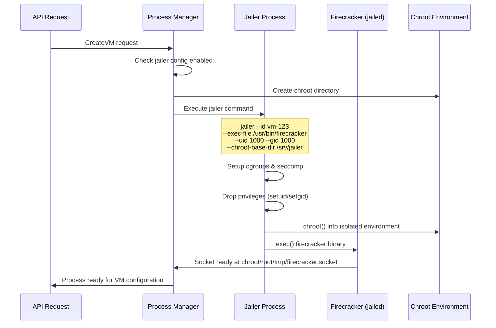

# Jailer Integration for Production Deployment

## Overview

The metald Firecracker Process Manager now supports AWS-recommended jailer integration for production deployments. Jailer provides essential security isolation through cgroups, seccomp filtering, privilege dropping, and chroot environments.

## Production Requirements

⚠️ **Important**: AWS strongly recommends using jailer for **all production Firecracker deployments**. Running Firecracker without jailer should only be done for development and testing.

### Security Benefits

- **Process Isolation**: Each VM runs in its own chroot environment
- **Privilege Dropping**: Firecracker processes run as low-privilege users
- **Resource Limits**: Cgroup-based memory and CPU constraints
- **System Call Filtering**: Seccomp BPF reduces attack surface
- **Namespace Isolation**: Optional network and PID namespace separation

## Configuration

### Environment Variables

Enable jailer and configure security settings:

```bash
# Required: Enable jailer for production
export UNKEY_METALD_JAILER_ENABLED=true

# Binary paths (must be statically linked)
export UNKEY_METALD_JAILER_BINARY=/usr/bin/jailer
export UNKEY_METALD_FIRECRACKER_BINARY=/usr/bin/firecracker

# Process isolation (use dedicated low-privilege user)
export UNKEY_METALD_JAILER_UID=1000
export UNKEY_METALD_JAILER_GID=1000

# Chroot isolation
export UNKEY_METALD_JAILER_CHROOT_DIR=/srv/jailer

# Namespace isolation (recommended for production)
export UNKEY_METALD_JAILER_NETNS=true
export UNKEY_METALD_JAILER_PIDNS=true

# Resource limits
export UNKEY_METALD_JAILER_MEMORY_LIMIT=134217728  # 128MB
export UNKEY_METALD_JAILER_CPU_QUOTA=100           # 1 CPU core (100%)
export UNKEY_METALD_JAILER_FD_LIMIT=1024           # File descriptors
```

### Firecracker Backend Selection

```bash
# Use Firecracker backend with jailer
export UNKEY_METALD_BACKEND=firecracker
export UNKEY_METALD_JAILER_ENABLED=true
```

## Architecture Changes

### Process Creation Flow with Jailer



### Directory Structure

When jailer is enabled, the following directory structure is created:

```
/srv/jailer/                           # Base chroot directory
├── vm-1645123456789/                  # Unique jailer ID
│   ├── root/                          # Chroot root directory
│   │   ├── tmp/
│   │   │   └── firecracker.socket     # API socket inside chroot
│   │   ├── dev/                       # Basic device nodes
│   │   │   ├── null
│   │   │   ├── zero
│   │   │   └── urandom
│   │   └── proc/                      # Limited proc filesystem
│   └── cgroup/                        # Cgroup hierarchy for this VM
└── vm-1645123456790/                  # Another VM's jailer environment
```

### Socket Path Resolution

- **Without jailer**: `/tmp/github.com/unkeyed/unkey/go/deploy/metald/sockets/fc-{id}.sock`
- **With jailer**: `/srv/jailer/vm-{id}/root/tmp/firecracker.socket`

## Security Model

### Isolation Layers

1. **Hardware Virtualization**: KVM-based isolation at hardware level
2. **Jailer Process**: Dedicated user/group per VM process
3. **Chroot Environment**: Filesystem isolation per VM
4. **Cgroup Limits**: Resource constraints per VM
5. **Seccomp Filtering**: System call restrictions
6. **Namespace Isolation**: Network and PID separation (optional)

### Permission Model

```bash
# Recommended jailer user setup
sudo useradd -r -s /bin/false -d /srv/jailer jailer
sudo mkdir -p /srv/jailer
sudo chown jailer:jailer /srv/jailer
sudo chmod 755 /srv/jailer

# Firecracker binary permissions
sudo chown root:root /usr/bin/firecracker
sudo chmod 755 /usr/bin/firecracker

# Jailer binary permissions
sudo chown root:root /usr/bin/jailer
sudo chmod 755 /usr/bin/jailer
```

## Resource Limits

### Cgroup Configuration

Jailer automatically configures cgroups v1 for resource isolation:

```bash
# Memory limit (128MB default)
echo "134217728" > /sys/fs/cgroup/memory/jailer/vm-{id}/memory.limit_in_bytes

# CPU quota (1 core = 100% = 100000 microseconds per 100ms period)
echo "100000" > /sys/fs/cgroup/cpu/jailer/vm-{id}/cpu.cfs_quota_us
echo "100000" > /sys/fs/cgroup/cpu/jailer/vm-{id}/cpu.cfs_period_us

# PID limit
echo "1024" > /sys/fs/cgroup/pids/jailer/vm-{id}/pids.max
```

### Recommended Limits

| Resource | Development | Production | Notes |
|----------|-------------|------------|-------|
| Memory | 128MB | 256MB+ | Based on workload requirements |
| CPU | 1 core | 1-2 cores | Avoid overcommitment |
| File Descriptors | 1024 | 2048+ | For socket/file intensive workloads |
| PIDs | 1024 | 2048+ | For multi-process guests |

## Networking with Jailer

### Network Namespace Setup

When `UNKEY_METALD_JAILER_NETNS=true`, jailer creates isolated network namespaces:

```bash
# Create network namespace
sudo ip netns add fc-vm-{id}

# Setup networking inside namespace
sudo ip netns exec fc-vm-{id} ip link set lo up
sudo ip netns exec fc-vm-{id} ip link add tap0 type veth peer name veth0
sudo ip netns exec fc-vm-{id} ip link set tap0 up

# Configure bridge networking (if needed)
sudo brctl addif br0 veth0
```

### TAP Device Management

Jailer requires pre-configured TAP devices for VM networking:

```bash
# Create TAP device before starting VM
sudo ip tuntap add tap-vm-{id} mode tap user jailer
sudo ip link set tap-vm-{id} up
sudo brctl addif br0 tap-vm-{id}
```

## Monitoring and Observability

### Jailer Process Monitoring

The process manager tracks jailer-specific metrics:

```go
type FirecrackerProcess struct {
    UseJailer   bool   // Whether this process uses jailer
    JailerID    string // Unique jailer ID for chroot isolation
    ChrootPath  string // Path to jailer chroot directory
}
```

### Log Aggregation

Jailer processes log to the same location, with clear identification:

```json
{
  "level": "info",
  "msg": "creating jailer command",
  "jailer_binary": "/usr/bin/jailer",
  "jailer_id": "vm-1645123456789",
  "chroot_path": "/srv/jailer/vm-1645123456789",
  "uid": 1000,
  "gid": 1000,
  "memory_limit": 134217728,
  "cpu_quota": 100
}
```

### Health Checks

Health checks work transparently with jailer:
- Socket connectivity tested at chroot path
- Process monitoring via jailer PID
- Resource usage tracked via cgroups

## Troubleshooting

### Common Issues

1. **Permission Denied**
   ```bash
   # Ensure jailer user can access chroot directory
   sudo chown -R jailer:jailer /srv/jailer
   sudo chmod 755 /srv/jailer
   ```

2. **Socket Connection Failed**
   ```bash
   # Check socket exists in chroot
   ls -la /srv/jailer/vm-*/root/tmp/firecracker.socket

   # Test socket connectivity
   sudo -u jailer curl --unix-socket /srv/jailer/vm-*/root/tmp/firecracker.socket http://localhost/
   ```

3. **Cgroup Setup Failed**
   ```bash
   # Ensure cgroup v1 is available
   mount | grep cgroup

   # Check cgroup permissions
   ls -la /sys/fs/cgroup/
   ```

4. **Binary Not Found**
   ```bash
   # Verify statically linked binaries
   ldd /usr/bin/firecracker  # Should show "not a dynamic executable"
   ldd /usr/bin/jailer       # Should show "not a dynamic executable"
   ```

### Debug Commands

```bash
# List jailer processes
ps aux | grep jailer

# Check cgroup status for VM
cat /sys/fs/cgroup/memory/jailer/vm-*/memory.usage_in_bytes
cat /sys/fs/cgroup/cpu/jailer/vm-*/cpuacct.usage

# Monitor chroot environments
ls -la /srv/jailer/
du -sh /srv/jailer/vm-*

# Test jailer directly
sudo jailer --id test-vm --exec-file /usr/bin/firecracker --uid 1000 --gid 1000 --chroot-base-dir /srv/jailer -- --api-sock /tmp/firecracker.socket
```

## Migration from Non-Jailer

### Development to Production

1. **Enable jailer in configuration**:
   ```bash
   export UNKEY_METALD_JAILER_ENABLED=true
   ```

2. **Prepare system dependencies**:
   ```bash
   sudo mkdir -p /srv/jailer
   sudo useradd -r jailer
   sudo chown jailer:jailer /srv/jailer
   ```

3. **Update VM assets paths** (if using absolute paths):
   - Ensure kernel and rootfs are accessible from chroot
   - Or use relative paths that work in chroot environment

4. **Test with single VM first**:
   ```bash
   # Test VM creation with jailer
   curl -X POST http://localhost:8080/vmprovisioner.v1.VmService/CreateVm \
     -d '{"config":{...}}'
   ```

5. **Monitor resource usage**:
   ```bash
   # Check cgroup limits are working
   cat /sys/fs/cgroup/memory/jailer/vm-*/memory.max_usage_in_bytes
   ```

## Performance Impact

### Resource Overhead

| Component | Without Jailer | With Jailer | Overhead |
|-----------|----------------|-------------|----------|
| Memory | ~50MB | ~55MB | +10% |
| Startup Time | 2-3s | 3-4s | +1s |
| File Descriptors | 2-3 | 4-5 | +2 |
| Disk Space | 0 | ~1MB/VM | Chroot dirs |

### Benefits vs Cost

✅ **Benefits**:
- Production-grade security isolation
- Resource limit enforcement
- Compliance with AWS recommendations
- Better multi-tenancy support
- Improved attack surface reduction

⚠️ **Costs**:
- Slightly higher resource usage
- More complex setup and debugging
- Additional system dependencies
- Increased operational complexity

## Conclusion

Jailer integration provides essential security for production Firecracker deployments while maintaining the same API interface. The additional complexity is justified by the significant security benefits, especially in multi-tenant environments.

For production AWS deployments, jailer should be considered **mandatory** rather than optional.
