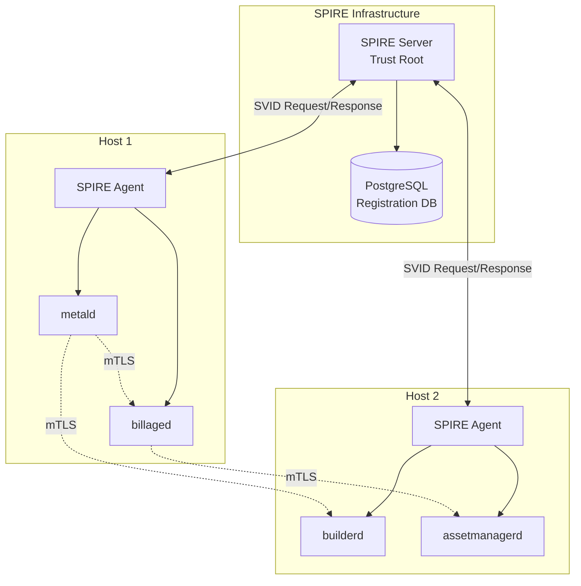
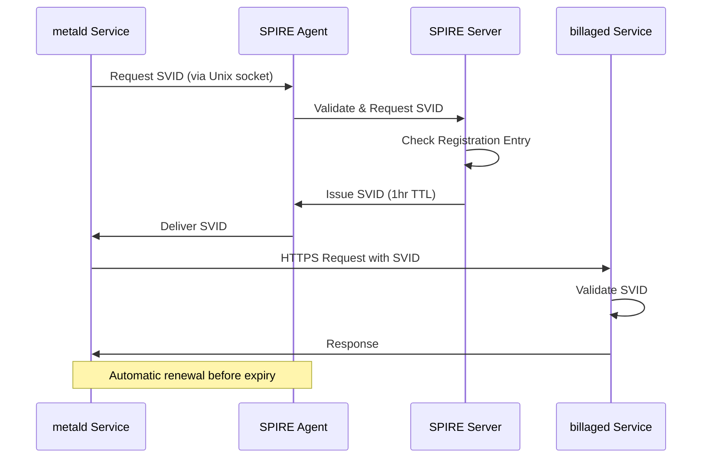

# SPIFFE/SPIRE Deployment Plan for Unkey Services

## Overview

This document outlines the deployment of SPIFFE/SPIRE for zero-trust service authentication across Unkey's infrastructure. SPIFFE/SPIRE replaces traditional certificate management with dynamic, automatically-rotating identities.

## Key Concepts for Developers

### Traditional mTLS vs SPIFFE/SPIRE

**Traditional mTLS:**
```
1. Generate CA certificate (10 years)
2. Generate service certificates (90 days)
3. Distribute certificate files to servers
4. Configure services to read cert files
5. Manually rotate before expiry
6. Panic when certs expire in production
```

**SPIFFE/SPIRE:**
```
1. Deploy SPIRE infrastructure
2. Register service identities
3. Services automatically get certificates
4. Rotation happens every hour automatically
5. No files, no manual work, no expiry panics
```

### Understanding the Paradigm Shift

- **No Certificate Files**: Certificates exist only in memory
- **Identity Not Files**: Services are identified by SPIFFE IDs, not cert CNs
- **Attestation**: SPIRE verifies a service is what it claims to be
- **Short-Lived**: Certificates rotate hourly, limiting breach impact
- **Zero Trust**: Every connection is authenticated and authorized

## Deployment Phases

### Phase 1: Infrastructure Setup (Week 1)

#### 1.1 Deploy SPIRE Server
```bash
# Single server for development, HA cluster for production
docker run -d \
  --name spire-server \
  -p 8081:8081 \
  -v /var/lib/spire:/var/lib/spire \
  -v $(pwd)/spire-server.conf:/etc/spire/server.conf \
  ghcr.io/spiffe/spire-server:1.8.0 \
  -config /etc/spire/server.conf
```

#### 1.2 Deploy SPIRE Agents (one per host)
```bash
# Install on each host running Unkey services
sudo apt-get install spire-agent

# Configure with server connection details
sudo cp spire-agent.conf /etc/spire/agent.conf
sudo systemctl enable --now spire-agent
```

#### 1.3 Verify Infrastructure
```bash
# Check server health
spire-server healthcheck

# Check agent health  
spire-agent healthcheck

# List registered entries
spire-server entry list
```

### Phase 2: Service Registration (Week 2)

#### 2.1 Register Base Services
```bash
# AIDEV-NOTE: Each service needs a registration entry
# This tells SPIRE how to identify the service

# Register metald
spire-server entry create \
  -parentID spiffe://unkey.prod/agent/host1 \
  -spiffeID spiffe://unkey.prod/service/metald \
  -selector unix:path:/usr/bin/metald \
  -selector systemd:unit:metald.service
```

#### 2.2 Test Identity Retrieval
```bash
# Verify service can get SVID
sudo -u unkey-metald spire-agent api fetch x509 \
  -socketPath /run/spire/sockets/agent.sock
```

### Phase 3: Service Integration (Weeks 3-4)

#### 3.1 Update Service Code

**Before (Traditional TLS):**
```go
// Old way - reading certificate files
cert, _ := tls.LoadX509KeyPair("server.crt", "server.key")
server := &http.Server{
    TLSConfig: &tls.Config{
        Certificates: []tls.Certificate{cert},
    },
}
```

**After (SPIFFE):**
```go
// New way - automatic certificates
spiffeClient, _ := spiffe.New(ctx)
server := &http.Server{
    TLSConfig: spiffeClient.TLSConfig(),
}
// No cert files needed!
```

#### 3.2 Integration Order
1. **assetmanagerd** - Simplest service, good test case
2. **billaged** - Isolated service, low risk
3. **builderd** - More complex, tenant isolation
4. **metald** - Most critical, do last

### Phase 4: Rollout Strategy (Week 5)

#### 4.1 Canary Deployment
```
1. Deploy SPIFFE-enabled service alongside existing
2. Route 10% traffic to SPIFFE version
3. Monitor for 24 hours
4. Gradually increase traffic
5. Full cutover after 1 week stable
```

#### 4.2 Rollback Plan
- Services can run with both SPIFFE and file-based certs
- Keep cert files as backup for 30 days
- One-command rollback via systemd unit swap

## Architecture Diagrams

### Component Architecture


### Identity Flow


## Service Integration Guide

### 1. Basic Integration
```go
// pkg/server/server.go
import "github.com/unkeyed/unkey/go/deploy/pkg/spiffe"

func (s *Server) Start(ctx context.Context) error {
    // Initialize SPIFFE
    spiffeClient, err := spiffe.New(ctx)
    if err != nil {
        return fmt.Errorf("init SPIFFE: %w", err)
    }
    defer spiffeClient.Close()
    
    // Your existing server setup
    s.httpServer = &http.Server{
        Addr:      s.config.BindAddress,
        Handler:   s.router,
        TLSConfig: spiffeClient.TLSConfig(), // Magic happens here
    }
    
    // Start server - empty strings for cert paths!
    return s.httpServer.ListenAndServeTLS("", "")
}
```

### 2. Client Integration
```go
// pkg/client/billaged.go
func NewBillagedClient(spiffeClient *spiffe.Client) *Client {
    return &Client{
        httpClient: spiffeClient.HTTPClient(),
        baseURL:    "https://billaged.unkey.internal:8081",
    }
}
```

### 3. Authorization Example
```go
// Only allow specific services
authorizer := spiffeClient.AuthorizeService("metald", "admin-tool")
tlsConfig := tlsconfig.MTLSServerConfig(
    source, 
    source, 
    authorizer, // Custom authorization
)
```

## Monitoring & Observability

### Metrics to Track
- SVID issuance rate
- SVID rotation success/failure  
- Authentication failures by service
- Certificate expiry histogram
- Agent health by host

### Dashboards
```yaml
# Prometheus queries
spire_server_svid_ttl_seconds{service="metald"} # Time until expiry
spire_agent_svid_renewed_total # Successful renewals
spire_server_authentication_failures_total # Auth failures
```

## Security Considerations

### Benefits
1. **Reduced Attack Surface**: No long-lived credentials
2. **Automatic Revocation**: Compromised services lose access in <1hr
3. **Fine-Grained Access**: Service-level authorization
4. **Audit Trail**: Every mTLS connection logged

### New Attack Vectors
1. **SPIRE Server**: Now critical infrastructure (deploy HA)
2. **Agent Socket**: Protect Unix socket permissions
3. **Registration Entries**: Audit changes carefully

## Resources for Learning

### Essential Reading
1. [SPIFFE Concepts](https://spiffe.io/docs/latest/spiffe-about/spiffe-concepts/) - Understand IDs, SVIDs, and trust domains
2. [SPIRE Architecture](https://spiffe.io/docs/latest/spire-about/spire-concepts/) - How SPIRE implements SPIFFE
3. [Zero Trust Networks](https://www.oreilly.com/library/view/zero-trust-networks/9781491962183/) - The philosophy behind SPIFFE

### Tutorials
1. [SPIRE Quickstart](https://spiffe.io/docs/latest/try/getting-started-linux-macos-x86/)
2. [Kubernetes + SPIRE](https://spiffe.io/docs/latest/try/getting-started-k8s/)
3. [SPIFFE Library Examples](https://github.com/spiffe/go-spiffe/tree/main/v2/examples)

### Videos
1. [SPIFFE/SPIRE Intro - CNCF](https://www.youtube.com/watch?v=H5IlmYmEDKk)
2. [Beyond mTLS: SPIFFE/SPIRE](https://www.youtube.com/watch?v=sXwFpUyLihE)

## Troubleshooting Guide

### Common Issues

**"No SVID available"**
```bash
# Check registration exists
spire-server entry list | grep metald

# Check selectors match
ps aux | grep metald  # Verify path
systemctl status metald  # Verify unit name
```

**"Authentication failed"**
```bash
# Check both services have SVIDs
spire-agent api fetch x509

# Verify trust domain matches
# Both must be in same trust domain
```

**"Cannot connect to agent"**
```bash
# Check socket permissions
ls -la /run/spire/sockets/agent.sock

# Ensure service user in spire group
usermod -a -G spire unkey-metald
```

## Success Criteria

1. All services using SPIFFE identities
2. Zero manual certificate operations
3. Service-to-service auth based on identity not IP
4. Automatic certificate rotation working
5. Monitoring shows >99.9% SVID renewal success

## Next Steps

After SPIFFE/SPIRE deployment:
1. Implement fine-grained authorization policies
2. Add rate limiting by service identity
3. Create service dependency map from mTLS logs
4. Integrate with external services (databases, caches)
5. Extend to customer workloads (VMs)